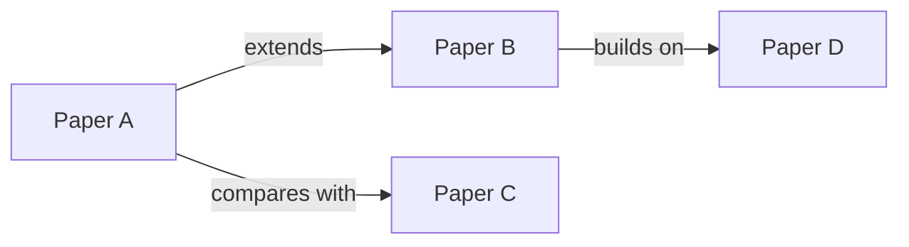

# Literature Survey: {Topic}

**Date:** {YYYY-MM-DD}
**Scope:** {What this survey covers and what it excludes}

---

## Timeline

| Year | Paper | Key Contribution |
|------|-------|-----------------|
| {YYYY} | {Author et al.} | {One-line contribution} |

## Taxonomy

```mermaid
graph TD
    A[{Topic}] --> B[{Category 1}]
    A --> C[{Category 2}]
    B --> D[{Subcategory 1a}]
    B --> E[{Subcategory 1b}]
    C --> F[{Subcategory 2a}]
```

## Comparison Table

| Paper | Approach | Dataset | Key Metric | Result | Code |
|-------|----------|---------|------------|--------|------|
| {Author YYYY} | {method} | {dataset} | {metric} | {value} | {link/No} |

## Key Themes & Trends

### {Theme 1}
{Discussion of this theme across papers}

### {Theme 2}
{Discussion of this theme across papers}

## Relationship Diagram



## Open Problems

1. {Open problem 1 — which papers attempt it, what's missing}
2. {Open problem 2}
3. {Open problem 3}

## References

- {Full citation 1}
- {Full citation 2}
