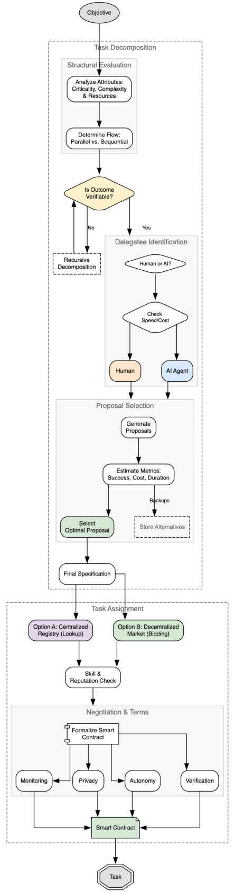
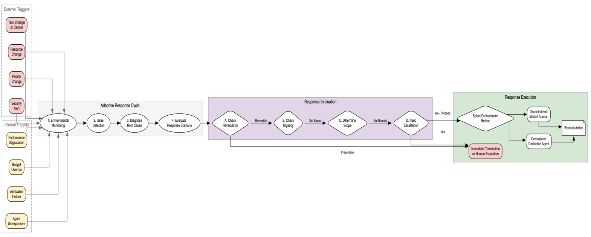

# Intelligent AI Delegation

**Authors:** Nenad Tomašev, Matija Franklin, Simon Osindero
**Venue:** Google DeepMind Technical Report, 2026
**PDF:** `paper.pdf`
**Date Read:** 2026-02-24

---

## One-Sentence Summary

AI agent 間および AI-人間間のタスク委任（delegation）を、信頼・説明責任・検証可能性を中核に据えた適応的フレームワークとして体系化し、既存の agentic protocol の不足を補う拡張案を提示する position paper。

## Problem Statement

AI agent がますます複雑なタスクを遂行可能になる中、タスク分解（task decomposition）と委任（delegation）は multi-agent システムの基盤となっている。しかし、著者らは既存の手法が単純な heuristic やハードコードされた制御フローに依存しており、動的な環境変化への適応、障害からの堅牢な回復、そして説明責任（accountability）の確保が不十分であると主張する。特に、web-scale の agentic economy が出現するにつれ、信頼（trust）、権限（authority）、責任（responsibility）、検証可能性（verifiability）を組み込んだ体系的な delegation framework の欠如が、高リスク環境での AI 応用の主要なボトルネックとなると論じている。

## Core Thesis & Design Philosophy

- **Core thesis:** タスク委任は単なるタスク分解＋割り当てではなく、権限の移譲、責任の所在明確化、信頼の確立、検証可能な成果物の保証を含む一連の意思決定プロセスであり、これを「intelligent delegation」として体系化すべきである
- **What they reject:** 現在の multi-agent framework における heuristic ベースの静的な delegation（事前に定義された role や routing rule に依存し、ランタイムでの適応や説明責任メカニズムを欠く方式）
- **What they bet on:** 人間組織論（principal-agent problem, span of control, authority gradient 等）から導出された原則を AI delegation に適用し、smart contract・暗号技術・reputation system による検証可能で動的に適応可能な delegation protocol を構築すること

## Intellectual Lineage

| Source | Original Concept | How This Paper Adapts It |
|--------|-----------------|-------------------------|
| Castelfranchi & Falcone (1998) | Delegation の社会的定義 — agent 間の task allocation における authority と responsibility の移譲を formalize | Delegation の定義の出発点として採用し、AI agent のコンテキストに拡張。authority, responsibility, accountability, trust を組み込んだ「intelligent delegation」の定義を構築 |
| Cvitanić et al. (2018); Grossman & Hart (1992) — Principal-Agent Problem | 委任者（principal）と受任者（agent）の間に情報の非対称性とインセンティブの不整合がある状況の経済学的分析 | AI delegation における reward misspecification, reward hacking, deceptive alignment を principal-agent problem のインスタンスとして再解釈。AI agent が hidden agenda を持つリスクを分析 |
| Ouchi & Dowling (1974) — Span of Control | 組織論における管理者が効果的に監督できる部下の人数の限界 | AI orchestrator が管理可能な sub-agent の数、および人間 overseer が信頼性高く監視できる AI agent 数の限界として再定式化 |
| Alkov et al. (1992); Cosby & Croskerry (2004) — Authority Gradient | 航空・医療分野で、上下関係の格差がコミュニケーションエラーを引き起こす現象 | AI delegator と delegatee 間の capability 格差が不適切な task delegation を生む問題、および sycophancy によって delegatee が request を拒否できない問題として適用 |
| Finkelman (1993); Isomura (2021) — Zone of Indifference | 権威が受容された範囲内で、指示が批判的検討なしに実行される領域 | 現在の AI system の safety filter と system instruction で定義される compliance 領域として再解釈。delegation chain が長くなるほど intent mismatch が伝播するリスクを指摘し、「dynamic cognitive friction」の必要性を主張 |
| Vezhnevets et al. (2017b) — FeUdal Networks | HRL における Manager-Worker 構造で、Manager が abstract goal を設定し Worker が低レベル action を実行。delegation policy を学習可能にした | 将来の agentic economy における学習ベースの delegation の template として参照。heuristic ではなく adaptive に分解規則を学習する方向性の先行例として位置づけ |
| Williamson (1979, 1989) — Transaction Cost Economics | 企業が内部委任 vs 外部契約のコスト（monitoring, negotiation, uncertainty のオーバーヘッド）を比較して組織境界を決定する理論 | AI delegation における4つの選択肢（自己実行、既知 sub-agent への委任、信頼済み外部 agent への委任、新規 agent への委任）のコスト分析のフレームワークとして適用 |
| Smith (1980) — Contract Net Protocol | Multi-agent system における auction-based の分散型タスク割り当てプロトコル | Decentralized market hub でのタスク広告・入札メカニズムの基盤として参照。smart contract と reputation system を組み合わせた拡張を提案 |

## Proposed Method

### Overview

著者らは「intelligent delegation」を5つの要件（pillar）と9つの技術的プロトコルから成るフレームワークとして定義する（Table 1参照）。

**5つの pillar:**
1. **Dynamic Assessment** — delegatee の competence, reliability, intent をリアルタイムで推定
2. **Adaptive Execution** — 環境変化・障害に応じた delegation 決定の動的調整
3. **Structural Transparency** — プロセスと結果の auditability 確保
4. **Scalable Market Coordination** — web-scale での効率的・信頼性の高い coordination
5. **Systemic Resilience** — system 全体の耐障害性確保

**9つの技術的プロトコル:**
Task Decomposition (Section 4.1), Task Assignment (Section 4.2), Multi-objective Optimization (Section 4.3), Adaptive Coordination (Section 4.4), Monitoring (Section 4.5), Trust & Reputation (Section 4.6), Permission Handling (Section 4.7), Verifiable Task Completion (Section 4.8), Security (Section 4.9)

### Key Design Decisions

1. **Contract-first decomposition**: タスクの分解粒度を、成果物の検証可能性に基づいて決定する — *Rationale:* 検証不能な sub-task への delegation は安全性を損なうため、検証能力に合致するまで再帰的に分解を続ける — *Alternatives:* 固定粒度の分解、delegatee の capability に基づく分解、あるいは検証なしの信頼ベースの delegation

2. **Decentralized market-based task assignment**: タスク割り当てに centralized registry ではなく decentralized market hub（入札・オークション方式）を推奨 — *Rationale:* Centralized approach はスケールしない。市場メカニズムにより capability matching と価格発見が自然に行われ、smart contract で契約を formalize できる — *Alternatives:* Centralized orchestrator pattern（現在の multi-agent framework の主流）、固定的な role 割り当て

3. **Multi-layered monitoring taxonomy**: Monitoring を5つの軸（target, observability, transparency, privacy, topology）で分類し、タスク特性に応じた組み合わせを選択 — *Rationale:* 単一の monitoring 方式では多様なタスクの criticality と privacy 要件に対応できない — *Alternatives:* 画一的な outcome-level monitoring のみ、あるいは full transparency の一律適用

4. **Trust as dynamic, contextual threshold vs. reputation as public history**: Trust を delegator 固有の private な閾値、reputation を public で検証可能な履歴として明確に区別 — *Rationale:* 高い overall reputation を持つ agent でも特定の high-stakes task の trust threshold を満たさない場合がある。この区別により、context-dependent な delegation 判断が可能になる — *Alternatives:* 単一の reputation score に基づく判断、あるいは trust の概念を排除した capability matching のみ

5. **Privilege attenuation in recursive delegation**: Sub-delegation 時に delegator の全権限を渡さず、sub-task に必要な最小限の権限に制限した Delegation Capability Token を発行 — *Rationale:* 末端 agent の compromise が系統的な breach に escalate することを防止（principle of least privilege） — *Alternatives:* Full permission pass-through、binary access control

### Technical Details

フレームワークの技術的詳細は以下の通り。

**Task Decomposition (Section 4.1)**: Objective からの構造的評価（criticality, complexity, resource requirements の分析）→ 並列 vs 逐次実行の判断 → 検証可能性チェック（不可の場合は再帰的分解）→ Human/AI の delegatee 識別 → 複数 proposal の生成・比較 → 最適 proposal の選択 → Final specification の formalize。Figure 1 にフローチャートが示されている。

**Adaptive Coordination (Section 4.4)**: External trigger（タスク変更・キャンセル、リソース変動、優先度変更、セキュリティアラート）と internal trigger（性能劣化、予算超過、検証失敗、応答なし）を検知 → 根本原因診断 → 応答シナリオの評価（reversibility チェック → urgency チェック → scope 決定 → escalation 判断）→ 集中型または分散型の orchestration method による応答実行。Figure 2 に adaptive coordination cycle が示されている。

**Monitoring (Section 4.5)**: 5軸の taxonomy（Table 2参照）:
- Target: Outcome-level（事後検証）vs Process-level（中間状態の追跡）
- Observability: Direct（明示的ステータスポーリング）vs Indirect（環境変化からの推論）
- Transparency: Black-box（I/O のみ）vs White-box（内部推論トレースの検査）
- Privacy: Full transparency vs Cryptographic（zk-SNARK, MPC）
- Topology: Direct（1対1）vs Transitive（中間 agent の signed attestation に依存）

**Trust & Reputation (Section 4.6)**: 3つの実装アプローチ（Table 3参照）:
- Immutable Ledger: Blockchain 上のタスク完了記録
- Web of Trust: Decentralized Identifier + Verifiable Credential によるドメイン固有の能力証明
- Behavioral Metrics: 推論の透明性・safety protocol 準拠度に基づくスコア

**Verifiable Task Completion (Section 4.8)**: 4つの検証メカニズム:
1. Direct outcome inspection（auto-verifiable なタスク向け）
2. Trusted third-party auditing
3. Cryptographic proofs（zk-SNARK）
4. Game-theoretic consensus（TrueBit 型の verification game）

**Protocol Extensions (Section 6)**: 既存プロトコル（MCP, A2A, AP2, UCP）の gap analysis と具体的拡張例:
- A2A Task object への `verification_policy` フィールド追加
- MCP への monitoring stream 拡張（L0〜L3 の粒度レベル）
- Task_RFQ / Bid_Object による市場メカニズムの導入
- Delegation Capability Token（Macaroons/Biscuits ベース）による権限の attenuation

## Key Claims

1. 既存の multi-agent delegation は heuristic ベースであり、動的適応・障害回復・説明責任が不十分 — Evidence: 先行研究の引用による argumentative support のみ。定量的比較は不提示
2. 人間組織論の概念（Principal-Agent Problem, Span of Control, Authority Gradient, Zone of Indifference 等）は AI delegation の設計に有用な指針を提供する — Evidence: 各概念の AI delegation へのアナロジー分析。実証的検証なし
3. 提案フレームワークの5つの pillar と9つのプロトコルが intelligent delegation の要件を網羅する — Evidence: Conceptual argument と Table 1 のマッピング。実装や実験による検証なし
4. 既存プロトコル（MCP, A2A, AP2, UCP）は intelligent delegation の要件を部分的にしか満たさず、拡張が必要 — Evidence: 各プロトコルの機能分析に基づく gap analysis（Section 6）。具体的な拡張コード例を提示
5. Contract-first decomposition により、検証可能性を delegation の事前条件として保証できる — Evidence: 設計原則としての提案。実装例なし
6. Web-scale の agentic economy においては、safety と accountability が delegation protocol に組み込まれるべき — Evidence: セキュリティ脅威の包括的分類（Section 4.9）および倫理的考察（Section 5）に基づく argumentative support

## Methodology Assessment

- **Datasets:** なし（実験を含まない conceptual framework / position paper）
- **Baselines:** なし（既存プロトコルとの定性的な比較のみ）
- **Metrics:** なし（フレームワークの有効性を測定する定量的指標は定義されていない）
- **Statistical rigor:** 該当せず
- **Reproducibility:** フレームワーク自体は実装に依存しない概念的提案。Section 6 のプロトコル拡張例は JSON snippet として示されているが、完全な実装は提供されていない。フレームワーク全体の実装と検証は future work として位置づけられている

## Results Summary

本論文は実験結果を含まない。主要な成果物はフレームワーク自体であり、以下の構成要素から成る:
- 5つの要件 pillar と9つの技術プロトコルの体系化（Table 1）
- Monitoring アプローチの taxonomy（Table 2）
- Reputation 実装方式の分類（Table 3）
- 既存プロトコル（MCP, A2A, AP2, UCP）の gap analysis
- プロトコル拡張の具体的提案（verification_policy, monitoring stream, RFQ/Bid, DCT）
- 倫理的考察6項目（meaningful human control, accountability, reliability, social intelligence, user training, de-skilling）

## Limitations & Open Questions

- **実証的検証の欠如**: フレームワークの有効性を示す実験、シミュレーション、ケーススタディが一切含まれていない。提案の妥当性は全て conceptual argument に依存している
- **実装の実現可能性**: ZKP, smart contract, decentralized market hub 等の技術要素は計算コストやレイテンシの観点で web-scale 実装が困難な可能性がある。著者らは Section 5.3 で reliability premium に言及しているが、具体的なコスト見積もりは示されていない
- **複雑性のトレードオフ**: 9つのプロトコルを全て実装した場合の delegation overhead が、delegation 自体のメリットを上回る閾値（complexity floor）の具体的な分析がない
- **既存 multi-agent framework との詳細比較の欠如**: AutoGen, CrewAI, LangGraph 等の実用的な multi-agent framework との具体的な比較がなく、提案フレームワークの差分が明確でない
- **Human-AI interaction の実証データ不在**: Authority gradient, zone of indifference, cognitive friction 等の概念は人間組織論からの類推であり、AI-human delegation の文脈での実証的裏付けがない
- **Adversarial robustness の未検証**: Security section（Section 4.9）で脅威を包括的に分類しているが、防御策の有効性は未検証

## Connections to Other Work

- **Builds on:** Castelfranchi & Falcone (1998) の delegation 理論、FeUdal Networks (Vezhnevets et al., 2017b) の hierarchical delegation、Contract Net Protocol (Smith, 1980) の market-based coordination、Tomasev et al. (2025) の virtual agentic economies
- **Compared with:** MCP (Anthropic, 2024), A2A (Google, 2025b), AP2 (Parikh & Surapaneni, 2025), UCP (Handa & Google Developers, 2026) — いずれも intelligent delegation の要件を部分的にしか満たさないと分析
- **Enables:** Delegation-aware protocol の設計・標準化、agentic web における safety-by-design の実現、curriculum-aware task routing による人間のスキル維持メカニズム

## Personal Notes

- 本論文の最大の強みは、AI delegation を人間組織論の豊かな概念体系と接続した点にある。特に authority gradient, zone of indifference, paradox of automation の AI delegation への適用は示唆に富む
- 一方で、conceptual framework としての完成度は高いものの、実装や実験が一切ないため、提案の各要素がどの程度実現可能・有効であるかは完全に未検証のままである
- Section 6 のプロトコル拡張提案は具体性があり、今後のプロトコル開発への実用的な指針となりうる。特に verification_policy の A2A 拡張や Delegation Capability Token の概念は注目に値する
- De-skilling（Section 5.6）と curriculum-aware task routing の議論は、AI delegation の長期的な社会的影響を考える上で重要な視点を提供している
- Smart contract, ZKP, blockchain への依存度が高いが、これらの技術は現時点で AI agent システムとの統合が十分に成熟しておらず、実装上のギャップが大きい可能性がある
