## Large Language ModelsのためのAgentic Reasoning

```
♢ Foundations · Evolution · Collaboration ♢ Tianxin Wei 1† Ting-Wei Li 1† Zhining Liu 1† Xuying Ning 1 Ze Yang 2 Jiaru Zou 1 Zhichen Zeng 1 Ruizhong Qiu 1 Xiao Lin 1 Dongqi Fu 2 Zihao Li 1 Mengting Ai 1 Duo Zhou 1 Wenxuan Bao 1 Yunzhe Li 1 Gaotang Li 1 Cheng Qian 1 Yu Wang 5 Xiangru Tang 6 Yin Xiao 1 Liri Fang 1 Hui Liu 3 Xianfeng Tang 3 Yuji Zhang 1 Chi Wang 4 Jiaxuan You 1 Heng Ji 1 Hanghang Tong 1 Jingrui He 1 1 University of Illinois Urbana-Champaign 2 Meta 3 Amazon 4 Google Deepmind 5 UCSD 6 Yale † Equal contribution , Corresponding Author
```

Abstract: Reasoningは知性の基盤をなす認知プロセスであり、推論、問題解決、および意思決定を支える。Large language models (LLMs) は数学やコードといった標準的なBenchmarkに代表される閉世界設定において強力なReasoning能力を示すが、開放的かつ動的な環境では困難に直面する。Agentic Reasoningの登場はパラダイムの転換を意味し、LLMsを自律的なAgentとして再定式化することで思考と行動を橋渡しする。このAgentは計画を立て、行動し、継続的なインタラクションを通じて学習する。本サーベイでは、Agentic Reasoningを三つの補完的な次元に沿って整理することで体系的なロードマップを提供する。まず、環境ダイナミクスを三つの層によって特徴付ける。第一層の基盤的Agentic Reasoningは、安定した環境において機能するPlanning、Tool use、Searchといったコアなシングルエージェント能力を確立する。第二層の自己進化的Agentic ReasoningはAgentが進化する環境においてFeedback、Memory、適応を通じてこれらの能力を洗練させる方法を検討する。第三層の集合的Multi-agent Reasoningは、複数のAgentが役割を調整し、知識を共有し、共通の目標を追求する協調的シナリオへと知性を拡張する。全層にわたって、構造化されたオーケストレーションと適応的なワークフロー設計を通じてTest-time Interactionをスケールさせる**In-context Reasoning**と、Reinforcement LearningおよびSupervised Fine-tuningを通じて行動を最適化する**Post-training Reasoning**を区別することで、システム制約と最適化設定を分析する。さらに、科学、ロボティクス、ヘルスケア、自律的研究、数学といった実世界応用およびBenchmarkにおけるAgentic Reasoningフレームワークをレビューし文脈付けを行うことで、異なるReasoning機構がどのようにドメインをまたいで実装・評価されるかを示す。本サーベイはAgentic Reasoningの手法を、思考と行動を橋渡しする統一されたロードマップへと統合し、環境ダイナミクス、最適化設定、エージェント間インタラクション設定にわたってAgentic Systemsへの実践的な指針を提供する。最後に、未解決の課題と将来の方向性を概説し、Agentic Reasoningがどのように発展してきたかを位置付けつつ、パーソナライゼーション、長期インタラクション、World Modeling、スケーラブルなMulti-agent Training、実世界展開のためのガバナンスフレームワークといった残課題を明らかにする。


```
Keywords : Agentic AI, LLM Agent, Agentic Reasoning, Self-evolving /github Github : https://github.com/weitianxin/Awesome-Agentic-Reasoning
```

## 1. はじめに

Reasoningは知性の核心にあり、インタラクティブかつ動的な設定における論理的推論、問題解決、意思決定を可能にする。Large language models (LLMs) は

Propose

User

LLM Reasoning

Task decompose

Evaluation

• Adjustment

Generic

Domain-specific

Manager

Critic

Solve

Task

Agentic Reasoning

Paradigm

Generalize

Compute

Learning

図1: Agentic Reasoningの概要。

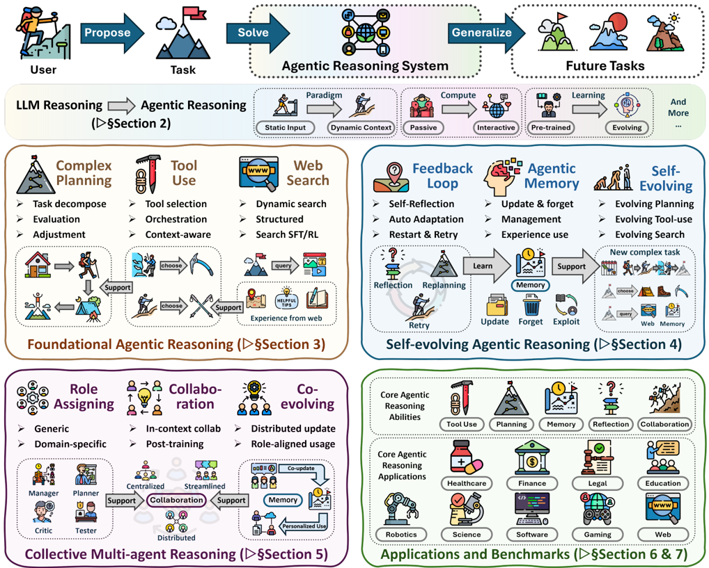

数学的問題解決やコード生成といった閉世界ドメインにおいて顕著な進歩を達成している。実証的には、Chain-of-Thought Promptingや分解、プログラム支援Solvingなど中間的なReasoningを明示化する手法が推論性能を大幅に向上させた [1, 2, 3, 4]。しかしながら、これらのアプローチは静的なコンテキストと短期的なReasoningを前提とすることが多い。従来のLLMsは情報が時間とともに変化する開放的な環境において、行動し、適応し、改善する機構を欠いている。

本サーベイでは、この進化を**Agentic Reasoning**というフレームワークのもとに体系化する。受動的に系列を生成するのではなく、LLMsは環境との継続的なインタラクションを通じてPlanning、行動、学習を行う自律的なReasoning Agentとして再定式化される。この再定式化はReasoningと行動を統合し、Reasoningを知覚、Planning、意思決定、検証のための組織化原理として位置づける。ReAct [5] のようなシステムは熟考と環境インタラクションを交互に行い、Tool-useフレームワークは自律的なAPI呼び出しを可能にし、ワークフローベースのAgentはサブタスクと検証可能な行動を動的にオーケストレートする [5, 6, 7]。概念的に、これは静的な一回推論から不確実性のもとでの逐次的意思決定への転換と類似する。単純な入出力マッピングとは異なり、このパラダイムはAgentが長期にわたってPlanningし、部分観測可能性を克服し、Feedbackを通じて能動的に改善することを要求する [8, 9, 10]。

And

## Agentic Reasoningの定義

Agentic ReasoningはReasoningを知的Agentの中心的な機構として位置づけ、基盤的能力（Planning、Tool use、Search）、自己進化的適応（Feedback、Memory駆動の適応）、集合的調整（Multi-agent Collaboration）にわたり、In-context OrchestratingまたはPost-training Optimizationのいずれかを通じて実現される。

環境ダイナミクスを体系的に特徴付けるため、本サーベイはAgentic Reasoningの三つの補完的スコープ、すなわち基盤的能力、自己進化、集合知を軸として構成し、多様なインタラクティブかつ動的な設定にわたる。**Foundational Agentic Reasoning**は、安定しているが複雑な環境内での動作を可能にするPlanning、Tool use、Searchを含むコアなシングルエージェント能力の礎を確立する。ここではAgentは目標を分解し、外部Toolを呼び出し、実行可能な行動を通じて結果を検証することで行動する。例えば、プログラム支援Reasoning [3] はコード実行に論理的導出を根拠付け、OpenHands [11] のようなリポジトリレベルシステムはReasoning、Planning、テストを統一ループに統合し、構造化されたMemoryモジュール [12, 13] は中間的なReasoningトレースを再利用のために永続化することで事実の想起を手続的な能力へと変換する。

これらの基盤の上に、**Self-Evolving Agentic Reasoning**はAgentが累積的な経験を通じて継続的に改善することを可能にする。タスク固有の自己改善（例えば反復的な批評による）を包含するこのパラダイムは、MemoryやPolicyといった内部状態の永続的な更新にまで適応を拡張する。固定されたReasoningパスに従うのではなく、AgentはFeedback統合とMemory駆動の適応のための機構を発展させ、進化する環境を乗り越える。Reflexion [14] のようなReflectionベースのフレームワークはAgentが自身のReasoningプロセスを批評・洗練することを可能にし、RL-for-memory [15] のようなReinforcement Learningの定式化はMemoryの書き込みと読み出しをPolicy Optimizationとして形式化する。これらの機構を通じて、AgentはInference時のReasoningと学習を動的に統合し、完全な再学習なしに内部表現と意思決定Policyを漸進的に更新する。この継続的な適応はReasoningと学習を結び付け、モデルが能力を積み上げ、タスクをまたいで汎化することを可能にする。

最後に、**Collective Multi-Agent Reasoning**は孤立したSolverから協調的エコシステムへと知性をスケールさせる。孤立して動作するのではなく、複数のAgentが明示的な役割割り当て（例：Manager-Worker-Critic）、通信プロトコル、共有Memoryシステムを通じて共通の目標を達成するために調整する [16, 17]。Agentがサブタスクに特化し互いのアウトプットを洗練させるにつれて、協調はReasoning多様性を増幅させ、自然言語ベースのMulti-turnインタラクションを通じて議論し、不一致を解消し、一貫性を達成することをシステムに可能にする [18, 19]。しかしながら、この複雑さは安定性、通信効率、信頼性においての課題も生じさせ、構造化された調整フレームワークと厳格な評価基準を必要とする [20, 21]。

全層にわたって、Inference時のオーケストレーション [5, 14, 22, 23, 24, 25] と学習ベースの能力最適化 [26, 27, 28, 15] に対応する二つの補完的なモードを区別することでシステム制約と最適化設定を分析する。**In-context Reasoning**はInference時のComputeのスケールに焦点を当てており、構造化されたオーケストレーション、検索ベースのPlanning、適応的なワークフロー設計を通じて、モデルパラメータを変更することなくAgentが複雑な問題空間を動的に乗り越えることを可能にする。対照的に、**Post-training Reasoning**は能力の内部化を目標とし、Reinforcement LearningおよびFine-tuningを通じて成功したReasoningパターンやTool-use戦略をモデルの重みに統合する。これらは合わせてAgentを設計するための実践的なロードマップを提供する。

三層の分類体系に基づき、Agentic Reasoningは数学的探索 [29, 30] や Vibe Coding [11, 31, 32] から科学的発見

## サーベイの範囲

本サーベイはReasoningが適応的な行動を駆動するReasoning強化型Agentic Systemsをレビューする。これらのシステムを二つの補完的な最適化モードを通じて分析する：

- **In-context Reasoning**: パラメータ更新なしに、構造化されたオーケストレーションとPlanningを通じてInference時のインタラクションをスケールさせる。
- **Post-training Reasoning**: Reinforcement LearningとFine-tuningを通じてReasoningの戦略をモデルパラメータに内部化する。

本サーベイの範囲は、シングルエージェントとMulti-agentのコンテキストにわたって、Planning、Memory、自己改善にこれらのモードを組み込む手法をカバーする。本サーベイは2025年までの進歩を要約する。

[33, 34, 35]、Embodied Robotics [36, 37, 38]、ヘルスケア [39, 40]、自律的なWeb探索 [41, 42] に至るまで幅広い実用的な応用の基盤となり始めている。これらの応用は、ドメイン固有のデータモダリティ、インタラクション制約、FeedbackループによってFormed された異なるReasoning要求を明示し、Planning、Tool use、Search、Reflection、Memory機構、Multi-agent調整を統合する多様なシステム設計を動機付けている [43, 44]。一方、Benchmark環境は個々のAgentic能力を切り離すターゲットテストからドメイン固有の環境およびシナリオでのエンドツーエンドの行動を評価するアプリケーション固有のBenchmarkに至るまで、Agentic Reasoningを評価するために出現してきた [45, 46, 47, 48, 20, 21, 49, 50]。

これらを総合して、本サーベイはAgentic Reasoningの手法をReasoningと行動を橋渡しする統一されたロードマップへと統合する。これらの手法を基盤的、自己進化的、集合的Reasoningの補完的なスコープにわたって体系的に特徴付け、In-contextとPost-trainingの最適化モードを区別する。さらに、代表的な応用と評価Benchmarkを通じてこのロードマップを文脈付け、異なるAgentic Reasoning機構が現実的なドメインとタスク設定をまたいでどのように実装・評価されるかを示す。最後に未解決の課題と将来の方向性を概説し、パーソナライゼーション、長期インタラクション、World Modeling、スケーラブルなMulti-agent Training、実世界展開のためのガバナンスフレームワークといった重要なフロンティアを特定する。

## 貢献

本サーベイは以下の貢献を行う：

- **概念的枠組み**: 基盤的、自己進化的、集合的Reasoningの層にわたる**Agentic Reasoning**のパラダイムを形式化する。
- **体系的レビュー**: In-contextおよびPost-training次元にわたるReasoning中心のワークフローオーケストレーションを強調しながら、シングルエージェント、適応型、Multi-agentシステムを分析する。
- **応用と評価**: Agentic Reasoning機構の実装と評価を示すために実世界の応用とBenchmarkをレビューする。
- **将来の課題**: ロバスト性、信頼性、効率性における新興の課題を特定し、次世代の適応型・協調型Agentへの方向性を概説する。

## 目次

| 1 はじめに                                         | 1 はじめに                                         | 1 はじめに                                                                      | 1   |
|----------------------------------------------------|----------------------------------------------------|---------------------------------------------------------------------------------|-----|
| 2 LLM ReasoningからAgentic Reasoningへ             | Reasoning to Agentic Reasoning                     | Reasoning to Agentic Reasoning                                                  | 7   |
|                                                    | 2.1 本サーベイの位置付け                           | Survey . . . . . . . . . . . . . . . . . . . . . . .                            | 7   |
|                                                    | 2.2 . . .                                          | 準備 . . . . . . . . . . . . . . . . . . . . . . . . . .                        | 8   |
| 3                                                  | Foundational Agentic Reasoning                     | Foundational Agentic Reasoning                                                  |     |
| 3.1 . . . . .                                      | 3.1 . . . . .                                      | 3.1 . . . . .                                                                   | 10  |
|                                                    |                                                    | Planning Reasoning . . . . . . . . . . . . . . . . . . . .                      | 10  |
|                                                    | 3.1.1                                              | In-context Planning . . . . . . . . . . . . . . . . . . . . .                   | 11  |
|                                                    | 3.1.2                                              | Post-training Planning . . . . . . . . . . . . . . . . . . .                    | 13  |
| 3.2                                                | Tool-Use                                           | Optimization . . . . . . . . . . . . . . . . . . . . . . .                      | 14  |
|                                                    | 3.2.1                                              | In-Context Tool-integration . . . . . . . . . . . . . . . .                     | 14  |
|                                                    | 3.2.2                                              | Post-training Tool-integration . . . . . . . . . . . . . . .                    | 16  |
|                                                    | 3.2.3                                              | Orchestration-based Tool-integration . . . . . . . . . . .                      | 16  |
| 3.3                                                | Agentic Search . . . . .                           | . . . . . . . . . . . . . . . . . . . . . . .                                   | 17  |
|                                                    | 3.3.1                                              | In-Context Search . . . . . . . . . . . . . . . . . . . . . .                   | 18  |
|                                                    | 3.3.2                                              | Post-Training Search . . . . . . . . . . . . . . . . . . . .                    | 19  |
| 4 Self-evolving Agentic Reasoning                  |                                                    |                                                                                 | 20  |
| 4.1                                                | Agentic                                            | Feedback機構 . . . . . . . . . . . . . . . . . . .                              | 20  |
|                                                    | 4.1.1                                              | Reflective Feedback . . . . . . . . . . . . . . . . . . . . .                   | 21  |
|                                                    | 4.1.2                                              | Parametric Adaptation . . . . . . . . . . . . . . . . . . .                     | 22  |
|                                                    | 4.1.3                                              | Validator-Driven Feedback . . . . . . . . . . . . . . . . .                     | 22  |
| 4.2                                                | Agentic Memory . . . . . . . .                     | . . . . . . . . . . . . . . . . . . .                                           | 24  |
|                                                    | 4.2.1                                              | Flat MemoryのAgenticな使用 . . . . . . . . . . . . . . . .                      | 24  |
|                                                    | 4.2.2                                              | Memoryの構造的使用 . . . . . . . . . . . . . . . . .                            | 26  |
|                                                    | 4.2.3                                              | Post-training Memory Control . . . . . . . . . . . . . . .                      | 27  |
| 4.3                                                | 基盤的Agentic能力の進化                            | Agentic Capabilities . . . . . . . . . . .                                      | 27  |
|                                                    | 4.3.1                                              | Self-evolving Planning . . . . . . . . . . . . . . . . . . .                    | 27  |
|                                                    | 4.3.2                                              | Self-evolving Tool-use . . . . . . . . . . . . . . . . . . . .                  | 28  |
|                                                    | 4.3.3                                              | Self-evolving Search . . . . . . . . . . . . . . . . . . . .                    | 29  |
| 5 Collective Multi-agent Reasoning                 | Reasoning                                          | Reasoning                                                                       | 29  |
| 5.1 Multi-Agent Systems (MAS)の役割分類            | 5.1 Role Taxonomy of Multi-Agent Systems (MAS)     | . . . . . . . . .                                                               | 30  |
|                                                    | 5.1.1                                              | Generic Roles . . . . . . . . . . . . . . . . . . . . . . . .                   | 30  |
|                                                    | 5.1.2                                              | Domain-Specific Roles . . . . . . . . . . . . . . . . . . .                     | 31  |
| 5.2                                                | 協調と分業 . .                                     | . . . . . . . . . . . . .                                                       | 34  |
|                                                    | 5.2.1                                              | In-context Collaboration . . . . . . . . . . . . . . . . . .                    | 35  |
|                                                    | 5.2.2                                              | Post-training Collaboration . . . . . . . . . . . . . . . .                     | 36  |
| 5.3                                                |                                                    | Multi-Agent Evolution . . . . . . . . . . . . . . . . . . . . . . . .           | 38  |
|                                                    | 5.3.1                                              | Single-Agent EvolutionからMulti-Agent Evolutionへ .                             | 38  |
|                                                    | 5.3.2                                              | for Evolution . . . .                                                           | 39  |
| 5.3.3                                              | Training                                           | Multi-agent Memory Management Multi-agent to Evolve . . . . . . . . . . . . . . | 42  |
| 6                                                  |                                                    |                                                                                 | 43  |
|                                                    | 応用                                               | 応用                                                                            |     |
| 6.1 Math Exploration & Vibe Coding Agents          | 6.1 Math Exploration & Vibe Coding Agents          | . . . . . . . . . . . . .                                                       | 44  |

## Large Language ModelsのためのAgentic Reasoning

| 6.2 Scientific Discovery                  | Agents . . . . . . . . . . . . . . . . . . . .                     |   48 |
|-------------------------------------------|--------------------------------------------------------------------|------|
| 6.3 Embodied Agents .                     | . . . . . . . . . . . . . . . . . . . . . . . .                    |   51 |
| 6.4 Healthcare & Medicine                 | Agents . . . . . . . . . . . . . . . . . .                         |   54 |
| 6.5 Autonomous Web Exploration & Research | Agents . . . . . . .                                               |   57 |
| Benchmarks                                | Benchmarks                                                         |   64 |
| 7.1 Agentic Reasoningのコア機構           | Mechanisms of Agentic Reasoning . . . . . . . . . . . .            |   64 |
| 7.1.1 . . . . .                           | Tool Use . . . . . . . . . . . . . . . . . . . . .                 |   64 |
| 7.1.2 . . . . . .                         | Search . . . . . . . . . . . . . . . . . . . . .                   |   66 |
| 7.1.3                                     | MemoryとPlanning . . . . . . . . . . . . . . . . . .               |   67 |
| 7.1.4                                     | Multi-Agent System . . . . . . . . . . . . . . . . . . . .         |   68 |
| 7.2 Agentic Reasoningの応用 . .           | . . . . . . . . . . . . .                                          |   70 |
| 7.2.1                                     | Embodied Agents . . . . . . . . . . . . . . . . . . . . .          |   70 |
| 7.2.2                                     | Scientific Discovery Agents . . . . . . . . . . . . . . . .        |   70 |
| 7.2.3                                     | Autonomous Research Agents . . . . . . . . . . . . . .             |   71 |
| 7.2.4                                     | Medical and Clinical Agents . . . . . . . . . . . . . . .          |   71 |
| 7.2.5 . . . .                             | Web Agents . . . . . . . . . . . . . . . . . . . . .               |   71 |
| 7.2.6                                     | General Tool-Use Agents . . . . . . . . . . . . . . . . .          |   72 |
| 未解決問題                                |                                                                    |   72 |
| 8.1                                       | ユーザー中心のAgentic ReasoningとPersonalization . . . . .         |   72 |
| 8.2                                       | 拡張インタラクションからの長期Agentic Reasoning                   |   73 |
| 8.3                                       | World ModelsによるAgentic Reasoning . . . . . . . . . . . . .      |   73 |
| 8.4                                       | Multi-agent協調ReasoningとTraining . . . . . . .                   |   73 |
| 8.5                                       | Latent Agentic Reasoning . . . . . . . . . . . . . . . . . . . . . |   73 |
| 8.6                                       | Agentic Reasoningのガバナンス . . . . . . . . . . . . . . . .      |   73 |

## サーベイの構成

本サーベイは以下のように構成される：

- **第2節: 準備**. LLMとAgentic Reasoningに関する主要な背景知識。
- **第3節: Foundational Agentic Reasoning**. Planning、Tool use、Searchを含むコアなシングルエージェント能力。
- **第4節: Self-evolving Reasoning**. 時間とともにReasoningを強化するFeedback、Memory、継続的適応機構。
- **第5節: Collective Multi-agent Reasoning**. 協調のための調整、通信、共有Memory戦略。
- **第6節: 応用**. 科学、ロボティクス、ヘルスケア、自律的研究、数学・コードにわたるReasoning強化型応用。
- **第7節: Benchmarks**. ReasoningとAgentic能力を評価するためのデータセット、評価指標、評価プロトコル。
- **第8節: 未解決問題**. AI Agent ReasoningのためのChallengeと将来の方向性。

## 2. LLM ReasoningからAgentic Reasoningへ

Large language models (LLMs) による従来のReasoningは、通常、静的入力に対するOne-shotまたはFew-shot予測タスクとして定式化される。これらのモデルはTest-time Computationのスケーリングに依存し、モデルサイズまたは推論バジェットを増加させることで精度を向上させるが、変化する目標に対してインタラクションし、記憶し、適応する能力を持たない。Prompt Engineering、In-context Learning、Chain-of-Thought PromptingといったRecording手法はReasoningをより明示的にしたが、従来のLLMsは依然として固定されたPrompt内で動作する受動的な系列予測器にとどまる。

**Agentic Reasoning**は対照的にTest-time Interactionのスケーリングを重視する。内部パラメータのみに依存するのではなく、Agentic SystemsはToolを呼び出し、代替案を探索し、Memoryを更新し、Feedbackを統合することによって行動を通じてReasoningする。これはInferenceを意思決定ステップ、Reflection、経験からの学習を含む反復的なプロセスへと変容させる。Reasoningはモデル、Memory、環境を接続する動的ループとなる。

表1: LLM ReasoningとAgentic Reasoningの対比する能力。

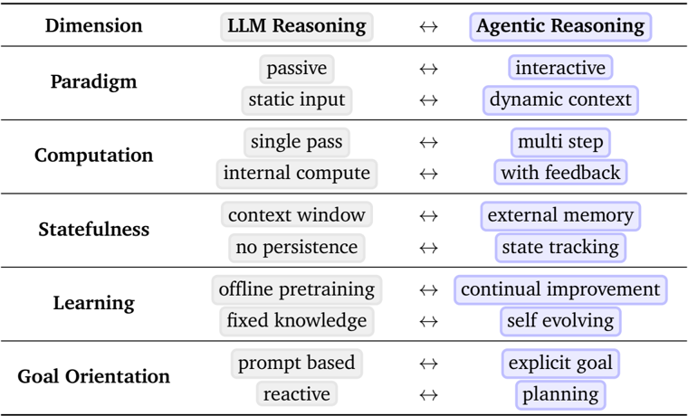

| 次元                                | LLM Reasoning                | ↔                                       | Agentic Reasoning   |
|-------------------------------------|------------------------------|-----------------------------------------|---------------------|
| 受動的 静的入力                     | ↔ ↔                          | インタラクティブ 動的コンテキスト       | パラダイム          |
|                                     | 単一パス 内部Compute         | ↔ マルチステップ ↔ Feedbackあり         | Computation         |
| コンテキストウィンドウ 永続性なし   |                              | ↔ 外部Memory ↔ 状態追跡                 | ステートフル性      |
| オフラインPretraining 固定知識      |                              | ↔ 継続的改善 ↔ 自己進化                 | 学習                |
| 目標指向                            | Promptベース 反応的          | ↔ 明示的目標 ↔ Planning                 |                     |

この移行は概念的な転換を意味する。Reasoningはもはや静的な能力を通じてスケールするのではなく、時間とタスクをまたいでPlanning、適応、協調を可能にする構造化されたインタラクションを通じてスケールする。

## 2.1. 本サーベイの位置付け

いくつかの最近のサーベイがLLM ReasoningまたはAgentアーキテクチャを検討しているが [51, 52, 53, 54, 55, 56, 57, 58, 59]、本研究はReasoningとインタラクションを統一するパラダイムとしてのAgentic Reasoningに特に焦点を当てる。本サーベイはモデル中心のReasoningとシステムレベルの知性の交差点に位置し、Reasoning機構とAgentアーキテクチャに関する先行議論を橋渡しすることを目指す。

**LLM Reasoningサーベイとの関係**. LLM Reasoningに関する既存サーベイは主にモデルの内部計算プロセス内でのReasoningをどのように引き出し強化するかを調査する。例えば、Huang and Chang [51]、Chen et al. [52]、Xu et al. [53]、Ke et al. [54] はChain-of-Thought、Reinforcement Post-training、Long-context ReasoningといったPromptingおよびスケーリング手法を要約し、LLMsがInference時の監督またはPost-training Alignmentを通じてどのようにより良くReasoningを学習できるかを強調する。これらの研究はReasoningトレースの内部的な表現力を向上させるが、通常、外部インタラクションなしに単一の前向きパスでReasoningが展開する静的推論設定にとどまる。対照的に、本サーベイはReasoningがどのようにテキスト生成を超えて拡張し、展開中の動的Planning、適応的Memory、Feedbackドリブンな行動を包含するかを検討する。

**AI Agentサーベイとの関係**. いくつかの最新サーベイがアーキテクチャまたはシステム的観点からLLMベースのAgentを探求し始めている [56, 57, 58, 59]。これらの研究は、AgentがReinforcement Learning、Planning、Tool-useモジュールをどのように使用して複雑な環境で動作するかを分析する。例えば、Zhang et al. [56]、Lin et al. [57] はAgentic SearchおよびDecision-makingのためのReinforcement Learningに焦点を当て、Fang et al. [58]、Gao et al. [59] はインタラクションから継続的に学習する自己進化型・生涯型Agentic Systemsを強調する。本研究の焦点はこれらの観点を補完し、これらのアーキテクチャが可能にするReasoningプロセスに中心を置く。具体的には、インタラクション、Feedback、協調がどのように静的Inferenceを適応的Reasoningへと変容させるかに焦点を当てる。Reasoningをアーキテクチャ設計の暗黙的な副産物として見るのではなく、シングルエージェントのReinforcement、Multi-agent調整、自己進化的知性を結びつける統一機構として扱う。

要約すると、本サーベイは知的エージェントシーに対するReasoning中心の視点を提供する。基盤的なReasoning機構、Post-training適応、長期的な自己進化がどのようにAgentic Reasoningの基礎を共同構成するかを検討し、静的予測からインタラクティブ、適応的、継続的に改善する知性への移行を示す。

## 2.2. 準備

本節は静的言語モデリングからAgentic Reasoningへの移行を形式化する。はじめにで概説された三層の次元（Foundational、Self-Evolving、Collaboration）に整合させるために、これらの能力を単一の制御理論的フレームワークのもとに統合する。

**Agentic Reasoningの形式化：潜在空間の視点**. 標準的なアプローチはしばしばAgentのコンテキストと環境状態を混同する。本研究は環境をPartially Observable Markov Decision Process (POMDP) としてモデル化し、Agentic PoliciesのThing-Act構造を明示するために内部Reasoning変数を導入する。具体的には、タプル $\langle X , O , A , Z , M , T , \Omega , R , \gamma \rangle$ を考える。ここで $X$ は潜在環境状態空間（Agentから観測不可能）、$O$ は観測空間（例：ユーザークエリ、APIの返答）、$A$ は外部行動空間（例：Tool呼び出し、最終回答）、$Z$ はReasoningトレース空間（例：潜在的なPlan、オプションとしてChain-of-Thoughtとして言語化されたもの）、$M$ はAgentの内部Memory・コンテキスト空間（例：インタラクション履歴の十分統計量）である。$T$ と $\Omega$ はTransitionカーネルとObservationカーネル、$R$ はReward、$\gamma \in ( 0, 1 )$ はDiscount Factorを表す。

時刻 $t$ において、AgentはHistory $h_t = ( o_{\leq t} , z_{< t} , a_{< t} )$（すなわち $o_t$ が $z_t$ 生成前に観測され、その後 $a_t$ が生成される）に基づいて条件付けを行う。同等に、HistoryはInternal Memory State $m_t \in M$ によって要約できる。重要なのは、外部行動と内部Reasoningを区別することである。Policyを以下のように因数分解する。

<!-- formula-not-decoded -->

この分解はAgentic Systemsにおけるコアな転換を際立たせる：$A$（行動）にコミットする前に $Z$（思考）においてComputeを実行することである。目標は期待リターン $J ( \theta ) = E_\tau [\sum_{t \geq 0} \gamma^t r_t]$ を最大化することに変わりない。

**In-Context Reasoning：Inference時のSearch**. このレジームでは、モデルパラメータ $\theta$ は固定される。Agentはヒューリスティックな価値関数 $\hat{v} ( h_t , z )$ を最大化するために $Z$ を探索することによってReasoningの軌跡を最適化する。Inferenceをトラジェクトリ $\tau = ( h_0, z_0, a_0, h_1, z_1, a_1, \ldots )$ の選択としてモデル化する。ReAct [5] のような手法は交互する思考 $z$ と行動 $a$ に対してGreedy Decodingを実行する。Tree-of-Thoughts (ToT [4]) および関連するMCTSスタイルのアプローチは部分的な思考をノード $u \in U$（例：$( h_t , z_t )$ から導出された表現）として扱い、最適パスを探索する：

<!-- formula-not-decoded -->

ここで $\hat{v}_\phi$ はヒューリスティックな評価器または検証器である。これはPolicy Parametersを更新せずに $Z$ においてPlanningを行うことに対応する。

**Post-Training：Policy Optimization**. このパラダイムは長期的なReward $r_t$（例：正確性、安全性）にPolicyを整合させるために $\theta$ を最適化し、Reasoning Model（例：DeepSeek-R1 [60]）やMulti-turn ReasoningまたはTool useをRLで学習するLearn-to-Searchシステム（例：Search-R1 [27]、DeepRetrieval [61]）を含む。PPO [62] が標準的であるが、Group Relative Policy Optimization (GRPO) [63] ベースの手法がReasoningタスクに広く使用される。GRPOはGroup相対Rewardから優位性を構築することでValue Networkを不要にする。同じPrompt $q$ からの $G$ 個のサンプル出力 $\{ y_i \}_{i=1}^G$ に対して、一般的なGRPO目標は：

<!-- formula-not-decoded -->

ここで $\rho_i = \frac{\pi_\theta ( y_i | q )}{\pi_{\theta_{\text{old}}} ( y_i | q )}$ であり、Group正規化優位性は

<!-- formula-not-decoded -->

$\delta > 0$ は数値安定性のための小定数である。ARPO [64] やDAP [65] などの高度な手法は、Sparse Rewardを扱い、複雑なTool-use環境における安定性を改善するためにこのフレームワークを拡張する（例：Replay・Rollout戦略とDecoupled Clippingを通じて）。

**Collective Intelligence：Multi-Agent Reasoning**. シングルエージェントの定式化を分散型の部分観測可能なMulti-agent設定、一般的にDec-POMADPとして形式化されるものに拡張する。核心的な違いは各AgentのObservationを通信チャンネル $C$ を含むように拡張することにある。$N$ 個のAgentからなるシステムに対して、Joint Policy $\pi$ は個々のPolicy $\pi_i$ で構成され、Agent $i$ のObservation $o_i^t$ はピアによって生成された通信メッセージ $c_{-i}^{t-1}$ を明示的に含む。重要なのは、Agentic MARLにおいて通信は単なるシグナル伝達ではなくReasoningプロセスの拡張であり、あるAgentの外部行動が別のAgentの内部Reasoning Chainを引き起こすPromptとして機能できることである。AutoGen [66] やCAMEL [67] などの既存フレームワークは固定Policyによる静的なRole-playingを表す。最近のAgentic RL の進歩（例：GPTSwarm [68]、MaAS、PPO・GRPO [69] を通じて学習されるAgent）はこのJoint Reasoning Distributionを最適化することを目指す。課題はシングルエージェントPlanningからMechanism Designへと移行する：分散型ReasoningプロセスをコヒーレントなグローバルObjectiveに整合させるために通信トポロジーとインセンティブ構造を最適化すること。これは協調的行動の出現を安定化させるためにCentralized-Training/Decentralized-Execution (CTDE) パラダイムをしばしば活用する。

**Self-Evolving Agents：Meta-Learning Loop**. 基盤的Agentがエピソード内でReasoning $z$ を最適化するのに対し、Self-Evolving AgentはエピソードをまたいでAgent System自体 $k = 1, \ldots, K$ を最適化する。$S_k$ を進化可能なシステム状態（例：明示的なMemory、Toolライブラリ、またはコード）とする。汎用的なMeta-update Ruleは

<!-- formula-not-decoded -->

ここで $F_k$ は環境Feedback（Reward、実行エラー）を表し、$S_k$ は進化可能な状態を表す。$S$ の性質によってSelf-evolutionを分類する：

- **Verbal Evolution**: $S$ はテキスト的なReflectionまたはガイドラインから成る。Reflexion [14] のような手法はエラーログを将来のReasoning Policyを条件付ける言語的手がかりへと統合することで $S$ を更新する。
- **Procedural Evolution**: $S$ は実行可能なToolまたはSkillのライブラリから成る。Voyager [36] のようなAgentは新しいコードベースのSkillを合成して行動空間 $A$ を永続的に拡張することで進化する。
- **Structural Evolution**: $S$ はAgentのソースコードまたはアーキテクチャ自体から成る。AlphaEvolve [70] のような高度な手法はAgentのコードを仮説空間として扱い、LLMをMutation Operatorとして使用してより優れたReasoningアルゴリズムを探索する。

このフレームワークはこれらの多様なアプローチをAgentの明示的なMemoryとArtifact（オプションとしてパラメータ）に対する勾配なし・勾配ありの最適化ステップとして統一し、経験と能力の間のループを閉じる。
## 3. 基礎的なエージェント推論

エージェント推論は単一エージェントの振る舞いに起源を持つ。適応と協調について論じる前に、個々のエージェントがいかにして推論を構造化された行動へと変換するかを、三つのコアコンポーネント——Planning、Search、Tool Use——に着目して考察する。この文脈において、エージェントは受動的なテキスト生成器ではなく、計画を立案し、検索や環境探索を通じて代替案を模索し、ツールを活用して具体的な操作を実行する自律的な問題解決者である。これらのメカニズムは総体として、エージェント推論の基盤を確立し、抽象的な熟考と検証可能な行動を結びつける。

典型的な基礎的ワークフローは、Planning（目標分解とタスク定式化）、Tool Use（外界に作用するための外部システムやAPIの呼び出し）、Search（意思決定支援のための検索と探索）を交互に繰り返す反復的なサイクルとして捉えることができる。Reasoningはこれらの段階全体を組織する原理として機能し、いつ計画を立てるか、何を検索するか、どのように行動するかを決定し、静的な推論をインタラクティブな意思決定へと変換する。

これらのコンポーネントを分析することで、構造化された推論が静的なLLMをいかにして自律的・目標駆動型のエージェントへと高めるかを明らかにする。次節ではSelf-Evolving Reasoningを紹介する。ここでは、フィードバックとメモリが継続的な適応とこれらの基礎的能力の拡張を可能にする。続いて、Collective Reasoningを検討する。複数のエージェントが役割、通信、および共有メモリを通じて調整し、個々では達成し得ない目標を実現する仕組みを考察する。

## 3.1. Planning Reasoning

Planningは知的行動の中核的コンポーネントであり、エージェントが問題を分解し、決定を順序付け、先見性をもって複雑な環境を渡り歩くことを可能にする。近年の研究では、

Workflow Design

Perception Reasoning

Verification Execution

Tree Search

Traversal

Heuristic

BFS, DFS

MCTS

A* search

Beam

In-context Planning

Process Formalization

Code-like

Artifact

PDDL

Decomposition

Separable

Hierarchical

Component

Abstraction

Post-training Planning

Reward Design

Reward

Behavior

Modeling Optimization

図2: LLMエージェントにおけるPlanning Reasoningの概観。In-context planningとPost-training planningに分類される。

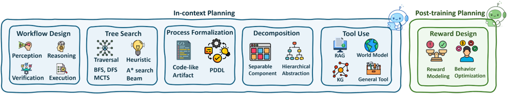

大規模言語モデル（LLM）の文脈における Planning の研究が増加している。エージェントとして自律的に機能する場合と、より広範なシステムのコンポーネントとして機能する場合の双方が探求されている。本節では、エージェントのPlanning研究を推論の観点から六つの方法論的スタイルに分類する。各カテゴリは、複雑なエージェント推論を支援する異なるPlanning戦略を示す。

## 3.1.1. In-Context Planning

**Workflow Design.** ワークフローベースのアプローチは、Planning全体のプロセスを個別の段階（例：Perception、Reasoning、Execution、Verification）へと構造化することを重視し、明示的な足場として設計されるか、あるいは暗黙的に学習される。例えば、[72, 73, 71, 92]はタスク解決をサブタスクへと分解するPlanningパイプラインを設計し、意図的なPlan-and-Actフレームワークを活用することが多い。同様に、[2, 93, 75, 7]は構造化されたPromptingを用いてタスクを順序化し、推論の進行を誘導する。[94]のような手法は多様な「X-of-Thought」戦略間の構造化された遷移を使用する。PERIA [95]は統一されたマルチモーダルワークフロー内でPerception、Imagination、Actionを組み合わせる。[96]は構造化された順序付けによる長期的Planningを明示的なターゲットとし、[97]はコード関連のPlanningのためのワークフローを構築する。

これらのワークフローは、現在の状態を反復的に消費し、推論と行動を交互に組み合わせるReactiveコントローラーによって具体化される。Webオートメーションでは、エージェントはInspect-Reason-Act-Observeループに従い [5, 49]、In-contextの事例を動的に適応させることで堅牢性が向上する [98]。コードでは、エージェントが即時実行・APIコールを決定し、出力やエラーを読み取り、段階的に洗練させる [99, 78, 14, 79, 100, 101, 102, 103, 104]。ロボティクスでは、モニターがリアルタイム調整を伴うオンザフライの安全介入とVLM誘導のサブゴール実行をトリガーする [87, 105]。このReactiveワークフローの視点は、スクリプト化されたステージ設計とオンライン適応を統一する。ワークフローが解釈可能な構造とインターフェース（何をいつ行うか）を提供し、Reactiveループが閉ループのGroundingとエラー回復（文脈内でどのように行われるか）を供給する。このアプローチは広く有効であるが、長い時間軸にわたるエラーが蓄積される可能性があり、実行を安定させるためにワークフロー内の段階的な検証とメモリが必要となる。

**Tree Search / Algorithm Simulation.** BFS、DFS、A*、MCTS、Beam Searchといったツリーベースの探索戦略は、解釈可能で効果的なPlanningの足場として注目を集めている。いくつかの研究はツリー探索アルゴリズムをシミュレートして熟考的なプロセスを模倣する。[4, 106, 107, 108]は構造化された思考ツリーを探索するためにBFSやDFS戦略を適用する。A*に類似したHeuristic誘導の展開が[109, 110, 111]に見られ、状態評価を伴うHeuristic駆動のPlanningを提供する。さらに、MCTSはエージェント研究において広く探求されており、[112, 113, 114, 115, 116, 117, 118, 119, 120, 121, 122, 123]はMCTSやその変種を制御された探索と推論の忠実度向上に使用する。Beam Searchは[124, 125, 126]において推論軌跡を効率的に刈り込み、優先順位付けするために活用される。その他のツリー探索に着想を得た研究には、学習済み探索ポリシーを使用する[127]と、高速（Reactive）と低速（熟考的）のPlanningを区別する[128]が含まれる。これらの手法は伝統的なアルゴリズム的Planningを反映し、LLMの探索プロセスを古典的な意思決定フレームワークに根付かせる。

Tool Use

RAGI

World Model

TRAN

表2: モーダリティ、Structure、Format、Toolによって分類された代表的なエージェントPlanningシステム。

| Method                                                                    | Structure                                                                 | Format                                                                    | Tool                                                                      |
|---------------------------------------------------------------------------|---------------------------------------------------------------------------|---------------------------------------------------------------------------|---------------------------------------------------------------------------|
| Modality I: Language Agents (e.g., Search Agents, Code Agents)            | Modality I: Language Agents (e.g., Search Agents, Code Agents)            | Modality I: Language Agents (e.g., Search Agents, Code Agents)            | Modality I: Language Agents (e.g., Search Agents, Code Agents)            |
| ReWOO [71]                                                                | Decomposed                                                                | Natural Language                                                          | None                                                                      |
| Reflexion [14]                                                            | Sequential                                                                | Natural Language                                                          | None                                                                      |
| LLM+P [72]                                                                | Sequential                                                                | Formal Language                                                           | None                                                                      |
| IPC [73]                                                                  | Sequential                                                                | Formal Language                                                           | None                                                                      |
| ToT [4]                                                                   | Tree                                                                      | Natural Language                                                          | None                                                                      |
| GoT [74]                                                                  | Graph                                                                     | Natural Language                                                          | None                                                                      |
| AoT [75]                                                                  | Graph                                                                     | Natural Language                                                          | None                                                                      |
| HTP [76]                                                                  | Hypertree                                                                 | Natural Language                                                          | Retrieval                                                                 |
| RefPlan [77]                                                              | Tree                                                                      | Constrained Space                                                         | None                                                                      |
| Gorilla [78]                                                              | Sequential                                                                | Programming Language                                                      | Retrieval, API                                                            |
| CodeNav [79]                                                              | Sequential                                                                | Programming Language                                                      | Code Indexer, Code Search                                                 |
| PoG [80]                                                                  | Graph                                                                     | Natural Language                                                          | Knowledge Graph                                                           |
| Tool-Planner [81]                                                         | Sequential                                                                | Natural Language                                                          | Tool Cluster                                                              |
| Modality II: Visual/Multimodal Agents (e.g., GUI Agents, Embodied Agents) | Modality II: Visual/Multimodal Agents (e.g., GUI Agents, Embodied Agents) | Modality II: Visual/Multimodal Agents (e.g., GUI Agents, Embodied Agents) | Modality II: Visual/Multimodal Agents (e.g., GUI Agents, Embodied Agents) |
| VisualPredictor [82]                                                      | Tree                                                                      | Formal Language                                                           | None                                                                      |
| LLM-Planner [83]                                                          | Sequential                                                                | Formal Language                                                           | Object Detector, KNN                                                      |
| Agent-E [84]                                                              | Sequential                                                                | Formal Language                                                           | DOM Grounder, Screenshot                                                  |
| Agent S [85]                                                              | Hierarchical                                                              | Natural Language                                                          | API, Search, Memory                                                       |
| ExRAP [86]                                                                | Sequential                                                                | Natural Language                                                          | Memory                                                                    |
| AESOP [87]                                                                | Reactive                                                                  | Natural Language                                                          | Anomaly Detector                                                          |
| HRV [88]                                                                  | Hierarchical                                                              | Formal Language                                                           | Symbolic Verifier                                                         |
| BehaviorGPT [89]                                                          | Sequential                                                                | Visual Features                                                           | World Model                                                               |
| Dino-WM [90]                                                              | Tree                                                                      | Visual Features                                                           | World Model                                                               |
| FLIP [91]                                                                 | Sequential                                                                | Visual Features                                                           | Language Model                                                            |

学習済み探索ポリシーを使用するこれらの手法と、高速（Reactive）および低速（熟考的）のPlanningを区別する[128]は、伝統的なアルゴリズム的Planningを反映し、LLMの探索プロセスを古典的な意思決定フレームワークに根付かせる。

このSearch-over-Hierarchyの視点はドメインシステムに自然に対応する。Webの文脈では、Planner-Executorアーキテクチャが自然言語で高レベルのサブタスクツリーを生成し、葉ノードをDOM具体化された行動に結びつける。文脈を保持するためにメモリを活用することが多い [84, 129, 85]。コードエージェントでは、階層的タスクツリーと疑似コード計画が問題を再帰的にコンパイル・編集可能な単位に分解し、構造化されたパイプラインがツリー内に階層的なRLやMCTSを埋め込んで有望な編集と検証パスを選択する [76, 22, 130, 131, 132]。ロボティクスでは、Behavior ToolsとHigh-level目標分解が言語指示をサブゴールシーケンスに変換し、低レベルコントローラーとスキルによって実行される [133, 134, 135, 136, 137]。

総じて、階層的なTree Searchは計画合成（ノード展開、Heuristic・証拠ベースの選択）と計画実現（葉のGroundingとフィードバック）を結合し、後退、洗練、コミット前の検証が可能な解釈可能な長期エージェントを生み出す。同時に、学習済みポリシーとメモリを組み込み、効率性と堅牢性を高める柔軟性も保持する。

**Process Formalization.** シンボリック表現、プログラミング言語、または論理フレームワークによるPlanningの形式化は、構成可能性、解釈可能性、および汎化を保証する。いくつかの研究はPlanをコード的なアーティファクトまたはPDDLプログラムとして符号化する。[138, 139, 140, 97, 141, 142]はシンボリック論理または手続き型プログラミングをLLMのPromptingや出力生成に組み込む。これらの表現は下流のツール実行を可能にし、古典的なプランナーやロボットコントローラーとよりクリーンに連携する。PDDLベースの定式化はLLMのPlanningを確立されたPlanning生態系と明示的に橋渡しし、[139, 140]に見られる。CodePlan [97]は長期的な推論を足場するためのプログラム合成の使用を強調する。このような形式化はエージェントの振る舞いに構造的な足場を提供し、生成された計画の説明可能性と堅牢性をしばしば高める。

**Decoupling / Decomposition.** Decouplingストラテジーは複雑なPlanningを、目標認識、メモリ検索、計画洗練などの分離可能なコンポーネントにモジュール化することを目的とする。特筆すべきは、ReWOO [71]が観察モジュールと推論モジュールを明示的に分離して効率を最適化する点である。同様に、[143, 144, 145, 146, 147, 142, 148]は推論を再利用可能または階層的な抽象に分解する。[76]はHypertreeによる階層的思考を推進し、[82]はシンボリック述語で世界を抽象化してPlanningの負担を軽減する。[149]や[119]は潜在変数や状態空間を通じた分解を採用する。これらの分解は扱いやすさを高めるだけでなく、ニューロシンボリックハイブリッドフレームワークとも整合する。特に[150, 151]のような長期的または多エージェントのPlanningシナリオで広く見られる。

**External Aid / Tool Use.** 多くのシステムは外部の構造やツールをPlanningの支援に活用する。RAG、知識グラフ、World Model、汎用Tool Useなどが含まれる。[80, 88, 181, 182, 143]のような知識補強フレームワークは構造化された表現（例：グラフ、シーンレイアウト）をLLMのコンテキストに注入する。RAGスタイルのシステム[86, 183, 184]は関連する知識を検索して継続的な指示Planningを支援する。[112, 138, 185, 89, 90, 91, 186, 187]のようなWorld Modelベースのエージェントは、モデルベースのPlanningのために環境モデルを学習または活用する。HuggingGPT [7]、Tool-Planner [81]、RetroInText [148]のようなTool指向フレームワークは外部APIまたはモジュラーToolchainを使用してPlanningの実行を支援する。これらのシステムはしばしばエージェントと環境のインタラクションを反映し、外部リソースを活用してLLMの能力を足場または補強する。

## 3.1.2. Post-training Planning

**Reward Design / Optimal Control.** 最終的に、最適化としてのPlanningは適切な報酬構造を設計し、RLまたは制御理論的ツールを使用して最適な振る舞いを解くことを意味する。Reflexion [14]、Reflect-then-Plan [77]、Rational Decision Agents [188]は効用ベースの学習を組み込んでPlanningの振る舞いを誘導する。報酬モデリングは[189]のような研究に見られ、[190]のような研究は報酬シェーピングを重視する。最適制御は[191, 192, 193, 194]で明示的に取り組まれ、拡散モデルによる軌跡最適化は[195, 196, 197]に見られる。[119, 198, 147]のようなOffline RL手法は、事前学習済みの動力学モデルまたはコストモデルを活用する。これらの研究における制御理論的な方向性は、連続的・構造的・学習済み報酬空間を最適化することで、シンボリックまたはHeuristicアプローチを補完する。

表3: Integration Stage、Learning Type、Tool Strategyによって分類された代表的なTool-Use最適化システム。

| Method                                                                  | Stage                                             | Learning                                            | Tool Strategy                                                                                                                        |
|-------------------------------------------------------------------------|---------------------------------------------------|-----------------------------------------------------|--------------------------------------------------------------------------------------------------------------------------------------|
| Modality I: In-Context Integration                                      | Modality I: In-Context Integration                | Modality I: In-Context Integration                  |                                                                                                                                      |
| ReAct [5] ART [199] ChatCoT [200] GEAR [201] AVATAR [202]               | Inference Inference Inference Inference Inference | Prompting Few-shot Prompting Delegation Contrastive | Interleaved reasoning-action Retrieved multi-step demos CoT with tool calls Light model for tool selection In-context tool reasoning |
| Toolformer [6] HuggingGPT [7]                                           | Post-train System System System                   | Self-sup. + SFT SFT SFT RL + Reflec. RL RL          | Self-generated API calls Large-scale API demos Simulated dialogues Adaptive retrieval reasoning                                      |
| Modality III: Orchestration-based                                       | Modality III: Orchestration-based                 |                                                     |                                                                                                                                      |
| ToolLLM [203] ToolAlpaca [204] ReSearch [205] ReTool [206] ToolRL [207] | Post-train Post-train Post-train Post-train       |                                                     |                                                                                                                                      |
| Integration                                                             | Integration                                       | Integration                                         |                                                                                                                                      |
| TaskMatrix.AI                                                           | Post-train                                        | Planner-Exec. Planner                               | Reinforced code execution Multi-tool policy learning                                                                                 |
|                                                                         |                                                   |                                                     | Multi-tool coordination                                                                                                              |
| [208] ToolPlanner [81]                                                  |                                                   | RL                                                  | Massive API ecosystem Plan-before-act framework                                                                                      |
| OctoTools [209]                                                         | System                                            | Rule-based Embedding                                | Hierarchical orchestration                                                                                                           |
|                                                                         | System                                            |                                                     | Experience-based selection                                                                                                           |
| ToolExpNet [210] ToolChain* [211]                                       | System                                            | Search                                              |                                                                                                                                      |
|                                                                         |                                                   |                                                     | A* decision over tools                                                                                                               |

## 3.2. Tool-Use Optimization

Tool Use最適化とは、エージェントが外部モジュールをインテリジェントに呼び出すことで固有の能力を拡張する能力である。これにより、エージェントは古くなった知識、正確な計算の不能、またはプライベート情報へのアクセス不足といった制限を克服できる。核心的な課題は、エージェントがツールをいつ使用するか、ライブラリからどのツールを選択するか、および有効な呼び出しをどのように生成するかを推論する能力にある。本節では、Tool Use最適化への既存のアプローチを検討する。大きく三つのスタイルに分類できる：In-Context Tool-Integration、Post-Training Tool-Integration、およびOrchestration-Based Tool-Integration。

## 3.2.1. In-Context Tool-integration

In-contextデモンストレーションパラダイムは、推論時にLLMに新しい能力を付与する学習不要のアプローチである。この手法は現代のLLMの優れたIn-context Learning能力を活用し、凍結されたオフザシェルフのモデルが、精巧に設計された指示、例、および文脈情報をPrompt内に直接提供することで複雑なタスクを実行するよう誘導する。

Query

User

1

Closed-world reasoning

Final Answer

Context Aware

Dynamic Tool-Selection

- Orchestration

Evolve

WHEN, WHICH,

HOW to Use Tool

Tool

& Invocation

図3: 従来のLLMとエージェントのTool-UseシステムとのCompare。従来のモデルは固定した推論で閉じた世界において動作するのに対し、エージェントのTool-Useシステムは外部ツールの動的な選択、Orchestration、統合を可能にし、エージェントが推論を拡張し、精度を向上させ、ドメインを横断して動的に適応することを可能にする。

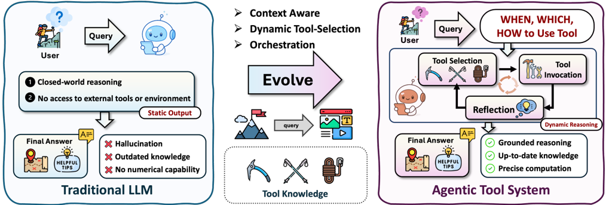

**推論とTool Useの交互実行.** In-contextエージェント推論の基盤は、Chain-of-Thought（CoT）プロセスに行動する能力を付加することにある [1]。ChatCoT [200]は、推論トレースを自然言語での交互の「Thought-Tool-Observation」ステップとして構造化し、LLMが中間出力を振り返り、次のツールクエリを動的に計画できるようにすることで、このパラダイムを形式化する。CoTがLLMに問題を中間推論ステップへと分解させる一方、CoTはモデルの内部知識によって制限された閉じた世界で動作する。エージェントのTool Useにおける主要なイノベーションは、これらの推論ステップを行動（ツール呼び出し）と交互に配置し、エージェントが外部環境とインタラクトして情報を収集し、タスクを実行できる動的なループを作り出すことである [212, 213]。ReAct [5]は「Reasoning+Acting」のSynergyを導入した。このアプローチにより、モデルは推論を使用して行動計画を作成、追跡、調整でき、一方で行動により知識ベースやWebなどの外部環境とのインターフェースを持ち、情報を収集できる。同様に、ART [199]は成功したタスクデモンストレーションのライブラリを維持することで構造化されたアプローチを提供する。新しいタスクに対してARTは関連するマルチステップの例を検索し、Few-shotのPromptとして使用し、LLMが実証済みの推論とTool Useのパスに従うよう誘導する。

**ツールインタラクションのためのContextの最適化.** 基礎的な交互ループは強力であるが、エージェントが大規模または複雑なツールセットを扱う必要がある場合にパフォーマンスが低下する。研究の重要な一分野は、エージェントに提供されるIn-contextの情報を最適化することでこの問題に対処する。最近の研究は、適切に書かれたツールドキュメントがLLMをゼロショット方式で新しいツールを利用可能にすることを実証している [214, 215]。この知見は、LLMが人間と同様に明確で簡潔な指示から恩恵を受けるという洞察と一致する。別の観点から、GEAR [201]は計算効率の高い学習不要のアルゴリズムを導入し、ツール選択プロセスを小規模な言語モデルに委任しながら、コストを削減するために最終的な推論ステップにより強力なLLMを確保する。AVATAR [202]は行動前にエージェントにIn-contextの「対比的推論」を実施させることで、この選択の堅牢性を高める。

これらのIn-context手法は柔軟であるが、パフォーマンスは最終的に凍結されたLLMの固有の能力とContextウィンドウの長さによって制限される。その結果、後続の研究はPost-training手法に焦点を移した。

User

Query

## 3.2.2. Post-training Tool-integration

Post-training手法によるTool Integration [5, 216, 217]は、古くなった知識、限られた計算精度、浅いマルチステップ推論といったLLMやLRMの固有の制限に対処する主要な戦略として浮上した。外部ツールとのインタラクション方法を学習することで、推論モデルは最新情報に動的にアクセスし、正確なシンボリックまたは数値計算を実行し、複雑なタスクをGroundingされたTool支援の推論ステップへと分解できる [218, 219, 9, 220, 221]。ツールを仲介として活用することで、モデルは外部の能力によって豊かに補強され、より正確で汎化可能なエージェント推論軌跡の生成を可能にする [222, 215, 223]。

**SFTによるTool Useのブートストラップ.** Tool Integrationに関する初期の研究 [5, 6, 203, 204, 224, 225, 226, 227, 228]は主に、キュレーションされたTool Use推論ステップに対してSFT（Supervised Fine-Tuning）を適用し、モデルが検索クエリ、コード実行、またはAPIコールのデモンストレーションを模倣するように訓練した。SFTステージは、ツールの呼び出し、ツール出力の解釈、および結果を一貫した推論チェーンへの統合における初期的な能力を提供した [225, 14]。例えば、Toolformer [6]は大規模言語モデルがラベルなしテキスト内で有用なAPIコールを生成・検証・保持し、フィルタリングされたデータに対するFine-tuningによって事実の精度と実用的な有用性を向上させるSelf-supervisedフレームワークを導入する。ToolLLM [203]はSFT訓練を16,000以上のReal-world APIにスケールし、大規模にキュレーションされたデモンストレーションのSupervised Fine-tuningを適用してモデルに堅牢なPlanningと呼び出し能力を付与する。ToolAlpaca [204]は多様なツールセットを自動構築し、マルチエージェントシミュレーションを通じてマルチターンのTool Use対話を生成し、Fine-tuningによって以前に見たことのないツールに対しても汎化されたTool Useを可能にすることで、このアイデアをコンパクトなLLMに拡張する。Tool認識のブートストラップには効果的であるが、SFTのみの適用は訓練データの特定のパターンへの過学習 [229, 230, 231, 172]に苦しみ、脆弱なツール選択戦略と未知の下流アプリケーションシナリオでの限られた適応性につながる [232, 207, 233]。

**RLによるTool Useの習熟.** 近年の研究 [234, 207, 235, 205, 236, 27, 237, 206]は、模倣を超えてTool統合推論の習熟を達成するために、モデルのPost-trainingでRL（Reinforcement Learning）を活用する。RLの統合により、モデルは結果駆動型の報酬を通じてTool Use戦略を洗練させ、試行錯誤によっていつ、どのように、どのツールを呼び出すかを学習する [205, 238, 206, 239]。例えば、SWE-RL [235]は大規模なソフトウェア進化データのコード編集ポリシーを最適化し、ソフトウェア問題解決だけでなく汎用的な推論スキルも向上させる。ReSearch [205]は検索操作をマルチホップ推論チェーンに埋め込み、複雑なQA中の適応的な検索を可能にする。ReTool は実リアルタイムのコード実行を推論ロールアウトに統合し、高度な数学推論ベンチマークで最適なパフォーマンスを達成する。ToolRL [207]は、安定でスケーラブルなマルチツール学習のための原則的な報酬設計を導入することで、このパラダイムを多様なツールセットに汎化する。これらの設定全体を通じて、RLはSFT単独よりも堅牢で適応的かつ汎化可能なTool Useポリシーをもたらすことが示されており、ドメイン外のタスクへの効果的な転移が多く見られる [240, 241, 242, 243, 244]。

## 3.2.3. Orchestration-based Tool-integration

現実のアプリケーションでは、複雑なシステム内のTool Useは単一モデル・単一ツールの設定を超えることが多く、複雑なタスクを完了するために複数のツール間のOrchestrationが必要となる。このOrchestrationは典型的に、ツール間のPlanningとシーケンシングおよび依存関係の管理、すなわち中間出力が適切に渡され変換されることの保証を含む。いくつかの初期の研究 [7, 208, 245]は、複数ツールの協調的使用のための戦略を考案することでこの方向性を探求し、単一のツールでは単独で処理できないマルチステージのタスクを解決できるシステムを実現している。具体的には、HuggingGPT [7]は言語インターフェースを活用して呼び出すツールと呼び出すタイミングを計画する中央集権的なエージェントを採用し、複数のツールを連続的に必要とする複雑なタスクの解決を可能にする。TaskMatrix.AI [208]は基盤モデルを数百万のAPIと接続し、モデルを使用してタスク解決のアウトラインを生成し、特定のサブタスクを専門的な機能を持つオフザシェルフのモデルとシステムに自動的にマッチングさせる。ToolkenGPT [209]は次のトークン予測中に各ツールを特殊なトークンとしてエンコードすることで、凍結された言語モデルに大規模なツールセットを付加する。

**Tool Orchestrationのためのエージェントパイプライン.** LLMがツールを効果的に呼び出しOrchestrationできるようにするための多くのフレームワークが設計されている。現在のエージェントパラダイムの多くは「行動前に計画する」戦略に従い、モデルはまずTool Useのための構造化された計画を生成し、その後実行する。ToolPlanner [81]はパス計画とフィードバックを伴う二段階のRLフレームワークをMGToolBenchとともに導入し、API重視の訓練データと現実のユーザー指示のギャップを埋める。ToolMVR [246]はツール呼び出しのメタ検証と探索ベースの反省学習を通じた信頼性と反省を向上させ、GPT-4と他のベースラインを大幅に上回る成果を示す。より最近では、OctoTools [209]が標準化されたツールカード、階層的なプランナー、およびエグゼキューターを備えた学習不要の拡張可能なフレームワークを提供し、マルチドメイン推論タスクにわたって広範な改善を示す。Chain-of-Tools [247]は凍結されたLLMのSemantic表現を活用して未知のツールをChain-of-Thought推論で動的に構成し、Fine-tuningなしに大規模なツールプールへの汎化を可能にする。PyVision [248]はMLLMが動的にPythonベースのツールを生成・実行・洗練するインタラクティブなマルチターンフレームワークを導入し、視覚的推論における静的なツールセットを超える。ConAgents [228]はインタラクティブなマルチエージェント設定へのTool Useフレームワークの初期的な拡張を行う。このようなエージェントのTool OrchestrationフレームワークがChemistryドメイン [249]への新たな応用として登場していることも注目すべきである。

**OrchestrationのためのTool表現.** Orchestrationパイプラインの設計に留まらず、別の研究の流れはOrchestration中のより正確な選択、構成、および調整を促進するためにツール自体を最適化することに焦点を当てる。ToolExpNet [210]はツールとその使用経験をSemantic的な類似性と依存関係をエンコードするネットワークとしてモデル化し、LLMが類似したツールを区別し、選択中の相互依存性を考慮できるようにする。T2Agent [250]はマルチモーダルの誤情報検出を、ツールを標準化されたテンプレートで表現し、ベイズ最適化を使用してタスク関連のサブセットを選択することで対処する。この削減されたアクション空間上でのMonte Carlo Tree Searchと組み合わせることで、T2Agentは効率的なマルチソース検証を可能にする。ToolChain* [211]はツールアクション空間全体を決定木として捉え、タスク固有のコスト関数を伴うA*探索を適用してナビゲーションを誘導する。この表現は高コストのブランチの効率的な刈り込みと最適なTool Useパスの特定を可能にする。ToolRerank [251]は既知ツールと未知ツールの適応的な切り捨てと、単一ツールクエリの集中と多ツールクエリの多様性のバランスをとる階層認識のReRankingを導入することでツール検索を洗練させる。

## 3.3. Agentic Search

単一エージェントのAgentic RAG（Retrieval-Augmented Generation）システムは、検索-生成ループ全体を管理する中央集権的なエージェントに推論と制御を埋め込む。生成前に固定された一回限りの検索を実行する従来のRAGパイプライン [252, 10, 253]とは異なり、Agentic RAGエージェントはリアルタイムの推論ニーズに基づいて、いつ、何を、どのように検索するかを動的に制御する。これにより、モデルは推論中間で検索戦略を適応させ、クエリを洗練させ、複数のソースからの証拠をより適切に統合できる。エージェントが推論中に検索コンテンツをどのように選択、洗練、統合するかに基づいて、単一エージェントのAgentic RAGシステムを三つの異なるアーキテクチャスタイルに分類する：In-context、Post-training、およびStructure-Enhanced Agentic RAG。

to Retrieve

Final Answer query

Evolve

User Query

HELPFUL

TIPS

User

HELPFUL

Query

A=

Data Sources

Dynamic Retrieval

1 www.

Autonomou:

Data Embedding

WHEN,WHAT, HOW

TIPS

to Retrieve

Vector Database

Reasoning

Evnarianco from wchl

Tool Use

Cwwwo

+

Retrieved

Document

Traditional RAG System

Static Retrieval

Synthesize 8

Generate

図4: 従来のRAGシステムとAgentic Searchシステムとの比較。従来のRAGはVector DatabaseのStatic Retrieval（静的検索）に依存するのに対し、Agentic Searchはいつ、何を、どのように検索するかの自律的な意思決定を導入し、動的な検索、In-context Retrieval、Critique-and-Adaptループ、およびTool Useを可能にする。

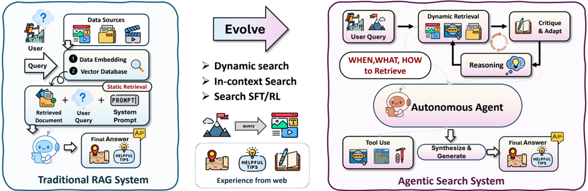

## 3.3.1. In-Context Search

**推論と検索の交互実行.** In-contextのAgentic RAGシステムは、精巧に設計されたPromptingストラテジーを通じて、言語モデルの推論プロセスに直接検索行動を埋め込む。モデルに検索行動を学習させる代わりに、これらの手法はモデルを単一のForward Pass内で推論と検索を交互に行うよう誘導する。典型的にはFew-shotの例示または特殊なトークンを介して行われる。代表的な例はReAct [5]であり、Chain-of-Thought推論と&lt;Search&gt;のようなTool Useコマンドを交互に配置し、外部APIまたは知識ソースを動的に呼び出す。Self-Ask [254]やIRCoT [213]のような拡張は、モデルに再帰的に質問を分解してサブ証拠を検索するよう促すことで、逐次的な推論を超える。より最近の手法 [255, 183, 256, 263]は反省的な検索を導入し、モデルが各ステップで追加情報が必要かどうかを明示的に評価し、必要な場合にのみ検索することを決定する。これらのアプローチは追加の訓練を必要とせず、非常に柔軟でデプロイ可能であるが、しばしばPrompt Engineeringに依存し、多様なドメインにわたる安定性に苦しむ場合がある。

**Structure-Enhanced Search.** Structure-Enhanced Agentic RAGシステムは、単一のエージェントが動的なクエリ、ツール呼び出し、および反省的な自己監視を通じて知識グラフのようなシンボリック知識ソースを推論できるようにすることで、RAGを強化する。静的なKGレトリーバーやクエリエグゼキューターとは異なり、これらのエージェントは構造化された知識にいつアクセスするか、グラフベースのクエリをどのように定式化するか、検索された情報が推論軌跡を継続するのに十分かどうかを決定する。Agent-G [262]は非構造化ドキュメント検索と構造化グラフ推論を統合するモジュラーなエージェントアーキテクチャを導入し、フィードバックループと専門的な検索モジュールを使用して正確なマルチホップ応答を保証する。MC-Search [263]はマルチモーダルなSearch強化推論プロセスをモデル化するための五つの標準的な推論トポロジーを導入し、異種ソースにわたるモデルのPlanningと検索の忠実度を評価するEnd-to-endのAgentic RAGとステップワイズ評価パイプラインを提案する。同様に、GeAR [264]は複雑なマルチホップクエリにおける課題に対処するために、エージェントコントローラーにグラフ展開操作を組み込み、構造化および非構造化ソース間の一貫性を向上させる。検索Orchestrationを超えて、ARG [265]は知識グラフ上の推論のための完全なEnd-to-endエージェントフレームワークを、能動的な自己反省を通じて提案する。モデルは自律的に検索タイミングを決定し、シンボリック入力に基づいて反復的なCritiqueを実行する。

Critique

& Adapt

表4: Reasoning Structure、Format、Tool Useによって分類された代表的なAgentic Searchシステム。NLはReasoning中に使用される自然言語トレースを示し、Opsはシンボリックまたはグラフ操作を指し、KGは知識グラフを表す。Tool Useには検索API、ブラウザ操作、またはKGベースの検索が含まれる。

| Method                                          | Structure                                       | Format                                          | Tool                                            |
|-------------------------------------------------|-------------------------------------------------|-------------------------------------------------|-------------------------------------------------|
| Modality I: In-Context Agentic Search           | Modality I: In-Context Agentic Search           | Modality I: In-Context Agentic Search           | Modality I: In-Context Agentic Search           |
| ReAct [5]                                       | Interleaved Decomposed                          | NL + Actions NL Queries                         | Search API Search API                           |
| Self-Ask [254]                                  | Sequential                                      |                                                 |                                                 |
| IRCoT [213] Self-RAG                            | Reflective                                      | NL + CoT                                        | Search API Conditional Search                   |
| [255]                                           |                                                 | NL Self-check                                   |                                                 |
| DeepRAG [256]                                   | Iterative                                       | NL Feedback                                     | Search API                                      |
| Modality II: Post-Training Agentic Search       | Modality II: Post-Training Agentic Search       | Modality II: Post-Training Agentic Search       | Modality II: Post-Training Agentic Search       |
| Toolformer [6]                                  | Sequential                                      | Tool Tokens                                     | APIs, Search                                    |
| INTERS [257]                                    | Sequential                                      | Instructions                                    | Search API                                      |
| WebGPT [258]                                    | Sequential                                      | NL + Browser                                    | Web Search                                      |
| RAG-RL [259]                                    | Decision                                        | NL Policy                                       | Evidence API                                    |
| Search-R1 [27]                                  | Iterative                                       | NL + Tokens                                     | Live Web                                        |
| Deep-                                           | Multi-step                                      | NL Trajectories                                 | Browser Tools                                   |
| Researcher [260]                                | Researcher [260]                                | Researcher [260]                                | Researcher [260]                                |
| ReSearch [205]                                  | Step-wise                                       | NL Steps                                        | Search + Verifier                               |
| ReARTeR [261]                                   | Reflective                                      | NL Policy                                       | Tool Cluster                                    |
| Modality III: Structure-Enhanced Agentic Search | Modality III: Structure-Enhanced Agentic Search | Modality III: Structure-Enhanced Agentic Search | Modality III: Structure-Enhanced Agentic Search |
| Agent-G [262]                                   | Modular                                         | NL + Graph Ops                                  | KG Query                                        |
| MC-Search [263]                                 | Multi-step                                      | NL                                              | Multimodal Search                               |
| GeAR [264]                                      | Graph                                           | Graph Ops                                       | KG Expansion                                    |
| ARG [265]                                       | Reflective                                      | NL + Symbols                                    | KG Traversal                                    |

これらのシステムは、受動的なグラフアクセスから能動的なフィードバック駆動型のシンボリック推論へのシフトを表し、構造化されたAgentic RAGが事実の信頼性と解釈可能性の双方を達成する可能性を示している。

## 3.3.2. Post-Training Search

Post-trainingのAgentic RAG手法は、SFTまたはRLのいずれかによってモデルをFine-tuningし、マルチステップ推論全体にわたって情報に基づいた意思決定を行う検索認識能力を言語モデルに付与する。In-context Promptingとは異なり、これらのアプローチはモデルを訓練して、検索がいつ必要か、クエリをどのように定式化するか、検索された証拠をどのように組み込むかを決定させる。

**SFTベースのAgentic Search.** これらの手法は、検索操作と自然言語推論を交互に配置するキュレーションまたは合成データセットを構築し、その後SFTを適用してモデルに検索認識能力を植え付ける。Toolformer [6]はモデル生成テキスト内のTool Use行動にアノテーションをつけるSelf-supervisedアプローチを導入し、LLMがWebSearchや計算機などのツールをいつどのように呼び出すかを学習できるようにする。INTERS [257]は40以上のソースからコンパイルされた多様なマルチタスクデータセットに対するInstruction-based Fine-tuningを実行することでこの方向性を拡張し、幅広い検索-推論パターンを捉える。このクラスの手法はスケーラブルなデータ生成パイプライン [266, 267, 23]から恩恵を受け、人間によるアノテーションの必要性を最小化する。Instructionalの再定式化手法 [268, 257, 269]は、タスクを人間に好まれるフォーマットと推論に合わせることで汎化をさらに強化する。

**RLベースのAgentic Search.** これらの手法は、回答品質、事実性、またはユーザーの好みを反映する報酬シグナルを通じて検索認識行動を最適化する。WebGPT [258]は人間の判断に合わせた検索補強チェーンを監督するための報酬モデリングを導入し、RAG-RL [259]は検索を証拠アクセス上の逐次的な意思決定タスクとして定式化する。Search-R1 [27]やDeep-Researcher [260]のような最近の取り組みは、エージェントを訓練して検索行動（例えば、推論中間に&lt;Search&gt;トークンを生成する）を動的に発行し、LiveWebのようなオープンエンドな環境で動作させることをさらに推進する。これらのエージェントは、反復的な分解、再検証、証拠Planningといった創発的な能力を示す。最終的に、ReSearch [205]やReARTeR [261]のようなシステムは正確な回答だけでなく解釈可能で忠実な推論軌跡も追求し、RL学習済みレトリーバーが制御可能で反省的なエージェントとして機能する可能性を示している。
## 4. 自己進化するエージェント推論

自己進化するエージェント推論とは、エージェントが経験を通じて自身の推論プロセスを改善する能力を指す。この進化の核心には、**フィードバック**と**メモリ**という2つの基本メカニズムが存在する。フィードバックは自己修正と洗練のための評価信号を提供し、エージェントが結果や環境の反応に基づいて推論戦略を修正することを可能にする。メモリはその一方で、過去のインタラクションを保存・整理・統合するための永続的な基盤として機能し、タスクをまたいだ知識の蓄積と再利用を可能にする。これらのメカニズムが合わさることで、推論は静的なプロセスから、継続的な改善が可能なダイナミックで適応的なループへと変貌する。

計画、探索、ツール使用などの基礎的な能力の上に構築され、自己進化するエージェントはフィードバックとメモリを統合して内部の推論ポリシーを洗練し、意思決定戦略を調整し、多様なコンテキストにわたって汎化する。これは多くの場合、明示的な外部監督を必要としない。この継続的な適応は、生涯推論に向けた重要な一歩であり、次のセクションで探求される集合知の基盤を築く。

## 4.1. エージェント的フィードバックメカニズム

エージェント的フィードバックメカニズムにより、モデルは一度限りの応答に依存するのではなく、推論と行動を反復的に洗練させることが可能になる。自己批評、検証器ガイダンス、またはバリデータベースの再サンプリングを組み込むことで、これらの手法は人間の試行錯誤学習を模倣し、自律的な自己改善の基盤を形成する。大まかに言えば、3つの異なるフィードバック体制を通じて機能する：(1) **反射的フィードバック**（Reflective Feedback）：モデルが自己批評や検証を通じて推論を修正する；(2) **パラメトリック適応**（Parametric Adaptation）：フィードバックが更新されたモデルパラメータに統合される；(3) **バリデータ駆動フィードバック**（Validator-Driven Feedback）：二値の結果信号が内省なしに再サンプリングを誘導する。

これらの体制は、動的な推論時適応性、パラメータ更新による持続的な学習、そして外部信号による効率的な修正の間の連続体を定義する。合わせて、現代のエージェントが柔軟性、信頼性、効率性のバランスをとるためにフィードバックをいかに活用するかを示している。

Reflective Feedback

Reasoning

Trajectory

Update

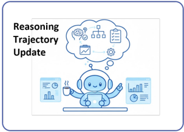

Parametric Adaptation

Parameter update

Training

Validator-Driven Feedback

Feedback

Attempt Failed

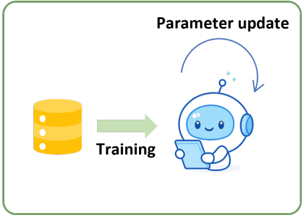

## Attempt Succeed

図5：3つのエージェント的フィードバックメカニズムの図示。推論時のReflectionにより、推論中のリアルタイムな自己批評と修正が可能になる；オフライン適応はフィードバックをモデルパラメータに統合し長期的な改善をもたらす；結果ベースのフィードバックはバリデータ信号（成功または失敗）に依存してリトライを通じた行動の洗練を行う。合わせて、適応的なReflectionから安定した学習、効率的な検証までの連続体を表す。

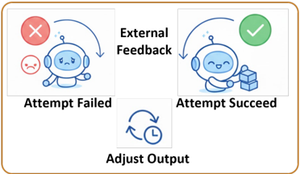

## 4.1.1. 反射的フィードバック（Reflective Feedback）

反射的フィードバック手法は、モデルパラメータを更新することなく推論時に推論プロセスを修正することで、モデルの信頼性を向上させる。これらのアプローチは、思考の連鎖や部分的な解といった中間推論出力を公開し、モデルが生成をどのように継続するかに直接影響を与える追加的な評価ステップを導入する。

初期の自己批評と根拠洗練手法 [14, 270] は、明示的な「生成→批評→修正」ループを通じてReflectionを実装する。モデルはまず推論とともに回答を生成する。同じモデルまたは別にプロンプトされた批評者の役割が、この出力を分析して論理的エラー、根拠のない仮定、または欠けているステップを特定する。批評は修正された生成のためのコンテキストとして追加され、このプロセスは複数回繰り返されることもあり、検索などの外部証拠で補強されることもある。より最近の自己改善フレームワーク [271] は、インタラクションをまたいで批評や失敗ケースを蓄積することで、単一の推論エピソードを超えて反射的フィードバックを拡張する。単一の応答を修正するだけでなく、これらの手法は推論時に直接パラメータ更新を行わずに、プロンプト洗練やキュレーションされた監督信号を通じて将来の生成を導くために過去のフィードバックを再利用する。探索ベースの推論戦略 [272, 4, 74] は、複数の候補推論パスを生成して比較することで信頼性を向上させる。これらの手法は確率的サンプリングや構造化された探索を通じて解空間を探索し、投票スキーム、ヒューリスティックスコア、または学習済み評価器を使用して出力を選択または集約する。改善は単一の推論軌跡の明示的な修正ではなく、代替案間の比較から生じる。分解ベースのプロンプト手法 [2, 273] は、複雑な問題をより単純なサブ問題の順序列に再定式化する。中間結果は後のステップで再利用され、明示的な批評ステップが導入されていない場合でも、推論の進行状況の部分的な検査を可能にし、エラーの伝播を減少させる。

全体として、反射的フィードバックは追加的な推論または比較ステップを導入することで推論時の推論軌跡を変化させる。フィードバックはエピソード内での生成を誘導するために使用されるが、モデルのパラメータは変更されないままである。

## 4.1.2. パラメトリック適応（Parametric Adaptation）

パラメトリック適応は、追加のトレーニングを通じてフィードバックをモデルのパラメータに組み込み、個々の推論エピソードを超えて汎化する永続的な行動変化を生み出す。反射的フィードバックとは異なり、これらの手法はフィードバック信号をモデルの重みを更新する教師あり学習または選好ベースのトレーニング目標に変換する。

軌跡レベルの教師ありファインチューニングアプローチ [274, 103] は、最終回答だけでなく中間推論トレースにフィードバックを付与する。モデルはまず多段階の軌跡を生成し、それが人間、補助モデル、または自動検証器によってレビューされる。誤ったステップは修正または置き換えられ、結果として得られるフィードバックで豊かにされた軌跡が教師あり学習データとして使用され、モデルが改善された推論パターンを内面化するよう促す。蒸留ベースの手法 [275] は、より強力な教師が生成した高品質な思考の連鎖または自己修正解を学生モデルのトレーニングに活用することで、改善された推論トレースをさらに活用する。このプロセスは構造化された推論行動をより安定した効率的なモデルに転移し、推論時に明示的なReflectionを必要としなくなる。選好アラインメントアプローチ [276, 277, 278] は、好ましい出力と好ましくない出力を区別する比較判断の形でフィードバックを組み込む。報酬モデリングや直接選好最適化などのトレーニング目標は、好ましい行動がより確実になるようにモデルのパラメータを調整する。フィードバックはしばしば最終出力に対して定義されるが、それを生み出す内部推論戦略を暗黙的に形成する。最近の研究では、検証増強トレーニングデータが複数のドメインにわたる推論の堅牢性をさらに改善できることが示されている [279, 280]。これらの設定では、軌跡はトレーニング前に正確性または一貫性信号に基づいてフィルタリングまたは修正され、信頼性の高い推論パターンを強調するデータセットが得られる。

要約すると、パラメトリック適応はフィードバックをモデルのパラメータに直接埋め込み、タスクをまたいで持続的な改善をもたらす。この持続性は、追加のトレーニングコストと推論時手法と比較した柔軟性の低下を犠牲にして得られる。

## 4.1.3. バリデータ駆動フィードバック（Validator-Driven Feedback）

バリデータ駆動フィードバックは、モデルの推論プロセスやパラメータを修正することなく、外部の成功または失敗信号を使用してモデル出力を改善する。ユニットテスト、制約チェッカー、シミュレータ、または環境信号などのバリデータが候補出力を評価し、それらが事前定義された正確性基準を満たすかどうかを判断する。

リトライベースのシステム [281, 282] は、1つが検証をパスするまで候補出力を繰り返しサンプリングすることでこのパラダイムを実装する。モデルは完全な解を生成し、バリデータに提出し、検証に失敗した場合は破棄する。その後の試みは、以前の失敗に関する明示的な情報でコンディショニングすることなく独立して生成される。この戦略は、プログラム合成やソフトウェアエンジニアリング [283, 284, 285] など、信頼性が高くコストの安い検証が利用可能なドメインで特に効果的である。生成されたコードはユニットテストに対して実行でき、明確な正確性信号を提供する。モデルは明示的な推論修正なしに、すべてのテストを満たす解が得られるまで反復する。同様のメカニズムは、具現化および対話型エージェント [136, 286] にも現れ、環境がタスク完了を合図するまでアクションシーケンスが繰り返し実行される。失敗したシーケンスは破棄され、外部の成功信号のみに基づいて新しいものが試みられる。一部のハイブリッド手法は、リトライループ内に軽量なガイダンスを導入する。例えば、最終的に成功した結果につながる行動により高い報酬を割り当てるなど [287]。しかし、支配的なメカニズムは推論ステップの修正やパラメータ更新ではなく、外部検証による選択のままである。

全体として、バリデータ駆動フィードバックは、

表5：フィードバック段階、フィードバックソース、更新ターゲットによって分類されたエージェント的フィードバックメカニズムの代表例。

| 手法 / システム                  | フィードバック段階 | フィードバックソース          | 更新ターゲット   |
|----------------------------------|------------------|-------------------------------|------------------|
| I. Reflective Feedback           |                  |                               |                  |
| Reflexion [14]                   | Inference        | 自己生成した批評               | Trajectory       |
| Self-Refine [270]                | Inference        | 自己評価                       | Trajectory       |
| Constitutional AI [278]          | Inference        | 規範的ルール                   | Trajectory       |
| RLAIF [288]                      | Inference        | AI検証器                       | Trajectory       |
| SelfCheckGPT [289]               | Inference        | クロスサンプル分岐             | Trajectory       |
| Zero-Shot Verification-CoT [290] | Inference        | 外部検証器                     | Trajectory       |
| ASCoT [291]                      | Inference        | 脆弱性検出                     | Trajectory       |
| MM-Verify [292]                  | Inference        | マルチモーダル検証器           | Trajectory       |
| ReAct [5]                        | Inference        | アクション結果                 | Trajectory       |
| PAL [3]                          | Inference        | コード実行                     | Trajectory       |
| WebGPT [258]                     | Inference        | Web証拠                        | Trajectory       |
| MemGPT [293]                     | Inference        | 検索されたメモリ               | Trajectory       |
| Voyager [36]                     | Inference        | 環境 + メモリ                  | Trajectory       |
| II. Parametric Adaptation        |                  |                               |                  |
| AgentTuning [274]                | Training         | 高品質な軌跡                   | モデルパラメータ |
| ReST [103]                       | Training         | 批評-修正ペア                  | モデルパラメータ |
| ReFT [294]                       | Training         | Reflection増強データ           | モデルパラメータ |
| Distill-CoT [275]                | Training         | Expert CoT                    | モデルパラメータ |
| ReflectEvo [279]                 | Training         | Reflectionトレース             | モデルパラメータ |
| Reasoning-CV [280]               | Training         | 検証信号                       | モデルパラメータ |
| III. Validator-Driven Feedback   |                  |                               |                  |
| ReZero [281]                     | Inference        | 二値バリデータ                 | 出力のみ         |
| Retrials [282]                   | Inference        | 受容信号                       | 出力のみ         |
| CodeRL [283]                     | Inference        | ユニットテスト                 | 出力のみ         |
| LEVER [284]                      | Inference        | 実行結果                       | 出力のみ         |
| SWE-bench [285]                  | Inference        | テストスイート                 | 出力のみ         |
| SayCan [136]                     | Inference        | 環境状態                       | 出力のみ         |
| PaLM-E [286]                     | Inference        | 環境フィードバック             | 出力のみ         |
| Reflect-Retry-Reward [287]       | Inference        | バリデータ + Reflection信号   | 出力のみ         |

信頼性の高いバリデータが利用可能な場合に出力の正確性を効率的かつスケーラブルに改善する方法を提供する。その限界は、フィードバックが診断的でなく、失敗を説明したりモデルの推論行動を変えることなく個々の出力を修正するのみである点にある。

anepdn

図6：LLMエージェントにおけるエージェント的メモリの概要。インコンテキスト使用（テキストと経験）、構造化された表現（グラフとマルチモーダルメモリ）、ポストトレーニング制御（報酬誘導メモリ管理）という3つの並行次元を示している。

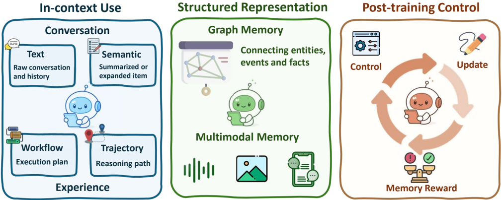

## 4.2. エージェント的メモリ（Agentic Memory）

メモリ拡張LLMエージェントの最近の進歩は、静的なメモリ保存からエージェント推論を直接サポートするより動的でインタラクティブなメカニズムへと焦点が移行している。コンテキストウィンドウを単に拡張したり過去の入力を保存したりするのではなく、メモリはますます推論ループの不可欠なコンポーネントとして扱われるようになっており、過去の経験への反省、将来の行動のガイダンス、そして複雑な長期タスクへの動的な適応に使用される。形式的には、エージェントはメモリモジュールを維持し、各メモリエントリはシステム設計に応じて、生の観測、要約された軌跡、サブゴール、ツール呼び出しトレース、または他の構造化要素を表す場合がある。

エージェントの推論プロセスは、その即時のコンテキストだけでなく、この永続的なメモリ上でも動作し、反省、汎化、長期的な目標追跡を可能にする。このセクションでは、エージェント推論をサポートし可能にするためのメモリ使用における4つの新興トレンドに沿って先行研究を整理する。図6は、エージェント的メモリがコンテキスト的想起から適応的制御へとどのように進展するかを要約する。インコンテキストメモリは過去のインタラクションからテキストおよび意味情報を取得し；構造化メモリはこれらをグラフおよびマルチモーダル表現に統合し；ポストトレーニング制御は、エージェントが学習された報酬ベースのメカニズムを通じてメモリを進化させ、更新し、検索することを可能にする。

## 4.2.1. フラットメモリのエージェント的使用

**事実メモリ（Factual Memory）。** LLMエージェントの従来のメモリシステムは通常、メモリをpassiveなバッファとして扱い、主にTransformerモデルの限られたコンテキストウィンドウに対処するために対話履歴や最近の観測を保存するために使用されていた。例としては、密な検索手法 [252, 319, 297]、LangChainおよびLlamaIndexの事前定義モジュール [296]、MemGPT [293] のようなキャッシュに着想を得た設計がある。これらのアプローチは通常、意味的に類似した過去のコンテンツを検索してプロンプトを増強するが、エージェントの内部推論には影響を与えない。微分可能なメモリを持つRET-LLMなどの拡張機能 [320]、コントローラベースのメカニズムを持つSCM [321]、長期保持のためのLOCOMOおよびLongMemEvalベンチマーク [322, 323] はリコールをさらに改善するが、依然として大部分は静的である。これらのシステムはしばしば固定されたヒューリスティックと

表6：設定、フォーマット、メモリタイプによって分類されたエージェント的メモリシステムの代表例。

| 手法 / システム                            | 設定                                       | フォーマット                               | メモリタイプ                               |
|--------------------------------------------|--------------------------------------------|--------------------------------------------|--------------------------------------------|
| I. フラットメモリのエージェント的使用（インコンテキスト） | I. フラットメモリのエージェント的使用（インコンテキスト） | I. フラットメモリのエージェント的使用（インコンテキスト） | I. フラットメモリのエージェント的使用（インコンテキスト） |
| LangMem [295]                              | インコンテキスト                           | テキスト                                   | 事実                                       |
| LlamaIndex [296]                           | インコンテキスト                           | テキスト                                   | 事実                                       |
| MemGPT [293]                               | インコンテキスト                           | テキスト                                   | 事実                                       |
| MemoryBank [297]                           | インコンテキスト                           | 意味的                                     | 事実                                       |
| Amem [24]                                  | インコンテキスト                           | 意味的                                     | 事実                                       |
| Workflow Memory [298]                      | インコンテキスト                           | ワークフロー                               | 経験                                       |
| MemOS [13]                                 | インコンテキスト                           | 意味的                                     | 事実                                       |
| LightMem [299]                             | インコンテキスト                           | 意味的                                     | 事実                                       |
| Nemori [300]                               | インコンテキスト                           | 意味的                                     | 事実                                       |
| ACE [301]                                  | インコンテキスト                           | ワークフロー                               | 経験                                       |
| Reasoning Bank [302]                       | インコンテキスト                           | ワークフロー                               | 経験                                       |
| Dynamic Cheatsheet [303]                   | インコンテキスト                           | Trajectory                                 | 経験                                       |
| Sleep-time Compute [304]                   | インコンテキスト                           | Trajectory                                 | 経験                                       |
| Evo-Memory [25]                            | インコンテキスト                           | 意味的                                     | 経験                                       |
| II. 構造化メモリ表現                       | II. 構造化メモリ表現                       | II. 構造化メモリ表現                       | II. 構造化メモリ表現                       |
| GraphRAG [305]                             | インコンテキスト                           | グラフ                                     | 事実                                       |
| MEM0 [12]                                  | インコンテキスト                           | グラフ                                     | 事実                                       |
| Zep [306]                                  | インコンテキスト                           | グラフ                                     | 事実                                       |
| Optimus-1 [307]                            | インコンテキスト                           | マルチモーダル                             | 経験                                       |
| RAP [308]                                  | インコンテキスト                           | マルチモーダル                             | 経験                                       |
| M3-Agent [309]                             | インコンテキスト                           | マルチモーダル                             | 事実                                       |
| Mem-Gallery [310]                          | インコンテキスト                           | マルチモーダル                             | 事実                                       |
| Agent-ScanKit [311]                        | インコンテキスト                           | マルチモーダル                             | 経験                                       |
| III. ポストトレーニングメモリ制御          | III. ポストトレーニングメモリ制御          | III. ポストトレーニングメモリ制御          | III. ポストトレーニングメモリ制御          |
| Mem1 [312]                                 | ポストトレーニング                         | 意味的                                     | 事実                                       |
| Memory-as-Action [313]                     | ポストトレーニング                         | 意味的                                     | 事実                                       |
| MemAgent [314]                             | ポストトレーニング                         | 意味的                                     | 事実                                       |
| Mem- α [315]                               | ポストトレーニング                         | 意味的                                     | 事実                                       |
| Memory-R1 [15]                             | ポストトレーニング                         | 意味的                                     | 事実                                       |
| Agent Early Experience [316]               | ポストトレーニング                         | 暗黙的                                     | 経験                                       |
| Agentic Memory [317]                       | ポストトレーニング                         | 意味的                                     | 経験                                       |
| MemRL [318]                                | ポストトレーニング                         | 意味的                                     | 経験                                       |

非構造化トークンリスト [297] に依存し、ゴール分解 [324, 143]、長期計画 [150]、または反復的自己改善 [325] を含むタスクへの適応性を制限する。これに対し、新興のエージェント的メモリは

メモリを推論ループの一部として扱い、Reflection [326] や意思決定 [327] をサポートする。Amem [24] は、LLMエージェントが文脈的なメモリ記述を自律的に生成し、関連する経験間の動的なリンクを構築し、新しい情報に応じてメモリコンテンツを進化させることを可能にする。同様に、Zep [306]、Mirix [328]、MemOS [13]、LightMem [299]、Nemori [300] はLLMを活用してコンテキストを意識したメモリ表現を自動的に生成する。LLL駆動アプローチを超えて、最近の研究では強化学習を用いてエージェントが事実メモリを取得・整理するよう明示的にトレーニングすることも探求されており、後のセクションで詳しく議論するMemα [315] やMemory-R1 [15] などがある。

**経験メモリ（Experience Memory）。** Workflow Memory [298] は手続き的トレースを追跡して計画の回復と一貫した推論を可能にする。Sleep-time Computeは、LLMエージェントがユーザーインタラクションの前に予測される推論ステップを事前計算・保存することを可能にし、実質的にメモリを準備リソースとして使用して「オフラインで考える」ことができる [304]。Dynamic Cheatsheet (DC) [303] は、ブラックボックスモデルに再利用可能な戦略を保存する外部メモリを装備し、冗長な推論を削減する。他の取り組みはエージェント的メモリの補完的なパラダイムを探求している。並行して、ワークフローメモリが別の構造化アプローチとして台頭しており、特に手続き的でツール拡張されたタスクに適している。実行中の手続き的トレースを明示的に追跡し、計画の回復、長期的な一貫性、およびアクションの解釈可能な連鎖をサポートする。原子的推論（Atomic reasoning）[143] は、誤った推論パターンを減少させる合理化された生成空間において有限の再利用可能な原子スキルセット上の構造化されたトレースを提案する。Context evolution (ACE) [301] は静的な構造化ストアを構築するのではなく、コンテキストを進化するプレイブックとして扱うのに対し、Reasoning Bank [302] は失敗した推論トレースを再利用して将来のタスクパフォーマンスを向上させることに焦点を当てている。Evo-Memory [25] は、ストリーミングタスク設定下での自己進化メモリをベンチマークすることでこれらのアイデアを統合し、状態保持型の長期的なエージェント推論の中心的な能力として経験の再利用を強調する。事実メモリに加えて、Mirix [328] は再利用可能なアクションパターンを取得する手続き的メモリコンポーネントをさらに導入し、Agentic Memory [317] とMemRL [318] は経験的メモリの取得と管理を最適化するために強化学習を採用する。

これは静的なバッファから構造化された推論中心のメモリアーキテクチャへの転換を示す。これらのエージェント的メモリシステムでは、メモリは動的に成長するコンテキストとして機能する：エージェントは過去の行動を記録するだけでなく、時間をかけて戦略を積極的に反省し、編集し、洗練させる。

## 4.2.2. 構造化されたメモリの使用

フラットなメモリの使用と制御を超えて、メモリの構造は複雑な推論を可能にする上で重要な役割を果たす。最近の研究は、意味グラフ、ワークフロー、階層的ツリーなどの構造化表現をますます探求しており、多くの場合マルチモーダル設定に拡張して、依存関係とコンテキスト的関係をより良く捉えることを目指している。

グラフベースの表現は、エージェント内の関係的知識を整理するための柔軟な基盤を提供する [329]。GraphRAG [305] は、グラフ構造の推論で検索を増強する基礎的な技術として機能し、より文脈的に一貫したマルチホップ情報統合を可能にする。この基盤の上に構築され、MEM0 [12] やZep [306] などのエージェントシステムはメモリを動的知識グラフとして明示的に整理し、エンティティ、属性、およびその関係を改善された効率性と意味的根拠で保存、検索、推論することをエージェントに可能にする。グラフを超えて、構造化メモリは代替的な組織形態を通じても探求されてきた。MemTree [330] は動的なツリー構造表現を活用して情報を階層的に整理・統合し、AutoFlow [331]、AFLOW [332]、FlowMind [333] などのワークフロー指向システムはサブゴール、ツール呼び出し、意思決定ポイントのシーケンスを取得し、推論ワークフローをメモリ内に明示的に表現する。

新しいベンチマークは推論メモリをマルチモーダルドメインに押し広げており、そこではエージェントが異種モダリティにわたって情報を根拠付け、検索し、再利用することが求められる。M3-Agent [309] は「見て、聞いて、推論する」を通じてビジュアル-オーディオ-テキスト推論を評価し、Agent-Scankit [311] は適応的な検索と根拠付けのための統合メモリモジュールを持つマルチモーダルエージェントを提案する。Optimus-1 [307] は、世界知識を階層的な有向知識グラフとして表現し、過去のインタラクションをマルチモーダル経験プールに抽象化するハイブリッドマルチモーダルメモリアーキテクチャを提案する。RAP [308] はコンテキスト的類似性に基づいて関連する経験を検索し、マルチモーダルメモリの適応的な再利用を可能にする。

これらの構造化メモリフォーマットは、タスクの意味論、時間的依存関係、マルチモーダル信号を整合させ、エージェントが組み合わせ的に推論し、拡張されたインタラクションにわたって一貫した行動を維持することを可能にする。タスクの複雑さが増すにつれて、メモリの抽象化と組織化は、堅牢で汎用的なエージェントを構築するためにますます重要になる。

## 4.2.3. ポストトレーニングメモリ制御（Post-training Memory Control）

逆に、メモリシステムはエージェント自身の推論プロセスによっても制御できる。メモリの読み書きに固定されたヒューリスティックに依存するのではなく、最近の研究はエージェント制御可能なメモリ操作を探求しており、そこではエージェントが何を保存するか、いつ検索するか、メモリとどのようにインタラクトするかを明示的に決定する。これはメモリをポリシーターゲットとして再フレーミングし、もはやpassiveなバッファではなく、推論によって積極的に形成されるリソースとする。

MemAgent [314] はメモリの上書きを強化学習問題として定式化する：エージェントは有用であることが判明した情報を保持し、無関係なコンテンツを破棄することに対して報酬を受ける。新しく提案されたDAPOアルゴリズムを使用することで、モデルは将来の有用性を最大化しながら会話全体で一定サイズのメモリを維持することを学習する。Mem1 [312] は、エージェントがターンをまたいでコンパクトで共有された内部状態を維持し、推論とメモリ統合を共同でサポートするエンドツーエンドの強化学習フレームワークを提示する。Memory-R1 [15] はさらに、デュアルエージェント設計を導入することでこの方向を進める：メモリストア内のエントリをいつ追加、更新、削除するかを動的に決定するMemory Managerと、応答生成を誘導するために最も関連性の高い検索されたメモリを蒸留するAnswer Agentである。Memα [315] などの最近の研究もエージェントにおけるマルチコンポーネントメモリ構築のRLベースの制御を探求し、適応的なメモリ構築と推論制御に関する統一的な視点を提供する。Memory-as-Action [313] は、挿入、削除、修正を含むメモリ編集を推論ポリシーに直接統合し、メモリ操作によって引き起こされる非プレフィックス軌跡変化を処理するDynamic Context Policy Optimizationアルゴリズムを提案する。Agent Learning via Early Experience [316] は、自己予測とReflectionを通じて自身のインタラクショントレースからエージェントが学習することを可能にすることで報酬依存をさらに緩和し、模倣学習と強化学習を橋渡しする。さらに、Agentic Memory [317] とMemRL [318] は経験的メモリの取得と管理を最適化するために強化学習を採用する。

合わせて、これらのシステムは**学習ベースのメモリ制御**への転換を示しており、そこではメモリ使用が強化学習または模倣学習を通じて最適化される。メモリ管理を推論ポリシーに統合することで、エージェントはより適応的でスケーラブルになり、動的な環境における長期的な意思決定が可能になる。

## 4.3. 進化する基礎的エージェント能力

## 4.3.1. 自己進化する計画

最近の進歩は、計画を固定された推論ルーチンではなく進化する能力として捉えている。静的なデータセットや人間が設計したカリキュラムに頼るのではなく、エージェントは自律的にタスクを生成し、

自己進化する計画（Self-evolving Planning）

タスク生成（Task Generation）

戦略洗練（Strategy Refinement）

自己進化するツール使用（Self-evolving Tool-Use）

ツール合成（Tool Synthesis）

ツール作成（Tool Creation）　自己進化する探索（Self-evolving Search）

知識合成（Knowledge Synthesis）

動的検索（Dynamic Retrieval）

図7：計画（タスク生成と戦略洗練）、ツール使用（ツール作成と合成）、探索（動的検索と知識合成）という3つの主要次元に沿った進化する基礎的エージェント能力の概要。これらの次元は、エージェントシステムが時間をかけて推論と問題解決能力を自律的にどのように向上させるかを反映している。

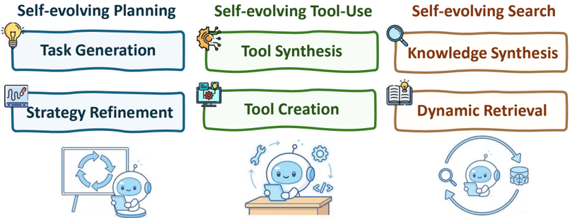

自身のフィードバックから学習し、環境との反復的なインタラクションを通じて戦略を適応させることができる。これにより、外部監督なしに継続的な改善が可能になる。

代表的な方向性は、自己生成タスク構築である。例えば、SCAは問題を生成して解くことを交互に行い、成功した軌跡をファインチューニングに再利用することを可能にする [334]。自己報酬フレームワークはさらに、エージェントが自身の出力を評価し、人間のラベルなしに高品質なトレーニング信号を生み出すことを可能にする [335, 336]。他の研究は、SELF、SCoRe、PAG、TextGrad、AutoRuleなど、オンライン適応のために実行フィードバックを直接活用し、自然言語の批評やトレースをトレーニング報酬に変換して継続的なポリシー洗練を可能にするものがある [337, 338, 339, 340]。

内部フィードバックを超えて、エージェントは環境形成を通じても進化できる。AgentGenはカリキュラム学習を誘導するための適応的な環境を構築し [341]、ReflexionとAdaPlannerはランタイムで計画を洗練するために自己反省的または適応的戦略を使用する [14, 342]。Self-Refineは反復的に出力を批評して改善し [270]、SICAはコードと推論ツールの自己修正を可能にする [343]。RL観点からは、RAGENとDYSTILが計画をMarkov Decision Processとしてモデル化し、密なフィードバックで戦略を最適化する [344, 345]。

合わせて、これらの手法はエージェントが自身のタスクを生成し、環境を形成し、戦略を洗練させる自己改善型計画ループを確立し、自律的でオープンエンドな計画進化の基盤を築く。

## 4.3.2. 自己進化するツール使用

**ツールの作成と合成。** インコンテキスト推論の頂点は、エージェントが新しいツールを自律的に作成する創発的な能力である。これはトレーニングによってではなく、既存のツールセットでは解決できない問題に遭遇した際に、凍結されたLLMをプログラマーとして機能させるプロンプトによって達成される。LATMフレームワーク [346] は、強力なモデルを一度限りの「ツールメーカー」として、より安価で軽量なモデルを頻繁な「ツールユーザー」として使用し、作成コストを償却する。汎用APIの限界を超えた専門化を可能にするために、CRAFT [347] やCREATOR [348] などのフレームワークは特定のドメイン向けにカスタムツールを生成する。さらに一歩進んで、ToolMaker [349] は公開コードリポジトリ全体を使用可能なツールに変換でき、エージェントが複雑な人間が書いたコードベースをその場で活用できるようにする。

## 4.3.3. 自己進化する探索

探索はエージェント推論において中心的な役割を果たし、モデルが大規模で進化するメモリ空間にわたって関連する知識を検索し、選択し、統合することを可能にする。初期のシステムでは、探索は通常、固定された検索ヒューリスティックや類似性ベースの密な検索器に基づく静的なものであった [252, 255, 297, 293]。これらの手法は検索された情報でプロンプトを増強したが、メモリがどのように進化するか、または検索戦略が時間とともにどのように改善されるかについての適応的な制御を欠いていた。

最近の研究は、探索とメモリを**共進化ループ**においてますます結びつけている：エージェントはタスク実行中に継続的にメモリベースを更新し、この進化する知識に対して探索がどのように行われるかを動的に調整する。MemGPT [293]、MemoryBank [297]、Workflow Memory [298] などのエージェント的メモリシステムは、検索された情報がどのように統合されメモリに再挿入されるかをすでに強調しており、徐々に検索品質を改善する。Dynamic Cheatsheet (DC) [303] は、再利用可能な戦略がクエリをまたいでどのように蓄積・活用されるかをさらに示しており、静的な検索をエージェントの経験とともに進化するリビング検索基盤に効果的に変換する。

**進化するメモリベース。** 静的なインデックスベースの検索とは異なり、自己進化するエージェントはReflectionとポスト実行更新を通じてメモリベースを積極的に洗練させる。Reflexion [14] は、エージェントが自身の推論トレースを批評し蒸留された洞察を保存することを可能にし、将来の検索関連性を改善する。Reasoning Bank [302] とコンテキスト進化手法 [301] は、検索結果を進化する問題解決戦略に整合させるためにメモリ表現を明示的に再構造化し、検索ターゲット自体を時間とともに適応させる。

**動的探索と合成。** メモリ更新を超えて、探索戦略自体も動的な優先順位付けと合成を通じて進化できる。ワークフロー [331, 332, 333] や知識グラフ [329, 305, 12, 306] などの構造化メモリ表現は、マルチホップおよび組み合わせ的な探索を可能にする意味的な足場を提供し、より長いホライズンにわたってより豊かな推論をサポートする。MemOS [13] やMemory-as-Action [313] などのシステムは、探索の意思決定を推論ポリシーに直接統合することでこれをさらに進め、エージェントが経験を蓄積するにつれて検索ターゲット、戦略、ソースが共適応することを可能にする。

全体として、自己進化する探索は検索を静的なユーティリティから推論ループの継続的に適応するコンポーネントに変換する。メモリベースを進化させ、探索戦略を動的に調整し、検索結果を構造化知識に統合することで、エージェントは拡張された時間ホライズンにわたってより関連性が高く、構造化された、実行可能な情報を維持できる。
## 5. 集合的なマルチエージェント推論

単一エージェントの基盤――推論が統一された知覚・行動ループ内でPlanning、Search、Tool Useを支援する――を踏まえ、マルチエージェント推論はこれらの原則を協調的な設定へと拡張する。マルチエージェントシステム（MAS）では、複数の推論エージェントが相互作用して複雑なタスクを共同で解決する。同一の問題解決者ではなく、エージェントはタスク分解を担うManagerや実行を担うWorker、評価を担うVerifierといった相補的な役割を担うことで、認知労働の専門化と分業を可能にする。このRole Differentiationが集合的知性への第一歩となり、推論は複数のエージェントにわたって分散・調整される。

Role Assignmentを超えて、マルチエージェント推論の本質はエージェントがいかに協調・通信・共進化するかにある。Collaboration Schemaは推論トレースがどのように交換され、対立がどのように解決され、整合性を達成するためにShared Memoryがどのように維持されるかを定義する。こうした相互作用を通じて、推論は個別プロセスから分散的・反復的なループへと移行し、エージェントが互いの出力を洗練させながら集合的により良い解へと収束する。

Generic Roles（§5.1.1）

Leader/Coordinator

Worker/Executor

Critic/Evaluator

Memory Keeper

Communication Facilitator という個人的なプロセスから分散的・反復的なループへと移行し、エージェントが互いの出力を洗練させながら集合的により優れた解へと収束していく。

単一エージェントシステムと比較して、マルチエージェント推論はシステムレベルで推論を再考する新たな課題をもたらす：

- 役割分担：タスク構造と専門知識の分布に合わせた静的または適応的な役割をいかに設計するか。Finance、Education、Healthcare、Biomedicine、Music
- 協調とコミュニケーション：中間推論をいかに交換し、合意形成を交渉し、分業を効率的に行うか。
- 集合的メモリと進化：共有または分散したステートが長期的な調整と継続的な適応をいかに支えるか。

これらの課題が以下の分析構成を動機づける。Section 5.1ではMASの役割分類（汎用的な組織的役割からドメイン固有の専門化まで）を検討する。Section 5.2では協調と分業（in-context調整戦略とpost-training調整戦略を含む）に焦点を当てる。最後にSection 5.3では、メモリがマルチエージェントシステムの時間的進化と集合的整合性の維持をいかに可能にするかを探る。これらの観点を総合することで、推論が個々のエージェントから適応的・協調的な知性へとスケールする統一的な見方を提供する。

## 5.1. マルチエージェントシステム（MAS）の役割分類

本節では、まずMASで頻繁に現れる汎用的な役割をまとめる。次に、ソフトウェアエンジニアリング、Finance、Legal、Education、Healthcare、Biomedicine、Musicといった異なるドメインにMASを適用した場合の役割ごとの具体的な機能を紹介する。

図8：Section 5.1におけるエージェントの汎用的役割とドメイン固有の適応の概要。

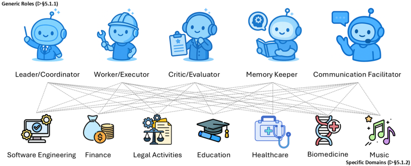

## 5.1.1. 汎用的役割

- Leader/Coordinator：リーダー（Coordinator）はシステム内の高レベルな一貫性を維持する責任を担う。この役割には、グローバルな目標の設定、タスクの管理しやすいサブゴールへの分解、それぞれのエージェントへの割り当てが含まれる。さらに、リーダーは出力が重複または矛盾するエージェント間で生じる対立を調停する。実際には、この役割はしばしば他のエージェントの進捗を監視し、実行が包括的なPlanに従うことを保証するメタ・コントローラとして現れる。

- Worker/Executor：Executor（Workerとも呼ばれる）はMASの実働的な根幹である。外部Toolの呼び出し、コードの記述・実行、文書の検索、環境とのインターフェースなど、具体的なアクションを実行する。通常はリーダーの指示のもとで動作するが、よく設計されたシステムでは適応的自律性が許容されており、新たなローカル情報が得られたときにExcutorが自らのタスクを改良・最適化できる。
- Critic/Evaluator：Critic/Evaluatorの役割は品質保証を中心とする。正確性の検証、仮説のテスト、応答のレッドチーミング、潜在的なリスクの顕在化などが含まれる。LLMベースのシステムでは、専用のEvaluatorが出力の事実性・安全性・スタイル的整合性を評価するLLM-as-a-judge設定として現れることが多い。Critic役割は、生成的なワークフローに歯止めと均衡をもたらし、エラーの伝播を軽減する。
- Memory Keeper：効果的なMASには、コンテキストを蓄積し、反復的な失敗を防ぎ、エピソードをまたいだ学習を可能にする永続的なメモリが必要である。Memory Keeperは、エピソードログ、Semantic Embedding、検索インデックス、知識グラフなどの長期知識構造を管理・維持する。メモリ管理を専用の役割に抽象化することで、システムは短期的な反応性と長期的な継続性・適応性のバランスをより良く取ることができる。
- Communication Facilitator：コミュニケーションのオーバーヘッドは、MASの効率を容易に損なう。この役割は、メッセージスキーマの定義、通信帯域幅の管理、ゲーティングメカニズムの適用、合意形成のオーケストレーションなど、エージェント間交換のプロトコルを統治する。曖昧さを減らし、構造化された情報フローを確保することで、Communication Facilitatorは大規模または異種エージェント集団においてボトルネックや調整の失敗を防ぐ。

## 5.1.2. ドメイン固有の役割

汎用的なエージェント役割を超えて、ドメイン固有のタスクはしばしば専門的な機能を必要とする。これらの役割は特定の産業における専門的実践を反映し、MASアーキテクチャに自然にマッピングされる。

Software Engineering：ソフトウェアエンジニアリングでは、MASは一般的にソフトウェア開発ライフサイクルを反映した役割にマッピングされる：Architect、Developer、コードレビュアー/テスター、CIオーケストレーター、リリースマネージャー \[17, 350\]。その趣旨は、産業的なソフトウェア実践と同様に、創造性・検証・自動化・ガバナンスのバランスが取れる形で責任を分散することにある。

- Architectはシステムレベルの設計原則を定め、構造的青写真を確立する。
- Developerはこれらの抽象を具体的な実装へと翻訳する。
- コードレビュアーとテスターは正確性・保守性・機能カバレッジを確認し、信頼性を守る。
- CIオーケストレーターはビルド、テスト、アーティファクトパイプラインを自動化し、統合の摩擦を軽減する。
- そして、リリースマネージャーはデプロイを監督し、新バージョンをマイルストーンおよびセーフティプロトコルと整合させる。

先行研究では類似のマッピングが示されており、例えばMetaGPT \[17\]は開発をProduct Manager、Architect、Engineerエージェントに分解する。ChatDev \[350\]はさらに、要件分析・コーディング・テストを支援するための専門エージェント間のコミュニケーション協調を強調する。より最近では、自己進化型協調ネットワークがMASがソフトウェアライフサイクル全体を通じて役割を動的に再編成・最適化できるようにすることでこのパラダイムを拡張している \[351\]。MASの変形はHigh-Performance Computing（HPC）ドメインにも適用されている \[352\]。これらのステージを中心にMASを構築することで、アーキテクチャは専門的なエンジニアリングワークフローと同じ堅牢性とスケーラビリティを獲得する。

Finance：Financeドメインは大まかに4つの典型的役割に分解できる：Analyst、Risk Manager、Trader/実行エージェント、コンプライアンス担当者 \[353, 354\]。この分割は、利益創出と体系的安定性のバランスを取るために責任を区分する、金融機関の確立された組織設計を反映している。

- Analystは異なるレベル（例：ファンダメンタル、センチメント、テクニカル）で運用され、それぞれが生の市場データまたはテキストデータから独自のシグナルを抽出する。
- Risk Managerはポートフォリオのエクスポージャーを監視し、ストレステストを適用し、カスケードする脆弱性を防ぐためのセーフガードを適用する。
- Traderは市場との相互作用に責任を持ち、実行エージェントは流動性制約のもとで注文が速度と効率で発注されることを保証する。
- 最後に、コンプライアンス役割は活動が規制要件に沿い続けることを保証し、追跡可能な意思決定と適切な監督を可能にする。

これらが組み合わさって、専門化とチェック・アンド・バランスが不可欠な現実の金融機関を反映した階層的な生態系が形成される。FinanceにおけるMASの最近の進展はこの階層的な生態系を反映している。R&DAgent-Quant \[355\]は、量的戦略のためにエージェントがファクター発見と結合最適化に特化できることを示す。FinRobot \[356\]はFinanceアプリケーションに特化したオープンソースのマルチエージェントプラットフォームを提供し、モジュール性とスケーラビリティの実践的な必要性を反映している。PEER \[357\]はMASをドメイン固有の責任に適応させるための専門化とチューニング手法を導入し、FinCon \[358\]は意思決定とコンプライアンスを強化するための概念的言語強化の役割を強調する。これらの研究は総合して、MASが現実世界の金融機関の専門化・チェック・バランスをいかに複製できるかを示している。

Legal Activities：マルチエージェントシステムは、法的実践に固有の協調的かつ対抗的なプロセスをモデル化するよう設計されており、相談・推論・論証を管理する役割が割り当てられる。

- 法的相談については、フレームワークがしばしばクライアント受け入れのためのreceptionistエージェント、助言を提供するspecialized lawyerエージェント、文書化のためのsecretaryエージェント、品質管理のためのbossエージェントを持つ法律事務所の構造をシミュレートする。相談モデルでは、receptionistエージェントがまずユーザーのクエリを明確にしてから適切なlawyerエージェントにルーティングし、複数ターンの相談後にsecretaryエージェントが対話を要約し、bossエージェントが評価を行うことで、包括的かつ高品質なサービスを保証する \[359\]。
- 法律推論については、タスクが法的テキストを解釈する知識取得エージェントと、形式化されたルールをケースの事実に適用する知識適用エージェントの間で分解される。具体的には、推論システムで知識取得エージェントがまず法令から再利用可能なオントロジーを構築し、その後知識適用エージェントがこの形式的な構造を使って新しいケースの具体的な詳細を分析し、一貫かつ透明な論理を保証する \[360\]。

- 法廷のダイナミクスをシミュレートするために、judge、plaintiff、defendant、adversarial lawyerエージェントなどの役割が作成される \[361\]。法廷シミュレーションでは、adversarial lawyerエージェントがjudgeエージェントの前で討論を行い、各審理の後にパフォーマンスを振り返り、内部知識ベースを更新することで論証戦略を反復的に改善する \[361\]。

Education：教育においては、専門化されたエージェント間に教育的機能を分散させることで、個別化・適応的な学習体験を提供するためにMASが開発されている。

- 個別指導では、中央のtutorエージェントがSocratesの対話を使って生徒と関わり、memory dispatcherエージェントが生徒の進捗と誤概念を追跡してリアルタイムでレッスンの難易度とフォーカスを適応させる \[362\]。
- カリキュラム設計では、エージェントのパイプラインが協調する：research agentが関連情報を収集し、planning agentがそれを一貫したコースに構造化し、他のエージェントが特定の学習活動や評価を生成する。また、adversarialプロセスでモデル化することもでき、evaluator agentがgenerator agentが作成したレッスンプランを批評し、optimizer agentがフィードバックに基づいてそれを改良する \[363\]。

これらのシステムは、教育者を支援し、学生により効果的・魅力的・個別化された学習体験を提供できるインテリジェントな適応プラットフォームの作成への移行を示している。

Healthcare：Healthcareドメインでは、マルチエージェントシステムは臨床・研究ワークフローを反映する形で構造化されており、複雑なタスクを専門化されたAIエージェント間で分散している。

- 臨床診断と相談については、これらの役割にはしばしばinitial case assessmentのためのtriage agent（またはmoderator）、さまざまなspecialist agent（例：病理医、神経科医）、患者との対話のためのdoctor agent、検査結果を提供するmeasurement agentが含まれる \[364, 365\]。より具体的には、診断設定においてtriage agentがまずケースの複雑さを評価し、分析のために適切なspecialist agentにルーティングする。これらのspecialistは複数ラウンドの議論を行い、lead physician agentがその意見を統合してコンセンサスに達する。さらに、doctor agentはpatient agentと複数ターンの対話を行い、measurement agentに特定データをリクエストして動的に情報を収集する。
- 自律的研究については、役割が科学的プロセスに倣ってモデル化されており、戦略的Planningのためのmeta agent、分析実行のためのexecutor、結果評価のためのevaluator、知識統合のためのreflectorが含まれる \[366\]。この分業により、多面的な健康課題に対する系統的かつ包括的なアプローチが可能になる。特に、meta agentが実験を計画し、executorがそれを実行し、evaluatorが即時フィードバックを提供し、reflectorが成功した戦略を永続的な知識ベースに蒸留することで、将来のPlanningを強化する自己改善サイクルを生み出す。
- 公衆衛生イベントについては、ShortageSim \[367\]がFDA規制当局・製造業者・医療購買者を情報の非対称性のもとで相互作用するようにモデル化し、反事実的な政策テストを可能にし、発表や中断が歴史的軌跡に対して投資・備蓄・解決タイミングをいかに形成するかを評価する。

MMedAgentやMedAgent-Proなどの他のフレームワークは、専門的な医療ToolのオーケストレーションにフォーカスしてCentralエージェントを使ってアクションを計画し、マルチモーダルデータを処理するためのさまざまなTool-Basedエージェントから結果を集約する \[39, 368\]。

Cascading

Manually design

Sequential chains with a fixed flow

In-context Collaboration

Hierarchical

Role-based

Manually design centrally planned

hierarchical structure

Manually design modular system with

fixed-role agents orchestrate agent

coordination personas and adjust

system prompts communication graphs

for optimal coordination

Post-training Collaboration

Policy-based Opt.

Learn agent-selection policies via advanced

training paradigms

図9：マルチエージェントシステムにおけるAgentic Collaborationの概要。In-context collaboration（トレーニングなしのタスク固有調整設計）とPost-training collaboration（最適化ベースの自動ワークフロー生成）という2つの並行する次元を含む。

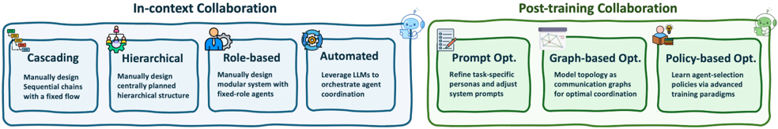

Biomedicine：Biomediceでは、特に薬物・材料発見において、MASは設計・テスト・改良という反復サイクルを反映した役割を割り当てることで、科学的プロセスを自動化・加速するよう設計されている。

de novoの分子設計については、主要な役割として新規構造を生成するactor（またはreasoner）、化学的特性を評価するevaluator、結果に基づいて将来の仮説を洗練させるself-reflectorが含まれる。具体的には、actor agentが新候補を提案し、それがevaluator agentに渡される。Evaluatorは計算化学Toolを使って結合親和性や合成アクセシビリティなどの特性を計算し、定量的フィードバックを提供する \[369\]。このフィードバックをself-reflector agentが分析して次世代サイクルのシステムの戦略を更新し、フィードバック駆動の最適化プロセスを生み出す \[370\]。

同様に、LIDDIAはReasoner、Executor、Evaluator、Memoryコンポーネントを持つ「デジタル化学者」として機能し、薬物発見プロセスをナビゲートして新しい化学空間の探索と有望な候補の活用のバランスを取る \[369\]。機械学習ワークフローの作成を効率化するために、DrugAgentはLLM PlannerとLLM InstructorをADMET予測などのタスクのためのプログラミングの自動化に使用する \[371\]。ゲノミクスでは、GenoMASがガイド付きPlanningフレームワークを通じて6つの専門化されたエージェントをオーケストレートして複雑な遺伝子発現データを分析し、構造化ワークフローの信頼性と自律エージェントの適応性を統合する \[372\]。

Music：音楽作曲のクリエイティブドメインでは、MASは音楽創作の複雑なプロセスを協調的・専門化された役割に分解することが探求されている。ComposerXのようなシステムは、高レベルのユーザープロンプトを解釈してプロジェクトを監督するconductor agent、主要な音楽テーマを生成するmelody agent、伴奏のコード進行を作成するharmony agent、打楽器的・時間的基盤を構築するrhythm agentを備えている。これらのエージェントは反復的に相互作用し、conductor agentがその出力を統合してフィードバックを提供することで、異なる音楽層が最初のクリエイティブビジョンと一貫かつ整合していることを保証する。これは人間のオーケストラやバンドの協調プロセスを反映しており、複雑で調和のとれた最終製品を実現するためにクリエイティブな責任を分散させる \[373\]。

## 5.2. 協調と分業

協調と分業は、現代のマルチエージェントシステムにおける中心的な組織原則を構成する。エージェントを均質なコンポーネントとして扱う代わりに、最近の研究は効率性と堅牢性を向上させるために専門化されたエージェント間で責任がいかに分解・調整されるかを強調する。この観点から、既存のアプローチは大きく2つの次元で整理できる。In-context collaborationは、追加トレーニングなしに推論時に特定・誘導される調整戦略に焦点を当てる。

Post-training collaborationは代わりに、学習または探索を通じてエージェントの役割・相互作用構造・ルーティングポリシーを最適化する。さらに、agentic routingはこの分業の特殊ケースとして見ることができ、ルーティング決定が明示的にタスクの要求に基づいて異なるエージェントに認知と計算をオフロードする。

## 5.2.1. In-context Collaboration

マルチエージェントシステムの設計において、タスク固有のin-context情報を活用することが、明示的なトレーニングなしに非常に効果的なシステムを構築するために十分しばしば十分であることを複数の研究が観察している。これらの研究のうち一つの研究ラインは、研究者がターゲットタスクに合わせたエージェントの相互作用とワークフローを設計する手動作成パイプラインに依存する。対照的に、別のラインはLLM駆動の自動パイプライン生成を探求し、モデル自体がタスクコンテキストに基づいてシステムの構造を動的に構築・適応させる。

手動作成パイプライン. これらのアプローチは事前定義された階層または固定された協調ワークフローに依存しており、エージェントの役割・実行順序・コミュニケーションルールが実行前に決定される。AgentOrchestra \[374\]、MetaGPT \[17\]、SurgRAW \[375\]などの階層的システムは、中央のPlannerまたはConductorが構造化されたサブゴールを通じて下位エージェントを指揮する。Collab-RAG \[376\]、MA-RAG \[377\]、Chain of Agents \[378\]、AutoAgents \[16\]などのCascadingパイプラインは、中間出力を限られた修正とともに下流へ渡しながら情報を逐次的に処理する。RAG-KG-IL \[379\]、SMoA \[380\]、MDocAgent \[381\]などのモジュール型役割分解フレームワークは固定した機能的役割（例：retriever、reasoner、vision agent）を定義するが、最小限の動的調整を許容する。これらの手動設計パイプラインは解釈可能性・モジュール性・低い実行複雑性を提供するが、その硬直性は曖昧または進化するPlanningタスクへの適応性を制限し、より柔軟な推論駆動の調整メカニズムを動機づける。

LLM駆動パイプライン. このカテゴリは、高レベルの目標をサブゴールに分解し、役割特化されたエージェントまたはToolにルーティングし、完了まで中間フィードバックに基づいてワークフローを反復的に改良するオーケストレーターとしてLLMを活用する。AutoML-Agent \[382\]は、役割特化されたマイクロエージェント（例：coder/tester/runner）を通じてWeb/API/CodeToolを計画・割り当て・調整するオーケストレーター主導のエージェントチームによるフルパイプラインを提案し、エンドツーエンドのソフトウェア開発ワークフローを実現する。Magentic-One \[383\]は、中央OrchestratorがPlanningしながら進捗を追跡し、専門化されたエージェント（WebSurfer、FileSurfer、Coder、ComputerTerminal）に対してレジャーベースのルーティングを実行する汎用マルチエージェントシステムを導入し、GAIA、AssistantBench、WebArenaで競争力のある結果を達成する。MAS-GPT \[384\]はユーザークエリを条件とした実行可能なMASコードを出力するLLMをトレーニングし、1回のForward PassでクエリSpecificなマルチエージェントワークフローを生成する。MetaAgent \[385\]は状態・遷移・Toolを宣言するfinite-state-machine（FSM）抽象化を提示し、LLM DesignerがそこからMASパイプラインを自動構築する。AOP \[146\]はオーケストレーターの責任を形式化し、解決可能性・完全性・非冗長性という3つの設計原則を導入し、高速分解・割り当てとreward-model evaluatorでそれらを運用化する。

Agent Routing. LLM駆動オーケストレーションと密接に関連して、各クエリまたはサブタスクに対して適切なスペシャリストを選択する意思決定レイヤーとしてエージェントルーティングを明示的にモデル化する一連の研究がある。例えば、AgentRouter \[386\]は構造化されたタスクセマンティクスを活用して質問を関連エージェントにディスパッチする知識グラフ誘導ルーターを提案し、個々のエージェントを変更せずに効果的な協調的質問応答を実現する。同様に、Talk to Right Specialists \[387\]はルーティングとPlanningを統一された推論時プロセスとして組み立て、コントローラーが中間推論状態に基づいてサブタスクをドメイン特化されたエージェントに動的に割り当てる。これらのアプローチは、agentic routing自体が分業の推論時実現として見られ、認知が選択的に専門化されたエージェントにオフロードされることを強調する。

Theory-of-Mind強化協調. もう一つの興味深い研究ラインはTheory of Mind（ToM）であり、これはエージェントが他のエージェントの信念・意図・精神状態を推論・考慮する能力を指す。Li et al. \[388\]は、協調テキストゲームにおいてLLMエージェントに明示的な信念状態表現を装備することが、ToMなしのLLMベースラインと比較して協調性能とToM精度の両方を改善することを初めて示した。これを踏まえて、Hypothetical Minds \[389\]は他のエージェントの戦略に対するモジュラーな仮説生成・改良ループとしてToMを足場とし、MindForge \[390\]はToM対応推論を身体化された協調学習に拡張する。並行して、Wu et al. \[391\]はLLMがToMをエンコードする仕組みの機械的な説明を提供し、その摂動が選択的に社会的推論を破壊するスパースなパラメータパターンを特定する。さらに進んで、ToM-agent \[392\]はLLM生成エージェントに対し相手の信念に対する反事実的な反省を拡張し、BeliefNet \[393\]は身体化されたエージェントが入れ子状の信念状態に基づいて行動するToM中心の共同行動シミュレーターを提供する。

## 5.2.2. Post-training Collaboration

マルチエージェントシステムでは、エージェントプロンプト（またはペルソナ）の設計と相互作用トポロジーが、システムが複雑なタスクを解決する能力を決定する上で重要な役割を果たす。最近、post-trainingフェーズ中にこれらのコンポーネントを最適化することが重要な研究方向として浮上している。最適化目標に基づいて、既存の研究は大きく2つの研究ラインに分類できる：プロンプト最適化とトポロジー最適化。

マルチエージェントプロンプト最適化. マルチエージェントシステムにおけるプロンプト最適化は、エージェントの役割・ワークフロー・フィードバックをプロンプトにいかにエンコードして信頼できる調整と強力なタスク性能をもたらすかに焦点を当てる。例えば、AutoAgents \[16\]はプロンプト最適化を単一エージェントのコンテキストからマルチエージェントチームへと拡張し、メタエージェント間の構造化された対話を通じて役割の専門化と実行計画を精緻化する。SPP \[18\]はマルチエージェント協調中に知識集約型および推論集約型タスクのために複数のペルソナを動的に選択するcognitive synergistを導入し、相補的な専門知識が出現することを可能にする。DSPy Assertions \[394\]はhard（Assert）またはsoft（Suggest）のいずれかであるLM Assertionsを導入する。違反時、これらのアサーションはバックトラッキングをトリガーし、誤った出力とエラートレースを使ってプロンプト修正を行う。コンパイル中、このメカニズムはfew-shotプロンプトを強化するための例と反例をブートストラップし、RecallとPrecisionの両方を改善する。MASS \[395\]は、プロンプトがしばしばMAS性能の支配的要因であることを示し、ローカルおよびグローバルトポロジー情報を取り込んで各エージェントのプロンプトをきめ細かく精緻化するための自動プロンプト最適化 \[396\] をさらに適用する。

トポロジー最適化については、比較的独立した最適化経路を追求する2つのカテゴリの研究が浮上している。第1のカテゴリは、マルチエージェントトポロジーをコミュニケーショングラフとして扱い、グラフベースの手法を活用して制約されたコミュニケーションコスト（すなわち制限されたグラフサイズ）のもとで強い性能を達成する最適構造を特定する。第2のカテゴリはポリシーベースの観点を採用し、特別に設計された報酬または監督シグナルを持つエージェント選択ポリシーを学習するためにさまざまなトレーニングパラダイムを使用する。反復的なポリシーベースのその後のエージェント選択を通じて、これらのアプローチは最適な全体性能をもたらすトポロジーを漸進的に構築することを目指す。以下の段落でこれら2つのカテゴリのアプローチをより詳細に議論する。

グラフベースのトポロジー生成. 大量の研究がマルチエージェントシステム（MAS）をエージェントがノードでエージェント間コミュニケーションがエッジを形成するグラフとしてモデル化する。MAS設計はコミュニケーション/調整トポロジーを学習する問題となる。これらの研究はおおよそ以下の3つのグループに分けられる。

グラフ生成. これらの手法は、タスク条件付きグラフを適応的に生成することでゼロからコミュニケーショントポロジーを構築することを目指す。GommFormer \[397\]はエンコーダー・デコーダーフレームワークを使ってグラフ表現の連続的な緩和を通じてコミュニケーショングラフを学習し、帯域幅制約のもとでトポロジーをエンドツーエンドで最適化する。G-designer \[398\]は仮想タスクノードを持つタスクアンカー型ネットワークから始まり、Variational Graph Auto-Encoderを使ってクエリ適応型コミュニケーショングラフをデコードする。MCGD \[399\]は連続ノードと離散エッジ属性を持つスパース調整グラフを構築し、エッジにCategorical Diffusionを、アクションにAnisotropic Diffusionを実行して構造の多様性を捉える。

グラフプルーニング. これらの研究は密な協調グラフから始まり、効用を保持しトークンと計算コストを削減しながら、コンパクトでタスク適切なパイプラインへとプルーニングすることを目指す。例えば、AgentPrune \[400\]はMAS問題を時空間グラフのスパース化問題として定式化し、ワンショット・マグニチュードプルーニングを適用してスパースで効果的なパイプラインを学習する。AGP \[401\]はエッジのsoft-pruningとノードのhard-pruningという二重プルーニングポリシーを学習し、クエリごとのトポロジーを取得する。G-Safeguard \[402\]はプルーニングをセキュリティメカニズムとして導入する。コミュニケーションエッジを探索空間として扱い、Graph Neural Networkを使ってリスクのあるノードを特定し、モデル駆動の閾値に基づいて決定論的なルールをその外向きエッジに適用することで、システムをadversarial attackから守る。

トポロジー探索. この研究ラインは、agentic operatorとコミュニケーションエッジを探索することでグラフ空間を探索し、効果的なパイプラインを特定する。具体的には、AFlow \[332\]は固定されたoperatorライブラリ上でMonte-Carlo Tree Searchを使ってマルチエージェントワークフロー設計を自動化する。MASSはdebatingやtool-usingなどの影響力のあるグラフモチーフを事前定義し、このプルーニングされたモチーフサブセット内でトポロジー探索を実装する。そしてMASS \[395\]はそのトポロジー上でプロンプト探索を実行して性能を最大化する。MaAS \[403\]は単一グラフ探索を階層化されたoperator選択上の確率的な「agentic supernet」に置き換え、コントローラーを使ってクエリ条件付きサブグラフをサンプリングする。DynaSwarm \[404\]は設計空間を1つの最適化されたコミュニケーショングラフから候補構造のポートフォリオへと広げる。Actor-Critic（A2C）最適化を使ってこのポートフォリオを精緻化し、各インスタンスに最適なトポロジーを選択する軽量グラフセレクターを導入する。GPTSwarm \[68\]は探索空間を計算グラフ内のエージェント間接続として定式化する。離散トポロジーを連続エッジ確率に緩和し、Reinforcement Learningを活用して結果の接続スキームを最適化し、柔軟で適応的なグラフ構造を実現する。

ポリシーベースのトポロジー生成. 増加する研究ラインは、Supervised Fine-Tuning（SFT）やReinforcement Learning（RL）などの高度なトレーニングパラダイムを持つその後のエージェントを選択するポリシーを学習することで、マルチエージェントパイプライン生成を強化する。これらのアプローチは補助シグナルを最適化プロセスに埋め込み、エージェントがより強い推論スキルとより信頼できる調整を獲得できるようにする。Routingは協調の特殊ケースとして見ることができ、ルーターがタスクの状態とシステムコンテキストを条件に効率性と性能を最大化するエージェントを選択するポリシーを学習する \[405, 406, 407, 408\]。大まかに、これらの手法は学習に注入するシグナルの種類に基づいて3つのカテゴリに分けられる。

相対的優位性ポリシー学習. いくつかのアプローチはCritic-Free目標に依存してAdvantageを形成し、集中型Value Modelを避けて効果的なポリシー最適化のガイダンスを提供する。例えば、MAGRPO \[409\]はLLM協調のDec-POMDP定式化を提案し、集中型Criticをグループ相対的Advantageシグナルに置き換えることで、対話ターンの粒度で分散型Training/Executionを実現する。MHGPO \[410\]はGRPOスタイルのシグナルを異種グループへと拡張し、共有グループ相対目標を通じて異なるエージェント役割を共同で最適化し、実用的なサンプリング/最適化の調整を導入する。COPY \[26\]は共有報酬とKL正則化（凍結されたRefポリシーとエージェント間ポリシーへ）を持つ2エージェント共同トレーニングフレームワークを活用し、推論タスクにおけるpioneer/observer役割間の安定性と転移を改善する。

LLM生成の事前ガイダンス. 他の手法は学習のためにLLMを活用して報酬または事前分布を生成する。具体的には、LGC-MARL \[411\]はLLMを使って自然言語の目標を構造化された報酬項に変換するReward Function Generator（RFG）を提案する。LAMARL \[412\]はLLMに事前ポリシーとタスク固有の報酬関数を統合させ、その後エージェントをRLでFine-Tuningする。MAPoRL \[413\]は報酬を現在および将来のターンに対するLLM Verifierスコアの重み付き和として定義し、マルチエージェントPPOでポリシーを更新する。COPPER \[326\]はカウンターファクチュアルPPOパイプラインで共有Reflectorを学習し、学習された報酬モデルがタスク改善へのそれぞれのエージェントの限界貢献によって各エージェントのReflectionをスコアリングする。SIRIUS \[414\]は成功した成果につながるTrajectoryを保持し失敗を増強することでExperience Libraryを構築し、Judgment-Critic-Actor三組がLLM生成の正確性シグナルを提供して後続のFine-Tuningを推論タスク全体でフィルタリング・監督する。Multiagent Finetuning \[415\]はgenerator LLM間のマルチエージェントデバートを実行し、LLM CriticとMajority Votingを使って自己生成の監督シグナルを生成し、Critic選択されたTrajectoryで役割特化されたエージェントをFine-Tuningすることで推論をブートストラップし、精度と多様性の両方を改善する。

人間の嗜好シグナル. この研究ラインは、環境報酬を人間由来のフィードバックで置き換えまたは拡張し、オンラインおよびオフラインの両レジームで行動を人間の意図と整合させる。例えば、M3HF \[416\]は人間の入力をLLMによって報酬形成シグナルに処理されるマルチフェーズフィードバック（例：スカラー評価、ペアワイズ比較、自然言語による根拠）に組織化する。O-MAPL \[417\]はエンドツーエンドの嗜好ベース学習フレームワークを導入し、オフラインの嗜好データから直接Q値を学習し、2段階のReward Model-then-RLパイプラインを回避する。

## 5.3. マルチエージェントの進化

自己進化型エージェントが相互作用とフィードバックを通じて個々のモデルが継続的に改善できるようにする一方で、多くの現実世界のアプリケーションは複数のエージェント間の協力によって支えられる集合知を必要とする。したがって、最近の研究はself-evolutionを単一エージェント設定（Planning、Tool use、探索の進化を含む \[14, 342, 270, 344, 36\]）からマルチエージェントの共進化へと拡張しており、適応が分散エージェント間で出現する \[332, 418, 419, 420, 421\]。モデルパラメータ・メモリ・プロンプト・Toolの進化を超えて \[12, 422, 423, 424\]、マルチエージェント進化はさらに共有メモリ・コミュニケーションメカニズム・協調プロトコルを対象とする \[395, 421, 298\]。

その結果、マルチエージェントメモリはアーキテクチャ・トポロジー・コンテンツ・管理の次元に沿って共同で進化しなければならず、階層構造・役割対応アーキテクチャ \[425\]、統治された分散ストレージトポロジー \[426, 427\]、モジュラーでタスク構造化されたメモリコンテンツ \[328, 428\]、圧縮・検証・継続的更新のための能動的管理メカニズム \[429, 430\] によって支えられることで、一貫性のあるスケーラブルな協調を保証する。

したがって、目標は単一エージェントの能力を最適化することから、複雑な長期間タスクにおける複数エージェントの集合的性能を向上させることへと移行する \[332, 418, 419, 70\]。

## 5.3.1. 単一エージェントの進化からマルチエージェントの進化へ

単一エージェントの進化からマルチエージェントの共進化への移行が適応の空間的次元を個々のモデルから集合へと広げる一方で、進化の時間的次元も同様に重要である。誰が進化するか（単一エージェントか集団か）を決定することを超えて、最近の研究はエージェントが相互作用中にいつ、いかに速く適応すべきかも調査する。この観点は、エピソード内の短期間の更新と長期的なクロスエピソードの改善を区別する補完的な分析軸をもたらし、一般にintra-test-time evolutionとinter-test-time evolutionと呼ばれる。これらの自己進化動作の時間的モードをまとめる。

Intra-test-time evolutionはエージェントがタスク実行中に適応・改善し、未知の状態や予期しないフィードバックに直面したときにその場で失敗を修正し戦略を精緻化できる能力を指す。静的な推論パイプラインとは異なり、このパラダイムは自己反省・動的Planning・メモリ書き換え、さらには局所的なFine-Tuningを実行ループに埋め込む。代表的な研究は、外部監督なしに修正シグナルを生成するために自然言語の自己批評 \[14, 270\] とランタイム適応Planning \[342, 431\] を活用する。Reflexion \[14\]はエージェントが即時の行動改善のために蒸留された反省フィードバックを保存することを可能にし、AdaPlanner \[342\]は環境のミスマッチ検出に基づいてTrajectoryの途中で動的に修正・再Planningする。文脈的な適応を超えて、test-time supervised updating \[432\] やtest-time reinforcement learning（TTRL）\[433, 434\] などの手法は困難なケースに遭遇したときにモデルの動作を直接修正し、しばしば問題バリアント生成とターゲット最適化を通じて行う。これらのアプローチは、推論時の性能が1つのエピソード内で向上できることを示し、モデルが固定されたポリシーを実行するだけでなく解きながら学ぶ短期間の適応ループを形成する。

Inter-test-time evolutionはself-improvingプロセスをタスク横断的な学習へと拡張し、1つのタスクでの適応を将来のタスクに統合・転移できる。これにより、生涯にわたる相互作用ストリームを通じて永続的で汎化可能な能力の蓄積が実現する。著名なパラダイムはオフライン自己蒸留を含み、エージェントが応答を生成してから自己評価を通じて精緻化し、Supervised Fine-Tuningに使用する——SELF \[337\]、STaR \[435\]、Quiet-STaR \[436\] などがこれにあたる。これらの手法は誤った初期推論を将来の性能向上のための高品質なラベル付きデータに変換する。さらに、RAGEN \[344\]やDYSTIL \[345\]などのオンラインRLフレームワークは密な相互作用フィードバックに基づいてポリシーを継続的に更新し、長期間にわたって複雑な意思決定戦略を徐々に内面化できるようにする。Inter-test-time evolutionは、タスクの難易度と環境の複雑さを自動調整するカリキュラムメカニズム \[437, 438\]、および蓄積された推論ヒューリスティクスを保持するメモリ進化を通じた経験の構造化 \[439, 440, 298\] も組み込むことができる。この時間的モードは安定した長期的な改善に焦点を当て、個々のタスクからの短命な修正を多様なタスク分布にわたる継続的な能力成長へと変換する。

これらの新機能をサポートするために、メカニズムは個々の報酬ベースまたは反省的な適応 \[337, 338, 339\] からマルチエージェントRLとゲーム理論的な共最適化 \[419, 420\] へと進化し、協調構造が進化するタスク要件のもとで自己組織化できるようにする。さらに、メモリ駆動のマルチエージェント進化（例：共有ワークフローメモリまたは知識グラフ）は、エピソードをまたいで蓄積的なグループ知性を維持するのに役立つ \[298, 13\]。全体として、マルチエージェント進化は孤立した自己改善ループを、自己修正・自己組織化・社会的学習が可能な適応的インテリジェントエコシステムへと変換する。この移行は人工的な集合知への重要な一歩を示しており、協調ダイナミクスが個々のエージェントの能力を超えた継続的な進歩を駆動する \[395, 332, 418, 441\]。

## 5.3.2. 進化のためのマルチエージェント Memory 管理

マルチエージェント LLM システムは、単一エージェント設定と比較して Memory 設計に独自の課題をもたらす。個々のエージェントのローカルコンテキストを維持するだけでなく、エージェント間のインタラクションを捉え、時間の経過とともに役割と依存関係を追跡し、共有知識とプライベート知識の両方を一貫して保持しなければならない。また、Memory はコラボレーションが成長しインタラクションが蓄積するにつれてスケーラブルであり続ける必要がある。この状況をより明確に理解するために、既存のアプローチを4つの主要な次元に沿って分類する：(1) **Architecture**（アーキテクチャ）、Memory がエージェント内およびエージェント間でどのように整理されているか；(2) **Topology**（トポロジー）、それが集中型、分散型、またはハイブリッドであるか；(3) **Content**（コンテンツ）、保存される知識の種類と構造；および (4) **Management**（管理）、Memory が時間の経過とともにどのように書き込まれ、検索され、更新されるか。図10にイラストを示す。

Architecture

Hierarchical

Flat

Topology

Centralized

Content

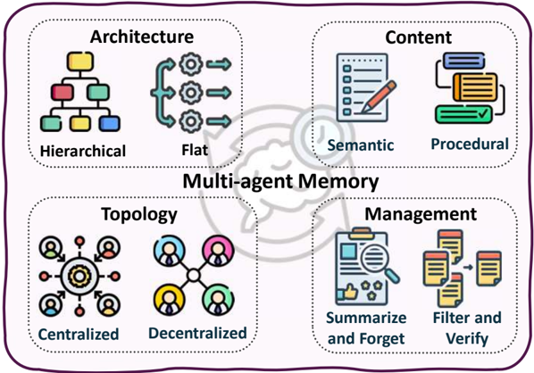

Decentralized

図10: マルチエージェント Memory 設計の4次元。このフレームワークには (1) **Architecture**、Memory の構造化方法；(2) **Topology**、保存・共有される場所；(3) **Content**、保存される知識の種類；および (4) **Management**、維持・更新の方法が含まれる。

**Architecture 次元：Hierarchical および Heterogeneous な設計。** 最近の研究では、現行のマルチエージェント Memory メカニズムが過度に単純であり、エージェントごとのカスタマイズが欠如していることが指摘されている [425]。これに対処するため、G-Memory は3層のグラフ階層（insight グラフ、query グラフ、interaction グラフ）を構築し、高レベルの汎用的な洞察を細粒度の実行トレースから分離する。この階層的アプローチにより、エピソードをまたいで抽象的な教訓と具体的な先例の両方を検索するための双方向 Memory トラバーサルが可能になる。しかし、グローバルな集約の代わりに、Intrinsic Memory Agents は各エージェントに専用の役割整合 Memory テンプレートを維持するという対照的な戦略を採用する [442]。この異種アプローチは、エージェントごとの不関連情報を削減することで、協調計画ベンチマーク上の専門的視点を保持する。最近の研究では、分散型アーキテクチャにおいて適応的な階層型知識グラフを採用するハイブリッド戦略をさらに探求しており、エージェントが過去のインタラクションについて推論し、生の経験ではなく関連情報のみを共有できるようにしている [443]。これらの対照的なアプローチは根本的なトレードオフを明らかにしている：階層設計はグローバルな一貫性とエピソード横断的な学習を最適化し、一方、異種設計は役割の忠実性と計算効率を最適化する。

**Storage トポロジーと Memory ガバナンス。** システムはスケーラビリティ、プライバシー、一貫性のバランスをとるために異なるトポロジーを採用し、それぞれが信頼とコーディネーションに関する異なる前提を反映している。SEDM（SelfEvolving Distributed Memory）[426] は、検証可能な書き込み承認（再現可能なリプレイによる）とユーティリティベースの統合を通じて Memory をアクティブな自己最適化コンポーネントに変えることで Memory 管理に取り組む。この検証ゲートを備えた集中型アプローチは、事実的または有用な情報のみがリポジトリに入ることを保証し、異種タスク間の転送を可能にするクロスドメイン知識拡散を実行する。対照的に、プライバシーと組織的境界が重要な場合、Collaborative Memory [427] は二部グラフポリシーを使用してプライベート Memory フラグメントと共有 Memory フラグメントを区別する。すべてのエントリには不変のプロベナンス（ソースエージェント、アクセスされたリソース、タイムスタンプ）が付与され、コンプライアンス監査と連合システムにおける安全なエージェント間知識転送が可能になる。スペクトルの反対端では、Memory Sharing [444] のような一部のシステムが、すべてのエージェントが経験を自由に交換する非制御プーリングを採用している。

共有 Memory プールにおける。研究によれば、LLM エージェント間の Memory 共有は、より多様な集合的 Memory プールをもたらし、新興の集合知性を生み出すことでオープンエンドタスクのパフォーマンスを向上させることが示されている。これら3つのトポロジーは形式性と制御の増加するレベルを表し、知識の多様性と検証の厳密さのトレードオフを管理するための異なる優先事項を反映している。

**Memory Content：Semantic、Task、および Cognitive-Phase 分解。** 異なるコンテンツ分解戦略は異なるタスク特性に適しており、コンテンツ構造の選択はエージェントが Memory とどのように相互作用するかを根本的に形成する。MIRIX [328] は、個別のエージェントによって管理される6つの特化された Memory タイプ（Core、Episodic、Semantic、Procedural、Resource、Knowledge Vault）を定義することで Semantic 分解を先導し、柔軟なルーティングによってストレージを削減しながらマルチモーダル QA タスクで35%の精度向上を達成した。このモジュール原則に基づいて、LEGOMem [428] は代わりにタスクベースの分解を採用し、実行トレースを中央プランナーまたは専門タスクエージェントに柔軟に割り当てられる再利用可能な Memory ユニットに分解する。この設計は、オーケストレーター Memory がタスク分解と委任を改善し、エージェント Memory がサブタスク実行を強化することで、小規模および大規模 LLM チーム間のパフォーマンスギャップを効果的に縮小することを示している。最近、MAPLE は Cognitive-phase 分解 [445] を導入し、専門化されたエージェント（Solver、Checker、Reflector、Archiver）を使用して体系的なエラー検出と計画修復サイクルを可能にした。Reflector は各エピソード後にエラーを診断し、Archiver は繰り返しのミスを避けるために洗練された計画を保存し、フィードバック駆動の学習をサポートする。これら3つのコンテンツ分解戦略は、Memory 設計がタスク構造と整合すべきであることを明らかにしている：異種情報には Semantic コンテンツ、ワークフロー自動化にはタスクベース、エラーに敏感な推論には Cognitive-phase が適している。

**Memory 管理戦略。** 効果的な長期 Memory には、関連性、効率性、一貫性のバランスを保つアクティブな管理が必要であり、単純さと洗練度のトレードオフを持つ異なるアプローチが存在する。Lyfe Agents [429] は、Summarize-and-Forget メカニズムを使用して Memory を定期的に圧縮し、重要なコンテキストのみを保持する忘却ベースアプローチを先導した。この戦略はストレージが厳しく制約されている場合に適しているが、エッジケースの微妙なディテールを失うリスクがある。単純な忘却を改善するために、AGENT-KB [430] は手続き的トレースを構造化された（entity、action、observation）トリプルに整理し、タスク横断的に再利用可能なパターン抽象化を学習することで、より洗練された管理を導入した。エージェントは Memory セグメントを検索、更新、推論するために協力し、明示的な再トレーニングなしに汎化を可能にしつつ、中央コーディネーションがスケーラブルな身体化計画の長期的一貫性を確保する。これらの戦略の選択はシステムの優先事項に依存する：忘却はストレージ効率を優先し、検証は信頼性を優先し、学習ベースのアプローチは適応性を優先する。本番システムは通常、複数の目標のバランスをとるために、例えば重要な Memory の検証と低ユーティリティの周辺情報の忘却のように、戦略を組み合わせる。

**議論。** 実質的な進歩にもかかわらず、マルチエージェント Memory システムはポストトレーニングとモデル適応に関してはほとんど未探索のままである。現在のアプローチは主に事前学習済みモデルの Memory 整理と検索に焦点を当てており、複数のエージェントが強化学習や教師あり Fine-Tuning などのポストトレーニング手順を通じて Memory を共同最適化する方法についての調査はほとんどない。これは注目すべきギャップを表している：ポストトレーニング技術が単一エージェント Memory システムに対して積極的に探索されている一方で、マルチエージェントチームが Memory 構造と管理ポリシーを共同進化させることを可能にするためにそれらを拡張することは未解決の問題のままである。

## 5.3.3. 進化するためのマルチエージェントの訓練

最近の進歩により、マルチエージェントシステムは固定された手作業によるコーディネーションから、エージェントが時間の経過とともに進化することを可能にする訓練パラダイムへと移行している [26, 446, 414]。進化するためにマルチエージェントシステムを訓練することは、静的なコーディネーションを超えた適応的で長期的な知性を実現するための重要なステップを表している。この新興のパラダイムでは、エージェントは孤立した、または独立して最適化された行動ではなく、インタラクション、フィードバック、共有 Memory を通じて集合的に改善する。強化学習 [447]、Self-play [448]、curriculum evolution [413]、および検証器駆動のフィードバック [449] を介して推論を学習ループに埋め込むことで、マルチエージェントシステムはコーディネーション戦略を内在化し、エージェント間の信用割り当てに対処し、労働分業を段階的に洗練させることができる。この進化は、マルチエージェント推論を協力する LLM の静的なアンサンブルから、タスクの複雑さと環境の変化に応答してその構造、コミュニケーションパターン、およびポリシーを適応させる自己改善組織へと変革する [450]。

**インタラクションと内発的フィードバックによる Co-evolution。** マルチエージェント進化を明示的な訓練目標を通じて具体化する研究が増加しており、インタラクション、フィードバック、および役割専門化を組み合わせている。例えば、Multi-Agent Evolve [446] は、共有 LLM バックボーンから導出されたすべての3つのインタラクションする役割（Proposer、Solver、Judge）を含む閉ループの Co-evolution フレームワークを実装し、強化学習によって共同最適化する。これは外部監督なしに集合的スキルの成長を可能にする自己改善カリキュラムを形成する。同様の精神で、CoMAS [451] は内発的インタラクション報酬を強調し、LLM ベースのジャッジを通じてマルチエージェント議論のダイナミクスから直接学習シグナルを抽出することで、純粋に協調的なインタラクションによって駆動される分散型 Co-evolution を可能にする。

**集合的適応のための Multi-Agent Reinforcement Fine-Tuning。** 追加の研究では、LLM ベースのマルチエージェントシステムに合わせた原則的な Reinforcement Fine-Tuning フレームワークに焦点を当てている。例えば、MARFT [447] は、役割の不均一性、動的コーディネーション、長期的な対話などの古典的な MARL 仮定と LLM ベースのエージェント組織との主要な不一致を強調することで Multi-Agent Reinforcement Fine-Tuning を形式化し、集合的ポストトレーニングを安定化するための体系的なフレームワークを提供する。Stronger-MAS [448] は、GRPO スタイルの最適化を拡張するエージェントおよびターンワイズのグループ化戦略を導入することで、On-Policy 強化学習をマルチロール・マルチターン設定に適応させ、複雑なエージェントワークフロー全体でより効果的なコーディネーション学習を可能にする。同様に、MAPoRL [413] は Multi-Agent Post-Co-training を提案し、最終的な結果だけでなく中間的な議論の質も報酬として与えるコラボレーション対応検証器を使用して複数の LLM を共同最適化し、転送可能なコミュニケーション戦略の出現を促進する。

**役割専門化と共同信用割り当て。** 他のアプローチでは、構造化された役割専門化と共同信用割り当てを探求している。MALT [452] はトラジェクトリ展開と結果ベースの強化シグナルを使用して異種エージェントの逐次パイプラインを訓練し、各エージェントがエンドツーエンドの協調性能を最適化しながら特化した機能を改善できるようにする。MARS [453] は、複雑なツールインタラクションの下での適応的な労働分業を可能にするために Multi-Agent 強化学習を介して補完的な System 1（高速、直感的）および System 2（慎重、ツール使用）エージェントを共同訓練することで、この考えを長期的な研究設定に拡張する。

**選好および Alignment 駆動のマルチエージェント進化。** 最後に、別の研究ラインが選好および Alignment 駆動の目標の下での進化を研究している。選好ベースのマルチエージェント強化

Self-evolving

Agentic Reasoning

Applications

Feedback Memory Evolving

(&gt; §Section 6)

Math Exploration

(&gt; §Section 6.1)

Role

図11: Agentic Reasoning のアプリケーションの概要。


学習 [449] は、マルチエージェント設定に固有のデータカバレッジと安定性の課題に対処しながら、選好のみのフィードバックから集合的ポリシーと均衡をどのように学習できるかを研究する。安全性の観点から、Alignment Waltz [454] は Alignment を生成エージェントとフィードバックエージェント間の協調的 Co-evolution プロセスとして組み立て、進化するガイダンスがシステムを安全でないまたは役に立たない行動を反復的に洗練させることを可能にする。これらの手法は集合的に、強化学習、Co-evolution、および検証器駆動のフィードバックをマルチエージェント訓練に組み込むことで、LLM ベースのシステムが静的なコラボレーションから適応的な自己改善組織へと進化することを可能にする方法を示している。

## 6. アプリケーション

前節で確立した三層分類（すなわち基礎的推論、自己進化型推論、集合的推論）をもとに、これらの能力が実世界のアプリケーションでどのように現れるかを検討する。本節では、図11に示すように、数学的探索とvibe coding（第6.1節）、科学的発見（第6.2節）、ロボティクス（第6.3節）、医療（第6.4節）、自律的なWeb探索と研究（第6.5節）という主要ドメインにわたる、推論能力を持ったエージェントシステムの代表的な事例を調査する。具体的には、各ドメインはデータモダリティと環境制約の影響を受けながら、独自の形態の推論を示す。そのため、各サブセクションの議論は三層を中心に構成される：（1）科学的仮説生成、身体的制御、医療的推論、自動実験、記号的問題解決にまたがる計画立案、Tool Use、探索などのコア能力；（2）反復的な実験ループ、生涯スキル学習、臨床適応を通じてドメイン固有の能力を洗練するフィードバック、リフレクション、メモリモジュールを統合する自己進化型能力；（3）協調的な科学アシスタントから協調ロボットチーム、診断アンサンブル、多面的専門家に至る協力と専門化を可能にする集合的マルチエージェント推論。本節では、エージェント的推論フレームワークがドメイン固有の知識構造とタスクにどのように適応するかを明らかにし、従来の LLM 推論から目標指向・ドメイン対応・能動的なエージェント的知性への移行を示す。

Collective

Reasoning Layers

Foundational

Role

Planning Tool Use Search

Self-evolving

Feedback Memory Evolving

Collective

Multi-agent

Memory

## 6.1. 数学的探索とVibe Codingエージェント

数学とコードは、どちらも構造化された記号操作と正確な多段階演繹を必要とするため、人工知能における推論を評価するための最も広く使用されてきたドメインである。これらのドメインにおけるベンチマーク駆動の従来の評価は、明確な限界を示し始めている。GSM8K [455]、MATH [456]、AIME [457] などの広く使用されている数学データセットは飽和しつつあり、現代の高性能モデルを区別することが困難になっている。これらのデータセットの問題は、繰り返しの限られた技術のセットに依存することが多く、より高度な数学的能力を評価するために必要な持続的で探索的な推論を必要としない。FrontierMath [458] などの最近の評価でさえ、最終解答の正確さを強調し続けており、エージェントの推論プロセスと問題解決中の戦略調整能力についての部分的な見方しか提供していない。

しかし、エージェント的推論パラダイムの下では、両分野は静的な問題解決から、探索、適応、協調を重視する動的なプロセスへと大幅な変化を遂げている。数学においては、LLM のコーディングタスクにおける成功を踏まえ、最近のシステム [70, 459, 29, 30] がエージェントは競技レベルの推論に取り組めることを示している。基礎数学における研究 [460, 461] は、エージェントが新しい問題を探索し、予想を立て、補助的な補題を構築し、数学的概念のより深い構造を探索できることをさらに示している。これらの発展により、数学は単なる評価ベンチマークとしてではなく、能動的な数学的探索のドメインとして位置づけられている。

Large Language Models はまた、エージェント的コーディングおよびvibe codingとして知られる新しいワークフロー [32, 462] を通じてコーディングを再形成した。このパラダイムでは、モデルは複数ターンの自然言語対話に参加するインタラクティブなコラボレーターとして機能する。ユーザーはエージェントがコンテキストを維持し、進化する要件に適応し、継続的に自己修正する一方で、プログラムを繰り返し設計・改良する。CopilotやCursorなどの現代のツールは、このコラボレーティブなワークフローをさらに普及させ、インタラクティブなプログラミングを実際のソフトウェア開発における一般的な慣行にしている。

本節では、先に紹介した三層フレームワークに従って議論を整理する。基礎層（第6.1.1節）は推論と実行のコアスキルに関するものである：数学エージェントは算術、代数、幾何、微積分にわたって記号的操作とステップごとの導出を実行し、コードエージェントは構文認識生成を実行し、関数を実装し、インタプリタやコンパイラのフィードバックを通じて正確性を検証する。自己進化層（第6.1.2節）はリフレクションと適応のメカニズムを導入する。数学エージェントは中間的な推論トレースから学習して誤りを修正したり代替の解法経路を探索したりし、コードエージェントは実行時フィードバックまたはテスト結果に基づいて実装を繰り返しデバッグ、改良、最適化する。集合層（第6.1.3節）は協力に焦点を当て、エージェントが中間結果を交換し、再利用可能なモジュールを共有し、複雑な証明やコードベースを共同で開発する。これらの層を合わせることで、数学とコーディングがエージェント的推論によってますます創造的で適応的な問題解決を可能にするドメインになりつつあることが明らかになる。

## 6.1.1. 基礎的エージェント推論

計画立案。明示的な計画立案は、LLM の構造化された推論能力を強化するためのコアメカニズムとして広く認識されている。数学的発見のドメインでは、いくつかのシステムが計画立案の形態として解釈できる構造を示している。表現論とknot理論において、Davies et al. [463] のシステムは中間オブジェクトと有望な探索方向を提案することで人間の数学者を導き、これらは問題解決ワークフローを組織化するための高レベルな提案として機能する。幾何

1 https://github.com/features/copilot

2 https://cursor.com

推論において、Trinh et al. [29] は構築、補題生成、検証の連続的な段階へと問題を分解することでオリンピアードレベルの幾何問題を解き、計画された推論軌道に似た構造化された多段階プロセスを生み出す。プログラム探索アプローチ [30] は候補プログラムと数学的構造を繰り返し改良し、この手続きは自然に粗から細への探索経路を形成する。大規模探索フレームワーク [461, 460] も予想や幾何学的オブジェクトを提案、テスト、修正するサイクルを通じて動作し、これらが集合的に計画立案と整合した手続き的構造を生み出す。より堅牢な数学的推論に向けた取り組み [459] も同様にステップごとの推論パターンに依存しており、数学エージェント全体に渡る暗黙的な計画立案のダイナミクスの存在をさらに強調している。

コードエージェントにおいて、計画立案は同様に多段階推論を組織化しより構造化された意思決定を可能にするための重要な構成要素として浮上している。CodeChain [464] やCodeAct [99] などの初期システムはモジュール式コード構築をサポートするために明示的な計画立案またはアクション空間を導入し、KareCoder [465] は計画立案プロセスに外部の知識ソースまたはドメイン固有の情報を統合する。後続の研究は、多段階制御フロー [466, 467]、ツリー型計画立案構造 [468, 22]、適応的改良メカニズム [469] など、より構造化された計画組織を探索する。計画立案はまた探索範囲の改善とも関連付けられている：GIF-MCTS [470] は複数のコード生成軌道を探索するためにMonte Carlo Tree Searchを組み込む。最近の拡張は、VerilogCoder [471] がグラフ構造の計画立案とwaveform検証を採用するハードウェア設計などの専門ドメインへの適用可能性を示している。状態のシリアライズが困難な環境に対処するため、Guided Search [472] は完全な環境アクセスなしに候補アクションを評価するための先読みと軌道選択戦略を導入する。

Tool Use。外部計算ツールと LLM を統合することは、単一エージェントシステムの推論と生成能力を拡張するための中心的なメカニズムになっている。多くの数学的推論システムの際立った特徴は、外部計算ツールとの統合である。Thakur et al. [473] による形式的定理証明エージェントはLean証明支援システム内で直接動作し、in-contextガイダンスを通じてタクティクスを選択し、基礎となるProverと対話する。形式的数学推論に関するポジションペーパー [474] は、数学的AIの進歩が定理証明器、充足可能性ソルバー、コンピュータ代数システムをより広い推論ループの一部として呼び出せるシステムに依存することを強調する。発見のためのプログラム探索フレームワーク [30] は生成されたプログラムの実行と検証のための記号的ルーチンの採用に依存している。生成的モデリングアプローチ [475] は、生成された候補を確認しフィルタリングするために計算的な数論ツールを利用する。幾何学に焦点を当てたシステム [29, 476] は、構築と導出された関係を検証するために自動幾何学ソルバーとチェッカーを統合する。これらのシステム全体で、外部計算リソースは正確でスケーラブルな数学的推論を可能にするための中心的な役割を果たしている。

コードエージェントにおいて、外部ツールも同様にLLMベースのエージェントの能力を純粋なテキスト生成を超えて拡張するために不可欠になっている。Toolformer [6] やToolCoder [477] などの初期研究では、生成中にモデルが不足している情報を得るためにAPIや検索ツールを呼び出すことを学習する方法を探索した。後続のシステムはますます豊かなツールチェーンを統合する：ToolGen [478] は未定義の依存関係を解決するために自動補完ツールを活用し、CodeAgent [479] は検索、ドキュメント読み込み、シンボルナビゲーション、コード実行など複数のプログラミングユーティリティを組み込んでより現実的なソフトウェアワークフローをサポートする。いくつかの方法はツールフィードバックループの改善に焦点を当てる：リアルタイムエラー検出と適応的バックトラッキングを組み合わせるROCODE [480]、ツール呼び出しの信頼性を向上させるプロセスレベルの監視を導入するCodeTool [481] などがある。これらのシステムは全体として、Tool統合が検索結果、ドキュメント、静的解析、または実行フィードバックを通じた本質的な外部シグナルを提供し、

単一エージェント LLM の推論と生成能力を拡張することを示している。

探索と検索。探索と検索は、外部情報ソースを通じてモデルコンテキストを豊かにする補完的なメカニズムとして浮上している。探索は数学的発見における反復的なメカニズムである。プログラム探索ベースのシステム [30] は、候補プログラムが予想や構造的仮説をエンコードし、記号的または数値的チェックに基づいて反復的にフィルタリングされるプログラム空間を探索することとして数学的発見を扱う。生成的モデリングアプローチ [475] は、構造的規則性を捉える柔軟な分布からサンプリングすることで、数学的オブジェクトのファミリーを探索する。Trinh et al. [29] やSwirszcz et al. [460] などの幾何学的システムは、学習されたヒューリスティクスや構造的制約に導かれながら、構築、配置、高次元ポリトープを探索する。大規模発見フレームワーク [461] は、予想を通じた提案・テスト・改良サイクルを繰り返し、数学的景観にわたる広い探索をサポートする。これらのシステムはすべて、数学的アイデアの探索を構造化する体系的な探索手続きに依存している。

コード生成において、RepoHyper [482] などのリポジトリレベルの検索システムは、大規模コードベースから再利用可能なコードセグメントを見つけて生成のためのより情報豊かなコンテキストを提供する。CodeNav [79] は生成中にリアルタイムでリポジトリのインデックスを作成し、関連する関数を検索して実行フィードバックに基づいて調整する。AUTOPATCH [483] は、歴史的なコード例と制御フローグラフ解析をコンテキスト対応の改善のために組み合わせることで、パフォーマンス最適化に検索を適用する。構造認識型の検索も探索されている：知識グラフベースのリポジトリ表現 [484] は記号的および関係的構造を捉えることで検索品質を向上させ、cAST [485] は構文的一貫性と検索粒度を高めるためにAST（Abstract Syntax Tree）ベースのチャンキングを導入する。これらの検索手法は、外部知識ソースが理解と生成の両方を導く高品質で構造化されたコンテキストを提供することで単一エージェント LLM を補完できることを示している。

## 6.1.2. 自己進化型エージェント推論

エージェント的フィードバックとリフレクション。数学的およびコード推論タスク全体で、フィードバックは不一致を強調し、正しい推論を確認し、エージェントをより信頼できる後続の計算へと向ける外部シグナルとして機能する。フィードバックメカニズムは数学的発見システム全体に顕著に現れる。プログラム探索ベースの発見 [30] において、候補プログラムを実行しその出力を制約に対して評価することは反例または確認を生み出し、予想の反復的な改良を可能にする。幾何学において、自動チェッカーは構築と導出された関係を検証し [29, 476]、その後の修正を導く正確性シグナルを提供する。インタラクティブ評価フレームワーク [486] は、人間の明確化とフォローアップのプロンプトが推論エラーを露わにしモデルの応答を改善することを示している。形式的推論に関するポジション研究 [474] は、構造化されたフィードバックの本質的なソースとして検証、証明チェック、モデルチェックを強調する。複数の候補仮説を含むいくつかのシステム [30, 475, 461] では、有望な候補を保持するために検証シグナルを使用することはフィットネスベースの評価ステップに類似した機能を果たす。これらのシグナルはどの仮説が生き残り、どれが廃棄されるかを決定するため、明示的な学習シグナルを導入することなく、後続の探索の方向を形成する。

コードエージェントにおいて、フィードバックとリフレクションは多段階推論の信頼性向上に中心的な役割を果たす。Self-Edit [487] などの障害認識型編集手法は実行ベースのシグナルを組み込んで誤りのあるコードを修正し、Self-Repair [488] はコードとフィードバックモデルを統合してテスト失敗を診断し、ターゲットを絞った修正を提案する。LeDeX [489] などのより構造化されたシステムは、フィードバックが継続的に次の修正を知らせるクローズドループパイプラインに、ステップごとの注釈、実行駆動の検証、自動修正を組み合わせる。リフレクションはまたメモリの一形態として機能する：Self-

Refine [270]、Self-Iteration [490]、Self-Debug [491] などの反復的自己改善フレームワークは、以前のドラフト、分析、説明を後続の修正を導くために再利用し、CodeChain [464] やLeDeX [489] などのアーティファクトレベルのメカニズムは再利用可能なコンポーネント、修正されたスニペット、実行トレースを永続的な表現として保持する。これらのアプローチは全体として、シンボリック、実行ベース、または自己生成のフィードバックが、コード指向のエージェントシステムにおける構造化された改良と長期的な改善をサポートするために反復的なメモリとどのように相互作用するかを示している。

メモリ。メモリはエージェントに過去の推論ステップからの情報を保持・活用するメカニズムを提供し、一貫性を維持し、中間状態を改善し、拡張された問題解決の地平線にわたってパフォーマンスを向上させることを可能にする。明示的なメモリモジュールを導入するシステムはほとんどないが、多くの数学エージェントは暗黙的なメモリとして見なせる形態の永続的な状態に依存している。インタラクティブ評価フレームワーク [486] は複数のターンにわたって会話と問題状態のコンテキストを維持し、モデルが以前の部分的な導出に基づいて構築することを可能にする。形式的定理証明エージェント [473] はLean内の進化する証明状態に対して動作し、タクティクス、サブゴール、中間補題を蓄積して構造化された永続的な情報として機能する。プログラム探索と発見システム [30, 461] は反復的な改良プロセスの一部として予想の履歴、反例、成功した構築を保持する。推論ステップにわたって情報を保存・再利用するこれらの役割は、エージェントシステムにおけるメモリのより広い概念と整合している。

コードエージェントにおいて、メモリはますます長期的な生成にわたる一貫性を維持する明示的な構造の形を取っている。いくつかのシステムは共有または構造化されたワークスペースを構築する：Self-Collaboration [492] は、エージェントが共通の表現を通じて調整できるように、タスク記述、中間ドラフト、修正記録を格納するためのblackboardメモリを導入する。L2MAC [493] やCogito [494] などのアーキテクチャアプローチは、コンテキストウィンドウの制限を克服し、マルチファイルまたは大規模関数の推論をサポートするために、コンテキストを専用レジスタ、階層的メモリユニット、または長期知識ストアに整理することでこのアイデアを拡張する。これらの設計全体で、基本的な洞察は一貫している：効果的なコードエージェントは、拡張された開発軌道にわたって中間推論を保存し自己改善を可能にする永続的で構造化されたドメイン対応のメモリを必要とする。

## 6.1.3. 集合的マルチエージェント推論

数学的発見とコード生成のタスクの増大する複雑性に対処するため、最近のシステムはますます問題を協力する専門コンポーネントに分解するマルチエージェントまたはモジュール設計に依存している。数学的発見フレームワークはしばしば推論を明示的に定義されたマルチエージェントまたはマルチコンポーネントのワークフローに組織化し、数学的アイデアを探索・検証するために協力する。polytopeの生成システム [460] は、幾何学的オブジェクトを生成、評価、改良する複数の専門コンポーネントを使用し、真のコラボレーティブなワークフローを形成する。大規模探索フレームワーク [461] は、予想を提案し、反例を特定し、ステートメントを改良するためのモジュールに発見を分割することが多く、これらは統一されたシステム内に実装されているにもかかわらず、マルチエージェントの役割専門化を反映している。AI支援数学研究の初期研究 [463] やオリンピアードレベルシステム [476] も、人間の数学者がAIシステムと相補的な方法で対話する人間とAIの協力を含む。これらの発展は、数学的発見が本質的に協力的なプロセスであり、マルチエージェントアーキテクチャがそのような協力をエージェントシステムに表現するための自然な手段を提供することを示している。

コード生成のマルチエージェントシステムは、単純な役割ベースのパイプラインから長期的なソフトウェア開発を処理できる適応型協調フレームワークへと進歩している。Self-Collaboration [492] やAgentCoder [495] などの初期アプローチはタスクを逐次的な役割に分解し、階層的な

PairCoder [496] やFlowGen [497] などの設計は、高レベルエージェントが計画立案を行い、低レベルエージェントが具体的な実装を実行するアーキテクチャを導入する。SoA [498] などの柔軟なシステムはさらに、タスクの複雑さに応じてエージェントの数と専門化を調整する。MapCoder [499]、AutoSafeCoder [500]、QualityFlow [501] を含む他のフレームワークは、複数のエージェントがコードを生成、テスト、分析、修正する反復サイクルに依存する。最近の研究はSEW [502] のような自己進化するシステム構造を探索し、実行時フィードバックに基づいて協力経路を再構成し、EvoMAC [351] は反復的なテキストベースの更新メカニズムを通じてエージェント戦略を調整する。Lingma SWE-GPT [503]、CodeCoR [504]、SyncMind [505]、CANDOR [506] などの協調最適化手法はエージェント間の調整を明示的に改善する。これらのシステムは全体として、役割分解だけでなく、リフレクション、分散評価、適応的な再構造化、チームレベルの最適化にも依存するマルチエージェントコードジェネレーターへの明確な移行を示し、コード生成をますます調整されレジリエントな問題解決プロセスに変換している。

## 6.2. 科学的発見エージェント

科学的発見エージェントは、LLM をドメイン固有のシミュレーター、実験室自動化、最新の文献と組み合わせることで、仮説生成から実験実行までの科学研究のライフサイクル全体を加速することを目指す。これらのシステムは、異種データ、安全制約、長期目標を処理しながら、検証可能なプロセスに決定を根拠づける。

本サブセクションでは、まず基礎層（第6.2.1節）から始める。これは、科学的コンテキストでの計画立案、科学リソースとのツール拡張インタラクション、RAGベースシステムや実験室ハードウェアとの実行時統合を含む探索と検索メカニズムを包含する。これらの能力を基盤として、自己進化層（第6.2.2節）はエージェント的なメモリ、フィードバック、リフレクションを導入し、科学エージェントが仮説を改良し、プロトコルを適応させ、実験結果から学習することを可能にする。最後に、集合層（第6.2.3節）は、エージェントが役割を調整し、中間知識を共有し、複雑な科学的目標に向けて共同で推論するマルチエージェント協力を探索する。

## 6.2.1. 基礎的エージェント推論

計画立案。科学エージェントは推論強化された計画立案能力を使用して研究目標をステップに分解し、次にどのツールやシミュレーターを呼び出すかを決定し、証拠が到着するにつれて計画を修正する。要するに、思考の連鎖（chain of thought）は命令を厳密な実行可能な計画にコンパイルするLLM推論から生まれる [1]。例えば、ProtAgents [507] は、LLM推論能力を利用してタンパク質解析のための具体的な計画を立案し、別の批評エージェントからのフィードバックで修正し続けるプランナーエージェントを実体化する。Eunomia [508] はReActスタイル [5] のワークフローを使用してin-contextの推論を行う：top-k証拠セットを検索した後、バックボーンLLMが根拠となる文を引用し、その引用が次のアクション選択を駆動する。他の例としては、MatExpert [35] がある。これはchain-of-thought LLMを展開してステップごとの移行経路を記述し、フィードバックループから構造化された結晶候補を生成する。

計画立案は推論制約としても機能する。例えば、Curie [509] はリゴーエンジンを利用して、アーキテクト LLM が提案する計画ステップ内での整合性、設定、再現性チェックを行う。したがって、アーキテクトの自由形式の推論はこれらの厳格なゲートが満たされない限り前進できず、計画立案を推論プロセスの案内役と規制者の両方に変換する。さらに、汎用的な生物医学エージェントBiomni [40] は、包括的なツール、ソフトウェアパッケージ、データベースから動的に構築された生物医学的アクション空間内に推論を制約し、各仮説を実行可能なコードとして運用化することを要求する。

Tool Use。Tool Useは現在の科学エージェントにとって推論ループの重要な部分である。具体的には、これらのエージェントはどのツールをいつ呼び出すか、パラメーターをどのように入力するか、証拠に基づいて検証・修正するかを決定できる。例えば、SciAgent [510] はtool拡張推論を4ステップの手順として形式化する：計画立案、検索、ツールベースのアクション、実行。エージェントはいつツールを呼び出すか、どのツールを使用するか、科学タスクの解決にどのように統合するかを学習するよう訓練される。ドメイン固有のツールを通じて、ChemCrow [33] は様々な専門的な化学ツールを連鎖させ、中間計算が次の推論ステップの前提になるため、エンドツーエンドの計画立案と自律的合成を可能にする。CACTUS [511] 同様に、言語モデルだけによる自由形式の推論への依存を減らし、ケモインフォマティクスの出力に説明を根拠づける。

他の注目すべき例にはChemToolAgent [512] とCheMatAgent [513] がある。特に、ChemToolAgent [512] は複数の専門的な化学ツールを持つReActライク [5] アーキテクチャを採用し、LLMがツール呼び出しを選択しパラメーター化できるようにし、CheMatAgent [513] はtool useを学習することでさらに進む：100以上の化学/材料ツールを統合し、ツール固有のベンチマークをキュレーションし、Monte Carlo Tree Searchとステップレベルのファインチューニングを使用して、どのツールを選ぶか、どのように引数を入力するかを学習する。

生物医学エージェントにおいて、TxAgent [514] は211の検証済みツールにわたって治療的推論をスケールアップし、薬物ラベル、相互作用、患者コンテキストを照合する多段階推論を実行し、臨床的な正当化を実行可能なトレースに変換する。一方、AgentMD [515] は2段階のツールメモリを構築する：まず文献から数千の臨床計算機をマイニングし（ツール作成）、次に推論時に適切なものを選択・適用し（ツール使用）、予測を具体的な計算に固定する。他の最近のシステム [516, 517, 518, 519, 520, 521] も同様のデザインを強化している：各主張が計算可能で監査可能になるようにtool useを推論と共同設計する。

Tool useのもう一つの注目すべきカテゴリーは、コードの実行や環境のシミュレーションを含むがそれに限定されないエージェント的実行の能力である。実行層は高レベルの計画を物理インフラにつなぎ、科学エージェントが実験室ハードウェアを自律的に操作し、シミュレーションパイプラインを調整し、大規模データワークフローを管理することを可能にする。Organa [522] などの最近の研究は、LLM推論をタスクおよびモーション計画とスケジューリングと知覚に結びつけ、自律ロボットで多段階実験を実行する；AtomAgents [523] は実行のシミュレーション側を例示する：コード実行、解析、仮説チェックのためのツールを調整する物理対応システムで、アトミックワークフローを計画し実行する；Chemist-x [524] はデジタルのみのシナリオを超えたウェットラボの実行を示し、エージェントが制御スクリプトを生成し、自動化されたプラットフォームを駆動して人間の介入なしに条件を検証する。

他のいくつかのプラットフォームは実行と最適化またはチームベースの自律性を組み合わせる。例えば、SGA [525] はLLM-as-proposerとsimulator-as-optimizerのワークフローを形式化し、MatExpert [35] は材料発見タスクのための検索、移行、生成ワークフローを運用し、CellAgent [526] はプランナー、エグゼキューター、エバリュエーターの役割を調整して完全なシングルセル解析パイプラインを実行する。

探索と検索。単純なコンテキストの詰め込みを超えて、最近の科学エージェントシステムは検索を意図的な推論ステップに昇格させる：エージェントはいつ何を取得するか、仮説にコミットする前に証拠をどのように使用するかを決定する。検索能力を持つことで、BioDiscoveryAgent [527] はクローズドループ内で文献と中間アッセイ結果を引き込み、モデルの次の遺伝子摂動の選択が読んで測定したことに条件付けられるようにする；DrugAgent [528] は知識グラフクエリ、Web APIを通じたターゲット文献検索、機械学習予測器を調整する。そのプランナーは検索アクションを選択し、次に異種の証拠を説明可能な根拠に集約する。科学的研究を促進するために、ARIA [529] は検索、フィルター、合成ワークフローを役割ごとのステップとして運用化し、引用を前進させ、文献を実行可能な手順に変換する。同様に、AI Scientist-v2 [530] はエージェント的な木探索

仮説立案と原稿作成中に科学文献データベースを積極的にクエリするフレームワークを採用し、分析と執筆が既存の証拠に根拠付けられることを保証する。研究アイデア生成のために、別の最近の研究 [531] はキュレーションされた背景パケットでプロセスを制約し、検索を実験的制御として使用する。

これらの発展を踏まえて、RAG（Retrieval-Augmented Generation）フレームワークは外部ソースを単なる参照としてではなく、推論プロセスの能動的な構成要素として位置づける。具体的には、RAG強化された科学エージェントは、外部ソースをLLMコンテキストと推論材料への主要な入力として使用し、主に明示的な計画立案、段落抽出、引用、矛盾チェックを伴う。例えば、PaperQA [516] とPaperQA2 [517] は検索をメインループとして扱う。どのドキュメントを読むかを決定し、すべての主張を帰属させ、矛盾を検出して合成を誘導することで、これらの研究は本質的に検証可能な専門家レベルの文献レビューを生み出すことができる。材料科学において、LLaMP [518] はRAGをテキストを超えて拡張する。具体的には、階層的なReAct [5] エージェントが材料固有のAPIを呼び出してバンドギャップや弾性テンソルを取得し、構造を編集し、計算された特性で推論する。

## 6.2.2. 自己進化型エージェント推論

科学的発見エージェントは、静的な推論を超えて、経験から学習し、内部表現を改良し、連続した相互作用にわたって決定の質を向上させる自己進化の能力を獲得できる。この自己進化層は、エージェントが自己の推論を監視・修正し、中間仮説を保持・再利用し、外部フィードバックまたは環境シグナルに基づいて将来の計画を調整するメカニズムを備える。以下の段落では、メモリモジュールが科学的知識の蓄積をどのように可能にするか、そしてフィードバックとリフレクションメカニズムが長期的な科学ワークフロー全体で継続的な適応と推論の一貫性をどのようにサポートするかを議論する。

メモリ。ChemAgent [532] は自己更新ライブラリを実装する。化学問題をサブタスクに分解し、後のプロンプトが取得・適応できる再利用可能なスキル（例：手順、パターン、解法）を書き込み、最初からすべてを再導出することなく長い多段階推論を安定させる。一方、MatAgent [533] は無機材料の解釈可能な生成を強調する。ここで短期メモリは最近の組成とフィードバックを呼び出し、長期メモリは推論トレースとともに成功した設計を保存し、どちらも提案の改良を導きイテレーションにわたって透明な監査を可能にするために再利用される。

エージェント的フィードバックとリフレクション。まず、Scientific Generative Agent [525] は離散的なLLM提案を連続的なパラメーターを最適化する内部ループシミュレーションに結びつけ、証拠が改善されるときのみ前進する。リフレクション能力は測定可能な損失の削減によって駆動される。次に、ChemReasoner [534] はLLMのアイデア空間に対してヒューリスティクス探索を実行するが、量子化学フィードバックで候補をスコアリングし誘導し、電子構造シグナルを言語的仮説の原則的な批評に変換する。これらの物理ベースのシグナルを補完して、Curie [509] はエージェント内チェック、エージェント間ゲート、実験知識モジュールを通じて厳格なチェックを制御フローに直接埋め込む。並行して、LLMatDesign [535] は材料ワークフローに明示的な自己リフレクションを組み込み、エージェントがツール呼び出しに伝播する前に不一致を表面化・修正するよう促す。さらに、NovelSeek [536] はリフレクションをクローズドループとして利用し、各ラウンド後に人間とのインタラクティブなフィードバックでコードと計画を更新する。最後に、最近の研究 [537] は明示的な目標と制約で事前にプロセスを規制化し、標準化されたスコアリングで事後に客観的な基準を提供してリフレクションを反復可能にする。

## 6.2.3. 集合的マルチエージェント推論

科学的発見のためのマルチエージェントフレームワークは専門的なLLM駆動の役割に労働を分配し、高度なLLM推論は科学エージェント間の調整を指揮するだけでなく、プロセスの一貫性を維持するために矛盾する証拠を裁定する。

例を挙げると、重要なマルチエージェントフレームワークをいくつか以下に紹介する。まず、ProtAgents [507] はタンパク質設計においてこのパターンを例示する。フレームワークには文献検索、構造解析、物理シミュレーション、結果解析のためのエージェントが含まれる。具体的には、バックボーンLLMがフィードバックシグナルに基づいていつ反復するか収束チェックするかを選択しながら、マルチモーダル出力に対する推論を指揮する。PiFlow [538] は、プランナーエージェントが戦略をHypothesisエージェントと検証ループに中継する原則対応の不確実性削減としてマルチエージェントループで推論を実体化し、マルチエージェント通信を仮説・証拠の整合に明示的に結びつける。AtomAgents [523] も合金発見に同様の役割専門化をもたらす。特に、エージェントはLLM誘導の推論を使用して、シミュレーションをいつ起動するか、マルチモーダル結果をどのように評価するかを制御し、推論が計算リソースを割り当て合金候補を剪定できるようにする。

同様のプランナー、エグゼキューター、エバリュエーターフレームワークで、CellAgent [526] はシングルセル解析の研究を実体化する。ここでプランナーLLMの推論はツールまたはハイパーパラメーターを選択し、品質チェックが失敗するとエバリュエーターLLMが自己反復的な再実行をトリガーする。他の注目すべき研究には、4エージェントフレームワーク（scout、filter、synthesizer、procedure-drafter）を導入するARIA [529]、マルチエージェント計画立案に厳格さを埋め込むCurie [509]、遺伝子発現発見のためのTeam of AI-made Scientists（TAIS）[539]、役割エージェントによるナノボディ設計のためのVirtual Lab [540] がある。

## 6.3. 身体化エージェント

身体化エージェントは推論をテキストを超えて拡張し、言語をロボットの知覚、操作、ナビゲーションに固定する。LLM をロボットおよびシミュレーションされた身体に埋め込むことで、これらの身体化エージェントは実世界の汎化、継続的適応、マルチモーダルグラウンディングに取り組む。

本サブセクションでは、まず基礎層（第6.3.1節）から始める。これは長期的な身体化計画立案、ツール支援の知覚、操作、実行を包含する。これらの能力を基盤として、自己進化層（第6.3.2節）はエージェント的なメモリ、フィードバック、自己リフレクション能力を導入し、ロボットが制御ポリシーを改良し、新しい環境に適応し、継続的なインタラクションを通じてパフォーマンスを向上させることを可能にする。最後に、集合的推論層はマルチロボット協力（第6.3.3節）を探索する。ここでエージェントは知覚を調整し、学習した表現を共有し、複雑な身体化目標を達成するためにタスクについて共同で推論する。

## 6.3.1. 基礎的エージェント推論

計画立案。SayCan [136] などの初期研究は言語記述をスキルアフォーダンス推定にマッピングするテンプレートを確立し、SayPlan [541] は目標参照をオブジェクト中心の表現と空間モデルに整合させるために3Dシーングラフを活用することでこのグラウンディングを改良した。記号的表現を超えて、EmbodiedGPT [542] はサブゴールのビデオCoT（Chain of Thought）注釈をキュレーションして、マルチモーダル入力を身体化計画立案のための構造化シーケンスにマッピングするモデルを訓練する。コンテキスト対応計画立案システム [543] はセマンティック空間マップとオブジェクト位置情報を計画立案パイプラインに追加し、実行中の動的な計画立案を可能にする。さらに、DEPS [544] はオープンワールドのマルチタスクエージェントのためのインタラクティブな計画立案ループ（すなわちdescribe、explain、plan、select）を導入する。

身体化エージェントはまた、アクション実行前に知覚と行動を明示的に整合させる推論ステップを含むマルチモーダル推論トレースにも依存する。例えば、Embodied CoT [545] はアクション実行前に視覚的特徴を組み込む推論ステップを生成するよう視覚・言語・アクションモデルを訓練する。Fast ECoT [546] は推論セグメントをタイムステップをまたいでキャッシュ・再利用することでこれを加速し、タスク成功を維持しながら推論レイテンシを削減する。より最近では、CosmosReason1 [547] が空間、時間、ダイナミクスのオントロジーを確立し、CoTシーケンスが構造化された物理的な事前知識をエンコードできるようにする。CoT-VLA [548] はアクション生成前の中間サブゴールとして将来の画像フレームを予測することで視覚的Chain-of-Thoughtを構築する。最後に、Emma-X [549] はグラウンドされたchain-of-thoughtと先読み空間推論を統合し、長期的な身体化タスクのパフォーマンスを向上させる。

別の研究系統は強化学習を通じて身体化計画立案を強化し、計画立案を静的な分解としてだけでなく環境フィードバックに適応する自己進化プロセスとして考える。RobotR1 [550] は、RL を物理的にグラウンドされた前向きモデルを学習するメカニズムに変換しながら、視覚コンテキストでキーポイント移行を予測するよう大規模VLMを訓練する。ManipLVM-R1 [551] は検証可能な物理的報酬シグナル（例：軌道一致やアフォーダンス正確性）を活用して密な専門家注釈への依存を減らす。Embodied-R [38] はVLMが知覚を処理し、より小さなLMが推論を処理する協力フレームワークを提示し、全体が身体化空間推論のためにRLで訓練される。VIKI-R [552] はこの方向をさらに、エージェントの活性化と計画立案を調整するchain-of-thoughtファインチューニングと階層的RLという2段階パイプラインを採用した2段階設計で異種マルチエージェント協力に拡張する。

Tool Use。身体化エージェントはまた、知覚を強化し不完全な観察を補完するために外部ツールと対話するよう強化できる。例えば、GSCE [553] は安全なLLM駆動のドローン制御のためのスキルAPIと制約を結びつけるプロンプトフレームワークを提供する。MineDojo [554] はエージェントをインターネット規模のコーパスにリンクし、より豊かなアフォーダンスグラウンディングを可能にする。Physical AI Agents [34] はさらに、LLM駆動エージェントに実世界の物理的インタラクションを埋め込むためのモジュールアーキテクチャとRAGデザインパターンを導入する。オフラインのtool useを超えて、いくつかのシステムは環境自体をAPIとして扱う。例えば、Matchaエージェント [450] はLLMを使用してオブジェクトとシーンについてクエリを発行し、タスク完了に必要な知覚情報を取得する。

一方、実行モジュールは最も重要なツールタイプの一つである。高レベルの言語指示を連続的なモーターコマンドに変換し、身体化エージェントが物理環境で信頼性を持って行動できるようにする。SayCan [136] などの初期システムはロボットのピックアンドプレーススキルを呼び出すために言語を使用し；LEO [555] はより一般的な操作設定に実行を広げ、Hi Robot [556] は複雑なプロンプトを処理するVLMリーズナーと選択されたステップを実行する低レベルのアクションポリシーを使用する。より最近の取り組みは実行空間を拡大する：Gemini Robotics [557] は実世界のロボット制御のための大規模な視覚・言語・アクションモデルを導入し、Octopus [558] は計画立案と操作を橋渡しするシミュレーション環境で実行可能なコードを生成する。

単一エージェント制御を超えて、ハイブリッドパイプラインは言語誘導ポリシーと反応的な反射を組み合わせて複雑なドメインをサポートする。例えば、CaPo [559] はエージェントが分解されたサブタスクを実行し進捗に基づいてメタ計画を適応させる実行フェーズを組み込む；COHERENT [560] は多様なロボットタイプにわたってシームレスな共同動作を確保するPEFAループ（すなわちproposal、execution、feedback、adjustment）内にロボットエグゼキューターモジュールを埋め込む；MP5 [561] はオープンエンドのMinecraftで実行可能な計画を生成するためにマルチモーダル知覚を統合する。知覚とアクションのインターフェースにおいて、LLM-Planner [83] はサブゴールを生成し、それらを低レベルコントローラーを介してアクションシーケンスにマッピングし、EmbodiedGPT [542] はLLM生成計画が物理環境での身体化制御のための制御ポリシーにどのように変換できるかを示す。

探索と検索。身体化エージェントはまた、言語を空間構造と過去の経験に根拠づけるために探索と検索能力を使用できる。L3MVN [562] などの初期ナビゲーションシステムは LLM を使用してセマンティックマップをクエリし、視覚ターゲットナビゲーション中に有望なフロンティアを長期目標として選択する。SayNav [563] やSayPlan [541] は3Dシーングラフを構築し、タスク関連のサブグラフを探索して、言語指示を大規模環境でのグラウンドされたウェイポイントとサブタスクに変換できるようにする。ReMEmbR [564] などの長期ナビゲーション研究は、過去のロボット経験についての「どこで」「いつ」の質問に答えるためにクエリできる構造化された時空間メモリを維持する。さらに、RAGスタイルのシステムはRetrieval を計画立案ループの一流の要素にする：Embodied-RAG [565] とEmbodiedRAG [37] はエージェントの経験と3Dシーングラフをナビゲーションとタスク計画立案のためにタスク関連のエピソードやサブグラフが検索される非パラメトリックメモリとして扱う；Retrieval-Augmented Embodied Agents [566] は共有メモリバンクからポリシーを検索し、それらを基にアクション生成を条件付ける；MLLM-as-Retriever [567] はマルチモーダルLLMリトリーバーを訓練して過去の軌道をランク付けし、各決定ステップが現在の観察だけでなく最も有用な過去の経験を条件にできるようにする。

## 6.3.2. 自己進化型エージェント推論

身体化エージェントは、自己の内部状態を監視し、タスク関連の知識を格納・更新し、計画が逸脱したときに行動を調整できる場合に、長期的な自律性を確実に達成する。以下の段落では、メモリモジュール、フィードバックシグナル、エージェント的リフレクションが身体化エージェントが計画立案を一度きりのプロセスから継続的に改善する行動サイクルに変える方法を検討する。

メモリ。効果的なメモリメカニズムにより、エージェントは過去の経験を再利用し、拡張されたインタラクションにわたって一貫したタスク実行を維持できる。多くのシステムはエピソードバッファに最近の観察をキャッシュし、家庭計画立案 [568] やハイブリッドマルチモーダルメモリを持つ長期エージェント [307] のように構造化グラフに長期的なセマンティクスを要約する。スキルとルーティンはインデックス付きのメモリストアを通じてタスクをまたいで共有できる。例えば、HELPER-X [569] は発見されたスキルとアクションスクリプトをインデックス化し、将来の対話を助け、ドメインをまたいで共有できる。BrainNav [570] などの空間ナビゲーション手法は、海馬ハブによってリンクされた生物学的にインスパイアされたデュアルマップメモリを維持して幻覚と漂流を減らす。より広いコンテキストも恩恵を受ける：CAPEAM [543] はオブジェクトの状態と空間的変化を追跡する環境認識メモリモジュールを組み込む。最後に、Ella [571] などの生涯エピソードシステムはソーシャルロボットインタラクションをサポートするための長期マルチモーダルメモリシステムを維持する。

エージェント的フィードバックとリフレクション。対話ベースの批評、較正された不確実性、環境認識の報酬形成は、二値成功シグナルを超えてポリシーを改良する。例えば、Matchaエージェント [450] は行動前にオブジェクトとシーンを対話型の情報ソースとして扱い、FAMER [572] は軽量な選好フィードバックを使用してユーザーの意図にリアルタイムで身体化エージェントを適応させる。KnowNo [573] などの不確実性対応プランナーは、信頼度が保証を下回るときに積極的にガイダンスを求め、Octopus [558] は時間とともに生成された実行可能なプログラムを改善するために環境フィードバックを活用する。マルチエージェントレベルでは、MindForge [390] は異種ロボットが互いの推論戦略に適応するようにTheory-of-Mindスタイルの視点フィードバックを導入し；ReAd [574] はLLMプランナーが身体化マルチエージェントタスクにわたって協力戦略を自己改良できるようにする優位度ベースのフィードバックループを導入する。

堅牢なリフレクションメカニズムは、自身の推論とアクションを監視し、計画を調整することで、エージェントが失敗を先読みできるよう助ける。Optimus-1 [307] はKnowledge-guided PlannerとExperience-Driven Reflectorを組み合わせて保存された経験を使用して決定を修正し、別の最近の研究 [575] は構造化された

エージェント的ワークフロー（自己リフレクション、マルチエージェントリフレクション、LLMアンサンブルを含む）を定義し、ロボットがLLM生成のオブジェクト中心計画を反省・改良できるようにすることで推論エラーを削減する。EMAC+ [576] などのシステムは知覚、計画立案、検証ステップを交互に行いオンラインの計画立案改良を実行し、Voyager [36] などの初期研究は環境フィードバックと実行エラーを使用してスキルライブラリを時間とともに改良する反復的なプロンプトループも埋め込んでいる。

## 6.3.3. 集合的マルチエージェント推論

マルチエージェント協力は身体化システムが労働を分割しより効率的に複雑なタスクを調整することを可能にし、言語はしばしば交渉と役割割り当ての主要な媒体として機能する。例えば、SMART-LLM [577] は高レベルの指示を分解し複数のロボットにサブタスクを割り当て、CaPo [559] は冗長な探索を避けるために協力計画を最適化する。異質性と調整メカニズムにおいて、COHERENT [560] は多様なロボットタイプにわたってシームレスな共同動作を可能にするためにpropose-execution-feedback-adjustループを展開する。さらに、Theory of Mind（ToM）—身体化エージェントが他者の信念と精神状態を推論する能力—も身体化マルチエージェントシステムと高度に関連している [388, 391, 389]。例えば、MindForge [390] は明示的なTheory-of-Mind表現と自然なエージェント間通信を備え、協力的に調整できるようにエージェントを装備する。

マルチモーダルフレームワークにおいて、EMAC+ [576] は視覚と言語モジュールを統合し視覚フィードバックを通じて継続的に計画を改良し、COMBO [578] も視覚と言語モジュールを統合し視覚フィードバックを通じて継続的に計画を改良し、VIKI-R [552] は身体化エージェント間のスケーラブルな調整メカニズムとして強化学習を示す。より大規模では、RoCo [579] などの研究は役割交渉と柔軟なプロトコルが動的環境での適応可能なチームワークをどのようにサポートするかを示す。

## 6.4. 医療・医学エージェント

医療・医学エージェントは、構造化された患者記録、医療オントロジー、専門家ガイドラインと LLM を統合しながら、最初の症状トリアージから治療計画立案までの完全な臨床意思決定パイプラインをサポートすることを目指す。一般的なアシスタントと異なり、これらのシステムは厳格な安全制約、マルチモーダルの証拠、法的正当化の下で動作しなければならない。

本サブセクションでは、まず基礎層（第6.4.1節）から始める。これは医療・診断推論、様々な生物医学的知識ベースとAPIへのツール拡張アクセスを含む。これらのプリミティブを基盤として、自己進化層（第6.4.2節）は患者固有のコンテキストを蓄積し、長期的な軌道に適応し、時間をかけて臨床計画を修正することをこれらのエージェントに可能にするメモリ、フィードバック、リフレクティブモジュールを検討する。最後に、集合層（第6.4.3節）はマルチエージェント協力を強調する。これは医師とエージェントの共同計画立案、人間とAIの共有自律性、専門モデルのアンサンブルを含む。

## 6.4.1. 基礎的エージェント推論

計画立案。計画立案は医療エージェントのコア能力であり、長期的な臨床経路を診断・治療フェーズに構造化し、患者の状態が進化するにつれてワークフローを動的に改良し、まとまりのあるケアデリバリーに向けてチームとツールにまたがって調整することを可能にする。いくつかの様々な最近の進歩を以下に議論する。例えば、最近のエージェント的臨床システム [580] は腫瘍学の意思決定をサポートするために専門ツールとガイドライン引用を調整し、EHRAgent [581] はフィードバック学習でマルチテーブルEHR推論をコード実行ステップに分解し、PathFinder [365] は診断推論のためのマルチエージェント・マルチモーダルの病理組織学ワークフローを提示する。

他のフレームワークは計画立案を抽象化レベルにわたる明示的な調整層としてモデル化する。例えば、

MedAgent-Pro [368] はガイドライン基準から疾患レベルの診断計画を最初に生成し、次に実行のためのツールエージェントモジュールをディスパッチする階層的ワークフローを提案する。MedOrch [582] はモダリティにわたるマルチステップ診断実行のために推論エージェントを調整し、ツール呼び出し自体を計画立案プリミティブとして扱う。一方、ClinicalAgent [583] は臨床計画立案のためのマルチエージェントワークフローを調整し、LLM推論を利用してツールを割り当て証拠を合成する。さらに、医療エージェントの計画立案はますます適応的になり、新しい情報と進化するコンテキストに応答する。例えば、DoctorAgent-RL [584] は不確実性下での臨床相談を動的意思決定プロセスとしてモデル化し、強化学習を通じて質問戦略と診断経路を最適化する；DynamiCare [585] は新しい患者情報が出現するにつれて複数ラウンドのインタラクションにわたって専門家エージェントチームを調整する。

Tool Use。Tool統合は医療エージェントのアクション空間を大幅に拡大し、精密な計算、医療画像解釈、専門データベースへのアクセスを可能にする。最近の研究を以下にまとめる。いくつかのシステムは拡張性を明示的に前景に置く。MedOrch [582] は再訓練なしに新しい診断APIを組み込めるモジュールアーキテクチャを導入し、TxAgent [514] は薬物・疾患・治療関係にわたる治療的意思決定をサポートするために200以上の薬理学的ツールを統合する。AgentMD [515] 同様に、2000以上の実行可能な臨床計算機をキュレーション・活用してリスク予測パイプラインを学習する。

他のアプローチは安全な実行のための構造化された関数呼び出しに焦点を当てる。例えば、LLMベースのエージェントは明示的な関数シグネチャが提供される場合、ベッドサイド計算機を確実に呼び出し、投薬とリスクスコアリングの算術的正確性を確保できる [586]。MeNTi [587] はマルチステップ医療計算機にわたるネストされたツール呼び出しを可能にすることでさらに進む。これらのテキストベースの統合を補完して、MMedAgent [39] はエージェントがマルチモーダルツールの中から選択することを学習できることを示す。

さらに、実行はコード操作、データベースクエリ、ロボット手術などの具体的なアクションに高レベルの臨床計画を変換するために重要である。VoxelPrompt [588] は言語指示が医療画像ボリュームの空間的セグメンテーションと解析を駆動するように3D体積事前知識を埋め込む。一方、身体化超音波ロボットコントローラー [589] はLLM生成計画を「think-observe-execute」ループを通じてクローズドループのロボットスキャンに変換する。適応的推論・行動システム [590] はシミュレーションされた臨床環境で時間とともに推論とアクションの両方をさらに改良する。医療画像において、MedRAX [591] などのシステムは専門的な胸部X線ツールとLLM推論をエンドツーエンドの診断エージェントに統合することで多段階推論を実体化する。PathFinder [365] も同様に病理組織学でマルチエージェント・マルチモーダルの診断ワークフローを実行する。

## 6.4.2. 自己進化的なエージェント推論

自己進化能力により、ヘルスケアエージェントは長期的な臨床的一貫性を維持できる。代表的なユースケースとしては、複数回の診察にわたって関連する医療コンテキストを蓄積すること、新たなエビデンスが得られた際に信念を更新すること、矛盾が生じた際に決定を修正することなどが挙げられる。以下では、Memory、Feedback、Reflectionメカニズムが連携して、臨床推論を一度きりの予測から継続的に改善されるケアプロセスへと変換する方法を考察する。

Memory。Persistent Memoryは、医療・患者履歴を追跡し、複数回のインタラクションにわたってコンテキストを維持するために不可欠である。例えば、感染症モデリングエージェント [598] は時間的接触履歴を保持して感染連鎖を経時的に追跡し、MedAgentSim [595] は経験履歴を蓄積して時間をかけて診断戦略を洗練する。構造化データの設定では、EHRAgent [581] は表形式EHR上の中間計算結果を記録し、後続のステップが以前の結果を参照できるようにしている。EvoPatient [599] はMemoryと共進化を組み合わせて、対話フェーズ全体にわたって進化する臨床状態を維持し、AIPatient [594] は長期的なEHR由来の変数を永続化して一貫した応答を促進する。MedOrch [582] などのマルチエージェントシステムには、既知の関係や診断パターンを検索するためにクエリ可能な外部Memoryとも見なせる臨床知識グラフエージェントが含まれている。

エージェントFeedbackと Reflection。エージェントFeedbackと自己Reflectionは、ヘルスケアエージェントの信頼性と適応性を高める補完的なメカニズムである。Feedbackは実行結果を学習シグナルに変換する：DynamiCare [585] は新たに観察された患者の状態が以前の計画と矛盾する際にマルチエージェント治療戦略を更新し、DoctorAgent-RL [584] は診察報酬から質問方針を最適化し、MedAgentGym [593] は生成されたコードを実行・採点することで正確性を担保する。ツール使用パイプラインもまた実行Feedbackを伝播する。例えば、EHRAgent [581] のテーブルクエリや MeNTi [587] および臨床計算エージェント [586] の電卓呼び出しの成功・失敗が、後続のアクションを洗練するために使用される。

## 6.4.3. 集合的マルチエージェント推論

マルチエージェント協調は、ヘルスケアAIの中核をなす。臨床意思決定は専門家間のコンセンサス、競合する仮説の交渉、医師・患者・治験デザイナーなどのロール間の調整に依存することが多いためである。以下では、マルチエージェント能力を中心とした研究の潮流をいくつか考察する。

協調的意思決定については、注目すべきフレームワークとして MDAgents [364] が挙げられる。これは医療タスクの複雑性に応じて、LLMチームに適切な協調構造を自動的に割り当てる。また DoctorAgentRL [584] は、マルチエージェント強化学習フレームワークを用いて多ターン医師-患者診察対話を最適化する。さらに Agent-derived Multi-Specialist Consultation（AMSC）[600] は、患者が複数の専門家に相談する医療シーンを模倣した、鑑別診断のための段階的マルチ専門家対話を探索する。その他の注目すべき研究として、ClinicalAgent [583]（ロールベースのエージェント協調・LLM推論によって臨床試験ワークフローを組織化）および PathFinder [365]（証拠を収集して自然言語説明とともに包括的な診断を提供できる多様なエージェントを統合）が挙げられる。

一方、シミュレーション駆動型の協調に焦点を当てた研究も存在する。これらの研究は、マルチエージェントのセットアップがどのようにトレーニングと評価を豊かにするかを示している。MedAgentSim [595] は医師エージェントと患者エージェントを共進化させて現実世界の多ターン臨床インタラクションをシミュレートし、EvoPatient [599] は患者エージェントと医師エージェントの共進化を用いて診断対話データを生成し、質疑応答の質を向上させて正確な人間医師の訓練を可能にする経験を蓄積する。さらに DynamiCare [585] は専門家エージェントチームを組織し、患者システムを反復的にクエリして新情報を統合し、構成と戦略を適応させる。最後に、医療エージェントは医療推論プロセスを支援するために協調することもできる。例えば、MedAgents [601] は医療推論タスクにおけるドメイン専門家エージェント間のゼロショット協調を実証し、CLADD [596] はエージェント間の創薬ワークフローを支援するためにRetrieval-Augmented Generationを使用し、GMAI-VL-R1 [602] はマルチモーダル推論と強化学習をマルチエージェントフレームワークで組み合わせて大規模な医療意思決定を支援する。

## 6.5. 自律的なWeb探索・研究エージェント

Webエージェント、GUIエージェント、自律研究エージェントは、エージェント推論システムの相互に連結されているが異なる3つの軌跡を構成する。第一に、Webエージェントはオンラインリソースのナビゲーション、Web API呼び出しやブラウザアクションの発行、動的なエビデンスの取得と研究方向の制御に特化している。GUIエージェントはさらに進んで、実験・データワークフロー・インターフェースベースのタスクを実行するために、ソフトウェアインターフェースやマルチモーダルダッシュボードを直接操作する（すなわちクリック、タイピング、ナビゲーション）。自律研究エージェントはこの階層の頂点に位置し、LLM推論器と科学的ワークフロー、ツールチェーン、メタループを組み合わせて仮説生成・データ合成・論文執筆を推進する。核心となる繋がりは自律性の漸進にある：まずWebエージェントがオンラインリソースからエビデンスを取得し、次にGUIエージェントがソフトウェアインターフェース内でアクションを操作し、最終的に自律研究エージェントが科学的ワークフロー全体をエンドツーエンドで調整する。

本セクションでは、基盤となる層（6.5.1節）から始める。これは任意の自律エージェントが支援しなければならないコア能力を捉えたものであり、環境の知覚、目標についての推論、アクションの計画、およびそれらをツール拡張ワークフローへと接地させることを含む。これらの基本要素を踏まえた上で、自己進化層（6.5.2節）では、エージェントがFeedback・Memory・Reflectionをどのように組み込んで行動を反復的に洗練し、時間をかけて手法を改善するかを検討する。最後に、集合的な層（6.5.3節）では、エージェントが個人的な能力を超えて協調・専門化・創発的協調へと発展する様子を示す。Webエージェント、GUIエージェント、自律エージェントは目標指向の自律性、ツール使用、反復的改善という共通のテーマを共有しているが、それぞれがどこで行動し、どのように環境を操作し、どのような目標を達成しようとするかにおいて異なる。

## 6.5.1. 基盤的なエージェント推論

Planning。PlanningはWebエージェントにとって不可欠である。長期のタスクを管理可能なステップに分解し、動的なページに適応し、ツール呼び出し戦略を調整しなければならないためである。WebGPT [258] などの初期研究は、テキストベースのWebブラウザインターフェースを通じてオープンエンドな質問に答えるようGPT-3 [603] をファインチューニングした。その後、様々なWebベースの手法がPlanningパラダイムを深化させた：例えば SEEACT [604] は大規模マルチモーダルモデルをジェネラリストとして探索し、Webベースタスクのための視覚的・HTMLグラウンディングを統合した。AutoWebGLM [605] は、オープンドメインWebタスク分解とナビゲーションのためのHTML簡略化と様々な学習技術を導入した。これらの研究は、ガイド付きMCTS・自己批判・オフポリシー嗜好最適化をWebタスクベンチマークで統合する Agent Q [113] などの最近のシステムへの道を開き、WebExplorer [606]、WebSailor [41] などのさらに高度な長期Webプランナーへの足場を築いた。

さらに、強化学習はWebベースLLMエージェントの意思決定・Planning行動を改善するためのコアツールとなっている。WebRL [437] は、失敗した試みから新しいタスクを生成し、方針最適化を導くためのアウトカム監督型報酬モデルを訓練する自己進化オンラインカリキュラムを導入する。WebAgent-R1 [28] はエンドツーエンドの多ターンRLを実行し、バイナリ成功報酬を用いたオンラインロールアウトから直接Webインタラクション方針を学習する。DeepResearcher [260] はRLを現実世界のWeb環境にスケールアップし、マルチエージェントブラウジングアーキテクチャを使用して、計画策定・クロスソース照合・自己Reflectionなどの創発的行動を示す。AutoWebGLM [605] のようなハイブリッドパイプラインは、タスク分解と構造化ナビゲーションを強化するために教師あり訓練とRLファインチューニングを組み合わせ、Navigating WebAI [607] は教師あり学習とRL技術を組み合わせてWebナビゲーション性能を改善する。Pangu DeepDiver [608]、EvolveSearch [609]、WebEvolver [610] などの手法は、例えば検索深度を適応的にスケールしたり、エージェントとワールドモデル的シミュレータを共同訓練して長期Webの意思決定を改善するなど、RLベースの自己改善を使用する。ArCHer [611] などの階層的アプローチはマルチターン階層型RLフレームワークで高レベルと低レベルの方針を最適化し、PAE [612] はタスクプロポーザー・行動エージェント・評価器を組み合わせてインターネット環境でのRLによる自律的スキル発見を支援する。

GUIエージェントにとってもPlanningはコア能力であり、アプリケーションや動作環境をまたぐ長く複雑なマルチステップインタラクションを調整できるようにする。OS-Copilot [613] は、デスクトップを統一された制御空間として扱い、ジェネラリストエージェントがマルチステップワークフローを継続的に洗練するアプローチを取る。Agent S [85] は、タスクをサブゴールに分解しながら過去の軌跡と外部知識を取得してアクションシーケンスを導く、経験拡張型Planningスタックを構築する。InfiGUIAgent [614] は階層的タスク構造化をマルチモーダルバックボーンに統合することでPlanningを強化し、エージェントが複数の抽象化レベルでGUI手順を整理できるようにする。MobA [615] と PC Agent [616] は、それぞれモバイルとデスクトップで高レベルPlanningと低レベル実行を分離する階層的アーキテクチャを採用する。OS-ATLAS [617]、OSCAR [618]、UItron [619] などのGUI基盤モデルは、クロスアプリケーション間の堅牢なPlanningをさらに強調する：OS-ATLAS は一貫した制御のためのプラットフォーム非依存のアクションモデルを提供し、OSCAR は実行の進展に応じて適応する状態認識型プランを維持し、UItron はオフラインとオンラインのPlanningを単一の汎用GUIエージェント内で統合する。

同様に、強化学習はGUIエージェントに長いアクションシーケンスにわたるPlanningを付与する中心的な方法となっている。ARPO [620] や ComputerRL [621] などのエンドツーエンドフレームワークは、リプレイバッファや大規模なオンラインインタラクションでマルチステップGUI軌跡を直接最適化し、一般的なデスクトップ制御のための手工芸スクリプトを学習済み方針に置き換える。UI-R1 [622]、GUI-R1 [623]、InfiGUI-R1 [624]、UI-S1 [625] を含むR1スタイルおよびセミオンライン手法は、強力なVision-Languageバックボーンから始め、RLを使用してアクション予測と長期推論を鋭敏にする。補完的な研究路線は視覚的Groundingの改善によって「どこに行動するか」に焦点を当てる：GUI-Bee [626]、SE-GUI [627]、UIShift/GUI-Shift [628]、UI-AGILE [629] はRLベースのGroundingフレームワークを開発し、エージェントがアクションを実行する前に対象要素を確実に特定できるようにする。ZeroGUI [630] は完全自動化されたオンラインRLループを目指し、エージェントが独自のタスクと軌跡を生成してゼロ人間アノテーションで改善し、ComputerRL [621] は大規模分散型デスクトップ環境でエンドツーエンドのオンラインRLをスケールする。AgentCPM-GUI [631] は教師あり事前学習と強化ファインチューニングを組み合わせてモバイルアプリでの意思決定品質を強化する。最後に、AutoGLM [632] や Mobile-Agent-v3 [633] などの基盤型GUIエージェントは知覚・Grounding・アクションを統合する汎用バックボーンとして機能し、スケーラブルなRLフレームワークで訓練またはファインチューニングされ、長期GUIPlanningを現実世界の成功シグナルと整合させる。

自律研究エージェントにとって、Planningモジュールは抽象的な目標を実行可能な研究計画に変換する。例えば、Agent Laboratory [634] は文献レビュー・実験・報告書執筆という3つの構造化されたステージに作業を整理し、コード実行・実験ランおよびドキュメンテーションを自動化するツールフックでワークフローを支援する。GPT Researcher [635] はplan→research→writeサイクルを使用し、専用のプランナーがアウトラインを作成し、取得・分析エージェントがエビデンスを収集し、ライターが最終レポートをまとめる。Chain of Ideas [636] は文献をチェーン構造に取得してドメインの進歩を反映し、実験設計を通じたアイデア創出を支援し、IRIS [637] はモンテカルロ木探索を通じて仮説探索を実行して下流タスクにコミットする前に有望な分岐を拡張する。より広範なバリアントとして ARIA [529] と NovelSeek [536] があり、完全な文献検索・仮説生成・実験計画サイクルで研究ワークフローを自動化する。

Tool-Use。Webエージェントにとって、ツール使用能力は現実的で動的な環境での計画実行を支える。例えば、WebVoyager [638] は実際のウェブサイト上で動作するエンドツーエンドエージェントを構築することでマルチモーダル実行を体系化する。インタラクション面では、BrowserAgent [639] はアクション空間をより人間的にし、コンパクトなブラウザプリミティブのセット（例：クリック・スクロール・タイプ）を定義してそれらを明示的なMemoryメカニズムと結合し、ステップ間で重要な結論を維持することでマルチホップQAベンチマークで大きな向上を示す。最後に、WALT [640] やWebDancer [641]・WebShaper [642] などのパイプライン指向システムは、ツール使用を単なる実行から、ツール発見とデータ中心のインタラクションへと押し進める。具体的には、WALT はウェブサイトの機能から再利用可能なツールをリバースエンジニアリングすることをエージェントに教え、WebDancer と WebShaper はWebアクションをそれぞれ多ターンの情報検索とデータセット合成ループ内に埋め込む。

ツール使用はGUIエージェントのもう一つのコア能力であり、システム機能とアプリケーション機能を構造化されたツールとして呼び出せるようにする。先駆的なシステムとして、AutoDroid [643] はAndroidアプリを自動的に分析して機能認識型UI抽象化を構築し、LLMエージェントが生のレイアウトではなく能力として推論できるようにする。その後継 AutoDroid-V2 [644] はモバイルUI自動化をLLM駆動型コード生成として再フレーミングし、デバイス上の小規模言語モデルがローカルインタープリタ用の実行可能スクリプトを生成する。MobileExperts [645] は各エキスパートをツール対応の専門家としてモデル化し、デュアルレイヤーコントローラーを使用して、モバイルワークフローの異なる段階でどのエキスパートとその関連ツールセットを呼び出すかを選択する。AgentStore [646] は異種エージェント自体をツールとして扱うことでこのアイデアをプラットフォームレベルに押し上げる：MetaAgentはAgentTokensを使用して、統一されたインターフェースを通じてOSのサブタスクを最適な専門化「ツールエージェント」にルーティングする。OS-Copilot [613] と OSCAR [618] は豊富なシステムレベルのツールを統一されたコンピュータ制御フレームワークに統合し、複雑なデスクトップタスクがツール呼び出しのシーケンスとして表現される。OS-ATLAS [617] はクロスプラットフォームGUIGroundingのための強固な基盤アクションモデルを提供することでこれらのシステムを補完し、下流のツール使用エージェントのための信頼性の高いアクチュエータ層として機能する。最後に、SeeClick [220] はGUI Groundingのための視覚的GUIエージェントを事前訓練することで実行スタックを強化し、命令から正しい画面要素を特定する能力を向上させる。

特化されたツールは、自律研究エージェントの能力を純粋なテストを超えて拡張し、より細かい粒度の能力を可能にする。例えば、Agentic Reasoning [223] はメインLLMが推論のギャップを検出した際に、コード実行・Webサーチ・構造化Memoryエージェントなどの適切なツールモジュールに自動的にクエリをルーティングし、Webthinker [647] はWebエクスプローラモジュールで推論・検索・ドラフト作成を交互に行うことで、長期的な調査中の自律的なWeb探索とページナビゲーションを可能にする。PaperQA [516] とその後継合成エージェント [517] はPDF解析と引用レベルのGroundingを統合して検証可能な回答と文献合成を生成し、Scideator [648] は論文のファセットと新規性チェックをリアルタイムブレインストーミングのために組み合わせたIDEスタイルのツールチェーンを提供する。さらに DeepResearcher [260] は、現実世界のWebインタラクションに対する強化学習が計画洗練やクロスソース照合などの創発的行動とともに深い研究の効率と品質を向上させることを示す。

Execution コンポーネントは高レベルの推論をコード・シミュレーション・実験室プロトコルに接地し、検証可能な科学的成果を生み出す。Agent Laboratory [634] は宣言的設定ファイルで指定された実験を外部ツールチェーンを調整することで実行し、Agentic Reasoning [223] はWebサーチと構造化Memoryとともにコーディングエージェントを統合してPythonを実行し、結果を推論プロセスにフィードバックする。MLR-Copilot [649] は研究計画を実行可能な実装に変換するExperimentAgentを通じ、取得されたプロトタイプコードを活用して実験を実行し実装を反復的にデバッグする。Dolphin [650] はアイデアを生成し、トレースバックガイドのデバッグを用いたコードテンプレートで実装し、実験を実行し、分析された結果を使用して次の研究サイクルを操作することでループを閉じる。The AI Scientist [651] はMLの実験をエンドツーエンドで自動化する。すなわちアイデア生成・コード記述・実験実行・結果可視化を行い、観察された結果が後続の実行を導けるようにする。The AI Scientist-v2 [530] は専用の実験マネージャとプログレッシブエージェント木探索を追加して実験の分岐を優先付けおよびスケジュールする。最近では NovelSeek [536] が、仮説生成・アイデアから方法論への構築・多様な科学的ドメインにわたるFeedbackを含む多ラウンドの自動実験実行にまたがる統一されたクローズドループマルチエージェントフレームワークを導入した。

Search and Retrieval。SearchとRetrievalは、静的な言語モデルとWebエージェントを区別するものの核心にある：動的な環境においてWebスケールの情報を見つけ、合成し、再フレーミングしなければならない。WebExplorer [606] は、チャレンジングな情報検索軌跡を生成し、多ターンにわたって検索ツールとブラウズツールを交互に使用するエージェントを訓練することでこれに取り組み、複雑なベンチマークでマルチステップ取得方針を改善する。WebSailor [41] も極端な不確実性下での情報検索に焦点を当て、高不確実性検索タスクを構築して2段階の事後学習パイプラインを使用し、長期Webタスクのための不確実性を低減する検索戦略を植え付ける。INFOGENT [652] は多様なWebソースにわたるマルチクエリ検索も実行し、タスク完了を超えた包括的な情報検索を可能にする。Retrieval-Augmented Generationアプリケーションに対して、RaDA [653] はWebエージェントのPlanningをRetrieval-augmented Task DecompositionとRetrieval-augmented Action Generationに明示的に切り分け、各高レベルのサブゴールと具体的なアクションがコンテキスト制限を尊重しながら新鮮な検索結果で条件付けられるようにする。さらに GeAR [264] はベースリトリーバーをグラフ拡張とエージェントフレームワークで拡張することでRetrieval自体を進化させ、グラフ構造の証拠チェーンに沿ったマルチホップ通路Retrievalを可能にする。最後に WebRAGent [654] は、過去の軌跡と外部知識をマルチモーダルRAGポリシーに取得することでWebエージェントのためのRAGを実例化する。

いくつかのGUIエージェントは取得能力を使用して、推論時に外部の経験や知識を注入する。Synapse [655] は抽象化された軌跡の例示メモリを維持し、各新タスクに対して類似した過去の軌跡をインコンテキストプランとして取得することで、マルチステップ意思決定を大幅に改善する。LearnAct [656] は人間のデモンストレーションを知識ストアにマイニングして最も関連性の高い命令を取得し、未知の多様なタスクでのモバイルGUI実行を導く3エージェントパイプラインを構築する。MobileGPTのExplore-Select-Derive-Recallフレームワーク [657] は電話エージェントに人間のようなアプリメモリを装備し、類似タスクが再現された際に呼び出して再構成できるモジュラープロシージャを保存する。TongUI [658] は大規模マルチモーダルWebチュートリアルをGUI-Net軌跡コーパスに変換し、複数のOSにわたる何百ものアプリを人間が操作する方法に関する大きなオフラインメモリをエージェントに効果的に与える。RAG-GUI [659] はWebチュートリアルをクエリしてテキストガイドラインを生成してVLMベースのGUIエージェントにステップバイステップのヒントとして供給することで推論時に取得を明示的にする。WebRAGent [654] はWebオートメーションにおける関連パターンを示し、マルチモーダルリトリーバーとWebエージェントを組み合わせ、各アクションが取得されたガイダンスで条件付けられるようにする。

検索モジュールは研究状況を探索して関連論文と通路を表面化させ、コンテキストを豊かにして後続の推論を根拠づける。WebThinker [647] は大型推論モデルにDeep Web Explorerモジュールを装備して自律的なWebサーチとページナビゲーションを実現し、RL訓練を用いた自律的Think-Search-and-Draft戦略を使用して長期タスク中にいつブラウズし何を抽出するかを決定する。DeepResearcher [260] はライブ検索環境での強化学習を通じてリアルWebでのエンドツーエンド訓練をスケールし、反復的なthink-searchループを最適化して、マルチステップ研究軌跡にわたる計画策定・クロスソース照合・自己修正などの創発的行動を示す。PaperQA [516] とその後継 PaperQA2 [517] などの取得中心のエージェントは、全文取得と生成を緊密に結合することで科学的QA精度を大幅に向上させながら、文献合成の引用出典を保持できることを実証する。

研究設定では、RAGがアイデア生成と分析を新鮮に取得され引用可能な通路に根拠づける。例えば、GPT Researcher [635] はソースを取得して引用付きレポートを生成する自律研究エージェントであり、主張からエビデンスへの追跡可能性を可能にする。Chain of Ideas [636] は関連文献をあるフィールドの進歩的発展を反映したチェーン構造スキャフォールドに整理し、それによって取得とアイデア創出を論拠の後続リンクへと導く。一方 Scideator [648] は主要な論文ファセット（例：目的・メカニズム・評価）を抽出し、それらを活用して方法論的またはエビデンス上のギャップを特定するためのアイデアの標的型取得と再結合を推進する。

## 6.5.2. 自己進化的なエージェント推論

効果的な自己進化能力により、これらの自律エージェントは時間をかけて行動を適応させ、インタラクションサイクル全体にわたって重要なタスクコンテキストを保持し、PlanningとExecution戦略を段階的に洗練できる。以下の段落では、MemoryFeedbackおよび自己Reflectionメカニズムがこれらのエージェントファミリー全体での継続的な改善をどのように支援するかをレビューし、インタラクションを一度きりのパイプラインから反復的な学習ループへと変換する。

Memory。Memoryモジュールは脆弱な単一パスのWebインタラクションを再利用可能な経験に変換する。例えば Agent Workflow Memory（AWM）[298] は成功した軌跡から再利用可能なワークフローを誘導してそれらを将来のタスクを導くために取得し、ICAL [660] はノイズの多い軌跡をマルチモーダル経験のMemoryとして保存され後でプロンプトに注入される高レベルの言語的・視覚的抽象化に蒸留する。BrowserAgent [639] などの制御指向の設計は、現在のページビューを再エンコードするだけでなく、過去のアクションと中間的な結論の明示的な履歴をエージェントのコンテキストに維持する。AutoWebGLM [605] や AgentOccam [661] などのGLMベースのエージェントは圧縮されたページ表現を重視し、HTML簡略化と注意深くチューニングされた観測空間を使用することで、エージェントのプロンプトが通常のアクション-観測履歴を通じて保存された過去のステップとともに、状態のより短く情報豊かなビューを含むようにする。LiteWebAgent [662] などのより統合されたフレームワークはPlanningMemoryおよび木探索をモジュラーコンポーネントとして公開し、長期的な再利用のために検索トレースと共にワークフローMemoryをプラグインできる。

最近のGUIエージェントは長期実行中にタスク関連情報を保存・取得する明示的なMemoryモジュールを採用する。MobileGPT [663] などの初期研究はモバイルアシスタントに人間のようなアプリMemoryを装備する：手順をモジュラーサブタスクに分解し、それらを探索・選択・導出し、保存して最初から再発見するのではなく呼び出して再利用できるようにする。Chain-of-Memory（CoM）[664] はアクション説明とタスク関連スクリーン情報を専用のMemoryモジュールに記録することで短期・長期Memoryを組み込み、クロスアプリケーションナビゲーションでタスク状態を追跡できるようにする。より最近のシステムはますます構造化されたMemoryを構築する：MobAのマルチファセットMemoryモジュール [615] は適応プランナーがモバイルタスク計画を洗練する際に取得する環境レベルとユーザーレベルのトレースを維持し、MGA [665] は現在のスクリーンショット・空間レイアウト・過去の遷移を要約して誤差蓄積を軽減する動的に更新される構造化Memoryのトライアドとして各ステップを表現する。

長いアクションチェーンにおいて。Mobile-Agent-E [666] は過去の軌跡から蒸留されたヒントとショートカットの永続的な長期ストアを追加し、後のプランが再学習する代わりに再利用可能なガイダンスとサブルーチンを呼び出せるようにする。Mirage-1 [667] も同様に経験を階層的なスキルMemoryに整理し、プランナーが新しいGUIタスクのための再利用可能なビルディングブロックとして取得できるようにする。

長期Memoryは自律研究エージェントにとって非常に重要であり、研究サイクル全体の継続性を促進しながら事前知識の蓄積と再利用を可能にする。例えば、Agent Laboratory [634] はマルチフェーズワークフロー全体にわたって以前の実験コード・結果・解釈を保持し、後のステージが以前の作業の上に構築できるようにする。GPT Researcher [635] は埋め込まれた引用付きレポートを生成し、研究トピックのPlanningと拡張のためのコンテキストを提供する。Chain of Ideas [636] は関連文献をフィールドの進歩を反映したチェーンスキャフォールドに構造化し、新しいエビデンスが生じた際に再訪できる。The AI Scientist-v2 [530] はイテレーション全体にわたる分岐・バックトラッキング・フォローアップ実験を可能にするプログレッシブエージェント木探索アプローチを組み込む。

エージェントFeedbackとReflection。現代のWebエージェントはインタラクションを継続的な学習プロセスとして扱い、Feedbackシグナルと自己Reflectionモジュールを使用して時間をかけて推論を洗練し、失敗から回復する。Agent Q [113] はガイド付きモンテカルロ木探索と自己批判ステージを組み合わせ、ロールアウトがアクションシーケンスだけでなく嗜好スタイルの監視も提供するようにする。ReAP [668] はReflectionをRetrieval問題として扱うことで明示的にする：過去の軌跡から何が学ばれたかを要約するタスク-Reflectionキーバリューペアを保存し、推論時に最も関連性の高いReflectionを取得してエージェントのプロンプトに追加し、新しいWebナビゲーションタスクのPlanningを導く。Agent-E [669] はテキストとビジョンにわたる実行エラーを検出する自動検証パイプラインを導入し、その後自己洗練をトリガーして、エージェントが独自のワークフローを反復的に修正できるようにする。Recon-Act [670] は再偵察チームが成功した軌跡と失敗した軌跡から汎用ツールを抽出し、アクションチームがこれらのツールを使用してタスクを再計画するデュアルチームアーキテクチャを使用し、クローズドFeedbackループを形成する。INFOGENT [652] は一方でアグリゲーターFeedbackを活用し、特定された情報ギャップに基づいてナビゲーションおよび検索戦略を反復的に洗練する。そして WINELL [671] は更新型Webエージェントとして、連続的な動作中の後続の検索を適応させ選択を更新するために集約プロセスからのFeedbackに依存する。最後に WebSeer [672] などの自己Reflective型検索エージェントはReflectionシグナルを強化学習に明示的に統合し、Reflection注釈付き軌跡と2段階訓練フレームワークを構築して、誤解決またはの不確実なケースが将来の検索と推論を深める標的型Feedbackとなるようにする。

GUIエージェントも明示的なReflectionを統合して独自のプランを批判・修復できるようにする。構造化自己Reflectionループを持つ初期のコンピュータ制御システム [673] は、後のGUIエージェントが視覚的・マルチアプリケーション設定に適応する概念的テンプレートを提供する。GUI-Reflection [674] はこのアイデアをエンドツーエンドで具現化する：Reflectionに特化したタスクスイートを構築し、既存の成功軌跡からエラーシナリオを自動的に合成し、オンラインReflectionチューニングステージを追加することで、マルチモーダルGUIモデルが人間のアノテーションなしに失敗を検出し、原因について推論し、修正アクションを生成することを学ぶ。History-Aware Reasoning（HAR）[675] は長期GUIオートメーションをReflective学習問題として扱い、Reflective学習シナリオを構築し、調整された修正ガイドラインを合成し、ハイブリッドRL報酬を設計することで、エージェントが独自のエラーからエピソード推論知識を獲得して、履歴非認識から履歴認識推論へと移行する。MobileUse [676] はモバイルデバイス上で階層的Reflectionを導入し、エージェントがアクション・サブタスク・タスクレベルで自己監視し、必要時のみオンデマンドでReflectionをトリガーして診断・回復する。InfiGUIAgent [614] は第2訓練ステージで階層的・期待-Reflection推論を統合し、エージェントが期待と実際の結果を比較してマルチステップ計画が乖離した際に修正する期待-Reflectionサイクルを実行できるようにする。Mobile-Agent-E [666] はAction ReflectorとNotetakerを埋め込み、実行されたステップを評価して洗練されたTipsとShortcutsを永続的な長期Memoryに書き戻し、蓄積された経験からエージェントの行動が段階的に洗練される自己進化ループを形成する。

自律研究エージェントにとって、結果から学ぶことは時間をかけて推論と実験の信頼性を改善するために不可欠である。CycleResearcher [677] は研究エージェントと自動ピアレビューFeedbackを提供するレビュアーエージェントを組み合わせ、研究エージェントが将来のドラフトと決定を洗練できるよう反復的な嗜好訓練ループを使用する。MLR-Copilot [649] は実験実装と実行中の実行結果と人間のコメントを監視し、これらのシグナルを使用してコード・設定・さらには上流の仮説を反復的に洗練する。Dolphin [650] は生成されたコードをベンチマークで実行し、例外ガイドのデバッグと結果分析をアイデア生成と実装にフィードバックして非生産的なパスを刈り込む、クローズドループ自動研究フレームワークを実装する。検索-推論インターフェースでは、DeepResearcher [260] はリアルWebの軌跡に対する強化学習によってクエリ・ブラウジング・回答方針を最適化し、アウトカム報酬が計画・クロスバリデーション・自己Reflectionなどの行動を誘発する。Agentic Deep Research [678] はさらに推論駆動型検索のための報酬設計を強調し、回答品質と推論トレースに対する原則的なインセンティブが深い研究エージェントにおける下流の合成を改善する構造化されたシグナルを提供すると主張する。

## 6.5.3. 集合的マルチエージェント推論

Webエージェントの集合的マルチエージェント推論は、ブラウザの使用を単一モノリシックポリシーではなく専門化された役割間の協力として再フレーミングする。WebPilot [679] は、タスクを分解するグローバルプランニングエージェントとサブタスクを解くローカルMCTSベースの実行者を持つマルチエージェントシステムとしてWebタスク実行をモデル化し、複雑なWeb環境での検索を共同で操作する。INFOGENT [652] はWebの情報集約をNavigator・Extractor・Aggregatorに整理し、探索・証拠抽出・合成が将来のナビゲーションを導くAggregatorからのFeedbackとともに協調する別個のエージェントによって処理される；WINELL [671] はエージェントによるWebサーチを活用してターゲットWikipedia記事に関連するタイムリーな事実更新を発見するための反復的な情報収集を計画・実行する。Recon-Act [670] は、Reconチームが成功した軌跡と失敗した軌跡を分析して汎用ツールやヒントを導出し、Actionチームがこの進化するツールセットで再計画・実行する偵察-行動パラダイムを採用する。PAE [612] はタスクプロポーザー・行動Webエージェント・VLMベース評価器の3つの役割を使用し、ビジョンベースのWebタスクを自律的に生成してRLを通じた成功シグナルを方針にフィードバックする。Agent-E [84] や Plan-and-Act [93] などの階層的Webエージェントも同様に高レベルのプランナーをブラウザナビゲーションエージェントから分離し、構造化された計画実行協力を可能にする。より概念的なレベルでは、Agentic Web [680] はインターネットをインタラクションエージェントのエージェント的Webとして構想し、調整・通信プロトコル・経済的インセンティブがそのようなエコシステムをどのように形成するかを分析し、Agentic Deep Research [678] は情報検索を推論・取得・合成の反復的なFeedbackループとしてフレーミングし、単一または複数エージェントのWeb研究システムによって具現化できる。

GUIエージェントのマルチエージェント設計は、典型的にはコンピュータの使用を計画・知覚・決定・実行する協力する役割に分解する。COLA [681] はシナリオ認識型タスクスケジューラ・プランナー・決定エージェントプール・実行者・レビュアーを具現化し、UIタスクが単一のモノリスではなくドメイン専門化エージェントにルーティングされる基本的な能力単位に分割される。モバイルでは、Mobile-Agent-v2 [682] はプランナー・決定・Reflectionエージェントを用いた3役割パターンで進捗ナビゲーション・ローカルアクション選択・エラー修正を行い、Mobile-Agent-E [666] はさらにManagerと4つの従属エージェント（Perceptor・Operator・Action Reflector・Notetaker）および経験からの長期TipsとShortcutsを学習する自己進化モジュールを持つ階層スタックを構築する。Mobile-Agent-V [683] は同様にビデオエージェント・決定エージェント・Reflectionエージェントを採用してマルチモーダル知覚と実行を調整し、MobileExperts [645] はツール専門化エキスパートにサブタスクを割り当てるデュアルレイヤープランナーを持つエキスパートエージェントチームを動的に形成する。SWIRL [684] はRLのためにこの構造を明示化し、言語と画面コンテキストを構造化された計画に変換するNavigatorと、マルチエージェントRLワークフロー内でそれらの計画を原子的なGUIアクションに接地するInteractorを訓練する。PC Agent [616] はデスクトップオートメーションのための2段階パイプラインで別個のPlanningとGroundingエージェントを使用し、マルチエージェント分解が長期PCコントロールをどのように改善できるかを示す。

自律研究エージェントを支援するために、マルチエージェント協調により単一モデルの線形ワークフローが調整された研究グループとなる：専門化エージェントが並列で動作し、明示的なインターフェースを通じて中間成果物を交換し、創造性と厳密性の両方を改善するために敵対的または補完的なFeedbackを提供する。例えば、AgentRxiv [685] は著者・レビュアー・編集者エージェントを調整し、マニュスクリプトを反復的に洗練して進化する成果物をバーチャル「ラボ」全体で共有する。ARIA [529] は科学文献を検索・フィルタリング・合成して実行可能な実験手順にするロール構造マルチLLMチームを具現化する。CAMEL [531] などの初期のマルチエージェント設計は、ツールアクセスを伴う協調型ロールプレイが仮説生成とタスク分解をどのように強化できるかを示す。実験科学において、Coscientist [686] はPlanningロボット機器制御・分析を自律的に湿式実験を設計・実行するマルチエージェントクローズドループに統合する。最後に TAIS [539] はプロジェクトマネージャー・データエンジニア・ドメイン専門家からなる階層チームを定義し、調整された分業を通じて発現データから疾患予測遺伝子を共同発見する。

## 7. ベンチマーク

Agentic reasoningは急速に拡大するベンチマーク群によって評価されてきたが、既存のスイートはコア能力として何を重視するかにしばしば違いがある。例えば、tool invocationの精度、長いコンテキストにおけるmemoryの保持、あるいはmulti-agentセッティングにおける協調品質などがそれにあたる。一貫した見解を提供するため、本章では二つの補完的な視点からベンチマークを整理する。まず、agentic reasoningのコアメカニズムを単独で評価するベンチマークをまとめ、能力レベルにおいてシステムがどこで成功・失敗するかを特定する。次に、エージェントのエンドツーエンドの挙動を現実的なドメインで評価するアプリケーションレベルのベンチマークをレビューし、知覚・計画・tool use・memory・協調の総合的な効果を捉える。

## 7.1. Agenticな推論のコアメカニズム

まずメカニズムレベルの能力を対象とするベンチマークから始める。これらはagenticな推論をより制御可能かつ解釈可能な方法で評価することを目的としている。具体的には、これらのベンチマークはagenticな挙動をtool use、サーチ、メモリと計画、マルチエージェント協調という少数の繰り返し登場するプリミティブに分解する。このようなメカニズム中心の評価は、性能変化を特定のコンポーネントに帰属させることを容易にし、複数の誤り源を混同しうるエンドツーエンドのベンチマークを補完するものである。

## 7.1.1. Tool Use

ツールを使用するモデルの評価は、関与するタスク、ツール、および使用シナリオの多様性から、依然として未解決の課題である [687]。主な困難は、利用可能なツールの幅広い種類、シナリオの複雑性の変動、およびタスク領域に特有の要件の存在から生じる。

Single-Turn Tool Use. エージェント的推論はしばしばマルチターンまたは長期的な相互作用に注目するが、Single-turn tool useはLLMの基本的なツール呼び出し能力を評価するための基盤的な能力として依然重要である。ToolQA [688]は、13種類の専門ツールを用いた1,530件の対話からなるデータセットを構築し、LLMが

Ability-centric Benchmarks (D §7.1)

Tool Use

Single-turn

Multi-turns

(&gt;§7.1.1)

Memory

Management

Multi-agent

Collaboration

Long-horizon

Game/Simulation

## Multi-session Language/Social

(§7.1.2)

(§7.1.3)


Embodied

Agents

(&gt; §7.2.1)

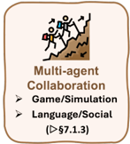


Autonomous

Application-centric Benchmarks (&gt; §7.2)

www

Medical

Web

General

## Research Clinical Browse Too-use

(&gt; §7.2.3)

(D §7.2.4)

(&gt;§7.2.5)


Scientific

Discovery

(&gt; §7.2.2)

図12: エージェント的推論に関するベンチマークの概観。


質問応答の文脈において外部知識源と対話する能力を評価するために設計されている。APIBench [78]は、HuggingFace、TorchHub、TensorHubの実世界APIに基づく大規模ベンチマークを導入し、1,645個のユニークなAPIと16,450件の指示-APIペアを含む。これはGorilla（幅広いAPIを呼び出せるLLM）の訓練・評価に使用され、多様なツールインターフェースへの汎化能力を重視している。ToolLLMToolBench [203]は、RapidAPI Hubから49カテゴリにわたる16,464個の実世界APIを収集し、ChatGPTを用いてこれらのAPIに対する多様な指示形式のプロンプトを生成する。このベンチマークはToolLLaMAの訓練に使用され、同モデルは強力なツール使用能力と未見のAPIへの有望な汎化能力を示している。MetaTool [689]はTOOLEデータセットを導入し、20,000件以上のエントリと、ソフトウェアエンジニアリング、金融、アートデザインなど多様なシナリオにわたる約200ツールを含むベンチマークを提供する。ツール選択タスクを、類似選択肢からのツール選択、特定シナリオでのツール選択、信頼性に問題が生じ得る場合のツール選択、マルチツール選択に分類している。T-Eval [690]はツール利用を一連のサブプロセス（指示追従、計画、推論、検索、理解、レビュー）に分解し、各ステップを個別に評価することでツール使用能力の細粒度な評価を提供する。このベンチマークは15種類の異なるツールにわたる合計23,305件のテストケースを含む。GTA (General Tool Agents) [691]は、実際のユーザクエリ、実世界に展開されたツール、マルチモーダル入力を重視することで、現実的なツール使用シナリオを対象とする。多様なドメインにわたる14ツールを含む、実用的な応用に基づく229件の難解なタスクを導入している。ToolRet [692]はツール検索タスクに特化し、7,600件の多様な検索タスクと43,000件のツールのコーパスからなる異種ベンチマークを導入している。

Multi-Turn Tool Use. Multi-turn tool useは実世界アプリケーションのよりリアルなシミュレーションを提供し、エージェントが複雑なタスクを解決するためにツールを自律的に選択・順序付けする。ToolAlpaca [204]はこの方向における最初期の取り組みの一つであり、マルチエージェントシミュレーションを用いて50の異なるカテゴリにわたる400以上の実世界APIから3,938件のツール使用インスタンスを生成する。SambaNova-ToolBench [693]は、実世界タスク向けのソフトウェアツール操作に重点を置いたベンチマークを導入し、エージェント能力をテストするためにAPIの複雑性を段階的に変化させる。API-Bank [694]は、2,138個のAPIから得られた1,888件のツール使用対話のデータセットと、73個のAPIおよび314件のツール使用テストケースを含む実行可能な評価システムを提供する。UltraTool [695]は、計画認識、計画能力、創造、ツール使用認識、ツール選択、ツール使用の6次元にわたってツール使用能力を評価する。このベンチマークは22ドメインにわたり、2,032個のツールを含み、5,824件の評価サンプルを提供する。ToolFlowは長期的な計画を重視することで先行ベンチマークと差別化され、107個の実世界ツールを含む224件の専門家が作成したタスクを特徴とし、目標分解とマルチステップ意思決定における課題を強調する。より最近では、MTU-Bench [696]がマルチターン・マルチツールシナリオ向けのマルチ粒度ベンチマークを提示し、136個のツールを含む54,798件の対話からなる大規模指示データセットMTU-Instructを公開している。m &amp; m'sは、マルチモーダルモデル、公開API、画像処理モジュールを含む33ツールを用いた4,000件以上のマルチステップ・マルチモーダルタスクのベンチマークを導入する。また、人手で検証された実行可能な高品質サブセット1,565件のタスクプランも提供している。


(&gt; §7.2.6)


end-to-end.

## 7.1.2. サーチ

エージェントがインタラクションを通じて情報を取得する能力を体系的に評価するため、近年のベンチマークはサーチを逐次推論問題として位置づけており、エビデンスソース・インタラクション空間・接地要件の違いによって単一モーダルとマルチモーダル設定に大きく分類できる。

**単一モーダルサーチ。** 単一モーダルのagenticサーチに向けた近年のベンチマークは、情報探索を逐次的・意思決定駆動のプロセスとしてますます位置づけ、計画・インタラクション・エビデンス統合を重視する。たとえばWebWalker [697] は構造化されたウェブサイト走査を重視し、サーチを相互に接続されたページ間の水平探索と垂直掘り下げとして明示的にモデル化する。現実的なオープンワールドの情報探索を反映するため、InfoDeepSeek [698] は検証可能だが非キュレートの回答を持つ動的なWeb設定を導入し、ノイズや分布シフトへの頑健性を際立たせる。いくつかのベンチマークはサーチを時間的・情報的次元に沿ってスケールさせる。Mind2Web 2 [50] は長期的なブラウジングと引用に基づく統合に焦点を当て、RAVine [699] は回答品質をプロセスレベルの効率とインタラクション忠実度で補強する。補完的なものとして、WideSearch [700] とDeepWideSearch [701] は幅指向の大規模事実集約と深さ指向のマルチホップ推論を区別し、カバレッジと推論一貫性の同時最適化の難しさを明らかにする。ドメイン固有のベンチマークは厳格な正確性制約下での信頼性をさらに問う。MedBrowseComp [702] は異種かつ矛盾の可能性がある医療エビデンスを統合することをエージェントに求めることで臨床意思決定支援を対象とし、FinAgentBench [703] はドキュメントタイプ選択ときめ細かなパッセージ局在化を通じて金融分析における検索中心の推論を評価する。最後に、LocalSearchBench [704] はagenticサーチを実世界の地域サービスに根ざかせ、大規模構造化データベース上でのマルチ制約・マルチエンティティ推論を評価する。これらのベンチマークを総合すると、agenticサーチ評価を計画の深さ・インタラクション品質・エビデンス統合・実世界忠実度を中心に再定義し、言語ベースエージェントにおけるサーチ中心推論のより全体的な評価を提供している。

**マルチモーダルサーチ。** マルチモーダルのagenticサーチに関する近年のベンチマークは、静的なマルチモーダル質問応答を超え、現実的な制約のもとで異種情報源を積極的に検索・閲覧・推論するエージェントの能力を体系的に評価する。MMSearch [705] とその拡張版MMSearch-Plus [706] などのベンチマークはマルチモーダルサーチをエンドツーエンドのプロセスとして位置づけ、エージェントはマルチモーダルクエリを解釈し、テキストと視覚的エビデンスを共同活用することで回答を統合しなければならず、異なる入出力モダリティ構成を明示的にモデル化する。この設定を補完するMMBrowseComp [707] は「見つけにくく、検証しやすい」パラダイムをマルチモーダルなWeb環境に適応させ、テキストのみのショートカットを防ぎオープンウェブブラウジング中のマルチモーダルエビデンス接地をストレステストするために画像への強制依存を課す。BEARCUBS [708] はライブWebシナリオにおけるコンピュータ使用エージェントをさらに重視し、明示的なインタラクション軌跡とマルチモーダル操作（たとえば動画や3Dナビゲーション）を必要とすることで、検索精度だけでなく手続的能力も評価する。ドメイン固有でツール拡張された設定に移ると、PaperArena [709] は科学的ワークフローにおけるマルチモーダルのagenticサーチを評価し、エージェントはPDF解析・図の理解・データベースクエリ・ウェブサーチを協調させて研究レベルの問いに答えなければならない。最後に、Video-BrowseComp [710] とVideoDR [711] はagenticサーチを動画中心の設定に拡張し、エージェントは動画から視覚的・時間的手がかりを抽出し、オープンウェブエビデンスを通じて仮説を反復的に検証しなければならず、動画と外部検索の二重依存を確保するよう慎重に設計された制約を持つ。これらのベンチマークを総合すると、インタラクティブな研究者としてのマルチモーダルエージェントを評価する方向への明確な進化が見え、計画・tool use・マルチモーダルエビデンス統合をagenticサーチの一等市民能力として際立たせる。

## 7.1.3. メモリと計画

エージェントの独自の強みの一つは、正確な長期性能と強力な推論能力を達成するためにメモリを活用できることにある。この能力は二つの補完的な観点から評価できる。第一はメモリ管理であり、エージェントが長期メモリをどれほど効果的に統合・整理・検索するかを反映する。第二はメモリ活用であり、エージェントが計画とインフォームドなフィードバックを支援するために履歴情報をどれほどうまく利用するかを捉える。本節では、この二つの側面からベンチマークを個別に論じる。

メモリ管理の観点から、既存のベンチマークはLong-Horizon Episodic MemoryとMulti-session Recallに大きく分類できる。これはテキスト文脈が単一の連続した長形式入力か複数の不連続な対話セッションかによる。

**Long-Horizon Episodic Memory。** このカテゴリは部分観測性と遅延報酬を持つ単一エピソードタスクを対象とし、エージェントが長期間にわたって情報を保存・検索することを必要とする。この空間のベンチマークは長文脈にわたるメモリ保持・検索・推論を評価する。PerLTQA [712] は個人化された対話をシミュレートし、エージェントは長期的なペルソナとイベントメモリを用いて質問に答える。8,500件のQAペアを含み、メモリ分類・検索ランキング・統合忠実度を評価する。ELITRBench [713] はノイジーな会議議事録上のQAをテストし、関連するエビデンスがクエリよりはるか以前に現れる可能性がある。モデルは様々なASRノイズレベルと対話設定にわたってGPT-4でスコアリングされる。また、Multi-IF [714] とMultiChallenge [715] はマルチターンの命令追従に焦点を当てる。Multi-IF [714] は8言語にわたる4,500件の三ターン会話を含み、厳密および緩和した命令精度に基づく評価を行う。MultiChallenge [715] は保持・推論・編集・一貫性という四つのメモリ集約的な現象をテストし、バイナリ合否評価による273件のキュレート対話を使用する。TurnBench-MS [716] は540件の記号論理ゲームにわたるマルチステップ推論を評価し、勝率・ラウンドレベル精度・検証器使用状況を追跡する。StoryBench [717] はメモリをインタラクティブな物語における意思決定として位置づけ、エージェントは進展するために過去の選択を記憶しなければならない。決定精度・リトライ回数・実行効率を評価する。MemBench [718] は参加者的および観察者的設定における60,000件のエピソードにわたる事実的・内省的メモリをテストし、精度・再現率・容量・検索速度の指標を持つ。MMRC [719] は単一ラウンドのマルチモーダル会話に焦点を当てたマルチモーダルメモリベンチマークを開発する。これらのベンチマークを総合すると、構造化されたメモリ要求を重視し、タスク成功だけでなくメモリ精度・統合品質・長文脈ストレス下での頑健性を捉える指標を持つことが特徴的である。

**Multi-session Recall。** Multi-session Recallは、エージェントが別々のセッションにわたって知識を保持・統合しなければならないマルチエピソードタスクに焦点を当て、生涯適応を支援し壊滅的忘却を軽減する。近年の一連のベンチマークはこの能力を現実的な長期インタラクションシナリオのもとで体系的に探る。LOCOMO [322] はLLMエージェントを19セッション対話にわたる持続的な会話メモリで評価し、マルチホップQA・イベント要約・マルチモーダル応答生成などのタスクを使用する。MemSim [720] は日常生活ドメインの2,900件超の合成軌跡を持つシミュレータベースのフレームワークを導入し、精度・多様性・合理性スコアによってセッション間の事実保持を評価する。LONGMEMEVAL [323] は情報抽出・マルチセッション推論・時間的推論・知識更新・棄権という五つのサブタスクにわたってアシスタントをベンチマークし、最大1.5Mトークンの対話履歴にわたってGPT-4で判定した精度と検索再現率を用いる。REALTALK [721] は21日間の実際の人間の会話を呈示し、二者間で17,000トークンを持ち、マルチホップQAと感情接地指標を通じてメモリプロービングとペルソナシミュレーションの評価を可能にする。さらに、MemoryAgentBench [722] はテスト時学習・矛盾解消・長距離理解などの多様なメモリタスクを複数のデータセットにわたって統合し、分類精度・部分一致F1・ROUGEを含むタスク固有の指標を持つ。Mem-Gallery [310] は幅広いメモリ管理と活用シナリオを体系的にカバーするマルチモーダルの長期メモリ評価ベンチマークを導入する。最後に、Evo-Memory [25] はテスト時学習における経験再利用を測定するベンチマークと統合評価プロトコルを導入する。これらのベンチマークを総合すると、セッション間の動的メモリ統合の重要性を強調し、事実想起・適応・推論にわたる包括的な評価を提供する。

メモリ活用の観点から、履歴情報を用いて計画とフィードバックを支援するエージェントの能力を評価するベンチマークの詳細な議論を行う。

**計画とフィードバック。** 計画とフィードバックを対象とするベンチマークは主に、エージェントが環境フィードバックに基づくマルチステップ計画を支援するためにメモリを効果的に活用し、長期的なインタラクションにわたって一貫した内部状態を維持できるかどうかを評価する。まず、ALFWorld [48] はインタラクティブな環境を用いてマルチステップ計画の一貫性を評価し、エージェントはアクション間で観測を蓄積し、実行全体にわたって潜在的な内部状態を維持することを要求される。さらに、PlanBench [723] やACPBench [724] などの形式的計画ベンチマークは明示的に定義された動的環境における計画能力を評価し、エージェントがアクションの前提条件・効果・到達可能性・全体的な計画妥当性について正しく推論できるかをテストする。TEXT2WORLD [725] は断片的なテキスト記述を一貫した実行可能なworld modelに統合し、歴史的事実を構造化された計画表現に継続的に集約する能力を評価する。より近年のベンチマークはフィードバック統合と非定常条件下での計画をより重視する。たとえば、REALM-Bench [726] は実世界の製造シナリオに動的な混乱を導入し、エージェントが以前のコミットメントを記憶し、基本的な仮定が違反されたときに再計画することを要求する一方、TravelPlanner [727] は制約された変化する情報のもとでの正確な旅程作成に焦点を当てる。最後に、FlowBench [728] とUrbanPlanBench [729] はそれぞれ手続的およびドメイン固有の設定における計画性能を評価し、エージェントは会話的またはポリシーコンテキストを保持し意思決定ステップ間で一貫して適用しなければならない。これらのベンチマークを総合すると、ワンショットの計画生成を超え、エージェントが持続的な計画・適応的フィードバック統合・時間をかけた反復的な意思決定修正を支援するために履歴情報を活用できるかどうかを体系的に調査する。

## 7.1.4. マルチエージェントシステム

孤立した推論を超えた協調・競争・意思決定を評価するため、近年のベンチマークはマルチエージェントシステムをインタラクティブな環境に位置づける。これらの研究はゲームベース評価・シミュレーション中心の実世界シナリオ・言語駆動の社会的推論タスクに大きくわたる。

**ゲームベースの強化学習評価。** ゲームベースのRL評価ベンチマークは古典的・新規のゲーム環境を活用して、協調的および敵対的設定のもとでマルチエージェントRLアルゴリズムの性能を体系的に比較する。MAgent [730] はカスタマイズ可能なグリッドワールド内での追跡やリソース競争などの大規模マルチエージェントシナリオを促進し、個別の累積報酬やリソース占有率などの競争的指標を評価する。Pommerman [731] は協調的・敵対的インタラクションのためにクラシックなBombermanゲームを適応させ、勝率・生存時間・キル対自殺比でパフォーマンスを定量化する。SMAC [732] はStarCraft IIシナリオにおける分散型マイクロマネジメント課題を中心とし、勝率・平均ダメージ出力・編隊分散でチーム成功を評価する。MineLand [733] は大規模マルチエージェント協調のためのリアルな生態シミュレーションとしてMinecraftを利用し、最大64エージェントが部分観測性のもとで身体的ニーズを満たすために協調する。TeamCraft [734] もMinecraftを採用し、視覚・テキスト・環境プロンプトを解釈して55,000件の手続的生成タスクインスタンスを協調達成するよう課される具現化マルチモーダルエージェントをベンチマークする。Melting Pot [735] は多様な社会的ジレンマ環境でのエージェントのゼロショット汎化能力を評価し、一人当たりリターン・社会的厚生・不平等指数などの指標を用いる。BenchMARL [736] は複数のシナリオ（SMACv2、VMAS、MPEなど）にわたる標準化されたアルゴリズム比較を提供し、収束率・最終性能・ハイパーパラメータ感度を測定する。最後に、Arena [737] はさまざまな複雑度の協調的・敵対的ゲームの包括的なスイートを包含し、個別リターン・集合的社会的厚生・創発的通信プロトコルを評価する。

**シミュレーション中心の実世界評価。** シミュレーション中心の実世界ベンチマークはリアルまたは擬似リアルな環境をシミュレートし、スケーラビリティ・部分観測性・動的計画を重視する。SMARTS [738] は合流や交差点などの実世界交通シナリオ向けのスケーラブルなマルチエージェント走行プラットフォームを提供し、衝突率・タスク完了率・エージェント行動分布に基づいて評価する。Nocturne [739] はWaymoの軌跡を用いた高スループットの部分観測走行シミュレーションを提供し、交差点やラウンドアバウトなどのタスクで協調と人間らしい行動をテストする。MABIM [740] はマルチエシェロンの在庫管理をベンチマークし、協調的・競争的な小売ダイナミクスをシミュレートして多様な在庫設定での利益指標によって評価する。IMP-MARL [741] はインフラ点検・保守スケジューリングを扱い、大規模システムでのリスク低減とコスト効率を測定する。POGEMA [742] はグリッドにおける分散型マルチエージェント経路探索に焦点を当て、成功率・経路効率・大規模協調を追跡する。INTERSECTIONZOO [743] は交差点での協調的エコドライビングに向けた文脈RLを研究し、交通シミュレーションを用いて排気量と所要時間性能を評価する。REALM-Bench [726] は物流から災害救助にわたる実世界計画タスクを動的な混乱・マルチスレッドの依存関係・計画品質・適応性・制約満足による評価とともに導入する。これらのベンチマークを総合すると、スケーリング・不確実性・協調・動的適応における課題を反映し、実世界のマルチエージェントシステムの厳格なテストベッドを提供する。

**言語・コミュニケーション・社会的推論。** 言語・コミュニケーション・社会的推論のベンチマークはマルチエージェントの通信プロトコル・Theory-of-Mind推論・ゲーム理論的インタラクション・言語駆動の協調を探る。LLM-Coordination [744] は協調型ゲームプレイ（HanabiやOvercooked-AIなど）を通じたLLMエージェントの協調推論と共同計画能力を検討し、全体スコアときめ細かな協調問題精度で測定する。AVALONBENCH [745] は社会的推理ゲームAvalonを活用してロール条件付き言語ベース推論を評価し、数千件の五人プレイヤー対話データセットと勝率・ロール精度・投票ダイナミクスの指標を持つ。Welfare Diplomacy [746] はクラシックゲームDiplomacyを一般和厚生交渉に拡張し、50ゲームデータセットを用いて連合安定性と厚生志向の戦略的推論を定量化する。MAgIC [747] は社会的推理やクラシックなジレンマ（カメレオンや囚人のジレンマなど）をカバーし、手作りシナリオデータセットを用いて推論・欺き・協調・合理性をベンチマークする。BattleAgentBench [19] は戦略的ゲームプレイ環境における言語ベースの協調的・競争的ダイナミクスを評価し、多様なマップデータセットにわたってナビゲーション精度・エージェントインタラクション・exploitabilityをスコアリングする。COMMA [748] は視覚言語協調を含む協調的パズル解決タスクを通じてマルチモーダルコミュニケーティブ推論を評価し、数千件のシナリオにわたって接地精度・プライバシー遵守・対話効果性を測定する。IntellAgent [749] は小売と航空の領域での合成会話AIタスクを導入し、ポリシー制約付きの広範な対話データセットを生成して会話成功・ミス頻度・ポリシー遵守によって評価する。最後に、MultiAgentBench [21] はMinecraftビルディング・コーディング・バーゲニングなどのタスクにわたる包括的な評価を提供し、動的な主要パフォーマンス指標と様々なマルチエージェントトポロジーとシナリオにわたるLLMスコアによるコミュニケーション品質を採用する。

## 7.2. Agenticな推論の応用

メカニズム中心のベンチマークは個別の能力を分離するのに役立つが、実世界のデプロイメントは部分観測性・長期的依存関係・安全クリティカルな決定などの現実的な制約のもとでこれらの能力が共同して機能することを要求する。そこで次に、代表的な環境にわたるエンドツーエンドのエージェント性能を評価するアプリケーションレベルのベンチマークを概観し、知覚・推論・アクション実行・協調を共同してストレステストするタスクを取り上げる。

本節では、様々なドメインにわたるagenticな推論システムのアプリケーションレベルの性能を評価するよう設計されたベンチマークを概観する。これらのベンチマークはエージェントが現実的または高インパクトのタスク設定において知覚・推論・行動する能力を評価する。アプリケーション環境に基づいて六つのカテゴリに整理する：Embodied Agents・Scientific Discovery Agents・Autonomous Research Agents・Medical and Clinical Agents・Web Agents・Tool-Use Agents。各小節では代表的なベンチマークを紹介し、その設計動機・タスク形式・評価指標を説明する。

## 7.2.1. Embodied Agents

このカテゴリのベンチマークは物理的またはシミュレートされた環境とインタラクトするエージェントを評価し、接地・知覚・アクション計画を必要とする。AgentX [750] は走行とスポーツにおける多様なvision-language具現化タスクを提供し、エージェントは動画からマルチモーダル情報を用いて意思決定しなければならない。閉塞・時間的ギャップ・気を散らすものがあるシーンにわたる推論を重視する。BALROG [751] はゲーム環境でのagenticな計画をベンチマークするためのRL中心のフレームワークを構築し、命令追従・時間的抽象化・誤り修正に焦点を当てる。ALFWorld [48] は言語命令をテキストベースの3D環境でのオブジェクトインタラクションにリンクし、知覚に根ざした実行を評価する。AndroidArena [752] はGUIベースのモバイルタスクを対象とし、エージェントはvision-language理解を用いてフォーム入力やアプリナビゲーションなどのアクションを実行しなければならない。StarDojo [753] はオープンエンドのStardew Valleyゲームを活用して社会的計画とロールベースの協調を研究する。MindAgent [754] とNetPlay [755] は不確実性のもとでの創発的な社会的推論と交渉をベンチマークするためのマルチプレイヤーゲームテストベッドを作成する。OSWorld [756] はファイル開封・形式変換・文書修正などの多様なクロスアプリ生産性タスクを持つシミュレートされたデスクトップ環境を提供する。これらの環境は、動的でしばしば部分観測なシナリオにおける知覚・計画・記号的アクションの協調においてエージェントに挑戦する。

## 7.2.2. Scientific Discovery Agents

科学的ベンチマークは知識取得・仮説生成・実験自動化におけるエージェントの能力をテストすることを目指す。DISCOVERYWORLD [757] はシミュレートされたツールと機器を通じて生物学・化学・物理学の科学的現象を探索するエージェントのための仮想ラボを導入する。ScienceWorld [758] はテキスト命令と環境インタラクションを用いた基礎的な科学実験に焦点を当て、段階的な仮説テストを必要とする。ScienceAgentBench [759] は実世界の科学論文からベンチマークを構築し、コード実装・図生成・変数抽出などのタスクを実行可能なサブタスクに翻訳し、研究プロセスを自動化するエージェントの能力を評価する。The AI Scientist [651] はエンドツーエンドの完全な研究パイプラインをシミュレートし、エージェントは文献調査・手法記述・実験実行・査読シミュレーションを実行する。LAB-Bench [760] は遺伝子配列推論と実験計画を含むタスクで生物学固有のエージェントを評価する。MLAgentBench [761] は機械学習モデルを自律的に訓練・評価・チューニングするエージェントの能力をベンチマークし、現実的な実験ワークフローを提供する。これらのベンチマークは総合して、半構造化データ設定におけるオープンエンドの推論・長期的計画・科学的接地を探る。

## 7.2.3. Autonomous Research Agents

このカテゴリは汎用研究・オフィス・計画タスクにわたる長期的ワークフロー向けに設計されたエージェントをベンチマークする。WorkArena [762] とその拡張版WorkArena++ [763] は文書にわたる検索・要約・協調を含むチケットベースのワークフローを完了しなければならないエージェントのエンタープライズタスクベンチマークを提案する。OfficeBench [764] はミーティングメモの作成・スプレッドシートの修正・メールへの返信などのタスクを持つ生産性ソフトウェアスイート環境をシミュレートし、ゴール分解とツール選択を重視する。PlanBench [723] とFlowBench [728] は抽象化されたタスクグラフと構造化依存関係を持つ汎用ワークフロー計画スキルをテストする。ACPBench [724] はアシスタント-協力者-計画者の三者構成でエージェントを評価し、ハイブリッドロール階層での性能を追跡する。TRAIL [765] はLLMベースシステムにおけるマルチエージェントトレースデバッグと誤り帰属 [766] に焦点を当て、推論チェーンに対する密なアノテーションを提供する。CLIN [767] はエージェントが分布シフトとタスク進化に適応する生涯少数ショット学習ベンチマークを導入する。Agent-as-a-Judge [768] はエージェントが他のエージェントの出力の推論チェーンと正確性を採点するピアレビュースタイルの評価を研究する。InfoDeepSeek [698] はオープンドメインQAと統合タスクにおける情報探索能力を測定する。これらのベンチマークを総合すると、抽象化・反復・評価を含む複雑な知識ワークフローにおけるagenticな推論への高まる需要を捉えている。

## 7.2.4. Medical and Clinical Agents

これらのベンチマークは臨床知識・患者データ・マルチモーダルな生物医学ソースで推論するエージェントの能力をテストする。AgentClinic [769] はエージェントが患者症状と医療画像に基づいて診断的意思決定を行う仮想病院環境を導入する。MedAgentBench [770] は標準化試験に根ざしたマルチフォーマットベンチマークで医療QA・患者シミュレーション・検索タスクを組み合わせる。MedAgentsBench [771] は構造化・非構造化データにわたるマルチホップ医療推論を評価し、正確性とエビデンス整合性でエージェントをスコアリングする。EHRAgent [581] は診断コード予測と薬剤推論などのタスクを完了するために構造化された電子健康記録（EHR）テーブルと臨床ノートに取り組むエージェントをベンチマークする。MedBrowseComp [702] はブラウジングベースの医療QAに焦点を当て、エージェントはWebページにわたって情報を検索・検証しなければならない。ACC [772] は検索・幻覚検出・引用ベースのサポート評価を含む信頼できる医療エージェントを探る。MedAgents [601] は協調的なマルチエージェント対話セットアップを用いて患者-医師-看護師のインタラクションをシミュレートし、流暢性と事実精度をスコアリングする。GuardAgent [773] はEHRとウェブサイトフォームの構造化リスク検出ベンチマークを持つ臨床プライバシー保護エージェントを提案する。これらのデータセットは実世界の臨床デプロイメントコンテキストにおける正確性・信頼性・安全性を重視する。

## 7.2.5. Web Agents

Web agentsは現実的なブラウジング環境で動作し、レイアウトの解析・アクションの実行・動的コンテンツの処理能力をベンチマークされる。WebArena [45] はショッピングや予約などのドメインにわたる90件超の現実的なウェブサイトを含むブラウザベースのベンチマークスイートを導入し、エージェントは構造化ゴールとクリックベースAPIでタスクを完了する。VisualWebArena [46] はこれを視覚的レンダリングで拡張し、エージェントはウェブページ画像を解析しレンダリングされたコンポーネントと命令を整合させなければならない。WebVoyager [638] はマルチページ走査とバックトラッキングを含む長期的タスクによるゴール駆動ナビゲーションを提案する。Mind2Web [50] はマルチタスクデータセットと豊富な接地アノテーションによるクロスドメインウェブ自動化を対象とする。WebCanvas [774] はドラッグ&ドロップやリサイズアクションなどのきめ細かなレイアウト操作をサポートする。WebLINX [775] はブラウジング・要約・回答統合によるリサーチ情報収集タスクをシミュレートする。BrowseComp-ZH [776] は中国語ウェブサイトによる言語とインフラの多様性をもたらし、多言語理解においてエージェントに挑戦する。LASER [777]・WebWalker [697]・AutoWebBench [605] はウェブナビゲーションにおける構造化ページ表現・リアルタイムアクション実行・ポリシー学習に焦点を当てる。これらのベンチマークはウェブ設定における知覚・接地・ポリシー汎化の課題を際立たせる。

## 7.2.6. 汎用Tool-Use Agents

このグループのベンチマークはLLMエージェントがツールとAPIを呼び出し・協調し・推論する能力を重視する。GTA [691] はユーザクエリとデプロイされたソフトウェアツールに根ざした現実的なtool-useベンチマークを提示し、画像生成から分析ダッシュボードまでのAPIを対象とする。NESTFUL [778] はツールチェーン間の合成的計画を必要とするネストされたAPI呼び出しタスクを評価する。CodeAct [99] は実行可能な関数呼び出しをシミュレートし、解析・合成・実行時精度でエージェントを評価する。RestGPT [225] はLLMをRESTful APIと粗から細への計画パイプラインで接続し、60件超のツールタイプでテストする。Search-o1 [23] はtool useを逐次的な検索としてフレーム化し、コード検索・PDFクエリ・科学的ツール使用にわたるベンチマークを持つ。Agentic RL [779] はツールインタフェースへのアクセスを持つRLエージェントと、カレンダースケジューリングや翻訳などの評価タスクを提案する。ActionReasoningBench [780] は構造化アクション文法を用いてアクションの副作用と下流の結果について推論するエージェントの能力をベンチマークする。R-Judge [781] はエージェントがツールを含むリスクのある計画を評価する安全判断ベンチマークを導入する。これらのデータセットは総合して、ツール拡張エージェント環境の高まる複雑性と合成性を反映する。

## 8. オープン問題

本節では、ユーザ中心のパーソナライゼーション・長期的インタラクションとクレジット割り当て・world modelベースの推論・マルチエージェント協調と訓練・潜在的内部推論・実世界環境で自律的に動作するagenticシステムのガバナンスから生じるオープン問題を強調する。

## 8.1. ユーザ中心のAgenticな推論とパーソナライゼーション

ユーザ中心のagenticな推論 [782, 783] とは、時間をかけてユーザの特性・好み・インタラクション履歴をモデル化することで、特定の個人ユーザに推論とアクションを適合させるエージェントの能力を指す。固定されたタスク定義の目的を最適化するのではなく、ユーザ中心エージェントはユーザを環境の一部として扱い、拡張されたマルチターンインタラクションを通じて継続的に戦略を適応させる。これはエージェントが進化するユーザの意図を動的に推論し、ゴールと行動スタイルの変化に適応し、対話が進むにつれて明示的または暗黙的なユーザフィードバックに基づいて決定を調整することを必要とする。重要なのは、ユーザ中心のagenticな推論が短期的なタスク報酬と長期的なユーザ体験・満足・信頼のバランスを取ることを含み、これが従来のagenticな推論設定を超えた非定常目標と長期クレジット割り当ての課題をもたらすことである。

## 8.2. 拡張インタラクションからの長期Agenticな推論

agenticな推論における中心的なオープン課題は、拡張されたインタラクションにわたる頑健な長期計画とクレジット割り当てである。ReActやTree of Thoughtなどの手法は短期的推論を改善するが [5, 4]、Voyager [36] などの具現化エージェントが示すように、長いタスクでは誤りが依然として急速に蓄積する。WebRLやAgent-R1などのRL訓練エージェントは現実的環境での性能を改善するが、大幅にエンジニアリングされたドメイン固有の報酬に依存し、エピソードをほぼ独立して扱う [437, 28]。より近年のプロセス認識アプローチはよりきめ細かなクレジットシグナルを構築しようとするが [784, 15, 785]、環境固有のままである。核心的なオープン問題は、トークン・ツール呼び出し・スキル・メモリ更新にわたってクレジットを割り当てる方法と、長期的なエピソードとタスクの系列にわたってそのような学習を汎化する方法である。

## 8.3. World Modelsを用いたAgenticな推論

World modelベースのエージェント [786, 316] は内部シミュレーションとlookaheadを可能にすることで近視眼的な推論を緩和することを目指す。DreamerV3などのmodel-based RLシステムは長期的制御のためのimagined rolloutsの有効性を示す [787] 一方、近年のLLMベースエージェントはworld modelsをウェブ・コード・GUI環境に適応させる [788, 786, 789, 790]。しかし、現在の設計はアドホックな表現に依存し、通常短期的または環境固有のデータで訓練されており、較正と汎化に関する懸念を高める。一部の研究のみが長期スケールでworld modelsとエージェントの共進化を探る [610, 791]。オープン問題は非定常環境でworld modelsを共同訓練・更新・評価する方法と、下流の計画信頼性に対するそれらの因果的影響をどのように評価するかである。

## 8.4. マルチエージェント協調推論と訓練

マルチエージェント協調はロール専門化と分業を通じてagenticな推論をスケールする強力なパラダイムとして浮上している [67, 792, 66]。ディベートおよびロールベースのシステムはしばしば単一エージェントを上回るが、ほとんどの協調構造はまだ手動で設計されている。近年のマルチエージェントRLアプローチは協調それ自体を訓練可能なスキルとして扱い始めているが [409, 413, 26]、グループレベルのクレジット割り当ては依然として十分に理解されていない。より大きなエージェント集団へのスケーリングはさらに、トポロジー適応・協調オーバーヘッド・安全性における課題をもたらす [793, 794, 766]。主要なオープン問題は、部分観測性と敵対条件のもとで頑健であり続ける適応的で解釈可能な協調ポリシーをいかに学習するかである。

## 8.5. 潜在的Agenticな推論

潜在的agenticな推論 [795, 796, 441] は明示的な自然言語や記号的なトレースではなく、内部の潜在空間で計画・意思決定・協調を実行することを探る。近年の研究は潜在的推論が効率性とスケーラビリティを改善できることを示唆するが、解釈可能性と制御可能性のコストを伴う。agenticな設定では、これは潜在的推論を外部の目的・ツール・エージェント・メモリシステムとどのように整合させるかを含む追加的な課題を引き起こす。中間の推論ステップが外部から観測不可能なとき、失敗の診断は特に困難になる。オープン問題は、潜在的agenticな推論を効果的かつ監査可能にする学習目的・プロービング手法・評価ベンチマークをどのように設計するかである。

## 8.6. Agenticな推論のガバナンス

ガバナンスは、ツール・環境・他のエージェントにわたって自律的に行動するagenticな推論システムにとって横断的な課題である。標準的なLLMの安全性問題を超えて、agenticシステムは長期的計画・持続的メモリ・実世界のアクション実行により新たなリスクをもたらす [797]。失敗は時間とコンポーネントにわたるインタラクションから生じる可能性があり、帰属と監査を困難にする。既存のベンチマークとガードレールは主に短期的な挙動に焦点を当てており [773, 781]、計画時の失敗とマルチエージェントダイナミクスは探索が不十分なままである。中心的なオープン問題は、現実的なデプロイメント条件のもとでモデルレベルの整合・エージェントレベルのポリシー・エコシステムレベルのインタラクションを共同して扱うガバナンスフレームワークを開発することである。

## References

- [1] Jason Wei, Xuezhi Wang, Dale Schuurmans, Maarten Bosma, Fei Xia, Ed Chi, Quoc V Le, Denny Zhou, et al. Chain-of-thought prompting elicits reasoning in large language models. Advances in neural information processing systems , 35:24824-24837, 2022.
- [2] Denny Zhou, Nathanael Schärli, Le Hou, Jason Wei, Nathan Scales, Xuezhi Wang, Dale Schuurmans, Claire Cui, Olivier Bousquet, Quoc Le, et al. Least-to-most prompting enables complex reasoning in large language models. arXiv preprint arXiv:2205.10625 , 2022.
- [3] Luyu Gao, Aman Madaan, Shuyan Zhou, Uri Alon, Pengfei Liu, Yiming Yang, Jamie Callan, and Graham Neubig. Pal: Program-aided language models. In International Conference on Machine Learning , pages 10764-10799. PMLR, 2023.
- [4] Shunyu Yao, Dian Yu, Jeffrey Zhao, Izhak Shafran, Tom Griffiths, Yuan Cao, and Karthik Narasimhan. Tree of thoughts: Deliberate problem solving with large language models. Advances in neural information processing systems , 36:11809-11822, 2023.
- [5] Shunyu Yao, Jeffrey Zhao, Dian Yu, Nan Du, Izhak Shafran, Karthik Narasimhan, and Yuan Cao. React: Synergizing reasoning and acting in language models. In International Conference on Learning Representations (ICLR) , 2023.
- [6] Timo Schick, Jane Dwivedi-Yu, Roberto Dessì, Roberta Raileanu, Maria Lomeli, Eric Hambro, Luke Zettlemoyer, Nicola Cancedda, and Thomas Scialom. Toolformer: Language models can teach themselves to use tools. Advances in Neural Information Processing Systems , 36:68539-68551, 2023.
- [7] Yongliang Shen, Kaitao Song, Xu Tan, Dongsheng Li, Weiming Lu, and Yueting Zhuang. Hugginggpt: Solving ai tasks with chatgpt and its friends in hugging face. Advances in Neural Information Processing Systems , 36:38154-38180, 2023.
- [8] Lei Wang, Chen Ma, Xueyang Feng, Zeyu Zhang, Hao Yang, Jingsen Zhang, Zhiyuan Chen, Jiakai Tang, Xu Chen, Yankai Lin, et al. A survey on large language model based autonomous agents. Frontiers of Computer Science , 18(6):186345, 2024.
- [9] Aditi Singh, Abul Ehtesham, Saket Kumar, and Tala Talaei Khoei. Agentic retrieval-augmented generation: A survey on agentic rag. arXiv preprint arXiv:2501.09136 , 2025.
- [10] Yizheng Huang and Jimmy Huang. A survey on retrieval-augmented text generation for large language models. arXiv preprint arXiv:2404.10981 , 2024.
- [11] Xingyao Wang, Boxuan Li, Yufan Song, Frank F Xu, Xiangru Tang, Mingchen Zhuge, Jiayi Pan, Yueqi Song, Bowen Li, Jaskirat Singh, et al. Openhands: An open platform for ai software developers as generalist agents. arXiv preprint arXiv:2407.16741 , 2024.

- [12] Prateek Chhikara, Dev Khant, Saket Aryan, Taranjeet Singh, and Deshraj Yadav. Mem0: Building production-ready ai agents with scalable long-term memory. arXiv preprint arXiv:2504.19413 , 2025.
- [13] Zhiyu Li, Shichao Song, Hanyu Wang, Simin Niu, Ding Chen, Jiawei Yang, Chenyang Xi, Huayi Lai, Jihao Zhao, Yezhaohui Wang, et al. Memos: An operating system for memory-augmented generation (mag) in large language models. arXiv preprint arXiv:2505.22101 , 2025.
- [14] Noah Shinn, Federico Cassano, Ashwin Gopinath, Karthik Narasimhan, and Shunyu Yao. Reflexion: Language agents with verbal reinforcement learning. Advances in Neural Information Processing Systems , 36:8634-8652, 2023.
- [15] Sikuan Yan, Xiufeng Yang, Zuchao Huang, Ercong Nie, Zifeng Ding, Zonggen Li, Xiaowen Ma, Kristian Kersting, Jeff Z. Pan, Hinrich Schütze, Volker Tresp, and Yunpu Ma. Memory-r1: Enhancing large language model agents to manage and utilize memories via reinforcement learning. arXiv preprint arXiv:2508.19828 , 2025.
- [16] Guangyao Chen, Siwei Dong, Yu Shu, Ge Zhang, Jaward Sesay, Börje F Karlsson, Jie Fu, and Yemin Shi. Autoagents: A framework for automatic agent generation. arXiv preprint arXiv:2309.17288 , 2023.
- [17] Sirui Hong, Mingchen Zhuge, Jonathan Chen, Xiawu Zheng, Yuheng Cheng, Jinlin Wang, Ceyao Zhang, Zili Wang, Steven Ka Shing Yau, Zijuan Lin, Liyang Zhou, Chenyu Ran, Lingfeng Xiao, Chenglin Wu, and Jürgen Schmidhuber. MetaGPT: Meta programming for a multi-agent collaborative framework. In The Twelfth International Conference on Learning Representations , 2024. URL https: //openreview.net/forum?id=VtmBAGCN7o .
- [18] Zhenhailong Wang, Shaoguang Mao, Wenshan Wu, Tao Ge, Furu Wei, and Heng Ji. Unleashing cognitive synergy in large language models: A task-solving agent through multi-persona self-collaboration. In Proc. 2024 Annual Conference of the North American Chapter of the Association for Computational Linguistics (NAACL2024) , 2024.
- [19] Wei Wang, Dan Zhang, Tao Feng, Boyan Wang, and Jie Tang. Battleagentbench: A benchmark for evaluating cooperation and competition capabilities of language models in multi-agent systems. arXiv preprint arXiv:2408.15971 , 2024.
- [20] Xiao Liu, Hao Yu, Hanchen Zhang, Yifan Xu, Xuanyu Lei, Hanyu Lai, Yu Gu, Hangliang Ding, Kaiwen Men, Kejuan Yang, Shudan Zhang, Xiang Deng, Aohan Zeng, Zhengxiao Du, Chenhui Zhang, Sheng Shen, Tianjun Zhang, Yu Su, Huan Sun, Minlie Huang, Yuxiao Dong, and Jie Tang. Agentbench: Evaluating llms as agents. arXiv preprint arXiv:2308.03688 , 2023. URL https://www.arxiv.org/ abs/2308.03688 .
- [21] Kunlun Zhu, Hongyi Du, Zhaochen Hong, Xiaocheng Yang, Shuyi Guo, Zhe Wang, Zhenhailong Wang, Cheng Qian, Xiangru Tang, Heng Ji, et al. Multiagentbench: Evaluating the collaboration and competition of llm agents. arXiv preprint arXiv:2503.01935 , 2025.
- [22] Ziyi Ni, Yifan Li, Ning Yang, Dou Shen, Pin Lyu, and Daxiang Dong. Tree-of-code: A self-growing tree framework for end-to-end code generation and execution in complex tasks. In Findings of the Association for Computational Linguistics: ACL 2025 , pages 9804-9819, 2025.
- [23] Xiaoxi Li, Guanting Dong, Jiajie Jin, Yuyao Zhang, Yujia Zhou, Yutao Zhu, Peitian Zhang, and Zhicheng Dou. Search-o1: Agentic search-enhanced large reasoning models. arXiv preprint arXiv:2501.05366 , 2025.

- [24] Wujiang Xu, Kai Mei, Hang Gao, Juntao Tan, Zujie Liang, and Yongfeng Zhang. A-mem: Agentic memory for llm agents. arXiv preprint arXiv:2502.12110 , 2025.
- [25] Tianxin Wei, Noveen Sachdeva, Benjamin Coleman, Zhankui He, Yuanchen Bei, Xuying Ning, Mengting Ai, Yunzhe Li, Jingrui He, Ed H Chi, et al. Evo-memory: Benchmarking llm agent test-time learning with self-evolving memory. arXiv preprint arXiv:2511.20857 , 2025.
- [26] Hao Ma, Tianyi Hu, Zhiqiang Pu, Liu Boyin, Xiaolin Ai, Yanyan Liang, and Min Chen. Coevolving with the other you: Fine-tuning llm with sequential cooperative multi-agent reinforcement learning. Advances in Neural Information Processing Systems , 37:15497-15525, 2024.
- [27] Bowen Jin, Hansi Zeng, Zhenrui Yue, Jinsung Yoon, Sercan Arik, Dong Wang, Hamed Zamani, and Jiawei Han. Search-r1: Training llms to reason and leverage search engines with reinforcement learning. arXiv preprint arXiv:2503.09516 , 2025.
- [28] Zhepei Wei, Wenlin Yao, Yao Liu, Weizhi Zhang, Qin Lu, Liang Qiu, Changlong Yu, Puyang Xu, Chao Zhang, Bing Yin, et al. Webagent-r1: Training web agents via end-to-end multi-turn reinforcement learning. arXiv preprint arXiv:2505.16421 , 2025.
- [29] Trieu H Trinh, Yuhuai Wu, Quoc V Le, He He, and Thang Luong. Solving olympiad geometry without human demonstrations. Nature , 625(7995):476-482, 2024.
- [30] Bernardino Romera-Paredes, Mohammadamin Barekatain, Alexander Novikov, Matej Balog, M Pawan Kumar, Emilien Dupont, Francisco JR Ruiz, Jordan S Ellenberg, Pengming Wang, Omar Fawzi, et al. Mathematical discoveries from program search with large language models. Nature , 625(7995): 468-475, 2024.
- [31] Ranjan Sapkota, Konstantinos I Roumeliotis, and Manoj Karkee. Vibe coding vs. agentic coding: Fundamentals and practical implications of agentic AI, 2025.
- [32] Andrej Karpathy. Vibe coding - wikipedia. https://en.wikipedia.org/wiki/Vibe\_coding , 2025.
- [33] Andres M Bran, Sam Cox, Oliver Schilter, Carlo Baldassari, Andrew D White, and Philippe Schwaller. Chemcrow: Augmenting large-language models with chemistry tools. arXiv preprint arXiv:2304.05376 , 2023.
- [34] Fouad Bousetouane. Physical ai agents: Integrating cognitive intelligence with real-world action. arXiv preprint arXiv:2501.08944 , 2025.
- [35] Qianggang Ding, Santiago Miret, and Bang Liu. Matexpert: Decomposing materials discovery by mimicking human experts. arXiv preprint arXiv:2410.21317 , 2024.
- [36] Guanzhi Wang, Yuqi Xie, Yunfan Jiang, Ajay Mandlekar, Chaowei Xiao, Yuke Zhu, Linxi Fan, and Anima Anandkumar. Voyager: An open-ended embodied agent with large language models. arXiv preprint arXiv:2305.16291 , 2023.
- [37] Booker Meghan, Byrd Grayson, Kemp Bethany, Schmidt Aurora, and Rivera Corban. Embodiedrag: Dynamic 3d scene graph retrieval for efficient and scalable robot task planning. arXiv preprint arXiv:2410.23968 , 2024. URL https://www.arxiv.org/abs/2410.23968 .

- [38] Baining Zhao, Ziyou Wang, Jianjie Fang, Chen Gao, Fanhang Man, Jinqiang Cui, Xin Wang, Xinlei Chen, Yong Li, and Wenwu Zhu. Embodied-r: Collaborative framework for activating embodied spatial reasoning in foundation models via reinforcement learning. arXiv preprint arXiv:2504.12680 , 2025.
- [39] Binxu Li, Tiankai Yan, Yuanting Pan, Jie Luo, Ruiyang Ji, Jiayuan Ding, Zhe Xu, Shilong Liu, Haoyu Dong, Zihao Lin, et al. Mmedagent: Learning to use medical tools with multi-modal agent. arXiv preprint arXiv:2407.02483 , 2024.
- [40] Kexin Huang, Serena Zhang, Hanchen Wang, Yuanhao Qu, Yingzhou Lu, Yusuf Roohani, Ryan Li, Lin Qiu, Gavin Li, Junze Zhang, et al. Biomni: A general-purpose biomedical ai agent. biorxiv , 2025.
- [41] Kuan Li, Zhongwang Zhang, Huifeng Yin, Liwen Zhang, Litu Ou, Jialong Wu, Wenbiao Yin, Baixuan Li, Zhengwei Tao, Xinyu Wang, et al. Websailor: Navigating super-human reasoning for web agent. arXiv preprint arXiv:2507.02592 , 2025.
- [42] Boyuan Zheng, Michael Y Fatemi, Xiaolong Jin, Zora Zhiruo Wang, Apurva Gandhi, Yueqi Song, Yu Gu, Jayanth Srinivasa, Gaowen Liu, Graham Neubig, et al. Skillweaver: Web agents can self-improve by discovering and honing skills. arXiv preprint arXiv:2504.07079 , 2025.
- [43] Ranjan Sapkota, Konstantinos I Roumeliotis, and Manoj Karkee. Ai agents vs. agentic ai: A conceptual taxonomy, applications and challenges. arXiv preprint arXiv:2505.10468 , 2025.
- [44] Zijun Liu, Yanzhe Zhang, Peng Li, Yang Liu, and Diyi Yang. A dynamic llm-powered agent network for task-oriented agent collaboration. In First Conference on Language Modeling , 2024.
- [45] Shuyan Zhou, Frank F. Xu, Hao Zhu, Xuhui Zhou, Robert Lo, Abishek Sridhar, Xianyi Cheng, Tianyue Ou, Yonatan Bisk, Daniel Fried, Uri Alon, and Graham Neubig. Webarena: A realistic web environment for building autonomous agents. arXiv preprint arXiv:2307.13854 , 2023. URL https://www.arxiv. org/abs/2307.13854 .
- [46] Jing Yu Koh, Robert Lo, Lawrence Jang, Vikram Duvvur, Ming Chong Lim, Po-Yu Huang, Graham Neubig, Shuyan Zhou, Ruslan Salakhutdinov, and Daniel Fried. Visualwebarena: Evaluating multimodal agents on realistic visual web tasks. arXiv preprint arXiv:2401.13649 , 2024. URL https://www.arxiv.org/abs/2401.13649 .
- [47] Lawrence Jang, Yinheng Li, Dan Zhao, Charles Ding, Justin Lin, Paul Pu Liang, Rogerio Bonatti, and Kazuhito Koishida. Videowebarena: Evaluating long context multimodal agents with video understanding web tasks. arXiv preprint arXiv:2410.19100 , 2024.
- [48] Mohit Shridhar, Xingdi Yuan, Marc-Alexandre Côté, Yonatan Bisk, Adam Trischler, and Matthew Hausknecht. Alfworld: Aligning text and embodied environments for interactive learning. arXiv preprint arXiv:2010.03768 , 2020.
- [49] Xiang Deng, Yu Gu, Boyuan Zheng, Shijie Chen, Sam Stevens, Boshi Wang, Huan Sun, and Yu Su. Mind2web: Towards a generalist agent for the web. Advances in Neural Information Processing Systems , 36:28091-28114, 2023.
- [50] Boyu Gou, Zanming Huang, Yuting Ning, Yu Gu, Michael Lin, Weijian Qi, Andrei Kopanev, Botao Yu, Bernal Jiménez Gutiérrez, Yiheng Shu, et al. Mind2web 2: Evaluating agentic search with agent-as-a-judge. arXiv preprint arXiv:2506.21506 , 2025.

- [51] Jie Huang and Kevin Chen-Chuan Chang. Towards reasoning in large language models: A survey. arXiv preprint arXiv:2212.10403 , 2022.
- [52] Qiguang Chen, Libo Qin, Jinhao Liu, Dengyun Peng, Jiannan Guan, Peng Wang, Mengkang Hu, Yuhang Zhou, Te Gao, and Wanxiang Che. Towards reasoning era: A survey of long chain-of-thought for reasoning large language models. arXiv preprint arXiv:2503.09567 , 2025.
- [53] Fengli Xu, Qianyue Hao, Zefang Zong, Jingwei Wang, Yunke Zhang, Jingyi Wang, Xiaochong Lan, Jiahui Gong, Tianjian Ouyang, Fanjin Meng, et al. Towards large reasoning models: A survey of reinforced reasoning with large language models. arXiv preprint arXiv:2501.09686 , 2025.
- [54] Zixuan Ke, Fangkai Jiao, Yifei Ming, Xuan-Phi Nguyen, Austin Xu, Do Xuan Long, Minzhi Li, Chengwei Qin, Peifeng Wang, Silvio Savarese, et al. A survey of frontiers in llm reasoning: Inference scaling, learning to reason, and agentic systems. arXiv preprint arXiv:2504.09037 , 2025.
- [55] Kaiyan Zhang, Yuxin Zuo, Bingxiang He, Youbang Sun, Runze Liu, Che Jiang, Yuchen Fan, Kai Tian, Guoli Jia, Pengfei Li, et al. A survey of reinforcement learning for large reasoning models. arXiv preprint arXiv:2509.08827 , 2025.
- [56] Guibin Zhang, Hejia Geng, Xiaohang Yu, Zhenfei Yin, Zaibin Zhang, Zelin Tan, Heng Zhou, Zhongzhi Li, Xiangyuan Xue, Yijiang Li, et al. The landscape of agentic reinforcement learning for llms: A survey. arXiv preprint arXiv:2509.02547 , 2025.
- [57] Minhua Lin, Zongyu Wu, Zhichao Xu, Hui Liu, Xianfeng Tang, Qi He, Charu Aggarwal, Xiang Zhang, and Suhang Wang. A comprehensive survey on reinforcement learning-based agentic search: Foundations, roles, optimizations, evaluations, and applications. arXiv preprint arXiv:2510.16724 , 2025.
- [58] Jinyuan Fang, Yanwen Peng, Xi Zhang, Yingxu Wang, Xinhao Yi, Guibin Zhang, Yi Xu, Bin Wu, Siwei Liu, Zihao Li, et al. A comprehensive survey of self-evolving ai agents: A new paradigm bridging foundation models and lifelong agentic systems. arXiv preprint arXiv:2508.07407 , 2025.
- [59] Huan-ang Gao, Jiayi Geng, Wenyue Hua, Mengkang Hu, Xinzhe Juan, Hongzhang Liu, Shilong Liu, Jiahao Qiu, Xuan Qi, Yiran Wu, et al. A survey of self-evolving agents: On path to artificial super intelligence. arXiv preprint arXiv:2507.21046 , 2025.
- [60] Daya Guo, Dejian Yang, Haowei Zhang, Junxiao Song, Ruoyu Zhang, Runxin Xu, Qihao Zhu, Shirong Ma, Peiyi Wang, Xiao Bi, et al. Deepseek-r1: Incentivizing reasoning capability in llms via reinforcement learning. arXiv preprint arXiv:2501.12948 , 2025.
- [61] Pengcheng Jiang, Jiacheng Lin, Lang Cao, Runchu Tian, SeongKu Kang, Zifeng Wang, Jimeng Sun, and Jiawei Han. Deepretrieval: Hacking real search engines and retrievers with large language models via reinforcement learning. arXiv preprint arXiv:2503.00223 , 2025.
- [62] John Schulman, Filip Wolski, Prafulla Dhariwal, Alec Radford, and Oleg Klimov. Proximal policy optimization algorithms. arXiv preprint arXiv:1707.06347 , 2017.
- [63] Zhihong Shao, Peiyi Wang, Qihao Zhu, Runxin Xu, Junxiao Song, Xiao Bi, Haowei Zhang, Mingchuan Zhang, YK Li, Yang Wu, et al. Deepseekmath: Pushing the limits of mathematical reasoning in open language models. arXiv preprint arXiv:2402.03300 , 2024.

- [64] Fanbin Lu, Zhisheng Zhong, Shu Liu, Chi-Wing Fu, and Jiaya Jia. Arpo: End-to-end policy optimization for gui agents with experience replay. arXiv preprint arXiv:2505.16282 , 2025.
- [65] Qiying Yu, Zheng Zhang, Ruofei Zhu, Yufeng Yuan, Xiaochen Zuo, Yu Yue, Weinan Dai, Tiantian Fan, Gaohong Liu, Lingjun Liu, et al. Dapo: An open-source llm reinforcement learning system at scale. arXiv preprint arXiv:2503.14476 , 2025.
- [66] Qingyun Wu, Gagan Bansal, Jieyu Zhang, Yiran Wu, Beibin Li, Erkang Zhu, Li Jiang, Xiaoyun Zhang, Shaokun Zhang, Jiale Liu, Ahmed Hassan Awadallah, Ryen W White, Doug Burger, and Chi Wang. Autogen: Enabling next-gen LLM applications via multi-agent conversations. In First Conference on Language Modeling , 2024. URL https://openreview.net/forum?id=BAakY1hNKS .
- [67] Guohao Li, Hasan Hammoud, Hani Itani, Dmitrii Khizbullin, and Bernard Ghanem. Camel: Communicative agents for" mind" exploration of large language model society. Advances in Neural Information Processing Systems , 36:51991-52008, 2023.
- [68] Mingchen Zhuge, Wenyi Wang, Louis Kirsch, Francesco Faccio, Dmitrii Khizbullin, and Jürgen Schmidhuber. Gptswarm: Language agents as optimizable graphs. In Forty-first International Conference on Machine Learning , 2024.
- [69] Haoyang Hong, Jiajun Yin, Yuan Wang, Jingnan Liu, Zhe Chen, Ailing Yu, Ji Li, Zhiling Ye, Hansong Xiao, Yefei Chen, et al. Multi-agent deep research: Training multi-agent systems with m-grpo. arXiv preprint arXiv:2511.13288 , 2025.
- [70] Alexander Novikov, Ngân V˜ u, Marvin Eisenberger, Emilien Dupont, Po-Sen Huang, Adam Zsolt Wagner, Sergey Shirobokov, Borislav Kozlovskii, Francisco JR Ruiz, Abbas Mehrabian, et al. Alphaevolve: A coding agent for scientific and algorithmic discovery. arXiv preprint arXiv:2506.13131 , 2025.
- [71] Binfeng Xu, Zhiyuan Peng, Bowen Lei, Subhabrata Mukherjee, Yuchen Liu, and Dongkuan Xu. REWOO: Decoupling reasoning from observations for efficient augmented language models. arXiv preprint arXiv:2305.18323 , 2023.
- [72] Bo Liu, Yuqian Jiang, Xiaohan Zhang, Qiang Liu, Shiqi Zhang, Joydeep Biswas, and Peter Stone. LLM+P: Empowering large language models with optimal planning proficiency. arXiv preprint arXiv:2304.11477 , 2023.
- [73] Karthik Valmeekam, Matthew Marquez, Sarath Sreedharan, and Subbarao Kambhampati. On the planning abilities of large language models: A critical investigation. Advances in Neural Information Processing Systems , 36:75993-76005, 2023.
- [74] Maciej Besta, Nils Blach, Ales Kubicek, Robert Gerstenberger, Michal Podstawski, Lukas Gianinazzi, Joanna Gajda, Tomasz Lehmann, Hubert Niewiadomski, Piotr Nyczyk, et al. Graph of thoughts: Solving elaborate problems with large language models. In Proceedings of the AAAI conference on artificial intelligence , volume 38, pages 17682-17690, 2024.
- [75] Bilgehan Sel, Ahmad Al-Tawaha, Vanshaj Khattar, Ruoxi Jia, and Ming Jin. Algorithm of thoughts: Enhancing exploration of ideas in large language models. arXiv preprint arXiv:2308.10379 , 2023.
- [76] Runquan Gui, Zhihai Wang, Jie Wang, Chi Ma, Huiling Zhen, Mingxuan Yuan, Jianye Hao, Defu Lian, Enhong Chen, and Feng Wu. Hypertree planning: Enhancing llm reasoning via hierarchical thinking. arXiv preprint arXiv:2505.02322 , 2025.

- [77] Jihwan Jeong, Xiaoyu Wang, Jingmin Wang, Scott Sanner, and Pascal Poupart. Reflect-then-plan: Offline model-based planning through a doubly bayesian lens. arXiv preprint arXiv:2506.06261 , 2025.
- [78] Shishir G Patil, Tianjun Zhang, Xin Wang, and Joseph E Gonzalez. Gorilla: Large language model connected with massive apis. Advances in Neural Information Processing Systems , 37:126544-126565, 2024.
- [79] Tanmay Gupta, Luca Weihs, and Aniruddha Kembhavi. Codenav: Beyond tool-use to using real-world codebases with llm agents. arXiv preprint arXiv:2406.12276 , 2024.
- [80] Liyi Chen, Panrong Tong, Zhongming Jin, Ying Sun, Jieping Ye, and Hui Xiong. Plan-on-graph: Self-correcting adaptive planning of large language model on knowledge graphs. Advances in Neural Information Processing Systems , 37:37665-37691, 2024.
- [81] Yanming Liu, Xinyue Peng, Jiannan Cao, Yuwei Zhang, Xuhong Zhang, Sheng Cheng, Xun Wang, Jianwei Yin, and Tianyu Du. Tool-planner: Task planning with clusters across multiple tools. In The Thirteenth International Conference on Learning Representations , 2025. URL https://openreview. net/forum?id=dRz3cizftU .
- [82] Yichao Liang, Nishanth Kumar, Hao Tang, Adrian Weller, Joshua B Tenenbaum, Tom Silver, João F Henriques, and Kevin Ellis. Visualpredicator: Learning abstract world models with neuro-symbolic predicates for robot planning. arXiv preprint arXiv:2410.23156 , 2024.
- [83] Chan Hee Song, Jiaman Wu, Clayton Washington, Brian M Sadler, Wei-Lun Chao, and Yu Su. Llmplanner: Few-shot grounded planning for embodied agents with large language models. In Proceedings of the IEEE/CVF international conference on computer vision , pages 2998-3009, 2023.
- [84] Tamer Abuelsaad, Deepak Akkil, Prasenjit Dey, Ashish Jagmohan, Aditya Vempaty, and Ravi Kokku. Agent-e: From autonomous web navigation to foundational design principles in agentic systems. arXiv preprint arXiv:2407.13032 , 2024.
- [85] Saaket Agashe, Jiuzhou Han, Shuyu Gan, Jiachen Yang, Ang Li, and Xin Eric Wang. Agent s: An open agentic framework that uses computers like a human. arXiv preprint arXiv:2410.08164 , 2024.
- [86] Minjong Yoo, Jinwoo Jang, Wei-Jin Park, and Honguk Woo. Exploratory retrieval-augmented planning for continual embodied instruction following. Advances in Neural Information Processing Systems , 37: 67034-67060, 2024.
- [87] Rohan Sinha, Amine Elhafsi, Christopher Agia, Matthew Foutter, Edward Schmerling, and Marco Pavone. Real-time anomaly detection and reactive planning with large language models. arXiv preprint arXiv:2407.08735 , 2024.
- [88] Cristina Cornelio, Flavio Petruzzellis, and Pietro Lio. Hierarchical planning for complex tasks with knowledge graph-rag and symbolic verification. arXiv preprint arXiv:2504.04578 , 2025.
- [89] Zikang Zhou, HU Haibo, Xinhong Chen, Jianping Wang, Nan Guan, Kui Wu, Yung-Hui Li, Yu-Kai Huang, and Chun Jason Xue. Behaviorgpt: Smart agent simulation for autonomous driving with next-patch prediction. Advances in Neural Information Processing Systems , 37:79597-79617, 2024.
- [90] Gaoyue Zhou, Hengkai Pan, Yann LeCun, and Lerrel Pinto. Dino-wm: World models on pre-trained visual features enable zero-shot planning. arXiv preprint arXiv:2411.04983 , 2024.

- [91] Chongkai Gao, Haozhuo Zhang, Zhixuan Xu, Zhehao Cai, and Lin Shao. Flip: Flow-centric generative planning as general-purpose manipulation world model. arXiv preprint arXiv:2412.08261 , 2024.
- [92] Shibo Hao, Yi Gu, Haotian Luo, Tianyang Liu, Xiyan Shao, Xinyuan Wang, Shuhua Xie, Haodi Ma, Adithya Samavedhi, Qiyue Gao, et al. LLM reasoners: New evaluation, library, and analysis of step-by-step reasoning with large language models. arXiv preprint arXiv:2404.05221 , 2024.
- [93] Lei Wang, Wanyu Xu, Yihuai Lan, Zhiqiang Hu, Yunshi Lan, Roy Ka-Wei Lee, and Ee-Peng Lim. Plan-and-solve prompting: Improving zero-shot chain-of-thought reasoning by large language models. In Proceedings of the 61st Annual Meeting of the Association for Computational Linguistics (Volume 1: Long Papers) , pages 2609-2634, 2023.
- [94] Tengxiao Liu, Qipeng Guo, Yuqing Yang, Xiangkun Hu, Yue Zhang, Xipeng Qiu, and Zheng Zhang. Plan, verify and switch: Integrated reasoning with diverse x-of-thoughts. arXiv preprint arXiv:2310.14628 , 2023.
- [95] Fei Ni, Jianye Hao, Shiguang Wu, Longxin Kou, Yifu Yuan, Zibin Dong, Jinyi Liu, MingZhi Li, Yuzheng Zhuang, and Yan Zheng. Peria: Perceive, reason, imagine, act via holistic language and vision planning for manipulation. Advances in Neural Information Processing Systems , 37:17541-17571, 2024.
- [96] Lutfi Eren Erdogan, Nicholas Lee, Sehoon Kim, Suhong Moon, Hiroki Furuta, Gopala Anumanchipalli, Kurt Keutzer, and Amir Gholami. Plan-and-act: Improving planning of agents for long-horizon tasks. arXiv preprint arXiv:2503.09572 , 2025.
- [97] Jiaxin Wen, Jian Guan, Hongning Wang, Wei Wu, and Minlie Huang. Codeplan: Unlocking reasoning potential in large language models by scaling code-form planning. In The Thirteenth International Conference on Learning Representations , 2024.
- [98] Michael Lutz, Arth Bohra, Manvel Saroyan, Artem Harutyunyan, and Giovanni Campagna. Wilbur: Adaptive in-context learning for robust and accurate web agents. arXiv preprint arXiv:2404.05902 , 2024.
- [99] Xingyao Wang, Yangyi Chen, Lifan Yuan, Yizhe Zhang, Yunzhu Li, Hao Peng, and Heng Ji. Executable code actions elicit better llm agents. In Forty-first International Conference on Machine Learning , 2024.
- [100] Asif Rahman, Veljko Cvetkovic, Kathleen Reece, Aidan Walters, Yasir Hassan, Aneesh Tummeti, Bryan Torres, Denise Cooney, Margaret Ellis, and Dimitrios S Nikolopoulos. Marco: Multi-agent code optimization with real-time knowledge integration for high-performance computing. arXiv preprint arXiv:2505.03906 , 2025.
- [101] Chengbo He, Bochao Zou, Xin Li, Jiansheng Chen, Junliang Xing, and Huimin Ma. Enhancing llm reasoning with multi-path collaborative reactive and reflection agents. arXiv preprint arXiv:2501.00430 , 2024.
- [102] Mrinal Rawat, Ambuje Gupta, Rushil Goomer, Alessandro Di Bari, Neha Gupta, and Roberto Pieraccini. Pre-act: Multi-step planning and reasoning improves acting in llm agents. arXiv preprint arXiv:2505.09970 , 2025.
- [103] Renat Aksitov, Sobhan Miryoosefi, Zonglin Li, Daliang Li, Sheila Babayan, Kavya Kopparapu, Zachary Fisher, Ruiqi Guo, Sushant Prakash, Pranesh Srinivasan, et al. Rest meets react: Self-improvement for multi-step reasoning llm agent. arXiv preprint arXiv:2312.10003 , 2023.

- [104] Xue Jiang, Yihong Dong, Lecheng Wang, Zheng Fang, Qiwei Shang, Ge Li, Zhi Jin, and Wenpin Jiao. Self-planning code generation with large language models. ACM Transactions on Software Engineering and Methodology , 33(7):1-30, 2024.
- [105] Dhruv Shah, Błażej Osiński, Sergey Levine, et al. Lm-nav: Robotic navigation with large pre-trained models of language, vision, and action. In Conference on robot learning , pages 492-504. PMLR, 2023.
- [106] Elan Markowitz, Anil Ramakrishna, Jwala Dhamala, Ninareh Mehrabi, Charith Peris, Rahul Gupta, KaiWei Chang, and Aram Galstyan. Tree-of-traversals: A zero-shot reasoning algorithm for augmenting black-box language models with knowledge graphs. arXiv preprint arXiv:2407.21358 , 2024.
- [107] Jieyi Long. Large language model guided tree-of-thought. arXiv preprint arXiv:2305.08291 , 2023.
- [108] Jing Yu Koh, Stephen McAleer, Daniel Fried, and Ruslan Salakhutdinov. Tree search for language model agents. arXiv preprint arXiv:2407.01476 , 2024.
- [109] Chaojie Wang, Yanchen Deng, Zhiyi Lyu, Liang Zeng, Jujie He, Shuicheng Yan, and Bo An. Q*: Improving multi-step reasoning for llms with deliberative planning. arXiv preprint arXiv:2406.14283 , 2024.
- [110] Silin Meng, Yiwei Wang, Cheng-Fu Yang, Nanyun Peng, and Kai-Wei Chang. Llm-a*: Large language model enhanced incremental heuristic search on path planning. arXiv preprint arXiv:2407.02511 , 2024.
- [111] Gang Liu, Michael Sun, Wojciech Matusik, Meng Jiang, and Jie Chen. Multimodal large language models for inverse molecular design with retrosynthetic planning. arXiv preprint arXiv:2410.04223 , 2024.
- [112] Shibo Hao, Yi Gu, Haodi Ma, Joshua Jiahua Hong, Zhen Wang, Daisy Zhe Wang, and Zhiting Hu. Reasoning with language model is planning with world model. arXiv preprint arXiv:2305.14992 , 2023.
- [113] Pranav Putta, Edmund Mills, Naman Garg, Sumeet Motwani, Chelsea Finn, Divyansh Garg, and Rafael Rafailov. Agent q: Advanced reasoning and learning for autonomous ai agents. arXiv preprint arXiv:2408.07199 , 2024.
- [114] Henry W Sprueill, Carl Edwards, Mariefel V Olarte, Udishnu Sanyal, Heng Ji, and Sutanay Choudhury. Monte carlo thought search: Large language model querying for complex scientific reasoning in catalyst design. arXiv preprint arXiv:2310.14420 , 2023.
- [115] Xiao Yu, Maximillian Chen, and Zhou Yu. Prompt-based monte-carlo tree search for goal-oriented dialogue policy planning. arXiv preprint arXiv:2305.13660 , 2023.
- [116] Zirui Zhao, Wee Sun Lee, and David Hsu. Large language models as commonsense knowledge for large-scale task planning. Advances in neural information processing systems , 36:31967-31987, 2023.
- [117] Ruomeng Ding, Chaoyun Zhang, Lu Wang, Yong Xu, Minghua Ma, Wei Zhang, Si Qin, Saravan Rajmohan, Qingwei Lin, and Dongmei Zhang. Everything of thoughts: Defying the law of penrose triangle for thought generation. arXiv preprint arXiv:2311.04254 , 2023.
- [118] Ziru Chen, Michael White, Raymond Mooney, Ali Payani, Yu Su, and Huan Sun. When is tree search useful for llm planning? it depends on the discriminator. arXiv preprint arXiv:2402.10890 , 2024.

- [119] Deqian Kong, Dehong Xu, Minglu Zhao, Bo Pang, Jianwen Xie, Andrew Lizarraga, Yuhao Huang, Sirui Xie, and Ying Nian Wu. Latent plan transformer for trajectory abstraction: Planning as latent space inference. Advances in Neural Information Processing Systems , 37:123379-123401, 2024.
- [120] Xidong Feng, Ziyu Wan, Muning Wen, Stephen Marcus McAleer, Ying Wen, Weinan Zhang, and Jun Wang. Alphazero-like tree-search can guide large language model decoding and training. arXiv preprint arXiv:2309.17179 , 2023.
- [121] Jaesik Yoon, Hyeonseo Cho, Doojin Baek, Yoshua Bengio, and Sungjin Ahn. Monte carlo tree diffusion for system 2 planning. arXiv preprint arXiv:2502.07202 , 2025.
- [122] John Schultz, Jakub Adamek, Matej Jusup, Marc Lanctot, Michael Kaisers, Sarah Perrin, Daniel Hennes, Jeremy Shar, Cannada Lewis, Anian Ruoss, et al. Mastering board games by external and internal planning with language models. arXiv preprint arXiv:2412.12119 , 2024.
- [123] Zhiliang Chen, Xinyuan Niu, Chuan-Sheng Foo, and Bryan Kian Hsiang Low. Broaden your scope! efficient multi-turn conversation planning for llms with semantic space. arXiv preprint arXiv:2503.11586 , 2025.
- [124] Yuxi Xie, Kenji Kawaguchi, Yiran Zhao, James Xu Zhao, Min-Yen Kan, Junxian He, and Michael Xie. Self-evaluation guided beam search for reasoning. Advances in Neural Information Processing Systems , 36:41618-41650, 2023.
- [125] Olga Golovneva, Sean O'Brien, Ramakanth Pasunuru, Tianlu Wang, Luke Zettlemoyer, Maryam FazelZarandi, and Asli Celikyilmaz. Pathfinder: Guided search over multi-step reasoning paths. arXiv preprint arXiv:2312.05180 , 2023.
- [126] Haofu Qian, Chenjia Bai, Jiatao Zhang, Fei Wu, Wei Song, and Xuelong Li. Discriminator-guided embodied planning for llm agent. In The Thirteenth International Conference on Learning Representations , 2025.
- [127] Kanishk Gandhi, Denise Lee, Gabriel Grand, Muxin Liu, Winson Cheng, Archit Sharma, and Noah D Goodman. Stream of search (sos): Learning to search in language. arXiv preprint arXiv:2404.03683 , 2024.
- [128] Swarnadeep Saha, Archiki Prasad, Justin Chih-Yao Chen, Peter Hase, Elias Stengel-Eskin, and Mohit Bansal. System-1. x: Learning to balance fast and slow planning with language models. arXiv preprint arXiv:2407.14414 , 2024.
- [129] Yanchu Guan, Dong Wang, Zhixuan Chu, Shiyu Wang, Feiyue Ni, Ruihua Song, Longfei Li, Jinjie Gu, and Chenyi Zhuang. Intelligent virtual assistants with llm-based process automation. arXiv preprint arXiv:2312.06677 , 2023.
- [130] Junjie Chen, Haitao Li, Jingli Yang, Yiqun Liu, and Qingyao Ai. Enhancing llm-based agents via global planning and hierarchical execution. arXiv preprint arXiv:2504.16563 , 2025.
- [131] Zican Hu, Wei Liu, Xiaoye Qu, Xiangyu Yue, Chunlin Chen, Zhi Wang, and Yu Cheng. Divide and conquer: Grounding llms as efficient decision-making agents via offline hierarchical reinforcement learning. arXiv preprint arXiv:2505.19761 , 2025.

- [132] Antonis Antoniades, Albert Örwall, Kexun Zhang, Yuxi Xie, Anirudh Goyal, and William Wang. Swesearch: Enhancing software agents with monte carlo tree search and iterative refinement. arXiv preprint arXiv:2410.20285 , 2024.
- [133] Artem Lykov and Dzmitry Tsetserukou. Llm-brain: Ai-driven fast generation of robot behaviour tree based on large language model. In 2024 2nd International Conference on Foundation and Large Language Models (FLLM) , pages 392-397. IEEE, 2024.
- [134] Yue Cao and CS Lee. Robot behavior-tree-based task generation with large language models. arXiv preprint arXiv:2302.12927 , 2023.
- [135] Riccardo Andrea Izzo, Gianluca Bardaro, and Matteo Matteucci. Btgenbot: Behavior tree generation for robotic tasks with lightweight llms. In 2024 IEEE/RSJ International Conference on Intelligent Robots and Systems (IROS) , pages 9684-9690. IEEE, 2024.
- [136] Michael Ahn, Anthony Brohan, Noah Brown, Yevgen Chebotar, Omar Cortes, Byron David, Chelsea Finn, Chuyuan Fu, Keerthana Gopalakrishnan, Karol Hausman, et al. Do as i can, not as i say: Grounding language in robotic affordances. arXiv preprint arXiv:2204.01691 , 2022.
- [137] Wenlong Huang, Fei Xia, Ted Xiao, Harris Chan, Jacky Liang, Pete Florence, Andy Zeng, Jonathan Tompson, Igor Mordatch, Yevgen Chebotar, et al. Inner monologue: Embodied reasoning through planning with language models. arXiv preprint arXiv:2207.05608 , 2022.
- [138] Lin Guan, Karthik Valmeekam, Sarath Sreedharan, and Subbarao Kambhampati. Leveraging pretrained large language models to construct and utilize world models for model-based task planning. Advances in Neural Information Processing Systems , 36:79081-79094, 2023.
- [139] Sadegh Mahdavi, Raquel Aoki, Keyi Tang, and Yanshuai Cao. Leveraging environment interaction for automated pddl translation and planning with large language models. Advances in Neural Information Processing Systems , 37:38960-39008, 2024.
- [140] Michael Katz, Harsha Kokel, Kavitha Srinivas, and Shirin Sohrabi Araghi. Thought of search: Planning with language models through the lens of efficiency. Advances in Neural Information Processing Systems , 37:138491-138568, 2024.
- [141] Yilun Hao, Yang Zhang, and Chuchu Fan. Planning anything with rigor: General-purpose zero-shot planning with llm-based formalized programming. arXiv preprint arXiv:2410.12112 , 2024.
- [142] Kaustubh Vyas, Damien Graux, Yijun Yang, Sébastien Montella, Chenxin Diao, Wendi Zhou, Pavlos Vougiouklis, Ruofei Lai, Yang Ren, Keshuang Li, et al. From an llm swarm to a pddl-empowered hive: Planning self-executed instructions in a multi-modal jungle. arXiv preprint arXiv:2412.12839 , 2024.
- [143] Yuji Zhang, Qingyun Wang, Cheng Qian, Jiateng Liu, Chenkai Sun, Denghui Zhang, Tarek Abdelzaher, Chengxiang Zhai, Preslav Nakov, and Heng Ji. Atomic reasoning for scientific table claim verification. arXiv preprint arXiv:2506.06972 , 2025.
- [144] Zibin Dong, Jianye Hao, Yifu Yuan, Fei Ni, Yitian Wang, Pengyi Li, and Yan Zheng. Diffuserlite: Towards real-time diffusion planning. Advances in Neural Information Processing Systems , 37:122556122583, 2024.

- [145] Chunlok Lo, Kevin Roice, Parham Mohammad Panahi, Scott M Jordan, Adam White, Gabor Mihucz, Farzane Aminmansour, and Martha White. Goal-space planning with subgoal models. Journal of Machine Learning Research , 25(330):1-57, 2024.
- [146] Ao Li, Yuexiang Xie, Songze Li, Fugee Tsung, Bolin Ding, and Yaliang Li. Agent-oriented planning in multi-agent systems. arXiv preprint arXiv:2410.02189 , 2024.
- [147] Mianchu Wang, Rui Yang, Xi Chen, Hao Sun, Meng Fang, and Giovanni Montana. Goplan: Goal-conditioned offline reinforcement learning by planning with learned models. arXiv preprint arXiv:2310.20025 , 2023.
- [148] Chenglong Kang, Xiaoyi Liu, and Fei Guo. Retrointext: A multimodal large language model enhanced framework for retrosynthetic planning via in-context representation learning. In The Thirteenth International Conference on Learning Representations , 2025.
- [149] Jiacheng Ye, Jiahui Gao, Shansan Gong, Lin Zheng, Xin Jiang, Zhenguo Li, and Lingpeng Kong. Beyond autoregression: Discrete diffusion for complex reasoning and planning. arXiv preprint arXiv:2410.14157 , 2024.
- [150] Yupeng Zheng, Zebin Xing, Qichao Zhang, Bu Jin, Pengfei Li, Yuhang Zheng, Zhongpu Xia, Kun Zhan, Xianpeng Lang, Yaran Chen, et al. Planagent: A multi-modal large language agent for closed-loop vehicle motion planning. arXiv preprint arXiv:2406.01587 , 2024.
- [151] Sid Nayak, Adelmo Morrison Orozco, Marina Have, Jackson Zhang, Vittal Thirumalai, Darren Chen, Aditya Kapoor, Eric Robinson, Karthik Gopalakrishnan, James Harrison, et al. Long-horizon planning for multi-agent robots in partially observable environments. Advances in Neural Information Processing Systems , 37:67929-67967, 2024.
- [152] Tianxin Wei, Ruizhong Qiu, Yifan Chen, Yunzhe Qi, Jiacheng Lin, Wenju Xu, Sreyashi Nag, Ruirui Li, Hanqing Lu, Zhengyang Wang, Chen Luo, Hui Liu, Suhang Wang, Jingrui He, Qi He, and Xianfeng Tang. Robust watermarking for diffusion models: A unified multi-dimensional recipe, 2024.
- [153] Wenxuan Bao, Ruxi Deng, Ruizhong Qiu, Tianxin Wei, Hanghang Tong, and Jingrui He. Latte: Collaborative test-time adaptation of vision-language models in federated learning. In Proceedings of the IEEE/CVF International Conference on Computer Vision , 2025.
- [154] Lingjie Chen, Ruizhong Qiu, Siyu Yuan, Zhining Liu, Tianxin Wei, Hyunsik Yoo, Zhichen Zeng, Deqing Yang, and Hanghang Tong. WAPITI: A watermark for finetuned open-source LLMs, 2024.
- [155] Zhining Liu, Ze Yang, Xiao Lin, Ruizhong Qiu, Tianxin Wei, Yada Zhu, Hendrik Hamann, Jingrui He, and Hanghang Tong. Breaking silos: Adaptive model fusion unlocks better time series forecasting. In Proceedings of the 42nd International Conference on Machine Learning , 2025.
- [156] Lihui Liu, Zihao Wang, Ruizhong Qiu, Yikun Ban, Eunice Chan, Yangqiu Song, Jingrui He, and Hanghang Tong. Logic query of thoughts: Guiding large language models to answer complex logic queries with knowledge graphs, 2024.
- [157] Zhining Liu, Ruizhong Qiu, Zhichen Zeng, Hyunsik Yoo, David Zhou, Zhe Xu, Yada Zhu, Kommy Weldemariam, Jingrui He, and Hanghang Tong. Class-imbalanced graph learning without class rebalancing. In Proceedings of the 41st International Conference on Machine Learning , 2024.

- [158] Zhining Liu, Ruizhong Qiu, Zhichen Zeng, Yada Zhu, Hendrik Hamann, and Hanghang Tong. AIM: Attributing, interpreting, mitigating data unfairness. In Proceedings of the 30th ACM SIGKDD Conference on Knowledge Discovery and Data Mining , pages 2014-2025, 2024.
- [159] Zhining Liu, Zhichen Zeng, Ruizhong Qiu, Hyunsik Yoo, David Zhou, Zhe Xu, Yada Zhu, Kommy Weldemariam, Jingrui He, and Hanghang Tong. Topological augmentation for class-imbalanced node classification, 2023.
- [160] Zhichen Zeng, Ruizhong Qiu, Wenxuan Bao, Tianxin Wei, Xiao Lin, Yuchen Yan, Tarek F. Abdelzaher, Jiawei Han, and Hanghang Tong. Pave your own path: Graph gradual domain adaptation on fused Gromov-Wasserstein geodesics, 2025.
- [161] Zhichen Zeng, Ruizhong Qiu, Zhe Xu, Zhining Liu, Yuchen Yan, Tianxin Wei, Lei Ying, Jingrui He, and Hanghang Tong. Graph mixup on approximate Gromov-Wasserstein geodesics. In Proceedings of the 41st International Conference on Machine Learning , 2024.
- [162] Xiao Lin, Zhining Liu, Ze Yang, Gaotang Li, Ruizhong Qiu, Shuke Wang, Hui Liu, Haotian Li, Sumit Keswani, Vishwa Pardeshi, et al. Moralise: A structured benchmark for moral alignment in visual language models, 2025.
- [163] Xiao Lin, Zhining Liu, Dongqi Fu, Ruizhong Qiu, and Hanghang Tong. BackTime: Backdoor attacks on multivariate time series forecasting. In Advances in Neural Information Processing Systems , volume 37, 2024.
- [164] Ruizhong Qiu, Gaotang Li, Tianxin Wei, Jingrui He, and Hanghang Tong. Saffron-1: Safety inference scaling, 2025.
- [165] Ruizhong Qiu, Zhe Xu, Wenxuan Bao, and Hanghang Tong. Ask, and it shall be given: On the Turing completeness of prompting. In 13th International Conference on Learning Representations , 2025.
- [166] Ruizhong Qiu, Weiliang Will Zeng, Hanghang Tong, James Ezick, and Christopher Lott. How efficient is LLM-generated code? A rigorous &amp; high-standard benchmark. In 13th International Conference on Learning Representations , 2025.
- [167] Ruizhong Qiu, Jun-Gi Jang, Xiao Lin, Lihui Liu, and Hanghang Tong. TUCKET: A tensor time series data structure for efficient and accurate factor analysis over time ranges. Proceedings of the VLDB Endowment , 17(13), 2024.
- [168] Ruizhong Qiu, Dingsu Wang, Lei Ying, H Vincent Poor, Yifang Zhang, and Hanghang Tong. Reconstructing graph diffusion history from a single snapshot. In Proceedings of the 29th ACM SIGKDD Conference on Knowledge Discovery and Data Mining , pages 1978-1988, 2023.
- [169] Ruizhong Qiu, Zhiqing Sun, and Yiming Yang. DIMES: A differentiable meta solver for combinatorial optimization problems. In Advances in Neural Information Processing Systems , volume 35, pages 25531-25546, 2022.
- [170] Zhe Xu, Ruizhong Qiu, Yuzhong Chen, Huiyuan Chen, Xiran Fan, Menghai Pan, Zhichen Zeng, Mahashweta Das, and Hanghang Tong. Discrete-state continuous-time diffusion for graph generation. In Advances in Neural Information Processing Systems , volume 37, 2024.
- [171] Ting-Wei Li, Ruizhong Qiu, and Hanghang Tong. Model-free graph data selection under distribution shift, 2025.

- [172] Jiaru Zou, Yikun Ban, Zihao Li, Yunzhe Qi, Ruizhong Qiu, Ling Yang, and Jingrui He. Transformer copilot: Learning from the mistake log in llm fine-tuning, 2025. URL https://arxiv.org/abs/ 2505.16270 .
- [173] Ruizhong Qiu and Hanghang Tong. Gradient compressed sensing: A query-efficient gradient estimator for high-dimensional zeroth-order optimization. In Proceedings of the 41st International Conference on Machine Learning , 2024.
- [174] Hyunsik Yoo, SeongKu Kang, Ruizhong Qiu, Charlie Xu, Fei Wang, and Hanghang Tong. Embracing plasticity: Balancing stability and plasticity in continual recommender systems. In Proceedings of the 48th International ACM SIGIR Conference on Research and Development in Information Retrieval , 2025.
- [175] Hyunsik Yoo, Ruizhong Qiu, Charlie Xu, Fei Wang, and Hanghang Tong. Generalizable recommender system during temporal popularity distribution shifts. In Proceedings of the 31st ACM SIGKDD Conference on Knowledge Discovery and Data Mining , 2025.
- [176] Hyunsik Yoo, Zhichen Zeng, Jian Kang, Ruizhong Qiu, David Zhou, Zhining Liu, Fei Wang, Charlie Xu, Eunice Chan, and Hanghang Tong. Ensuring user-side fairness in dynamic recommender systems. In Proceedings of the ACM on Web Conference 2024 , pages 3667-3678, 2024.
- [177] Eunice Chan, Zhining Liu, Ruizhong Qiu, Yuheng Zhang, Ross Maciejewski, and Hanghang Tong. Group fairness via group consensus. In The 2024 ACM Conference on Fairness, Accountability, and Transparency , pages 1788-1808, 2024.
- [178] Ziwei Wu, Lecheng Zheng, Yuancheng Yu, Ruizhong Qiu, John Birge, and Jingrui He. Fair anomaly detection for imbalanced groups, 2024.
- [179] Xinyu He, Jian Kang, Ruizhong Qiu, Fei Wang, Jose Sepulveda, and Hanghang Tong. On the sensitivity of individual fairness: Measures and robust algorithms. In Proceedings of the 33rd ACM International Conference on Information and Knowledge Management , pages 829-838, 2024.
- [180] Dingsu Wang, Yuchen Yan, Ruizhong Qiu, Yada Zhu, Kaiyu Guan, Andrew Margenot, and Hanghang Tong. Networked time series imputation via position-aware graph enhanced variational autoencoders. In Proceedings of the 29th ACM SIGKDD Conference on Knowledge Discovery and Data Mining , pages 2256-2268, 2023.
- [181] Yue Meng and Chuchu Fan. Telograf: Temporal logic planning via graph-encoded flow matching. arXiv preprint arXiv:2505.00562 , 2025.
- [182] Ruizhe Zhong, Xingbo Du, Shixiong Kai, Zhentao Tang, Siyuan Xu, Jianye Hao, Mingxuan Yuan, and Junchi Yan. Flexplanner: Flexible 3d floorplanning via deep reinforcement learning in hybrid action space with multi-modality representation. Advances in Neural Information Processing Systems , 37: 49252-49278, 2024.
- [183] Yangning Li, Yinghui Li, Xinyu Wang, Yong Jiang, Zhen Zhang, Xinran Zheng, Hui Wang, Hai-Tao Zheng, Philip S Yu, Fei Huang, et al. Benchmarking multimodal retrieval augmented generation with dynamic vqa dataset and self-adaptive planning agent. arXiv preprint arXiv:2411.02937 , 2024.
- [184] Jiaru Zou, Dongqi Fu, Sirui Chen, Xinrui He, Zihao Li, Yada Zhu, Jiawei Han, and Jingrui He. Rag over tables: Hierarchical memory index, multi-stage retrieval, and benchmarking, 2025. URL https://arxiv.org/abs/2504.01346 .

- [185] Shuofei Qiao, Runnan Fang, Ningyu Zhang, Yuqi Zhu, Xiang Chen, Shumin Deng, Yong Jiang, Pengjun Xie, Fei Huang, and Huajun Chen. Agent planning with world knowledge model. Advances in Neural Information Processing Systems , 37:114843-114871, 2024.
- [186] Zichen Liu, Guoji Fu, Chao Du, Wee Sun Lee, and Min Lin. Continual reinforcement learning by planning with online world models. arXiv preprint arXiv:2507.09177 , 2025.
- [187] Hang Wang, Xin Ye, Feng Tao, Chenbin Pan, Abhirup Mallik, Burhaneddin Yaman, Liu Ren, and Junshan Zhang. Adawm: Adaptive world model based planning for autonomous driving. arXiv preprint arXiv:2501.13072 , 2025.
- [188] Yining Ye, Xin Cong, Shizuo Tian, Yujia Qin, Chong Liu, Yankai Lin, Zhiyuan Liu, and Maosong Sun. Rational decision-making agent with internalized utility judgment. arXiv preprint arXiv:2308.12519 , 2023.
- [189] Zhenfang Chen, Delin Chen, Rui Sun, Wenjun Liu, and Chuang Gan. Scaling autonomous agents via automatic reward modeling and planning. arXiv preprint arXiv:2502.12130 , 2025.
- [190] Max Ruiz Luyten, Antonin Berthon, and Mihaela van der Schaar. Strategic planning: A top-down approach to option generation. In Forty-second International Conference on Machine Learning , 2025.
- [191] Chang Ma, Haiteng Zhao, Junlei Zhang, Junxian He, and Lingpeng Kong. Non-myopic generation of language models for reasoning and planning. arXiv preprint arXiv:2410.17195 , 2024.
- [192] Ruiqi Ni, Zherong Pan, and Ahmed H Qureshi. Physics-informed temporal difference metric learning for robot motion planning. arXiv preprint arXiv:2505.05691 , 2025.
- [193] Sharath Matada, Luke Bhan, Yuanyuan Shi, and Nikolay Atanasov. Generalizable motion planning via operator learning. arXiv preprint arXiv:2410.17547 , 2024.
- [194] Hongjin Su, Shizhe Diao, Ximing Lu, Mingjie Liu, Jiacheng Xu, Xin Dong, Yonggan Fu, Peter Belcak, Hanrong Ye, Hongxu Yin, Yi Dong, Evelina Bakhturina, Tao Yu, Yejin Choi, Jan Kautz, and Pavlo Molchanov. Toolorchestra: Elevating intelligence via efficient model and tool orchestration, 2025. URL https://arxiv.org/abs/2511.21689 .
- [195] Amber Xie, Oleh Rybkin, Dorsa Sadigh, and Chelsea Finn. Latent diffusion planning for imitation learning. arXiv preprint arXiv:2504.16925 , 2025.
- [196] Wei Xiao, Tsun-Hsuan Wang, Chuang Gan, Ramin Hasani, Mathias Lechner, and Daniela Rus. Safediffuser: Safe planning with diffusion probabilistic models. In The Thirteenth International Conference on Learning Representations , 2023.
- [197] Yixiang Shan, Zhengbang Zhu, Ting Long, Liang Qifan, Yi Chang, Weinan Zhang, and Liang Yin. Contradiff: Planning towards high return states via contrastive learning. In The Thirteenth International Conference on Learning Representations , 2025.
- [198] Anian Ruoss, Grégoire Delétang, Sourabh Medapati, Jordi Grau-Moya, Li K Wenliang, Elliot Catt, John Reid, Cannada A Lewis, Joel Veness, and Tim Genewein. Amortized planning with largescale transformers: A case study on chess. Advances in Neural Information Processing Systems , 37: 65765-65790, 2024.

- [199] Bhargavi Paranjape, Scott Lundberg, Sameer Singh, Hannaneh Hajishirzi, Luke Zettlemoyer, and Marco Tulio Ribeiro. Art: Automatic multi-step reasoning and tool-use for large language models, 2023. URL https://arxiv.org/abs/2303.09014 .
- [200] Zhipeng Chen, Kun Zhou, Beichen Zhang, Zheng Gong, Xin Zhao, and Ji-Rong Wen. ChatCoT: Tool-augmented chain-of-thought reasoning on chat-based large language models. In Houda Bouamor, Juan Pino, and Kalika Bali, editors, Findings of the Association for Computational Linguistics: EMNLP 2023 , pages 14777-14790, Singapore, December 2023. Association for Computational Linguistics. doi: 10.18653/v1/2023.findings-emnlp.985. URL https://aclanthology.org/2023. findings-emnlp.985/ .
- [201] Yining Lu, Haoping Yu, and Daniel Khashabi. GEAR: Augmenting language models with generalizable and efficient tool resolution. In Yvette Graham and Matthew Purver, editors, Proceedings of the 18th Conference of the European Chapter of the Association for Computational Linguistics (Volume 1: Long Papers) , pages 112-138, St. Julian's, Malta, March 2024. Association for Computational Linguistics. doi: 10.18653/v1/2024.eacl-long.7. URL https://aclanthology.org/2024.eacl-long.7/ .
- [202] Shirley Wu, Shiyu Zhao, Qian Huang, Kexin Huang, Michihiro Yasunaga, Kaidi Cao, Vassilis N. Ioannidis, Karthik Subbian, Jure Leskovec, and James Zou. Avatar: Optimizing llm agents for tool usage via contrastive reasoning. In Advances in Neural Information Processing Systems , volume 37, pages 25981-26010. Curran Associates, Inc., 2024.
- [203] Yujia Qin, Shihao Liang, Yining Ye, Kunlun Zhu, Lan Yan, Yaxi Lu, Yankai Lin, Xin Cong, Xiangru Tang, Bill Qian, Sihan Zhao, Lauren Hong, Runchu Tian, Ruobing Xie, Jie Zhou, Mark Gerstein, Dahai Li, Zhiyuan Liu, and Maosong Sun. Toolllm: Facilitating large language models to master 16000+ real-world apis. In The Twelfth International Conference on Learning Representations, ICLR 2024, Vienna, Austria, May 7-11, 2024 . OpenReview.net, 2024. URL https://openreview.net/ forum?id=dHng2O0Jjr .
- [204] Qiaoyu Tang, Ziliang Deng, Hongyu Lin, Xianpei Han, Qiao Liang, and Le Sun. Toolalpaca: Generalized tool learning for language models with 3000 simulated cases. CoRR , abs/2306.05301, 2023. doi: 10.48550/ARXIV.2306.05301. URL https://doi.org/10.48550/arXiv.2306.05301 .
- [205] Mingyang Chen, Tianpeng Li, Haoze Sun, Yijie Zhou, Chenzheng Zhu, Haofen Wang, Jeff Z Pan, Wen Zhang, Huajun Chen, Fan Yang, et al. Learning to reason with search for llms via reinforcement learning. arXiv preprint arXiv:2503.19470 , 2025.
- [206] Qingxiu Dong, Li Dong, Yao Tang, Tianzhu Ye, Yutao Sun, Zhifang Sui, and Furu Wei. Reinforcement pre-training. arXiv preprint arXiv:2506.08007 , 2025.
- [207] Cheng Qian, Emre Can Acikgoz, Qi He, Hongru Wang, Xiusi Chen, Dilek Hakkani-Tür, Gokhan Tur, and Heng Ji. Toolrl: Reward is all tool learning needs. arXiv preprint arXiv:2504.13958 , 2025.
- [208] Yaobo Liang, Chenfei Wu, Ting Song, Wenshan Wu, Yan Xia, Yu Liu, Yang Ou, Shuai Lu, Lei Ji, Shaoguang Mao, Yun Wang, Linjun Shou, Ming Gong, and Nan Duan. Taskmatrix.ai: Completing tasks by connecting foundation models with millions of apis. CoRR , abs/2303.16434, 2023. doi: 10.48550/ARXIV.2303.16434. URL https://doi.org/10.48550/arXiv.2303.16434 .
- [209] Pan Lu, Bowen Chen, Sheng Liu, Rahul Thapa, Joseph Boen, and James Zou. Octotools: An agentic framework with extensible tools for complex reasoning, 2025. URL https://arxiv.org/abs/ 2502.11271 .

- [210] Zijing Zhang, Zhanpeng Chen, He Zhu, Ziyang Chen, Nan Du, and Xiaolong Li. Toolexpnet: Optimizing multi-tool selection in llms with similarity and dependency-aware experience networks. In Wanxiang Che, Joyce Nabende, Ekaterina Shutova, and Mohammad Taher Pilehvar, editors, Findings of the Association for Computational Linguistics, ACL 2025, Vienna, Austria, July 27 - August 1, 2025 , pages 15706-15722. Association for Computational Linguistics, 2025. URL https://aclanthology. org/2025.findings-acl.811/ .
- [211] Yuchen Zhuang, Xiang Chen, Tong Yu, Saayan Mitra, Victor S. Bursztyn, Ryan A. Rossi, Somdeb Sarkhel, and Chao Zhang. Toolchain*: Efficient action space navigation in large language models with a* search. In The Twelfth International Conference on Learning Representations, ICLR 2024, Vienna, Austria, May 7-11, 2024 . OpenReview.net, 2024. URL https://openreview.net/forum?id= B6pQxqUcT8 .
- [212] Tatsuro Inaba, Hirokazu Kiyomaru, Fei Cheng, and Sadao Kurohashi. MultiTool-CoT: GPT-3 can use multiple external tools with chain of thought prompting. In Anna Rogers, Jordan Boyd-Graber, and Naoaki Okazaki, editors, Proceedings of the 61st Annual Meeting of the Association for Computational Linguistics (Volume 2: Short Papers) , pages 1522-1532, Toronto, Canada, July 2023. Association for Computational Linguistics. doi: 10.18653/v1/2023.acl-short.130. URL https://aclanthology. org/2023.acl-short.130/ .
- [213] Harsh Trivedi, Niranjan Balasubramanian, Tushar Khot, and Ashish Sabharwal. Interleaving retrieval with chain-of-thought reasoning for knowledge-intensive multi-step questions. arXiv preprint arXiv:2212.10509 , 2022.
- [214] Cheng-Yu Hsieh, Si-An Chen, Chun-Liang Li, Yasuhisa Fujii, Alexander Ratner, Chen-Yu Lee, Ranjay Krishna, and Tomas Pfister. Tool documentation enables zero-shot tool-usage with large language models, 2023. URL https://arxiv.org/abs/2308.00675 .
- [215] Siyu Yuan, Kaitao Song, Jiangjie Chen, Xu Tan, Yongliang Shen, Ren Kan, Dongsheng Li, and Deqing Yang. Easytool: Enhancing llm-based agents with concise tool instruction. arXiv preprint arXiv:2401.06201 , 2024.
- [216] Changle Qu, Sunhao Dai, Xiaochi Wei, Hengyi Cai, Shuaiqiang Wang, Dawei Yin, Jun Xu, and Ji-Rong Wen. Tool learning with large language models: A survey. Frontiers of Computer Science , 19(8): 198343, 2025.
- [217] Zhengliang Shi, Shen Gao, Lingyong Yan, Yue Feng, Xiuyi Chen, Zhumin Chen, Dawei Yin, Suzan Verberne, and Zhaochun Ren. Tool learning in the wild: Empowering language models as automatic tool agents. In Proceedings of the ACM on Web Conference 2025 , pages 2222-2237, 2025.
- [218] Hongru Wang, Yujia Qin, Yankai Lin, Jeff Z Pan, and Kam-Fai Wong. Empowering large language models: Tool learning for real-world interaction. In Proceedings of the 47th International ACM SIGIR Conference on Research and Development in Information Retrieval , pages 2983-2986, 2024.
- [219] Ling Yang, Zhaochen Yu, Tianjun Zhang, Shiyi Cao, Minkai Xu, Wentao Zhang, Joseph E Gonzalez, and Bin Cui. Buffer of thoughts: Thought-augmented reasoning with large language models. Advances in Neural Information Processing Systems , 37:113519-113544, 2024.
- [220] Kanzhi Cheng, Qiushi Sun, Yougang Chu, Fangzhi Xu, Yantao Li, Jianbing Zhang, and Zhiyong Wu. Seeclick: Harnessing gui grounding for advanced visual gui agents. arXiv preprint arXiv:2401.10935 , 2024.

- [221] Jiaru Zou, Ling Yang, Jingwen Gu, Jiahao Qiu, Ke Shen, Jingrui He, and Mengdi Wang. Reasonfluxprm: Trajectory-aware prms for long chain-of-thought reasoning in llms, 2025. URL https://arxiv. org/abs/2506.18896 .
- [222] Daye Nam, Andrew Macvean, Vincent Hellendoorn, Bogdan Vasilescu, and Brad Myers. Using an llm to help with code understanding. In Proceedings of the IEEE/ACM 46th International Conference on Software Engineering , pages 1-13, 2024.
- [223] Junde Wu, Jiayuan Zhu, Yuyuan Liu, Min Xu, and Yueming Jin. Agentic reasoning: A streamlined framework for enhancing llm reasoning with agentic tools. 2025. URL https://arxiv.org/abs/ 2502.04644 .
- [224] Pan Lu, Baolin Peng, Hao Cheng, Michel Galley, Kai-Wei Chang, Ying Nian Wu, Song-Chun Zhu, and Jianfeng Gao. Chameleon: Plug-and-play compositional reasoning with large language models. Advances in Neural Information Processing Systems , 36:43447-43478, 2023.
- [225] Yifan Song, Weimin Xiong, Dawei Zhu, Wenhao Wu, Han Qian, Mingbo Song, Hailiang Huang, Cheng Li, Ke Wang, Rong Yao, et al. Restgpt: Connecting large language models with real-world restful apis. arXiv preprint arXiv:2306.06624 , 2023.
- [226] Archiki Prasad, Alexander Koller, Mareike Hartmann, Peter Clark, Ashish Sabharwal, Mohit Bansal, and Tushar Khot. Adapt: As-needed decomposition and planning with language models. arXiv preprint arXiv:2311.05772 , 2023.
- [227] Da Yin, Faeze Brahman, Abhilasha Ravichander, Khyathi Chandu, Kai-Wei Chang, Yejin Choi, and Bill Yuchen Lin. Agent lumos: Unified and modular training for open-source language agents. arXiv preprint arXiv:2311.05657 , 2023.
- [228] Zhengliang Shi, Shen Gao, Xiuyi Chen, Yue Feng, Lingyong Yan, Haibo Shi, Dawei Yin, Pengjie Ren, Suzan Verberne, and Zhaochun Ren. Learning to use tools via cooperative and interactive agents. arXiv preprint arXiv:2403.03031 , 2024.
- [229] Robert Kirk, Ishita Mediratta, Christoforos Nalmpantis, Jelena Luketina, Eric Hambro, Edward Grefenstette, and Roberta Raileanu. Understanding the effects of rlhf on llm generalisation and diversity. arXiv preprint arXiv:2310.06452 , 2023.
- [230] Ziniu Li, Congliang Chen, Tian Xu, Zeyu Qin, Jiancong Xiao, Zhi-Quan Luo, and Ruoyu Sun. Preserving diversity in supervised fine-tuning of large language models. arXiv preprint arXiv:2408.16673 , 2024.
- [231] Laura O'Mahony, Leo Grinsztajn, Hailey Schoelkopf, and Stella Biderman. Attributing mode collapse in the fine-tuning of large language models. In ICLR 2024 Workshop on Mathematical and Empirical Understanding of Foundation Models , volume 2, 2024.
- [232] Yirong Zeng, Xiao Ding, Yuxian Wang, Weiwen Liu, Yutai Hou, Wu Ning, Xu Huang, Duyu Tang, Dandan Tu, Bing Qin, et al. itool: Reinforced fine-tuning with dynamic deficiency calibration for advanced tool use. In Proceedings of the 2025 Conference on Empirical Methods in Natural Language Processing , pages 13901-13916, 2025.
- [233] Zhaochen Yu, Ling Yang, Jiaru Zou, Shuicheng Yan, and Mengdi Wang. Demystifying reinforcement learning in agentic reasoning. arXiv preprint arXiv:2510.11701 , 2025.

- [234] Yifei Zhou, Song Jiang, Yuandong Tian, Jason Weston, Sergey Levine, Sainbayar Sukhbaatar, and Xian Li. Sweet-rl: Training multi-turn llm agents on collaborative reasoning tasks. arXiv preprint arXiv:2503.15478 , 2025.
- [235] Yuxiang Wei, Olivier Duchenne, Jade Copet, Quentin Carbonneaux, Lingming Zhang, Daniel Fried, Gabriel Synnaeve, Rishabh Singh, and Sida I Wang. Swe-rl: Advancing llm reasoning via reinforcement learning on open software evolution. arXiv preprint arXiv:2502.18449 , 2025.
- [236] Zijing Zhang, Ziyang Chen, Mingxiao Li, Zhaopeng Tu, and Xiaolong Li. Rlvmr: Reinforcement learning with verifiable meta-reasoning rewards for robust long-horizon agents. arXiv preprint arXiv:2507.22844 , 2025.
- [237] Jiaru Zou, Ling Yang, Yunzhe Qi, Sirui Chen, Mengting Ai, Ke Shen, Jingrui He, and Mengdi Wang. Autotool: Dynamic tool selection and integration for agentic reasoning, 2025. URL https://arxiv. org/abs/2512.13278 .
- [238] Jiazhan Feng, Shijue Huang, Xingwei Qu, Ge Zhang, Yujia Qin, Baoquan Zhong, Chengquan Jiang, Jinxin Chi, and Wanjun Zhong. Retool: Reinforcement learning for strategic tool use in llms. arXiv preprint arXiv:2504.11536 , 2025.
- [239] Hao Sun, Zile Qiao, Jiayan Guo, Xuanbo Fan, Yingyan Hou, Yong Jiang, Pengjun Xie, Yan Zhang, Fei Huang, and Jingren Zhou. Zerosearch: Incentivize the search capability of llms without searching. arXiv preprint arXiv:2505.04588 , 2025.
- [240] Kimi Team, Angang Du, Bofei Gao, Bowei Xing, Changjiu Jiang, Cheng Chen, Cheng Li, Chenjun Xiao, Chenzhuang Du, Chonghua Liao, et al. Kimi k1. 5: Scaling reinforcement learning with llms. arXiv preprint arXiv:2501.12599 , 2025.
- [241] Gheorghe Comanici, Eric Bieber, Mike Schaekermann, Ice Pasupat, Noveen Sachdeva, Inderjit Dhillon, Marcel Blistein, Ori Ram, Dan Zhang, Evan Rosen, et al. Gemini 2.5: Pushing the frontier with advanced reasoning, multimodality, long context, and next generation agentic capabilities. arXiv preprint arXiv:2507.06261 , 2025.
- [242] Kimi Team, Yifan Bai, Yiping Bao, Guanduo Chen, Jiahao Chen, Ningxin Chen, Ruijue Chen, Yanru Chen, Yuankun Chen, Yutian Chen, et al. Kimi k2: Open agentic intelligence. arXiv preprint arXiv:2507.20534 , 2025.
- [243] Aohan Zeng, Xin Lv, Qinkai Zheng, Zhenyu Hou, Bin Chen, Chengxing Xie, Cunxiang Wang, Da Yin, Hao Zeng, Jiajie Zhang, et al. Glm-4.5: Agentic, reasoning, and coding (arc) foundation models. arXiv preprint arXiv:2508.06471 , 2025.
- [244] Jiaru Zou, Soumya Roy, Vinay Kumar Verma, Ziyi Wang, David Wipf, Pan Lu, Sumit Negi, James Zou, and Jingrui He. Tattoo: Tool-grounded thinking prm for test-time scaling in tabular reasoning. arXiv preprint arXiv:2510.06217 , 2025.
- [245] Shibo Hao, Tianyang Liu, Zhen Wang, and Zhiting Hu. Toolkengpt: Augmenting frozen language models with massive tools via tool embeddings. In Alice Oh, Tristan Naumann, Amir Globerson, Kate Saenko, Moritz Hardt, and Sergey Levine, editors, Advances in Neural Information Processing Systems 36: Annual Conference on Neural Information Processing Systems 2023, NeurIPS 2023, New Orleans, LA, USA, December 10 - 16, 2023 , 2023. URL http://papers.nips.cc/paper\_files/paper/ 2023/hash/8fd1a81c882cd45f64958da6284f4a3f-Abstract-Conference.html .

- [246] Zhiyuan Ma, Jiayu Liu, Xianzhen Luo, Zhenya Huang, Qingfu Zhu, and Wanxiang Che. Advancing tool-augmented large language models via meta-verification and reflection learning. CoRR , abs/2506.04625, 2025. doi: 10.48550/ARXIV.2506.04625. URL https://doi.org/10.48550/ arXiv.2506.04625 .
- [247] Mengsong Wu, Tong Zhu, Han Han, Xiang Zhang, Wenbiao Shao, and Wenliang Chen. Chainof-tools: Utilizing massive unseen tools in the cot reasoning of frozen language models. CoRR , abs/2503.16779, 2025. doi: 10.48550/ARXIV.2503.16779. URL https://doi.org/10.48550/ arXiv.2503.16779 .
- [248] Shitian Zhao, Haoquan Zhang, Shaoheng Lin, Ming Li, Qilong Wu, Kaipeng Zhang, and Chen Wei. Pyvision: Agentic vision with dynamic tooling. CoRR , abs/2507.07998, 2025. doi: 10.48550/ARXIV. 2507.07998. URL https://doi.org/10.48550/arXiv.2507.07998 .
- [249] Yunheng Zou, Austin H. Cheng, Abdulrahman Aldossary, Jiaru Bai, Shi Xuan Leong, Jorge A. Campos Gonzalez Angulo, Changhyeok Choi, Cher Tian Ser, Gary Tom, Andrew Wang, Zijian Zhang, Ilya Yakavets, Han Hao, Chris Crebolder, Varinia Bernales, and Alán Aspuru-Guzik. El agente: An autonomous agent for quantum chemistry. CoRR , abs/2505.02484, 2025. doi: 10.48550/ARXIV.2505.02484. URL https://doi.org/10.48550/arXiv.2505.02484 .
- [250] Xing Cui, Yueying Zou, Zekun Li, Pei-Pei Li, Xinyuan Xu, Xuannan Liu, Huaibo Huang, and Ran He. Tˆ2agent A tool-augmented multimodal misinformation detection agent with monte carlo tree search. CoRR , abs/2505.19768, 2025. doi: 10.48550/ARXIV.2505.19768. URL https://doi.org/ 10.48550/arXiv.2505.19768 .
- [251] Yuanhang Zheng, Peng Li, Wei Liu, Yang Liu, Jian Luan, and Bin Wang. Toolrerank: Adaptive and hierarchy-aware reranking for tool retrieval. In Nicoletta Calzolari, Min-Yen Kan, Véronique Hoste, Alessandro Lenci, Sakriani Sakti, and Nianwen Xue, editors, Proceedings of the 2024 Joint International Conference on Computational Linguistics, Language Resources and Evaluation, LREC/COLING 2024, 20-25 May, 2024, Torino, Italy , pages 16263-16273. ELRA and ICCL, 2024. URL https: //aclanthology.org/2024.lrec-main.1413 .
- [252] Patrick Lewis, Ethan Perez, Aleksandra Piktus, Fabio Petroni, Vladimir Karpukhin, Naman Goyal, Heinrich Küttler, Mike Lewis, Wen-tau Yih, Tim Rocktäschel, et al. Retrieval-augmented generation for knowledge-intensive nlp tasks. Advances in neural information processing systems , 33:9459-9474, 2020.
- [253] Xiao Yang, Kai Sun, Hao Xin, Yushi Sun, Nikita Bhalla, Xiangsen Chen, Sajal Choudhary, Rongze Gui, Ziran Jiang, Ziyu Jiang, et al. Crag-comprehensive rag benchmark. Advances in Neural Information Processing Systems , 37:10470-10490, 2024.
- [254] Ofir Press, Muru Zhang, Sewon Min, Ludwig Schmidt, Noah A Smith, and Mike Lewis. Measuring and narrowing the compositionality gap in language models. arXiv preprint arXiv:2210.03350 , 2022.
- [255] Akari Asai, Zeqiu Wu, Yizhong Wang, Avirup Sil, and Hannaneh Hajishirzi. Self-rag: Self-reflective retrieval augmented generation. In NeurIPS 2023 workshop on instruction tuning and instruction following , 2023.
- [256] Xinyan Guan, Jiali Zeng, Fandong Meng, Chunlei Xin, Yaojie Lu, Hongyu Lin, Xianpei Han, Le Sun, and Jie Zhou. Deeprag: Thinking to retrieve step by step for large language models. arXiv preprint arXiv:2502.01142 , 2025.

- [257] Yutao Zhu, Peitian Zhang, Chenghao Zhang, Yifei Chen, Binyu Xie, Zheng Liu, Ji-Rong Wen, and Zhicheng Dou. Inters: Unlocking the power of large language models in search with instruction tuning. arXiv preprint arXiv:2401.06532 , 2024.
- [258] Reiichiro Nakano, Jacob Hilton, Suchir Balaji, Jeff Wu, Long Ouyang, Christina Kim, Christopher Hesse, Shantanu Jain, Vineet Kosaraju, William Saunders, et al. Webgpt: Browser-assisted question-answering with human feedback. arXiv preprint arXiv:2112.09332 , 2021.
- [259] Jerry Huang, Siddarth Madala, Risham Sidhu, Cheng Niu, Hao Peng, Julia Hockenmaier, and Tong Zhang. Rag-rl: Advancing retrieval-augmented generation via rl and curriculum learning. arXiv preprint arXiv:2503.12759 , 2025.
- [260] Yuxiang Zheng, Dayuan Fu, Xiangkun Hu, Xiaojie Cai, Lyumanshan Ye, Pengrui Lu, and Pengfei Liu. Deepresearcher: Scaling deep research via reinforcement learning in real-world environments. arXiv preprint arXiv:2504.03160 , 2025.
- [261] Zhongxiang Sun, Qipeng Wang, Weijie Yu, Xiaoxue Zang, Kai Zheng, Jun Xu, Xiao Zhang, Yang Song, and Han Li. Rearter: Retrieval-augmented reasoning with trustworthy process rewarding. In Proceedings of the 48th International ACM SIGIR Conference on Research and Development in Information Retrieval , pages 1251-1261, 2025.
- [262] Meng-Chieh Lee, Qi Zhu, Costas Mavromatis, Zhen Han, Soji Adeshina, Vassilis N Ioannidis, Huzefa Rangwala, and Christos Faloutsos. Agent-g: An agentic framework for graph retrieval augmented generation.
- [263] Xuying Ning, Dongqi Fu, Tianxin Wei, Mengting Ai, Jiaru Zou, Ting-Wei Li, and Jingrui He. Mc-search: Benchmarking multimodal agentic rag with structured reasoning chains. In NeurIPS 2025 Workshop on Evaluating the Evolving LLM Lifecycle: Benchmarks, Emergent Abilities, and Scaling , 2025.
- [264] Zhili Shen, Chenxin Diao, Pavlos Vougiouklis, Pascual Merita, Shriram Piramanayagam, Enting Chen, Damien Graux, Andre Melo, Ruofei Lai, Zeren Jiang, et al. Gear: Graph-enhanced agent for retrievalaugmented generation. In Findings of the Association for Computational Linguistics: ACL 2025 , pages 12049-12072, 2025.
- [265] Han Zhang, Langshi Zhou, and Hanfang Yang. Learning to retrieve and reason on knowledge graph through active self-reflection. arXiv preprint arXiv:2502.14932 , 2025.
- [266] Kelong Mao, Zheng Liu, Hongjin Qian, Fengran Mo, Chenlong Deng, and Zhicheng Dou. Rag-studio: Towards in-domain adaptation of retrieval augmented generation through self-alignment. In Findings of the Association for Computational Linguistics: EMNLP 2024 , pages 725-735, 2024.
- [267] Tianjun Zhang, Shishir G Patil, Naman Jain, Sheng Shen, Matei Zaharia, Ion Stoica, and Joseph E Gonzalez. Raft: Adapting language model to domain specific rag. arXiv preprint arXiv:2403.10131 , 2024.
- [268] Xi Victoria Lin, Xilun Chen, Mingda Chen, Weijia Shi, Maria Lomeli, Richard James, Pedro Rodriguez, Jacob Kahn, Gergely Szilvasy, Mike Lewis, et al. Ra-dit: Retrieval-augmented dual instruction tuning. In The Twelfth International Conference on Learning Representations , 2023.
- [269] Xuan-Phi Nguyen, Shrey Pandit, Senthil Purushwalkam, Austin Xu, Hailin Chen, Yifei Ming, Zixuan Ke, Silvio Savarese, Caiming Xong, and Shafiq Joty. Sfr-rag: Towards contextually faithful llms. arXiv preprint arXiv:2409.09916 , 2024.

- [270] Aman Madaan, Niket Tandon, Prakhar Gupta, Skyler Hallinan, Luyu Gao, Sarah Wiegreffe, Uri Alon, Nouha Dziri, Shrimai Prabhumoye, Yiming Yang, et al. Self-refine: Iterative refinement with self-feedback. Advances in Neural Information Processing Systems , 36:46534-46594, 2023.
- [271] Ziqi Wang, Le Hou, Tianjian Lu, Yuexin Wu, Yunxuan Li, Hongkun Yu, and Heng Ji. Enable language models to implicitly learn self-improvement from data. In Proc. The Twelfth International Conference on Learning Representations (ICLR2024) , 2024.
- [272] Xuezhi Wang, Jason Wei, Dale Schuurmans, Quoc V Le, Ed H Chi, Sharan Narang, Aakanksha Chowdhery, and Denny Zhou. Self-consistency improves chain of thought reasoning in language models. In The Eleventh International Conference on Learning Representations , 2023. URL https: //openreview.net/forum?id=1PL1NIMMrw .
- [273] Wenhu Chen, Xueguang Ma, Xinyi Wang, and William W Cohen. Program of thoughts prompting: Disentangling computation from reasoning for numerical reasoning tasks. Transactions on Machine Learning Research , 2023. URL https://openreview.net/forum?id=YfZ4ZPt8zd .
- [274] Aohan Zeng, Mingdao Liu, Rui Lu, Bowen Wang, Xiao Liu, Yuxiao Dong, and Jie Tang. Agenttuning: Enabling generalized agent abilities for llms. In Findings of the Association for Computational Linguistics: ACL 2024 , pages 3053-3077, 2024.
- [275] Cheng-Yu Hsieh, Chun-Liang Li, Chih-Kuan Yeh, Hootan Nakhost, Yasuhisa Fujii, Alex Ratner, Ranjay Krishna, Chen-Yu Lee, and Tomas Pfister. Distilling step-by-step! outperforming larger language models with less training data and smaller model sizes. In Findings of the Association for Computational Linguistics: ACL 2023 , pages 8003-8017, 2023.
- [276] Paul F Christiano, Jan Leike, Tom Brown, Miljan Martic, Shane Legg, and Dario Amodei. Deep reinforcement learning from human preferences. Advances in neural information processing systems , 30, 2017.
- [277] Rafael Rafailov, Archit Sharma, Eric Mitchell, Stefano Ermon, Christopher D. Manning, and Chelsea Finn. Direct preference optimization: Your language model is secretly a reward model. In Advances in Neural Information Processing Systems (NeurIPS) , 2023.
- [278] Yuntao Bai, Saurav Kadavath, Sandipan Kundu, Amanda Askell, Jackson Kernion, Andy Jones, Anna Chen, Anna Goldie, Azalia Mirhoseini, Cameron McKinnon, et al. Constitutional ai: Harmlessness from ai feedback. In Advances in Neural Information Processing Systems (NeurIPS) , 2022.
- [279] Jiaqi Li, Xinyi Dong, Yang Liu, Zhizhuo Yang, Quansen Wang, Xiaobo Wang, Song-Chun Zhu, Zixia Jia, and Zilong Zheng. Reflectevo: Improving meta introspection of small llms by learning selfreflection. In Findings of the Association for Computational Linguistics (ACL) , 2025. URL https: //aclanthology.org/2025.findings-acl.871/ .
- [280] Zhi Zheng and Wee Sun Lee. Reasoning-cv: Fine-tuning powerful reasoning llms for knowledgeassisted claim verification. arXiv preprint arXiv:2505.12348 , 2025.
- [281] Alan Dao and Thinh Le. Rezero: Enhancing llm search ability by trying one-more-time. arXiv preprint arXiv:2504.11001 , 2025.
- [282] Nearchos Potamitis and Akhil Arora. Are retrials all you need? enhancing large language model reasoning without verbalized feedback. arXiv preprint arXiv:2504.12951 , 2025.

- [283] Hung Le, Yue Wang, Akhilesh Deepak Yu, Thanh-Tung Nguyen, Zhiwei Sun, Nan Jiang, Quoc Viet Le, and Steven C. H. Hoi. Coderl: Mastering code generation through pretrained models and deep reinforcement learning. In Advances in Neural Information Processing Systems (NeurIPS) , 2022.
- [284] Ansong Ni, Srini Iyer, Dragomir Radev, Veselin Stoyanov, Wen-tau Yih, Sida Wang, and Xi Victoria Lin. Lever: Learning to verify language-to-code generation with execution. In International Conference on Machine Learning , pages 26106-26128. PMLR, 2023.
- [285] Carlos E. Jimenez, John Yang, Alexander Wettig, Shunyu Yao, Kexin Pei, Ofir Press, and Karthik R. Narasimhan. Swe-bench: Can language models resolve real-world github issues? In International Conference on Learning Representations (ICLR) , 2024.
- [286] Danny Driess, Fei Xia, Mehdi SM Sajjadi, Corey Lynch, Aakanksha Chowdhery, Brian Ichter, Ayzaan Wahid, Jonathan Tompson, Quan Vuong, Tianhe Yu, et al. Palm-e: An embodied multimodal language model. In International Conference on Machine Learning , pages 8469-8488. PMLR, 2023.
- [287] Shelly Bensal, Umar Jamil, Christopher Bryant, Melisa Russak, Kiran Kamble, Dmytro Mozolevskyi, Muayad Ali, and Waseem AlShikh. Reflect, retry, reward: Self-improving llms via reinforcement learning. arXiv preprint arXiv:2505.24726 , 2025.
- [288] Harrison Lee, Samrat Phatale, Hassan Mansoor, Thomas Mesnard, Johan Ferret, Kellie Lu, Colton Bishop, Ethan Hall, Victor Carbune, Abhinav Rastogi, and Sushant Prakash. Rlaif vs. rlhf: Scaling reinforcement learning from human feedback with ai feedback. 2024.
- [289] Potsawee Manakul, Adian Liusie, and Mark Gales. Selfcheckgpt: Zero-resource black-box hallucination detection for generative large language models. In Proceedings of the 2023 conference on empirical methods in natural language processing , pages 9004-9017, 2023.
- [290] Jishnu Ray Chowdhury and Cornelia Caragea. Zero-shot verification-guided chain of thoughts. arXiv preprint arXiv:2501.13122 , 2025.
- [291] Dongxu Zhang, Ning Yang, Jihua Zhu, Jinnan Yang, Miao Xin, and Baoliang Tian. Ascot: An adaptive self-correction chain-of-thought method for late-stage fragility in llms. arXiv preprint arXiv:2508.05282 , 2025.
- [292] Linzhuang Sun, Hao Liang, Jingxuan Wei, Bihui Yu, Tianpeng Li, Fan Yang, Zenan Zhou, and Wentao Zhang. Mm-verify: Enhancing multimodal reasoning with chain-of-thought verification. In ACL , 2025. URL https://aclanthology.org/2025.acl-long.689/ .
- [293] Charles Packer, Vivian Fang, Shishir G. Patil, Kevin Lin, Sarah Wooders, and Joseph Gonzalez. Memgpt: Towards llms as operating systems. ArXiv , abs/2310.08560, 2023. URL https: //api.semanticscholar.org/CorpusID:263909014 .
- [294] Zi-Yi Dou, Cheng-Fu Yang, Xueqing Wu, Kai-Wei Chang, and Nanyun Peng. Re-rest: Reflectionreinforced self-training for language agents. In Proceedings of the 2024 Conference on Empirical Methods in Natural Language Processing , pages 15394-15411, 2024.
- [295] LangChain AI. Langchain library. 2023. URL https://www.langchain.com/ .
- [296] Jerry Liu. LlamaIndex, 11 2022. URL https://github.com/jerryjliu/llama\_index .

- [297] Wanjun Zhong, Lianghong Guo, Qi-Fei Gao, He Ye, and Yanlin Wang. Memorybank: Enhancing large language models with long-term memory. ArXiv , abs/2305.10250, 2023. URL https://api. semanticscholar.org/CorpusID:258741194 .
- [298] Zora Zhiruo Wang, Jiayuan Mao, Daniel Fried, and Graham Neubig. Agent workflow memory. ArXiv , abs/2409.07429, 2024. URL https://api.semanticscholar.org/CorpusID:272592995 .
- [299] Jizhan Fang, Xinle Deng, Haoming Xu, Ziyan Jiang, Yuqi Tang, Ziwen Xu, Shumin Deng, Yunzhi Yao, Mengru Wang, Shuofei Qiao, et al. Lightmem: Lightweight and efficient memory-augmented generation. arXiv preprint arXiv:2510.18866 , 2025.
- [300] Jiayan Nan, Wenquan Ma, Wenlong Wu, and Yize Chen. Nemori: Self-organizing agent memory inspired by cognitive science. arXiv preprint arXiv:2508.03341 , 2025.
- [301] Qizheng Zhang, Changran Hu, Shubhangi Upasani, Boyuan Ma, Fenglu Hong, Vamsidhar Kamanuru, Jay Rainton, Chen Wu, Mengmeng Ji, Hanchen Li, et al. Agentic context engineering: Evolving contexts for self-improving language models. arXiv preprint arXiv:2510.04618 , 2025.
- [302] Siru Ouyang, Jun Yan, I Hsu, Yanfei Chen, Ke Jiang, Zifeng Wang, Rujun Han, Long T Le, Samira Daruki, Xiangru Tang, et al. Reasoningbank: Scaling agent self-evolving with reasoning memory. arXiv preprint arXiv:2509.25140 , 2025.
- [303] Mirac Suzgun, Mert Yuksekgonul, Federico Bianchi, Dan Jurafsky, and James Zou. Dynamic cheatsheet: Test-time learning with adaptive memory. arXiv preprint arXiv:2504.07952 , 2025.
- [304] Kevin Lin, Charlie Snell, Yu Wang, Charles Packer, Sarah Wooders, Ion Stoica, and Joseph Gonzalez. Sleep-time compute: Beyond inference scaling at test-time. ArXiv , abs/2504.13171, 2025. URL https://api.semanticscholar.org/CorpusID:277857467 .
- [305] Darren Edge, Ha Trinh, Newman Cheng, Joshua Bradley, Alex Chao, Apurva Mody, Steven Truitt, and Jonathan Larson. From local to global: A graph rag approach to query-focused summarization. ArXiv , abs/2404.16130, 2024. URL https://api.semanticscholar.org/CorpusID:269363075 .
- [306] Preston Rasmussen, Pavlo Paliychuk, Travis Beauvais, Jack Ryan, and Daniel Chalef. Zep: a temporal knowledge graph architecture for agent memory. arXiv preprint arXiv:2501.13956 , 2025.
- [307] Zaijing Li, Yuquan Xie, Rui Shao, Gongwei Chen, Dongmei Jiang, and Liqiang Nie. Optimus-1: Hybrid multimodal memory empowered agents excel in long-horizon tasks. Advances in neural information processing systems , 37:49881-49913, 2024.
- [308] Tomoyuki Kagaya, Thong Jing Yuan, Yuxuan Lou, Jayashree Karlekar, Sugiri Pranata, Akira Kinose, Koki Oguri, Felix Wick, and Yang You. Rap: Retrieval-augmented planning with contextual memory for multimodal llm agents. arXiv preprint arXiv:2402.03610 , 2024.
- [309] Lin Long, Yichen He, Wentao Ye, Yiyuan Pan, Yuan Lin, Hang Li, Junbo Zhao, and Wei Li. Seeing, listening, remembering, and reasoning: A multimodal agent with long-term memory. arXiv preprint arXiv:2508.09736 , 2025.
- [310] Yuanchen Bei, Tianxin Wei, Xuying Ning, Yanjun Zhao, Zhining Liu, Xiao Lin, Yada Zhu, Hendrik Hamann, Jingrui He, and Hanghang Tong. Mem-gallery: Benchmarking multimodal long-term conversational memory for mllm agents. arXiv preprint arXiv:2601.03515 , 2026.

- [311] Pengzhou Cheng, Lingzhong Dong, Zeng Wu, Zongru Wu, Xiangru Tang, Chengwei Qin, Zhuosheng Zhang, and Gongshen Liu. Agent-scankit: Unraveling memory and reasoning of multimodal agents via sensitivity perturbations. arXiv preprint arXiv:2510.00496 , 2025.
- [312] Zijian Zhou, Ao Qu, Zhaoxuan Wu, Sunghwan Kim, Alok Prakash, Daniela Rus, Jinhua Zhao, Bryan Kian Hsiang Low, and Paul Pu Liang. MEM1: Learning to synergize memory and reasoning for efficient long-horizon agents. arXiv preprint arXiv:2506.15841 , 2025.
- [313] Yuqiang Zhang, Jiangming Shu, Ye Ma, Xueyuan Lin, Shangxi Wu, and Jitao Sang. Memory as action: Autonomous context curation for long-horizon agentic tasks. arXiv preprint arXiv:2510.12635 , 2025. URL https://arxiv.org/abs/2510.12635 .
- [314] Hongli Yu, Tinghong Chen, Jiangtao Feng, Jiangjie Chen, Weinan Dai, Qiying Yu, Ya-Qin Zhang, Wei-Ying Ma, Jingjing Liu, Mingxuan Wang, et al. Memagent: Reshaping long-context llm with multi-conv rl-based memory agent. arXiv preprint arXiv:2507.02259 , 2025.
- [315] Yu Wang, Ryuichi Takanobu, Zhiqi Liang, Yuzhen Mao, Yuanzhe Hu, Julian McAuley, and Xiaojian Wu. Mem-{\ alpha } : Learning memory construction via reinforcement learning. arXiv preprint arXiv:2509.25911 , 2025.
- [316] Kai Zhang, Xiangchao Chen, Bo Liu, Tianci Xue, Zeyi Liao, Zhihan Liu, Xiyao Wang, Yuting Ning, Zhaorun Chen, Xiaohan Fu, et al. Agent learning via early experience. arXiv preprint arXiv:2510.08558 , 2025.
- [317] Yi Yu, Liuyi Yao, Yuexiang Xie, Qingquan Tan, Jiaqi Feng, Yaliang Li, and Libing Wu. Agentic memory: Learning unified long-term and short-term memory management for large language model agents. arXiv preprint arXiv:2601.01885 , 2026.
- [318] Shengtao Zhang, Jiaqian Wang, Ruiwen Zhou, Junwei Liao, Yuchen Feng, Weinan Zhang, Ying Wen, Zhiyu Li, Feiyu Xiong, Yutao Qi, et al. Memrl: Self-evolving agents via runtime reinforcement learning on episodic memory. arXiv preprint arXiv:2601.03192 , 2026.
- [319] Akari Asai, Zeqiu Wu, Yizhong Wang, Avirup Sil, and Hannaneh Hajishirzi. Self-rag: Learning to retrieve, generate, and critique through self-reflection. In The Twelfth International Conference on Learning Representations , 2024. URL https://openreview.net/forum?id=hSyW5go0v8 .
- [320] Ali Modarressi, Ayyoob Imani, Mohsen Fayyaz, and Hinrich Schütze. Ret-llm: Towards a general read-write memory for large language models. ArXiv , abs/2305.14322, 2023. URL https://api. semanticscholar.org/CorpusID:258841042 .
- [321] Bing Wang, Xinnian Liang, Jian Yang, Hui Huang, Zhenhe Wu, ShuangZhi Wu, Zejun Ma, and Zhoujun Li. Scm: Enhancing large language model with self-controlled memory framework. In International Conference on Database Systems for Advanced Applications , pages 188-203. Springer, 2025.
- [322] Adyasha Maharana, Dong-Ho Lee, Sergey Tulyakov, Mohit Bansal, Francesco Barbieri, and Yuwei Fang. Evaluating very long-term conversational memory of llm agents. arXiv preprint arXiv:2402.17753 , 2024.
- [323] Di Wu, Hongwei Wang, Wenhao Yu, Yuwei Zhang, Kai-Wei Chang, and Dong Yu. Longmemeval: Benchmarking chat assistants on long-term interactive memory. arXiv preprint arXiv:2410.10813 , 2024.

- [324] Ruihan Yang, Jiangjie Chen, Yikai Zhang, Siyu Yuan, Aili Chen, Kyle Richardson, Yanghua Xiao, and Deqing Yang. SELFGOAL: Your language agents already know how to achieve high-level goals. In Luis Chiruzzo, Alan Ritter, and Lu Wang, editors, Proceedings of the 2025 Conference of the Nations of the Americas Chapter of the Association for Computational Linguistics: Human Language Technologies (Volume 1: Long Papers) , pages 799-819, Albuquerque, New Mexico, April 2025. Association for Computational Linguistics. ISBN 979-8-89176-189-6. doi: 10.18653/v1/2025.naacl-long.36. URL https://aclanthology.org/2025.naacl-long.36/ .
- [325] Ajay Patel, Markus Hofmarcher, Claudiu Leoveanu-Condrei, Marius-Constantin Dinu, Chris CallisonBurch, and Sepp Hochreiter. Large language models can self-improve at web agent tasks. ArXiv , abs/2405.20309, 2024. URL https://api.semanticscholar.org/CorpusID:270122967 .
- [326] Xiaohe Bo, Zeyu Zhang, Quanyu Dai, Xueyang Feng, Lei Wang, Rui Li, Xu Chen, and Ji-Rong Wen. Reflective multi-agent collaboration based on large language models. Advances in Neural Information Processing Systems , 37:138595-138631, 2024.
- [327] Yangyang Yu, Haohang Li, Zhi Chen, Yuechen Jiang, Yang Li, Denghui Zhang, Rong Liu, Jordan W. Suchow, and Khaldoun Khashanah. Finmem: A performance-enhanced llm trading agent with layered memory and character design. arXiv preprint arXiv:2311.13743 , 2023. URL https://www.arxiv. org/abs/2311.13743 .
- [328] Yu Wang and Xi Chen. Mirix: Multi-agent memory system for llm-based agents. arXiv preprint arXiv:2507.07957 , 2025.
- [329] Siru Ouyang, Wenhao Yu, Kaixin Ma, Zi-Qiang Xiao, Zhihan Zhang, Mengzhao Jia, Jiawei Han, Hongming Zhang, and Dong Yu. Repograph: Enhancing ai software engineering with repositorylevel code graph. ArXiv , abs/2410.14684, 2024. URL https://api.semanticscholar.org/ CorpusID:273502041 .
- [330] Alireza Rezazadeh, Zichao Li, Wei Wei, and Yujia Bao. From isolated conversations to hierarchical schemas: Dynamic tree memory representation for llms. arXiv preprint arXiv:2410.14052 , 2024.
- [331] Zelong Li, Shuyuan Xu, Kai Mei, Wenyue Hua, Balaji Rama, Om Raheja, Hao Wang, He Zhu, and Yongfeng Zhang. Autoflow: Automated workflow generation for large language model agents. ArXiv , abs/2407.12821, 2024. URL https://api.semanticscholar.org/CorpusID:271270428 .
- [332] Jiayi Zhang, Jinyu Xiang, Zhaoyang Yu, Fengwei Teng, Xionghui Chen, Jiaqi Chen, Mingchen Zhuge, Xin Cheng, Sirui Hong, Jinlin Wang, et al. Aflow: Automating agentic workflow generation. arXiv preprint arXiv:2410.10762 , 2024.
- [333] Zhen Zeng, William Watson, Nicole Cho, Saba Rahimi, Shayleen Reynolds, Tucker Hybinette Balch, and Manuela Veloso. Flowmind: Automatic workflow generation with llms. Proceedings of the Fourth ACM International Conference on AI in Finance , 2023. URL https://api.semanticscholar.org/ CorpusID:265452485 .
- [334] Yifei Zhou, Sergey Levine, Jason Weston, Xian Li, and Sainbayar Sukhbaatar. Self-challenging language model agents. arXiv preprint arXiv:2506.01716 , 2025.
- [335] Weizhe Yuan, Richard Yuanzhe Pang, Kyunghyun Cho, Xian Li, Sainbayar Sukhbaatar, Jing Xu, and Jason E Weston. Self-rewarding language models. In Forty-first International Conference on Machine Learning , 2024.

- [336] Toby Simonds, Kevin Lopez, Akira Yoshiyama, and Dominique Garmier. Self rewarding self improving. arXiv preprint arXiv:2505.08827 , 2025.
- [337] Jianqiao Lu, Wanjun Zhong, Wenyong Huang, Yufei Wang, Qi Zhu, Fei Mi, Baojun Wang, Weichao Wang, Xingshan Zeng, Lifeng Shang, et al. Self: Self-evolution with language feedback. arXiv preprint arXiv:2310.00533 , 2023.
- [338] Aviral Kumar, Vincent Zhuang, Rishabh Agarwal, Yi Su, John D Co-Reyes, Avi Singh, Kate Baumli, Shariq Iqbal, Colton Bishop, Rebecca Roelofs, et al. Training language models to self-correct via reinforcement learning. arXiv preprint arXiv:2409.12917 , 2024.
- [339] Mert Yuksekgonul, Federico Bianchi, Joseph Boen, Sheng Liu, Zhi Huang, Carlos Guestrin, and James Zou. Textgrad: Automatic" differentiation" via text. arXiv preprint arXiv:2406.07496 , 2024.
- [340] Tevin Wang and Chenyan Xiong. Autorule: Reasoning chain-of-thought extracted rule-based rewards improve preference learning. arXiv preprint arXiv:2506.15651 , 2025.
- [341] Mengkang Hu, Pu Zhao, Can Xu, Qingfeng Sun, Jian-Guang Lou, Qingwei Lin, Ping Luo, and Saravan Rajmohan. Agentgen: Enhancing planning abilities for large language model based agent via environment and task generation. In Proceedings of the 31st ACM SIGKDD Conference on Knowledge Discovery and Data Mining V. 1 , pages 496-507, 2025.
- [342] Haotian Sun, Yuchen Zhuang, Lingkai Kong, Bo Dai, and Chao Zhang. Adaplanner: Adaptive planning from feedback with language models. Advances in neural information processing systems , 36: 58202-58245, 2023.
- [343] Maxime Robeyns, Martin Szummer, and Laurence Aitchison. A self-improving coding agent. arXiv preprint arXiv:2504.15228 , 2025.
- [344] Zihan Wang, Kangrui Wang, Qineng Wang, Pingyue Zhang, Linjie Li, Zhengyuan Yang, Xing Jin, Kefan Yu, Minh Nhat Nguyen, Licheng Liu, et al. Ragen: Understanding self-evolution in llm agents via multi-turn reinforcement learning. arXiv preprint arXiv:2504.20073 , 2025.
- [345] Borui Wang, Kathleen McKeown, and Rex Ying. Dystil: Dynamic strategy induction with large language models for reinforcement learning. arXiv preprint arXiv:2505.03209 , 2025.
- [346] Tianle Cai, Xuezhi Wang, Tengyu Ma, Xinyun Chen, and Denny Zhou. Large language models as tool makers. In The Twelfth International Conference on Learning Representations , 2024. URL https://openreview.net/forum?id=qV83K9d5WB .
- [347] Lifan Yuan, Yangyi Chen, Xingyao Wang, Yi Fung, Hao Peng, and Heng Ji. CRAFT: Customizing LLMs by creating and retrieving from specialized toolsets. In The Twelfth International Conference on Learning Representations , 2024. URL https://openreview.net/forum?id=G0vdDSt9XM .
- [348] Cheng Qian, Chi Han, Yi Fung, Yujia Qin, Zhiyuan Liu, and Heng Ji. CREATOR: Tool creation for disentangling abstract and concrete reasoning of large language models. In Houda Bouamor, Juan Pino, and Kalika Bali, editors, Findings of the Association for Computational Linguistics: EMNLP 2023 , pages 6922-6939, Singapore, December 2023. Association for Computational Linguistics. doi: 10.18653/v1/ 2023.findings-emnlp.462. URL https://aclanthology.org/2023.findings-emnlp.462/ .
- [349] Georg Wölflein, Dyke Ferber, Daniel Truhn, Ognjen Arandjelović, and Jakob Nikolas Kather. Llm agents making agent tools, 2025. URL https://arxiv.org/abs/2502.11705 .

- [350] Chen Qian, Wei Liu, Hongzhang Liu, Nuo Chen, Yufan Dang, Jiahao Li, Cheng Yang, Weize Chen, Yusheng Su, Xin Cong, Juyuan Xu, Dahai Li, Zhiyuan Liu, and Maosong Sun. Chatdev: Communicative agents for software development. In ACL 2024 , pages 15174-15186. Association for Computational Linguistics, 2024.
- [351] Yue Hu, Yuzhu Cai, Yaxin Du, Xinyu Zhu, Xiangrui Liu, Zijie Yu, Yuchen Hou, Shuo Tang, and Siheng Chen. Self-evolving multi-agent collaboration networks for software development. arXiv preprint arXiv:2410.16946 , 2024.
- [352] J Gregory Pauloski, Yadu Babuji, Ryan Chard, Mansi Sakarvadia, Kyle Chard, and Ian Foster. Empowering scientific workflows with federated agents. arXiv preprint arXiv:2505.05428 , 2025.
- [353] Shu-Heng Chen. Agent-based computational finance. In Leigh Tesfatsion and Kenneth L. Judd, editors, Handbook of Computational Economics , volume 3, pages 1245-1293. Elsevier, 2012.
- [354] John C. Hull. Risk Management and Financial Institutions . Wiley, 5th edition, 2018.
- [355] Yuante Li, Xu Yang, Xiao Yang, Minrui Xu, Xisen Wang, Weiqing Liu, and Jiang Bian. R&amp;d-agentquant: A multi-agent framework for data-centric factors and model joint optimization. CoRR , abs/2505.15155, 2025. doi: 10.48550/ARXIV.2505.15155. URL https://doi.org/10.48550/ arXiv.2505.15155 .
- [356] Hongyang Yang, Boyu Zhang, Neng Wang, Cheng Guo, Xiaoli Zhang, Likun Lin, Junlin Wang, Tianyu Zhou, Mao Guan, Runjia Zhang, et al. Finrobot: An open-source ai agent platform for financial applications using large language models. arXiv preprint arXiv:2405.14767 , 2024.
- [357] Yiying Wang, Xiaojing Li, Binzhu Wang, Yueyang Zhou, Yingru Lin, Han Ji, Hong Chen, Jinshi Zhang, Fei Yu, Zewei Zhao, et al. Peer: Expertizing domain-specific tasks with a multi-agent framework and tuning methods. arXiv preprint arXiv:2407.06985 , 2024.
- [358] Yangyang Yu, Zhiyuan Yao, Haohang Li, Zhiyang Deng, Yuechen Jiang, Yupeng Cao, Zhi Chen, Jordan W. Suchow, Zhenyu Cui, Rong Liu, Zhaozhuo Xu, Denghui Zhang, Koduvayur Subbalakshmi, Guojun Xiong, Yueru He, Jimin Huang, Dong Li, and Qianqian Xie. Fincon: A synthesized LLM multi-agent system with conceptual verbal reinforcement for enhanced financial decision making. In Amir Globersons, Lester Mackey, Danielle Belgrave, Angela Fan, Ulrich Paquet, Jakub M. Tomczak, and Cheng Zhang, editors, Advances in Neural Information Processing Systems 38: Annual Conference on Neural Information Processing Systems 2024, NeurIPS 2024, Vancouver, BC, Canada, December 10 - 15, 2024 , 2024. URL http://papers.nips.cc/paper\_files/paper/2024/hash/ f7ae4fe91d96f50abc2211f09b6a7e49-Abstract-Conference.html .
- [359] Jingyun Sun, Chengxiao Dai, Zhongze Luo, Yangbo Chang, and Yang Li. Lawluo: A multi-agent collaborative framework for multi-round chinese legal consultation. arXiv preprint arXiv:2407.16252 , 2024.
- [360] Albert Sadowski, JarosĹ Chudziak, et al. On verifiable legal reasoning: A multi-agent framework with formalized knowledge representations. arXiv preprint arXiv:2509.00710 , 2025.
- [361] Guhong Chen, Liyang Fan, Zihan Gong, Nan Xie, Zixuan Li, Ziqiang Liu, Chengming Li, Qiang Qu, Hamid Alinejad-Rokny, Shiwen Ni, et al. Agentcourt: Simulating court with adversarial evolvable lawyer agents. arXiv preprint arXiv:2408.08089 , 2024.

- [362] Jarosław A Chudziak and Adam Kostka. Ai-powered math tutoring: Platform for personalized and adaptive education. In International Conference on Artificial Intelligence in Education , pages 462-469. Springer, 2025.
- [363] Xueqiao Zhang, Chao Zhang, Jianwen Sun, Jun Xiao, Yi Yang, and Yawei Luo. Eduplanner: Llm-based multi-agent systems for customized and intelligent instructional design. IEEE Transactions on Learning Technologies , 2025.
- [364] Yubin Kim, Chanwoo Park, Hyewon Jeong, Yik S Chan, Xuhai Xu, Daniel McDuff, Hyeonhoon Lee, Marzyeh Ghassemi, Cynthia Breazeal, and Hae W Park. Mdagents: An adaptive collaboration of llms for medical decision-making. Advances in Neural Information Processing Systems , 37:79410-79452, 2024.
- [365] Fatemeh Ghezloo, Mehmet Saygin Seyfioglu, Rustin Soraki, Wisdom O Ikezogwo, Beibin Li, Tejoram Vivekanandan, Joann G Elmore, Ranjay Krishna, and Linda Shapiro. Pathfinder: A multi-modal multi-agent system for medical diagnostic decision-making applied to histopathology. arXiv preprint arXiv:2502.08916 , 2025.
- [366] Yinghao Zhu, Yifan Qi, Zixiang Wang, Lei Gu, Dehao Sui, Haoran Hu, Xichen Zhang, Ziyi He, Liantao Ma, and Lequan Yu. Healthflow: A self-evolving ai agent with meta planning for autonomous healthcare research. arXiv preprint arXiv:2508.02621 , 2025.
- [367] Mingxuan Cui, Yilan Jiang, Duo Zhou, Cheng Qian, Yuji Zhang, and Qiong Wang. Shortagesim: Simulating drug shortages under information asymmetry. arXiv preprint arXiv:2509.01813 , 2025.
- [368] Ziyue Wang, Junde Wu, Linghan Cai, Chang Han Low, Xihong Yang, Qiaxuan Li, and Yueming Jin. Medagent-pro: Towards evidence-based multi-modal medical diagnosis via reasoning agentic workflow. arXiv preprint arXiv:2503.18968 , 2025.
- [369] Reza Averly, Frazier N Baker, Ian A Watson, and Xia Ning. Liddia: Language-based intelligent drug discovery agent. arXiv preprint arXiv:2502.13959 , 2025.
- [370] Zhaolin Hu, Yixiao Zhou, Zhongan Wang, Xin Li, Weimin Yang, Hehe Fan, and Yi Yang. OSDA agent: Leveraging large language models for de novo design of organic structure directing agents. In The Thirteenth International Conference on Learning Representations, ICLR 2025, Singapore, April 24-28, 2025 . OpenReview.net, 2025. URL https://openreview.net/forum?id=9YNyiCJE3k .
- [371] Sizhe Liu, Yizhou Lu, Siyu Chen, Xiyang Hu, Jieyu Zhao, Yingzhou Lu, and Yue Zhao. Drugagent: Automating ai-aided drug discovery programming through llm multi-agent collaboration. arXiv preprint arXiv:2411.15692 , 2024.
- [372] Haoyang Liu, Yijiang Li, and Haohan Wang. Genomas: A multi-agent framework for scientific discovery via code-driven gene expression analysis. arXiv preprint arXiv:2507.21035 , 2025.
- [373] Qixin Deng, Qikai Yang, Ruibin Yuan, Yipeng Huang, Yi Wang, Xubo Liu, Zeyue Tian, Jiahao Pan, Ge Zhang, Hanfeng Lin, et al. Composerx: Multi-agent symbolic music composition with llms. In The 25th International Society for Music Information Retrieval Conference , 2024.
- [374] Wentao Zhang, Liang Zeng, Yuzhen Xiao, Yongcong Li, Ce Cui, Yilei Zhao, Rui Hu, Yang Liu, Yahui Zhou, and Bo An. Agentorchestra: Orchestrating multi-agent intelligence with the tool-environmentagent(tea) protocol, 2026. URL https://arxiv.org/abs/2506.12508 .

- [375] Chang Han Low, Ziyue Wang, Tianyi Zhang, Zhitao Zeng, Zhu Zhuo, Evangelos B Mazomenos, and Yueming Jin. Surgraw: Multi-agent workflow with chain-of-thought reasoning for surgical intelligence. arXiv preprint arXiv:2503.10265 , 2025.
- [376] Ran Xu, Wenqi Shi, Yuchen Zhuang, Yue Yu, Joyce C Ho, Haoyu Wang, and Carl Yang. Collab-rag: Boosting retrieval-augmented generation for complex question answering via white-box and black-box llm collaboration. arXiv preprint arXiv:2504.04915 , 2025.
- [377] Thang Nguyen, Peter Chin, and Yu-Wing Tai. Ma-rag: Multi-agent retrieval-augmented generation via collaborative chain-of-thought reasoning, 2025. URL https://arxiv.org/abs/2505.20096 .
- [378] Yusen Zhang, Ruoxi Sun, Yanfei Chen, Tomas Pfister, Rui Zhang, and Sercan Arik. Chain of agents: Large language models collaborating on long-context tasks. Advances in Neural Information Processing Systems , 37:132208-132237, 2024.
- [379] Hong Qing Yu and Frank McQuade. Rag-kg-il: A multi-agent hybrid framework for reducing hallucinations and enhancing llm reasoning through rag and incremental knowledge graph learning integration, 2025. URL https://arxiv.org/abs/2503.13514 .
- [380] Dawei Li, Zhen Tan, Peijia Qian, Yifan Li, Kumar Satvik Chaudhary, Lijie Hu, and Jiayi Shen. Smoa: Improving multi-agent large language models with sparse mixture-of-agents, 2024. URL https: //arxiv.org/abs/2411.03284 .
- [381] Siwei Han, Peng Xia, Ruiyi Zhang, Tong Sun, Yun Li, Hongtu Zhu, and Huaxiu Yao. Mdocagent: A multi-modal multi-agent framework for document understanding, 2025. URL https://arxiv. org/abs/2503.13964 .
- [382] Patara Trirat, Wonyong Jeong, and Sung Ju Hwang. Automl-agent: A multi-agent llm framework for full-pipeline automl. arXiv preprint arXiv:2410.02958 , 2024.
- [383] Adam Fourney, Gagan Bansal, Hussein Mozannar, Cheng Tan, Eduardo Salinas, Friederike Niedtner, Grace Proebsting, Griffin Bassman, Jack Gerrits, Jacob Alber, et al. Magentic-one: A generalist multi-agent system for solving complex tasks. arXiv preprint arXiv:2411.04468 , 2024.
- [384] Rui Ye, Shuo Tang, Rui Ge, Yaxin Du, Zhenfei Yin, Siheng Chen, and Jing Shao. Mas-gpt: Training llms to build llm-based multi-agent systems. arXiv preprint arXiv:2503.03686 , 2025.
- [385] Yaolun Zhang, Xiaogeng Liu, and Chaowei Xiao. Metaagent: Automatically constructing multi-agent systems based on finite state machines. arXiv preprint arXiv:2507.22606 , 2025.
- [386] Zheyuan Zhang, Kaiwen Shi, Zhengqing Yuan, Zehong Wang, Tianyi Ma, Keerthiram Murugesan, Vincent Galassi, Chuxu Zhang, and Yanfang Ye. Agentrouter: A knowledge-graph-guided llm router for collaborative multi-agent question answering. arXiv preprint arXiv:2510.05445 , 2025.
- [387] Feijie Wu, Zitao Li, Fei Wei, Yaliang Li, Bolin Ding, and Jing Gao. Talk to right specialists: Routing and planning in multi-agent system for question answering. arXiv preprint arXiv:2501.07813 , 2025.
- [388] Huao Li, Yu Quan Chong, Simon Stepputtis, Joseph Campbell, Dana Hughes, Michael Lewis, and Katia Sycara. Theory of mind for multi-agent collaboration via large language models. arXiv preprint arXiv:2310.10701 , 2023.

- [389] Logan Cross, Violet Xiang, Agam Bhatia, Daniel LK Yamins, and Nick Haber. Hypothetical minds: Scaffolding theory of mind for multi-agent tasks with large language models. arXiv preprint arXiv:2407.07086 , 2024.
- [390] Mircea Lică, Ojas Shirekar, Baptiste Colle, and Chirag Raman. Mindforge: Empowering embodied agents with theory of mind for lifelong cultural learning. arXiv preprint arXiv:2411.12977 , 2024.
- [391] Yuheng Wu, Wentao Guo, Zirui Liu, Heng Ji, Zhaozhuo Xu, and Denghui Zhang. How large language models encode theory-of-mind: a study on sparse parameter patterns. npj Artificial Intelligence , 1(1): 20, 2025.
- [392] Bo Yang, Jiaxian Guo, Yusuke Iwasawa, and Yutaka Matsuo. Large language models as theory of mind aware generative agents with counterfactual reflection. arXiv preprint arXiv:2501.15355 , 2025.
- [393] Rikunari Sagara, Koichiro Terao, and Naoto Iwahashi. Beliefnest: A joint action simulator for embodied agents with theory of mind. arXiv preprint arXiv:2505.12321 , 2025.
- [394] Arnav Singhvi, Manish Shetty, Shangyin Tan, Christopher Potts, Koushik Sen, Matei Zaharia, and Omar Khattab. Dspy assertions: Computational constraints for self-refining language model pipelines. arXiv preprint arXiv:2312.13382 , 2023.
- [395] Han Zhou, Xingchen Wan, Ruoxi Sun, Hamid Palangi, Shariq Iqbal, Ivan Vulić, Anna Korhonen, and Sercan Ö Arık. Multi-agent design: Optimizing agents with better prompts and topologies. arXiv preprint arXiv:2502.02533 , 2025.
- [396] Reid Pryzant, Dan Iter, Jerry Li, Yin Tat Lee, Chenguang Zhu, and Michael Zeng. Automatic prompt optimization with" gradient descent" and beam search. arXiv preprint arXiv:2305.03495 , 2023.
- [397] Shengchao Hu, Li Shen, Ya Zhang, and Dacheng Tao. Learning multi-agent communication from graph modeling perspective. arXiv preprint arXiv:2405.08550 , 2024.
- [398] Guibin Zhang, Yanwei Yue, Xiangguo Sun, Guancheng Wan, Miao Yu, Junfeng Fang, Kun Wang, Tianlong Chen, and Dawei Cheng. G-designer: Architecting multi-agent communication topologies via graph neural networks. arXiv preprint arXiv:2410.11782 , 2024.
- [399] Xianghua Zeng, Hang Su, Zhengyi Wang, and Zhiyuan Lin. Graph diffusion for robust multi-agent coordination. In Forty-second International Conference on Machine Learning .
- [400] Guibin Zhang, Yanwei Yue, Zhixun Li, Sukwon Yun, Guancheng Wan, Kun Wang, Dawei Cheng, Jeffrey Xu Yu, and Tianlong Chen. Cut the crap: An economical communication pipeline for llm-based multi-agent systems. arXiv preprint arXiv:2410.02506 , 2024.
- [401] Boyi Li, Zhonghan Zhao, Der-Horng Lee, and Gaoang Wang. Adaptive graph pruning for multi-agent communication. arXiv preprint arXiv:2506.02951 , 2025.
- [402] Shilong Wang, Guibin Zhang, Miao Yu, Guancheng Wan, Fanci Meng, Chongye Guo, Kun Wang, and Yang Wang. G-safeguard: A topology-guided security lens and treatment on llm-based multi-agent systems. arXiv preprint arXiv:2502.11127 , 2025.
- [403] Guibin Zhang, Luyang Niu, Junfeng Fang, Kun Wang, Lei Bai, and Xiang Wang. Multi-agent architecture search via agentic supernet. arXiv preprint arXiv:2502.04180 , 2025.

- [404] Hui Yi Leong and Yuqing Wu. Dynaswarm: Dynamically graph structure selection for llm-based multi-agent system. arXiv preprint arXiv:2507.23261 , 2025.
- [405] Yanwei Yue, Guibin Zhang, Boyang Liu, Guancheng Wan, Kun Wang, Dawei Cheng, and Yiyan Qi. Masrouter: Learning to route llms for multi-agent systems. arXiv preprint arXiv:2502.11133 , 2025.
- [406] Jun Liu, Zhenglun Kong, Changdi Yang, Fan Yang, Tianqi Li, Peiyan Dong, Joannah Nanjekye, Hao Tang, Geng Yuan, Wei Niu, et al. Rcr-router: Efficient role-aware context routing for multi-agent llm systems with structured memory. arXiv preprint arXiv:2508.04903 , 2025.
- [407] Cheng Qian, Zuxin Liu, Shirley Kokane, Akshara Prabhakar, Jielin Qiu, Haolin Chen, Zhiwei Liu, Heng Ji, Weiran Yao, Shelby Heinecke, et al. xrouter: Training cost-aware llms orchestration system via reinforcement learning. arXiv preprint arXiv:2510.08439 , 2025.
- [408] Jingbo Wang, Sendong Zhao, Haochun Wang, Yuzheng Fan, Lizhe Zhang, Yan Liu, and Ting Liu. Optimal-agent-selection: State-aware routing framework for efficient multi-agent collaboration. arXiv preprint arXiv:2511.02200 , 2025.
- [409] Shuo Liu, Zeyu Liang, Xueguang Lyu, and Christopher Amato. Llm collaboration with multi-agent reinforcement learning. arXiv preprint arXiv:2508.04652 , 2025.
- [410] Guanzhong Chen, Shaoxiong Yang, Chao Li, Wei Liu, Jian Luan, and Zenglin Xu. Heterogeneous groupbased reinforcement learning for llm-based multi-agent systems. arXiv preprint arXiv:2506.02718 , 2025.
- [411] Ziqi Jia, Junjie Li, Xiaoyang Qu, and Jianzong Wang. Enhancing multi-agent systems via reinforcement learning with llm-based planner and graph-based policy. arXiv preprint arXiv:2503.10049 , 2025.
- [412] Guobin Zhu, Rui Zhou, Wenkang Ji, and Shiyu Zhao. Lamarl: Llm-aided multi-agent reinforcement learning for cooperative policy generation. IEEE Robotics and Automation Letters , 2025.
- [413] Chanwoo Park, Seungju Han, Xingzhi Guo, Asuman Ozdaglar, Kaiqing Zhang, and Joo-Kyung Kim. Maporl: Multi-agent post-co-training for collaborative large language models with reinforcement learning. arXiv preprint arXiv:2502.18439 , 2025.
- [414] Wanjia Zhao, Mert Yuksekgonul, Shirley Wu, and James Zou. Sirius: Self-improving multi-agent systems via bootstrapped reasoning. arXiv preprint arXiv:2502.04780 , 2025.
- [415] Vighnesh Subramaniam, Yilun Du, Joshua B Tenenbaum, Antonio Torralba, Shuang Li, and Igor Mordatch. Multiagent finetuning: Self improvement with diverse reasoning chains. arXiv preprint arXiv:2501.05707 , 2025.
- [416] Ziyan Wang, Zhicheng Zhang, Fei Fang, and Yali Du. M3hf: Multi-agent reinforcement learning from multi-phase human feedback of mixed quality. arXiv preprint arXiv:2503.02077 , 2025.
- [417] The Viet Bui, Tien Mai, and Hong Thanh Nguyen. O-mapl: Offline multi-agent preference learning. arXiv preprint arXiv:2501.18944 , 2025.
- [418] Raja Ben Abdessalem, Shiva Nejati, Lionel C. Briand, and Thomas Stifter. Testing advanced driver assistance systems using multi-objective search and neural networks. In Proceedings of the 31st IEEE/ACM International Conference on Automated Software Engineering , ASE '16, page 63-74, New York, NY, USA, 2016. Association for Computing Machinery. ISBN 9781450338455. doi: 10.1145/ 2970276.2970311. URL https://doi.org/10.1145/2970276.2970311 .

- [419] Ziyu Wan, Yunxiang Li, Xiaoyu Wen, Yan Song, Hanjing Wang, Linyi Yang, Mark Schmidt, Jun Wang, Weinan Zhang, Shuyue Hu, et al. Rema: Learning to meta-think for llms with multi-agent reinforcement learning. arXiv preprint arXiv:2503.09501 , 2025.
- [420] Lang Feng, Zhenghai Xue, Tingcong Liu, and Bo An. Group-in-group policy optimization for llm agent training. arXiv preprint arXiv:2505.10978 , 2025.
- [421] Zixuan Ke, Austin Xu, Yifei Ming, Xuan-Phi Nguyen, Caiming Xiong, and Shafiq Joty. Mas-zero: Designing multi-agent systems with zero supervision. arXiv preprint arXiv:2505.14996 , 2025.
- [422] Andrew Zhao, Daniel Huang, Quentin Xu, Matthieu Lin, Yong-Jin Liu, and Gao Huang. Expel: Llm agents are experiential learners. In Proceedings of the AAAI Conference on Artificial Intelligence , volume 38, pages 19632-19642, 2024.
- [423] Omar Khattab, Arnav Singhvi, Paridhi Maheshwari, Zhiyuan Zhang, Keshav Santhanam, Saiful Haq, Ashutosh Sharma, Thomas T Joshi, Hanna Moazam, Heather Miller, et al. Dspy: Compiling declarative language model calls into state-of-the-art pipelines. In The Twelfth International Conference on Learning Representations , 2024.
- [424] Jiahao Qiu, Xuan Qi, Tongcheng Zhang, Xinzhe Juan, Jiacheng Guo, Yifu Lu, Yimin Wang, Zixin Yao, Qihan Ren, Xun Jiang, et al. Alita: Generalist agent enabling scalable agentic reasoning with minimal predefinition and maximal self-evolution. arXiv preprint arXiv:2505.20286 , 2025.
- [425] Guibin Zhang, Muxin Fu, Guancheng Wan, Miao Yu, Kun Wang, and Shuicheng Yan. G-memory: Tracing hierarchical memory for multi-agent systems. arXiv preprint arXiv:2506.07398 , 2025.
- [426] Haoran Xu, Jiacong Hu, Ke Zhang, Lei Yu, Yuxin Tang, Xinyuan Song, Yiqun Duan, Lynn Ai, and Bill Shi. Sedm: Scalable self-evolving distributed memory for agents. arXiv preprint arXiv:2509.09498 , 2025.
- [427] Alireza Rezazadeh, Zichao Li, Ange Lou, Yuying Zhao, Wei Wei, and Yujia Bao. Collaborative memory: Multi-user memory sharing in llm agents with dynamic access control. arXiv preprint arXiv:2505.18279 , 2025.
- [428] Dongge Han, Camille Couturier, Daniel Madrigal Diaz, Xuchao Zhang, Victor Rühle, and Saravan Rajmohan. Legomem: Modular procedural memory for multi-agent llm systems for workflow automation. arXiv preprint arXiv:2510.04851 , 2025.
- [429] Zhao Kaiya, Michelangelo Naim, Jovana Kondic, Manuel Cortes, Jiaxin Ge, Shuying Luo, Guangyu Robert Yang, and Andrew Ahn. Lyfe agents: Generative agents for low-cost real-time social interactions. arXiv preprint arXiv:2310.02172 , 2023.
- [430] Xiangru Tang, Tianrui Qin, Tianhao Peng, Ziyang Zhou, Daniel Shao, Tingting Du, Xinming Wei, Peng Xia, Fang Wu, He Zhu, et al. Agent kb: Leveraging cross-domain experience for agentic problem solving. arXiv preprint arXiv:2507.06229 , 2025.
- [431] Wenyue Hua, Xianjun Yang, Mingyu Jin, Zelong Li, Wei Cheng, Ruixiang Tang, and Yongfeng Zhang. Trustagent: Towards safe and trustworthy llm-based agents. In Findings of the Association for Computational Linguistics: EMNLP 2024 , pages 10000-10016, 2024.
- [432] Adam Zweiger, Jyothish Pari, Han Guo, Ekin Akyürek, Yoon Kim, and Pulkit Agrawal. Self-adapting language models. arXiv preprint arXiv:2506.10943 , 2025.

- [433] Yuxin Zuo, Kaiyan Zhang, Li Sheng, Shang Qu, Ganqu Cui, Xuekai Zhu, Haozhan Li, Yuchen Zhang, Xinwei Long, Ermo Hua, et al. Ttrl: Test-time reinforcement learning. arXiv preprint arXiv:2504.16084 , 2025.
- [434] Toby Simonds and Akira Yoshiyama. Ladder: Self-improving llms through recursive problem decomposition. arXiv preprint arXiv:2503.00735 , 2025.
- [435] Eric Zelikman, Yuhuai Wu, Jesse Mu, and Noah Goodman. Star: Bootstrapping reasoning with reasoning. Advances in Neural Information Processing Systems , 35:15476-15488, 2022.
- [436] Mohamed Amine Ferrag, Norbert Tihanyi, and Merouane Debbah. Reasoning beyond limits: Advances and open problems for llms. arXiv preprint arXiv:2503.22732 , 2025.
- [437] Zehan Qi, Xiao Liu, Iat Long Iong, Hanyu Lai, Xueqiao Sun, Wenyi Zhao, Yu Yang, Xinyue Yang, Jiadai Sun, Shuntian Yao, et al. Webrl: Training llm web agents via self-evolving online curriculum reinforcement learning. arXiv preprint arXiv:2411.02337 , 2024.
- [438] Jin Hwa Lee, Stefano Sarao Mannelli, and Andrew Saxe. Why do animals need shaping? a theory of task composition and curriculum learning. arXiv preprint arXiv:2402.18361 , 2024.
- [439] Xuechen Liang, Meiling Tao, Yinghui Xia, Jianhui Wang, Kun Li, Yijin Wang, Yangfan He, Jingsong Yang, Tianyu Shi, Yuantao Wang, et al. Sage: Self-evolving agents with reflective and memoryaugmented abilities. Neurocomputing , page 130470, 2025.
- [440] Rana Salama, Jason Cai, Michelle Yuan, Anna Currey, Monica Sunkara, Yi Zhang, and Yassine Benajiba. Meminsight: Autonomous memory augmentation for llm agents. arXiv preprint arXiv:2503.21760 , 2025.
- [441] Jiaru Zou, Xiyuan Yang, Ruizhong Qiu, Gaotang Li, Katherine Tieu, Pan Lu, Ke Shen, Hanghang Tong, Yejin Choi, Jingrui He, James Zou, Mengdi Wang, and Ling Yang. Latent collaboration in multi-agent systems, 2025. URL https://arxiv.org/abs/2511.20639 .
- [442] Sizhe Yuen, Francisco Gomez Medina, Ting Su, Yali Du, and Adam J. Sobey. Intrinsic memory agents: Heterogeneous multi-agent llm systems through structured contextual memory. arXiv preprint arXiv:2508.08997 , 2025.
- [443] Hanqing Yang, Jingdi Chen, Marie Siew, Tania Lorido-Botran, and Carlee Joe-Wong. Llm-powered decentralized generative agents with adaptive hierarchical knowledge graph for cooperative planning. arXiv preprint arXiv:2502.05453 , 2025.
- [444] Hang Gao and Yongfeng Zhang. Memory sharing for large language model based agents. arXiv preprint arXiv:2404.09982 , 2024.
- [445] Ye Bai, Minghan Wang, and Thuy-Trang Vu. Maple: Multi-agent adaptive planning with long-term memory for table reasoning. arXiv preprint arXiv:2506.05813 , 2025.
- [446] Yixing Chen, Yiding Wang, Siqi Zhu, Haofei Yu, Tao Feng, Muhan Zhang, Mostofa Patwary, and Jiaxuan You. Multi-agent evolve: Llm self-improve through co-evolution, 2025. URL https:// arxiv.org/abs/2510.23595 .
- [447] Junwei Liao, Muning Wen, Jun Wang, and Weinan Zhang. Marft: Multi-agent reinforcement finetuning, 2025. URL https://arxiv.org/abs/2504.16129 .

- [448] Yujie Zhao, Lanxiang Hu, Yang Wang, Minmin Hou, Hao Zhang, Ke Ding, and Jishen Zhao. Strongermas: Multi-agent reinforcement learning for collaborative llms, 2025. URL https://arxiv.org/ abs/2510.11062 .
- [449] Natalia Zhang, Xinqi Wang, Qiwen Cui, Runlong Zhou, Sham M Kakade, and Simon S Du. Preferencebased multi-agent reinforcement learning: Data coverage and algorithmic techniques. arXiv preprint arXiv:2409.00717 , 2024.
- [450] Xufeng Zhao, Mengdi Li, Cornelius Weber, Muhammad Burhan Hafez, and Stefan Wermter. Chat with the environment: Interactive multimodal perception using large language models. In 2023 IEEE/RSJ International Conference on Intelligent Robots and Systems (IROS) , pages 3590-3596. IEEE, 2023.
- [451] Xiangyuan Xue, Yifan Zhou, Guibin Zhang, Zaibin Zhang, Yijiang Li, Chen Zhang, Zhenfei Yin, Philip Torr, Wanli Ouyang, and Lei Bai. Comas: Co-evolving multi-agent systems via interaction rewards, 2025. URL https://arxiv.org/abs/2510.08529 .
- [452] Sumeet Ramesh Motwani, Chandler Smith, Rocktim Jyoti Das, Rafael Rafailov, Ivan Laptev, Philip H. S. Torr, Fabio Pizzati, Ronald Clark, and Christian Schroeder de Witt. Malt: Improving reasoning with multi-agent llm training, 2025. URL https://arxiv.org/abs/2412.01928 .
- [453] Guoxin Chen, Zile Qiao, Wenqing Wang, Donglei Yu, Xuanzhong Chen, Hao Sun, Minpeng Liao, Kai Fan, Yong Jiang, Penguin Xie, Wayne Xin Zhao, Ruihua Song, and Fei Huang. Mars: Optimizing dual-system deep research via multi-agent reinforcement learning, 2025. URL https://arxiv. org/abs/2510.04935 .
- [454] Jingyu Zhang, Haozhu Wang, Eric Michael Smith, Sid Wang, Amr Sharaf, Mahesh Pasupuleti, Benjamin Van Durme, Daniel Khashabi, Jason Weston, and Hongyuan Zhan. The alignment waltz: Jointly training agents to collaborate for safety, 2025. URL https://arxiv.org/abs/2510.08240 .
- [455] Karl Cobbe, Vineet Kosaraju, Mohammad Bavarian, Mark Chen, Heewoo Jun, Lukasz Kaiser, Matthias Plappert, Jerry Tworek, Jacob Hilton, Reiichiro Nakano, et al. Training verifiers to solve math word problems. arXiv preprint arXiv:2110.14168 , 2021.
- [456] Dan Hendrycks, Collin Burns, Saurav Kadavath, Akul Arora, Steven Basart, Eric Tang, Dawn Song, and Jacob Steinhardt. Measuring mathematical problem solving with the math dataset. arXiv preprint arXiv:2103.03874 , 2021.
- [457] Mathematical Association of America. American invitational mathematics examination. https: //www.maa.org/math-competitions/aime .
- [458] Elliot Glazer, Ege Erdil, Tamay Besiroglu, Diego Chicharro, Evan Chen, Alex Gunning, Caroline Falkman Olsson, Jean-Stanislas Denain, Anson Ho, Emily de Oliveira Santos, et al. Frontiermath: A benchmark for evaluating advanced mathematical reasoning in ai. arXiv preprint arXiv:2411.04872 , 2024.
- [459] Minh-Thang Luong, Dawsen Hwang, Hoang H Nguyen, Golnaz Ghiasi, Yuri Chervonyi, Insuk Seo, Junsu Kim, Garrett Bingham, Jonathan Lee, Swaroop Mishra, et al. Towards robust mathematical reasoning. In Proceedings of the 2025 Conference on Empirical Methods in Natural Language Processing , pages 35406-35430, 2025.
- [460] Grzegorz Swirszcz, Adam Zsolt Wagner, Geordie Williamson, Sam Blackwell, Bogdan Georgiev, Alex Davies, Ali Eslami, Sebastien Racaniere, Theophane Weber, and Pushmeet Kohli. Advancing geometry with ai: Multi-agent generation of polytopes. arXiv preprint arXiv:2502.05199 , 2025.

- [461] Bogdan Georgiev, Javier Gómez-Serrano, Terence Tao, and Adam Zsolt Wagner. Mathematical exploration and discovery at scale. arXiv preprint arXiv:2511.02864 , 2025.
- [462] Simon Willison. Not all ai-assisted programming is vibe coding (but vibe coding rocks). https: //simonwillison.net/2025/Mar/19/vibe-coding/ , 2025. Blog post.
- [463] Alex Davies, Petar Veličković, Lars Buesing, Sam Blackwell, Daniel Zheng, Nenad Tomašev, Richard Tanburn, Peter Battaglia, Charles Blundell, András Juhász, Marc Lackenby, Geordie Williamson, Demis Hassabis, and Pushmeet Kohli. Advancing mathematics by guiding human intuition with AI. Nature , (7887):70-74, 2021. doi: 10.1038/s41586-021-04086-x.
- [464] Hung Le, Hailin Chen, Amrita Saha, Akash Gokul, Doyen Sahoo, and Shafiq Joty. CodeChain: Towards modular code generation through chain of self-revisions with representative sub-modules. In International Conference on Learning Representations (ICLR) , 2023.
- [465] Tao Huang, Zhihong Sun, Zhi Jin, Ge Li, and Chen Lyu. Knowledge-aware code generation with large language models. In IEEE/ACM International Conference on Program Comprehension (ICPC) , pages 52-63, 2024.
- [466] Ramakrishna Bairi, Atharv Sonwane, Aditya Kanade, Vageesh D C, Arun Iyer, Suresh Parthasarathy, Sriram Rajamani, Balasubramanyan Ashok, and Shashank Shet. Codeplan: Repository-level coding using llms and planning. Proceedings of the ACM on Software Engineering , 1(FSE):675-698, 2024.
- [467] Yewei Han and Chen Lyu. Multi-stage guided code generation for large language models. Engineering Applications of Artificial Intelligence , 139(PA):109491, 2025.
- [468] Jierui Li, Hung Le, Yingbo Zhou, Caiming Xiong, Silvio Savarese, and Doyen Sahoo. Codetree: Agentguided tree search for code generation with large language models. arXiv preprint arXiv:2411.04329 , 2024.
- [469] Vaibhav Aggarwal, Ojasv Kamal, Abhinav Japesh, Zhijing Jin, and Bernhard Schölkopf. DARS: Dynamic action re-sampling to enhance coding agent performance by adaptive tree traversal, 2025.
- [470] Nicola Dainese, Matteo Merler, Minttu Alakuijala, and Pekka Marttinen. Generating code world models with large language models guided by monte carlo tree search. In Conference on Neural Information Processing Systems (NeurIPS) , pages 60429-60474, 2024.
- [471] Chia-Tung Ho, Haoxing Ren, and Brucek Khailany. Verilogcoder: Autonomous Verilog coding agents with graph-based planning and abstract syntax tree (ast)-based waveform tracing tool. In AAAI Conference on Artificial Intelligence (AAAI) , volume 39, pages 300-307, 2025.
- [472] Karina Zainullina, Alexander Golubev, Maria Trofimova, Sergei Polezhaev, Ibragim Badertdinov, Daria Litvintseva, Simon Karasik, Filipp Fisin, Sergei Skvortsov, Maksim Nekrashevich, Anton Shevtsov, and Boris Yangel. Guided search strategies in non-serializable environments with applications to software engineering agents. In International Conference on Machine Learning (ICML) , 2025.
- [473] Amitayush Thakur, George Tsoukalas, Yeming Wen, Jimmy Xin, and Swarat Chaudhuri. An in-context learning agent for formal theorem-proving. In Conference on Language Models , 2024.
- [474] Kaiyu Yang, Gabriel Poesia, Jingxuan He, Wenda Li, Kristin Lauter, Swarat Chaudhuri, and Dawn Song. Formal mathematical reasoning: A new frontier in AI. arXiv preprint arXiv:2412.16075 , 2024.

- [475] Jordan S Ellenberg, Cristofero S Fraser-Taliente, Thomas R Harvey, Karan Srivastava, and Andrew V Sutherland. Generative modeling for mathematical discovery. arXiv preprint arXiv:2503.11061 , 2025.
- [476] AlphaProof and AlphaGeometry teams. AI achieves silver-medal standard solving International Mathematical Olympiad problems, 2024. URL https://deepmind.google/discover/blog/ ai-solves-imo-problems-at-silver-medal-level .
- [477] Kechi Zhang, Huangzhao Zhang, Ge Li, Jia Li, Zhuo Li, and Zhi Jin. ToolCoder: Teach code generation models to use API search tools, 2023.
- [478] Renxi Wang, Xudong Han, Lei Ji, Shu Wang, Timothy Baldwin, and Haonan Li. Toolgen: Unified tool retrieval and calling via generation. In International Conference on Learning Representations (ICLR) , 2025.
- [479] Kechi Zhang, Jia Li, Ge Li, Xianjie Shi, and Zhi Jin. Codeagent: Enhancing code generation with toolintegrated agent systems for real-world repo-level coding challenges. In Proceedings of the 62nd Annual Meeting of the Association for Computational Linguistics (Volume 1: Long Papers) , pages 13643-13658, 2024.
- [480] Xue Jiang, Yihong Dong, Yongding Tao, Huanyu Liu, Zhi Jin, Wenpin Jiao, and Ge Li. ROCODE: Integrating backtracking mechanism and program analysis in large language models for code generation. In IEEE/ACM International Conference on Software Engineering (ICSE) , pages 670-670, 2025.
- [481] Yifei Lu, Fanghua Ye, Jian Li, Qiang Gao, Cheng Liu, Haibo Luo, Nan Du, Xiaolong Li, and Feiliang Ren. CodeTool: Enhancing programmatic tool invocation of LLMs via process supervision, 2025.
- [482] Huy Nhat Phan, Hoang Nhat Phan, Tien N Nguyen, and Nghi DQ Bui. Repohyper: Search-expand-refine on semantic graphs for repository-level code completion, 2024.
- [483] Manish Acharya, Yifan Zhang, Kevin Leach, and Yu Huang. Optimizing code runtime performance through context-aware retrieval-augmented generation. In 2025 IEEE/ACM 33rd International Conference on Program Comprehension (ICPC) , pages 1-5. IEEE Computer Society, 2025.
- [484] Mihir Athale and Vishal Vaddina. Knowledge graph based repository-level code generation. In IEEE/ACM International Workshop on Large Language Models for Code (LLM4Code) , pages 169-176, 2025.
- [485] Yilin Zhang, Xinran Zhao, Zora Zhiruo Wang, Chenyang Yang, Jiayi Wei, and Tongshuang Wu. cAST: Enhancing code retrieval-augmented generation with structural chunking via abstract syntax tree, 2025.
- [486] Katherine M Collins, Albert Q Jiang, Simon Frieder, Lionel Wong, Miri Zilka, Umang Bhatt, Thomas Lukasiewicz, Yuhuai Wu, Joshua B Tenenbaum, William Hart, et al. Evaluating language models for mathematics through interactions. Proceedings of the National Academy of Sciences , 121(24): e2318124121, 2024.
- [487] Kechi Zhang, Zhuo Li, Jia Li, Ge Li, and Zhi Jin. Self-edit: Fault-aware code editor for code generation. In Proceedings of the 61st Annual Meeting of the Association for Computational Linguistics (Volume 1: Long Papers) , pages 769-787, 2023.
- [488] Theo X. Olausson, Jeevana Priya Inala, Chenglong Wang, Jianfeng Gao, and Armando Solar-Lezama. Is self-repair a silver bullet for code generation?, 2024.

- [489] Nan Jiang, Xiaopeng Li, Shiqi Wang, Qiang Zhou, Soneya B Hossain, Baishakhi Ray, Varun Kumar, Xiaofei Ma, and Anoop Deoras. Ledex: Training LLMs to better self-debug and explain code. In Neural Information Processing Systems (NeurIPS) , pages 35517-35543, 2024.
- [490] Tianyou Chang, Shizhan Chen, Guodong Fan, and Zhiyong Feng. A self-iteration code generation method based on large language models. In International Conference on Parallel and Distributed Systems (ICPADS) , pages 275-281, 2023.
- [491] Xinyun Chen, Maxwell Lin, Nathanael Schärli, and Denny Zhou. Teaching large language models to self-debug. arXiv preprint arXiv:2304.05128 , 2023.
- [492] Yihong Dong, Xue Jiang, Zhi Jin, and Ge Li. Self-collaboration code generation via chatgpt. ACM Transactions on Software Engineering and Methodology , 33(7):1-38, 2024.
- [493] Samuel Holt, Max Ruiz Luyten, and Mihaela van der Schaar. L2MAC: Large language model automatic computer for extensive code generation, 2023.
- [494] Yanlong Li, Jindong Li, Qi Wang, Menglin Yang, He Kong, and Shengsheng Wang. Cogito, ergo sum: A neurobiologically-inspired cognition-memory-growth system for code generation, 2025.
- [495] Dong Huang, Jie M Zhang, Michael Luck, Qingwen Bu, Yuhao Qing, and Heming Cui. AgentCoder: Multi-agent-based code generation with iterative testing and optimisation, 2023.
- [496] Huan Zhang, Wei Cheng, Yuhan Wu, and Wei Hu. A pair programming framework for code generation via multi-plan exploration and feedback-driven refinement. In Proceedings of the 39th IEEE/ACM International Conference on Automated Software Engineering , pages 1319-1331, 2024.
- [497] Feng Lin, Dong Jae Kim, et al. Soen-101: Code generation by emulating software process models using large language model agents. In International Conference on Software Engineering (ICSE) , pages 1527-1539, 2025.
- [498] Yoichi Ishibashi and Yoshimasa Nishimura. Self-organized agents: A LLM multi-agent framework toward ultra large-scale code generation and optimization, 2024.
- [499] Md Ashraful Islam, Mohammed Eunus Ali, and Md Rizwan Parvez. Mapcoder: Multi-agent code generation for competitive problem solving. arXiv preprint arXiv:2405.11403 , 2024.
- [500] Ana Nunez, Nafis Tanveer Islam, Sumit Kumar Jha, and Peyman Najafirad. Autosafecoder: A multiagent framework for securing llm code generation through static analysis and fuzz testing, 2024.
- [501] Yaojie Hu, Qiang Zhou, Qihong Chen, Xiaopeng Li, Linbo Liu, Dejiao Zhang, Amit Kachroo, Talha Oz, and Omer Tripp. Qualityflow: An agentic workflow for program synthesis controlled by llm quality checks, 2025.
- [502] Siwei Liu, Jinyuan Fang, Han Zhou, Yingxu Wang, and Zaiqiao Meng. SEW: Self-evolving agentic workflows for automated code generation, 2025.
- [503] Yingwei Ma, Rongyu Cao, Yongchang Cao, Yue Zhang, Jue Chen, Yibo Liu, Yuchen Liu, Binhua Li, Fei Huang, and Yongbin Li. Lingma SWE-GPT: An open development-process-centric language model for automated software improvement, 2024.
- [504] Ruwei Pan, Hongyu Zhang, and Chao Liu. CodeCoR: An llm-based self-reflective multi-agent framework for code generation, 2025.

- [505] Xuehang Guo, Xingyao Wang, Yangyi Chen, Sha Li, Chi Han, Manling Li, and Heng Ji. Syncmind: Measuring agent out-of-sync recovery in collaborative software engineering. In International Conference on Machine Learning (ICML) , 2025.
- [506] Qinghua Xu, Guancheng Wang, Lionel Briand, and Kui Liu. Hallucination to consensus: Multi-agent llms for end-to-end test generation, 2025.
- [507] Alireza Ghafarollahi and Markus J Buehler. Protagents: protein discovery via large language model multi-agent collaborations combining physics and machine learning. Digital Discovery , 3(7):13891409, 2024.
- [508] Mehrad Ansari and Seyed Mohamad Moosavi. Agent-based learning of materials datasets from the scientific literature. Digital Discovery , 3(12):2607-2617, 2024.
- [509] Patrick Tser Jern Kon, Jiachen Liu, Qiuyi Ding, Yiming Qiu, Zhenning Yang, Yibo Huang, Jayanth Srinivasa, Myungjin Lee, Mosharaf Chowdhury, and Ang Chen. Curie: Toward rigorous and automated scientific experimentation with ai agents. arXiv preprint arXiv:2502.16069 , 2025.
- [510] Yubo Ma, Zhibin Gou, Junheng Hao, Ruochen Xu, Shuohang Wang, Liangming Pan, Yujiu Yang, Yixin Cao, Aixin Sun, Hany Awadalla, et al. Sciagent: Tool-augmented language models for scientific reasoning. arXiv preprint arXiv:2402.11451 , 2024.
- [511] Andrew D McNaughton, Gautham Krishna Sankar Ramalaxmi, Agustin Kruel, Carter R Knutson, Rohith A Varikoti, and Neeraj Kumar. Cactus: Chemistry agent connecting tool usage to science. ACS omega , 9(46):46563-46573, 2024.
- [512] Botao Yu, Frazier N Baker, Ziru Chen, Garrett Herb, Boyu Gou, Daniel Adu-Ampratwum, Xia Ning, and Huan Sun. Chemtoolagent: The impact of tools on language agents for chemistry problem solving. arXiv preprint arXiv:2411.07228 , 2024.
- [513] Mengsong Wu, YaFei Wang, Yidong Ming, Yuqi An, Yuwei Wan, Wenliang Chen, Binbin Lin, Yuqiang Li, Tong Xie, and Dongzhan Zhou. Chemagent: Enhancing llms for chemistry and materials science through tree-search based tool learning. arXiv preprint arXiv:2506.07551 , 2025.
- [514] Shanghua Gao, Richard Zhu, Zhenglun Kong, Ayush Noori, Xiaorui Su, Curtis Ginder, Theodoros Tsiligkaridis, and Marinka Zitnik. Txagent: An ai agent for therapeutic reasoning across a universe of tools. arXiv preprint arXiv:2503.10970 , 2025.
- [515] Qiao Jin, Zhizheng Wang, Yifan Yang, Qingqing Zhu, Donald Wright, Thomas Huang, Nikhil Khandekar, Nicholas Wan, Xuguang Ai, W John Wilbur, et al. Agentmd: Empowering language agents for risk prediction with large-scale clinical tool learning. Nature Communications , 16(1):9377, 2025.
- [516] Jakub Lála, Odhran O'Donoghue, Aleksandar Shtedritski, Sam Cox, Samuel G Rodriques, and Andrew D White. Paperqa: Retrieval-augmented generative agent for scientific research. arXiv preprint arXiv:2312.07559 , 2023.
- [517] Michael D Skarlinski, Sam Cox, Jon M Laurent, James D Braza, Michaela Hinks, Michael J Hammerling, Manvitha Ponnapati, Samuel G Rodriques, and Andrew D White. Language agents achieve superhuman synthesis of scientific knowledge. arXiv preprint arXiv:2409.13740 , 2024.

- [518] Yuan Chiang, Elvis Hsieh, Chia-Hong Chou, and Janosh Riebesell. Llamp: Large language model made powerful for high-fidelity materials knowledge retrieval and distillation. arXiv preprint arXiv:2401.17244 , 2024.
- [519] Huan Zhang, Yu Song, Ziyu Hou, Santiago Miret, and Bang Liu. Honeycomb: A flexible llm-based agent system for materials science. arXiv preprint arXiv:2409.00135 , 2024.
- [520] Yuanhao Qu, Kaixuan Huang, Ming Yin, Kanghong Zhan, Dyllan Liu, Di Yin, Henry C. Cousins, William A. Johnson, Xiaotong Wang, Mihir Shah, Russ B. Altman, Denny Zhou, Mengdi Wang, and Le Cong. Crispr-gpt for agentic automation of gene-editing experiments, 2025. URL https: //arxiv.org/abs/2404.18021 .
- [521] Bowen Gao, Yanwen Huang, Yiqiao Liu, Wenxuan Xie, Wei-Ying Ma, Ya-Qin Zhang, and Yanyan Lan. Pharmagents: Building a virtual pharma with large language model agents. arXiv preprint arXiv:2503.22164 , 2025.
- [522] Kourosh Darvish, Marta Skreta, Yuchi Zhao, Naruki Yoshikawa, Sagnik Som, Miroslav Bogdanovic, Yang Cao, Han Hao, Haoping Xu, Alán Aspuru-Guzik, et al. Organa: A robotic assistant for automated chemistry experimentation and characterization. Matter , 8(2), 2025.
- [523] Alireza Ghafarollahi and Markus J Buehler. Atomagents: Alloy design and discovery through physicsaware multi-modal multi-agent artificial intelligence. arXiv preprint arXiv:2407.10022 , 2024.
- [524] Kexin Chen, Junyou Li, Kunyi Wang, Yuyang Du, Jiahui Yu, Jiamin Lu, Lanqing Li, Jiezhong Qiu, Jianzhang Pan, Yi Huang, et al. Chemist-x: Large language model-empowered agent for reaction condition recommendation in chemical synthesis. arXiv preprint arXiv:2311.10776 , 2023.
- [525] Pingchuan Ma, Tsun-Hsuan Wang, Minghao Guo, Zhiqing Sun, Joshua B Tenenbaum, Daniela Rus, Chuang Gan, and Wojciech Matusik. Llm and simulation as bilevel optimizers: A new paradigm to advance physical scientific discovery. arXiv preprint arXiv:2405.09783 , 2024.
- [526] Yihang Xiao, Jinyi Liu, Yan Zheng, Xiaohan Xie, Jianye Hao, Mingzhi Li, Ruitao Wang, Fei Ni, Yuxiao Li, Jintian Luo, et al. Cellagent: An llm-driven multi-agent framework for automated single-cell data analysis. arXiv preprint arXiv:2407.09811 , 2024.
- [527] Yusuf Roohani, Andrew Lee, Qian Huang, Jian Vora, Zachary Steinhart, Kexin Huang, Alexander Marson, Percy Liang, and Jure Leskovec. Biodiscoveryagent: An ai agent for designing genetic perturbation experiments. arXiv preprint arXiv:2405.17631 , 2024.
- [528] Yoshitaka Inoue, Tianci Song, Xinling Wang, Augustin Luna, and Tianfan Fu. Drugagent: Multi-agent large language model-based reasoning for drug-target interaction prediction. ArXiv , pages arXiv-2408, 2025.
- [529] Joaquin Ramirez-Medina, Mohammadmehdi Ataei, and Alidad Amirfazli. Accelerating scientific research through a multi-llm framework. arXiv preprint arXiv:2502.07960 , 2025.
- [530] Yutaro Yamada, Robert Tjarko Lange, Cong Lu, Shengran Hu, Chris Lu, Jakob Foerster, Jeff Clune, and David Ha. The ai scientist-v2: Workshop-level automated scientific discovery via agentic tree search. arXiv preprint arXiv:2504.08066 , 2025.
- [531] Biqing Qi, Kaiyan Zhang, Haoxiang Li, Kai Tian, Sihang Zeng, Zhang-Ren Chen, and Bowen Zhou. Large language models are zero shot hypothesis proposers. arXiv preprint arXiv:2311.05965 , 2023.

- [532] Xiangru Tang, Tianyu Hu, Muyang Ye, Yanjun Shao, Xunjian Yin, Siru Ouyang, Wangchunshu Zhou, Pan Lu, Zhuosheng Zhang, Yilun Zhao, et al. Chemagent: Self-updating library in large language models improves chemical reasoning. arXiv preprint arXiv:2501.06590 , 2025.
- [533] Izumi Takahara, Teruyasu Mizoguchi, and Bang Liu. Accelerated inorganic materials design with generative ai agents. arXiv preprint arXiv:2504.00741 , 2025.
- [534] Henry W Sprueill, Carl Edwards, Khushbu Agarwal, Mariefel V Olarte, Udishnu Sanyal, Conrad Johnston, Hongbin Liu, Heng Ji, and Sutanay Choudhury. Chemreasoner: Heuristic search over a large language model's knowledge space using quantum-chemical feedback. arXiv preprint arXiv:2402.10980 , 2024.
- [535] Shuyi Jia, Chao Zhang, and Victor Fung. Llmatdesign: Autonomous materials discovery with large language models. arXiv preprint arXiv:2406.13163 , 2024.
- [536] NovelSeek Team, Bo Zhang, Shiyang Feng, Xiangchao Yan, Jiakang Yuan, Zhiyin Yu, Xiaohan He, Songtao Huang, Shaowei Hou, Zheng Nie, et al. Novelseek: When agent becomes the scientist-building closed-loop system from hypothesis to verification. arXiv preprint arXiv:2505.16938 , 2025.
- [537] Shrinidhi Kumbhar, Venkatesh Mishra, Kevin Coutinho, Divij Handa, Ashif Iquebal, and Chitta Baral. Hypothesis generation for materials discovery and design using goal-driven and constraint-guided llm agents. arXiv preprint arXiv:2501.13299 , 2025.
- [538] Yingming Pu, Tao Lin, and Hongyu Chen. Piflow: Principle-aware scientific discovery with multi-agent collaboration. arXiv preprint arXiv:2505.15047 , 2025.
- [539] Haoyang Liu, Yijiang Li, Jinglin Jian, Yuxuan Cheng, Jianrong Lu, Shuyi Guo, Jinglei Zhu, Mianchen Zhang, Miantong Zhang, and Haohan Wang. Toward a team of ai-made scientists for scientific discovery from gene expression data. arXiv preprint arXiv:2402.12391 , 2024.
- [540] Kyle Swanson, Wesley Wu, Nash L Bulaong, John E Pak, and James Zou. The virtual lab: Ai agents design new sars-cov-2 nanobodies with experimental validation. bioRxiv , pages 2024-11, 2024.
- [541] Krishan Rana, Jesse Haviland, Sourav Garg, Jad Abou-Chakra, Ian D. Reid, and Niko Sünderhauf. Sayplan: Grounding large language models using 3d scene graphs for scalable robot task planning. In Jie Tan, Marc Toussaint, and Kourosh Darvish, editors, Conference on Robot Learning, CoRL 2023, 6-9 November 2023, Atlanta, GA, USA , volume 229 of Proceedings of Machine Learning Research , pages 23-72. PMLR, 2023. URL https://proceedings.mlr.press/v229/rana23a.html .
- [542] Yao Mu, Qinglong Zhang, Mengkang Hu, Wenhai Wang, Mingyu Ding, Jun Jin, Bin Wang, Jifeng Dai, Yu Qiao, and Ping Luo. Embodiedgpt: Vision-language pre-training via embodied chain of thought. Advances in Neural Information Processing Systems , 36:25081-25094, 2023.
- [543] Byeonghwi Kim, Jinyeon Kim, Yuyeong Kim, Cheolhong Min, and Jonghyun Choi. Context-aware planning and environment-aware memory for instruction following embodied agents. In Proceedings of the IEEE/CVF International Conference on Computer Vision , pages 10936-10946, 2023.
- [544] Zihao Wang, Shaofei Cai, Anji Liu, Xiaojian Ma, and Yitao Liang. Describe, explain, plan and select: Interactive planning with large language models enables open-world multi-task agents. CoRR , abs/2302.01560, 2023. doi: 10.48550/ARXIV.2302.01560. URL https://doi.org/10.48550/ arXiv.2302.01560 .

- [545] Michał Zawalski, William Chen, Karl Pertsch, Oier Mees, Chelsea Finn, and Sergey Levine. Robotic control via embodied chain-of-thought reasoning. arXiv preprint arXiv:2407.08693 , 2024.
- [546] Zhekai Duan, Yuan Zhang, Shikai Geng, Gaowen Liu, Joschka Boedecker, and Chris Xiaoxuan Lu. Fast ecot: Efficient embodied chain-of-thought via thoughts reuse. arXiv preprint arXiv:2506.07639 , 2025.
- [547] Alisson Azzolini, Junjie Bai, Hannah Brandon, Jiaxin Cao, Prithvijit Chattopadhyay, Huayu Chen, Jinju Chu, Yin Cui, Jenna Diamond, Yifan Ding, et al. Cosmos-reason1: From physical common sense to embodied reasoning. arXiv preprint arXiv:2503.15558 , 2025.
- [548] Qingqing Zhao, Yao Lu, Moo Jin Kim, Zipeng Fu, Zhuoyang Zhang, Yecheng Wu, Zhaoshuo Li, Qianli Ma, Song Han, Chelsea Finn, et al. Cot-vla: Visual chain-of-thought reasoning for visionlanguage-action models. In Proceedings of the Computer Vision and Pattern Recognition Conference , pages 1702-1713, 2025.
- [549] Qi Sun, Pengfei Hong, Tej Deep Pala, Vernon Toh, U Tan, Deepanway Ghosal, Soujanya Poria, et al. Emma-x: An embodied multimodal action model with grounded chain of thought and look-ahead spatial reasoning. arXiv preprint arXiv:2412.11974 , 2024.
- [550] Dongyoung Kim, Sumin Park, Huiwon Jang, Jinwoo Shin, Jaehyung Kim, and Younggyo Seo. Robot-r1: Reinforcement learning for enhanced embodied reasoning in robotics. arXiv preprint arXiv:2506.00070 , 2025.
- [551] Zirui Song, Guangxian Ouyang, Mingzhe Li, Yuheng Ji, Chenxi Wang, Zixiang Xu, Zeyu Zhang, Xiaoqing Zhang, Qian Jiang, Zhenhao Chen, et al. Maniplvm-r1: Reinforcement learning for reasoning in embodied manipulation with large vision-language models. arXiv preprint arXiv:2505.16517 , 2025.
- [552] Li Kang, Xiufeng Song, Heng Zhou, Yiran Qin, Jie Yang, Xiaohong Liu, Philip Torr, Lei Bai, and Zhenfei Yin. Viki-r: Coordinating embodied multi-agent cooperation via reinforcement learning. arXiv preprint arXiv:2506.09049 , 2025.
- [553] Wenhao Wang, Yanyan Li, Long Jiao, and Jiawei Yuan. Gsce: A prompt framework with enhanced reasoning for reliable llm-driven drone control. In 2025 International Conference on Unmanned Aircraft Systems (ICUAS) , pages 441-448. IEEE, 2025.
- [554] Linxi Fan, Guanzhi Wang, Yunfan Jiang, Ajay Mandlekar, Yuncong Yang, Haoyi Zhu, Andrew Tang, De-An Huang, Yuke Zhu, and Anima Anandkumar. Minedojo: Building open-ended embodied agents with internet-scale knowledge. Advances in Neural Information Processing Systems , 35:18343-18362, 2022.
- [555] Jiangyong Huang, Silong Yong, Xiaojian Ma, Xiongkun Linghu, Puhao Li, Yan Wang, Qing Li, SongChun Zhu, Baoxiong Jia, and Siyuan Huang. An embodied generalist agent in 3d world. arXiv preprint arXiv:2311.12871 , 2023.
- [556] Lucy Xiaoyang Shi, Brian Ichter, Michael Equi, Liyiming Ke, Karl Pertsch, Quan Vuong, James Tanner, Anna Walling, Haohuan Wang, Niccolo Fusai, et al. Hi robot: Open-ended instruction following with hierarchical vision-language-action models. arXiv preprint arXiv:2502.19417 , 2025.
- [557] Gemini Robotics Team, Saminda Abeyruwan, Joshua Ainslie, Jean-Baptiste Alayrac, Montserrat Gonzalez Arenas, Travis Armstrong, Ashwin Balakrishna, Robert Baruch, Maria Bauza, Michiel Blokzijl, et al. Gemini robotics: Bringing ai into the physical world. arXiv preprint arXiv:2503.20020 , 2025.

- [558] Jingkang Yang, Yuhao Dong, Shuai Liu, Bo Li, Ziyue Wang, Haoran Tan, Chencheng Jiang, Jiamu Kang, Yuanhan Zhang, Kaiyang Zhou, et al. Octopus: Embodied vision-language programmer from environmental feedback. In European conference on computer vision , pages 20-38. Springer, 2024.
- [559] Jie Liu, Pan Zhou, Yingjun Du, Ah-Hwee Tan, Cees GM Snoek, Jan-Jakob Sonke, and Efstratios Gavves. Capo: Cooperative plan optimization for efficient embodied multi-agent cooperation. arXiv preprint arXiv:2411.04679 , 2024.
- [560] Kehui Liu, Zixin Tang, Dong Wang, Zhigang Wang, Xuelong Li, and Bin Zhao. Coherent: Collaboration of heterogeneous multi-robot system with large language models. arXiv preprint arXiv:2409.15146 , 2024.
- [561] Yiran Qin, Enshen Zhou, Qichang Liu, Zhenfei Yin, Lu Sheng, Ruimao Zhang, Yu Qiao, and Jing Shao. Mp5: A multi-modal open-ended embodied system in minecraft via active perception. In 2024 IEEE/CVF Conference on Computer Vision and Pattern Recognition ( CVPR) , pages 16307-16316. IEEE, 2024.
- [562] Bangguo Yu, Hamidreza Kasaei, and Ming Cao. L3mvn: Leveraging large language models for visual target navigation. In 2023 IEEE/RSJ International Conference on Intelligent Robots and Systems (IROS) , pages 3554-3560. IEEE, 2023.
- [563] Abhinav Rajvanshi, Karan Sikka, Xiao Lin, Bhoram Lee, Han-Pang Chiu, and Alvaro Velasquez. Saynav: Grounding large language models for dynamic planning to navigation in new environments. In Proceedings of the International Conference on Automated Planning and Scheduling , volume 34, pages 464-474, 2024.
- [564] Abrar Anwar, John Welsh, Joydeep Biswas, Soha Pouya, and Yan Chang. Remembr: Building and reasoning over long-horizon spatio-temporal memory for robot navigation. In 2025 IEEE International Conference on Robotics and Automation (ICRA) , pages 2838-2845. IEEE, 2025.
- [565] Quanting Xie, So Yeon Min, Pengliang Ji, Yue Yang, Tianyi Zhang, Kedi Xu, Aarav Bajaj, Ruslan Salakhutdinov, Matthew Johnson-Roberson, and Yonatan Bisk. Embodied-rag: General non-parametric embodied memory for retrieval and generation. arXiv preprint arXiv:2409.18313 , 2024. URL https: //www.arxiv.org/abs/2409.18313 .
- [566] Yichen Zhu, Zhicai Ou, Xiaofeng Mou, and Jian Tang. Retrieval-augmented embodied agents. In Proceedings of the IEEE/CVF Conference on Computer Vision and Pattern Recognition , pages 1798517995, 2024.
- [567] Junpeng Yue, Xinrun Xu, Börje F. Karlsson, and Zongqing Lu. Mllm as retriever: Interactively learning multimodal retrieval for embodied agents. arXiv preprint arXiv:2410.03450 , 2024. URL https://www.arxiv.org/abs/2410.03450 .
- [568] Marc Glocker, Peter Hönig, Matthias Hirschmanner, and Markus Vincze. Llm-empowered embodied agent for memory-augmented task planning in household robotics. arXiv preprint arXiv:2504.21716 , 2025.
- [569] Gabriel Sarch, Yue Wu, Michael J Tarr, and Katerina Fragkiadaki. Open-ended instructable embodied agents with memory-augmented large language models. arXiv preprint arXiv:2310.15127 , 2023.
- [570] Luo Ling and Bai Qianqian. Endowing embodied agents with spatial reasoning capabilities for vision-and-language navigation. arXiv preprint arXiv:2504.08806 , 2025.

- [571] Hongxin Zhang, Zheyuan Zhang, Zeyuan Wang, Zunzhe Zhang, Lixing Fang, Qinhong Zhou, and Chuang Gan. Ella: Embodied social agents with lifelong memory. arXiv preprint arXiv:2506.24019 , 2025.
- [572] Yuanfei Wang, Xinju Huang, Fangwei Zhong, Yaodong Yang, Yizhou Wang, Yuanpei Chen, and Hao Dong. Communication-efficient desire alignment for embodied agent-human adaptation, 2025. URL https://arxiv.org/abs/2505.22503 .
- [573] Allen Z Ren, Anushri Dixit, Alexandra Bodrova, Sumeet Singh, Stephen Tu, Noah Brown, Peng Xu, Leila Takayama, Fei Xia, Jake Varley, et al. Robots that ask for help: Uncertainty alignment for large language model planners. arXiv preprint arXiv:2307.01928 , 2023.
- [574] Yang Zhang, Shixin Yang, Chenjia Bai, Fei Wu, Xiu Li, Zhen Wang, and Xuelong Li. Towards efficient llm grounding for embodied multi-agent collaboration. arXiv preprint arXiv:2405.14314 , 2024.
- [575] Jesus Moncada-Ramirez, Jose-Luis Matez-Bandera, Javier Gonzalez-Jimenez, and Jose-Raul RuizSarmiento. Agentic workflows for improving large language model reasoning in robotic object-centered planning. Robotics , 14(3):24, 2025.
- [576] Shuang Ao, Flora D Salim, and Simon Khan. Emac+: Embodied multimodal agent for collaborative planning with vlm+ llm. arXiv preprint arXiv:2505.19905 , 2025.
- [577] Shyam Sundar Kannan, Vishnunandan LN Venkatesh, and Byung-Cheol Min. Smart-llm: Smart multiagent robot task planning using large language models. In 2024 IEEE/RSJ International Conference on Intelligent Robots and Systems (IROS) , pages 12140-12147. IEEE, 2024.
- [578] Hongxin Zhang, Zeyuan Wang, Qiushi Lyu, Zheyuan Zhang, Sunli Chen, Tianmin Shu, Behzad Dariush, Kwonjoon Lee, Yilun Du, and Chuang Gan. Combo: compositional world models for embodied multiagent cooperation. arXiv preprint arXiv:2404.10775 , 2024.
- [579] Mandi Zhao, Shreeya Jain, and Shuran Song. Roco: Dialectic multi-robot collaboration with large language models. In 2024 IEEE International Conference on Robotics and Automation (ICRA) , pages 286-299. IEEE, 2024.
- [580] Dyke Ferber, Omar SM El Nahhas, Georg Wölflein, Isabella C Wiest, Jan Clusmann, Marie-Elisabeth Leßman, Sebastian Foersch, Jacqueline Lammert, Maximilian Tschochohei, Dirk Jäger, et al. Autonomous artificial intelligence agents for clinical decision making in oncology. arXiv preprint arXiv:2404.04667 , 2024.
- [581] Wenqi Shi, Ran Xu, Yuchen Zhuang, Yue Yu, Jieyu Zhang, Hang Wu, Yuanda Zhu, Joyce Ho, Carl Yang, and May D. Wang. Ehragent: Code empowers large language models for few-shot complex tabular reasoning on electronic health records. arXiv preprint arXiv:2401.07128 , 2024. URL https: //www.arxiv.org/abs/2401.07128 .
- [582] Yexiao He, Ang Li, Boyi Liu, Zhewei Yao, and Yuxiong He. Medorch: Medical diagnosis with toolaugmented reasoning agents for flexible extensibility. arXiv preprint arXiv:2506.00235 , 2025.
- [583] Ling Yue, Sixue Xing, Jintai Chen, and Tianfan Fu. Clinicalagent: Clinical trial multi-agent system with large language model-based reasoning. In Proceedings of the 15th ACM International Conference on Bioinformatics, Computational Biology and Health Informatics , pages 1-10, 2024.

- [584] Yichun Feng, Jiawei Wang, Lu Zhou, Zhen Lei, and Yixue Li. Doctoragent-rl: A multi-agent collaborative reinforcement learning system for multi-turn clinical dialogue. arXiv preprint arXiv:2505.19630 , 2025.
- [585] Tianqi Shang, Weiqing He, Charles Zheng, Lingyao Li, Li Shen, and Bingxin Zhao. Dynamicare: A dynamic multi-agent framework for interactive and open-ended medical decision-making. arXiv preprint arXiv:2507.02616 , 2025.
- [586] Alex J Goodell, Simon N Chu, Dara Rouholiman, and Larry F Chu. Large language model agents can use tools to perform clinical calculations. npj Digital Medicine , 8(1):163, 2025.
- [587] Yakun Zhu, Shaohang Wei, Xu Wang, Kui Xue, Xiaofan Zhang, and Shaoting Zhang. Menti: Bridging medical calculator and llm agent with nested tool calling. arXiv preprint arXiv:2410.13610 , 2024.
- [588] Andrew Hoopes. Voxelprompt: A vision-language agent for grounded medical image analysis . PhD thesis, Massachusetts Institute of Technology, 2025.
- [589] Huan Xu, Jinlin Wu, Guanglin Cao, Zhen Lei, Zhen Chen, and Hongbin Liu. Enhancing surgical robots with embodied intelligence for autonomous ultrasound scanning. arXiv preprint arXiv:2405.00461 , 2024.
- [590] Abhishek Dutta and Yen-Che Hsiao. Adaptive reasoning and acting in medical language agents. arXiv preprint arXiv:2410.10020 , 2024.
- [591] Adibvafa Fallahpour, Jun Ma, Alif Munim, Hongwei Lyu, and Bo Wang. Medrax: Medical reasoning agent for chest x-ray. arXiv preprint arXiv:2502.02673 , 2025.
- [592] Mahyar Abbasian, Iman Azimi, Amir M Rahmani, and Ramesh Jain. Conversational health agents: A personalized llm-powered agent framework. arXiv preprint arXiv:2310.02374 , 2023.
- [593] Ran Xu, Yuchen Zhuang, Yishan Zhong, Yue Yu, Zifeng Wang, Xiangru Tang, Hang Wu, May D. Wang, Peifeng Ruan, Donghan Yang, Tao Wang, Guanghua Xiao, Xin Liu, Carl Yang, Yang Xie, and Wenqi Shi. Medagentgym: A scalable agentic training environment for code-centric reasoning in biomedical data science, 2025. URL https://arxiv.org/abs/2506.04405 .
- [594] Huizi Yu, Jiayan Zhou, Lingyao Li, Shan Chen, Jack Gallifant, Anye Shi, Jie Sun, Xiang Li, Jingxian He, Wenyue Hua, et al. Simulated patient systems powered by large language model-based ai agents offer potential for transforming medical education. Communications Medicine , 2025.
- [595] Mohammad Almansoori, Komal Kumar, and Hisham Cholakkal. Self-evolving multi-agent simulations for realistic clinical interactions. arXiv preprint arXiv:2503.22678 , 2025.
- [596] Namkyeong Lee, Edward De Brouwer, Ehsan Hajiramezanali, Tommaso Biancalani, Chanyoung Park, and Gabriele Scalia. Rag-enhanced collaborative llm agents for drug discovery. arXiv preprint arXiv:2502.17506 , 2025.
- [597] Juncheng Wu, Wenlong Deng, Xingxuan Li, Sheng Liu, Taomian Mi, Yifan Peng, Ziyang Xu, Yi Liu, Hyunjin Cho, Chang-In Choi, et al. Medreason: Eliciting factual medical reasoning steps in llms via knowledge graphs. arXiv preprint arXiv:2504.00993 , 2025.
- [598] Ross Williams, Niyousha Hosseinichimeh, Aritra Majumdar, and Navid Ghaffarzadegan. Epidemic modeling with generative agents. arXiv preprint arXiv:2307.04986 , 2023.

- [599] Zhuoyun Du, Lujie Zheng, Renjun Hu, Yuyang Xu, Xiawei Li, Ying Sun, Wei Chen, Jian Wu, Haolei Cai, and Haohao Ying. Llms can simulate standardized patients via agent coevolution. arXiv preprint arXiv:2412.11716 , 2024.
- [600] Haochun Wang, Sendong Zhao, Zewen Qiang, Nuwa Xi, Bing Qin, and Ting Liu. Beyond direct diagnosis: Llm-based multi-specialist agent consultation for automatic diagnosis. arXiv preprint arXiv:2401.16107 , 2024.
- [601] Xiangru Tang, Anni Zou, Zhuosheng Zhang, Ziming Li, Yilun Zhao, Xingyao Zhang, Arman Cohan, and Mark Gerstein. Medagents: Large language models as collaborators for zero-shot medical reasoning. arXiv preprint arXiv:2311.10537 , 2023. URL https://www.arxiv.org/abs/2311.10537 .
- [602] Yanzhou Su, Tianbin Li, Jiyao Liu, Chenglong Ma, Junzhi Ning, Cheng Tang, Sibo Ju, Jin Ye, Pengcheng Chen, Ming Hu, et al. Gmai-vl-r1: Harnessing reinforcement learning for multimodal medical reasoning. arXiv preprint arXiv:2504.01886 , 2025.
- [603] Tom Brown, Benjamin Mann, Nick Ryder, Melanie Subbiah, Jared D Kaplan, Prafulla Dhariwal, Arvind Neelakantan, Pranav Shyam, Girish Sastry, Amanda Askell, et al. Language models are few-shot learners. Advances in neural information processing systems , 33:1877-1901, 2020.
- [604] Boyuan Zheng, Boyu Gou, Jihyung Kil, Huan Sun, and Yu Su. Gpt-4v (ision) is a generalist web agent, if grounded. arXiv preprint arXiv:2401.01614 , 2024.
- [605] Hanyu Lai, Xiao Liu, Iat Long Iong, Shuntian Yao, Yuxuan Chen, Pengbo Shen, Hao Yu, Hanchen Zhang, Xiaohan Zhang, Yuxiao Dong, et al. Autowebglm: A large language model-based web navigating agent. In Proceedings of the 30th ACM SIGKDD Conference on Knowledge Discovery and Data Mining , pages 5295-5306, 2024.
- [606] Junteng Liu, Yunji Li, Chi Zhang, Jingyang Li, Aili Chen, Ke Ji, Weiyu Cheng, Zijia Wu, Chengyu Du, Qidi Xu, et al. Webexplorer: Explore and evolve for training long-horizon web agents. arXiv preprint arXiv:2509.06501 , 2025.
- [607] Lucas-Andrei Thil, Mirela Popa, and Gerasimos Spanakis. Navigating webai: Training agents to complete web tasks with large language models and reinforcement learning. In Proceedings of the 39th ACM/SIGAPP Symposium on Applied Computing , pages 866-874, 2024.
- [608] Wenxuan Shi, Haochen Tan, Chuqiao Kuang, Xiaoguang Li, Xiaozhe Ren, Chen Zhang, Hanting Chen, Yasheng Wang, Lifeng Shang, Fisher Yu, et al. Pangu deepdiver: Adaptive search intensity scaling via open-web reinforcement learning. arXiv preprint arXiv:2505.24332 , 2025.
- [609] Ding-Chu Zhang, Yida Zhao, Jialong Wu, Liwen Zhang, Baixuan Li, Wenbiao Yin, Yong Jiang, Yu-Feng Li, Kewei Tu, Pengjun Xie, et al. Evolvesearch: An iterative self-evolving search agent. In Proceedings of the 2025 Conference on Empirical Methods in Natural Language Processing , pages 13134-13147, 2025.
- [610] Tianqing Fang, Hongming Zhang, Zhisong Zhang, Kaixin Ma, Wenhao Yu, Haitao Mi, and Dong Yu. Webevolver: Enhancing web agent self-improvement with coevolving world model. arXiv preprint arXiv:2504.21024 , 2025.
- [611] Yifei Zhou, Andrea Zanette, Jiayi Pan, Sergey Levine, and Aviral Kumar. Archer: Training language model agents via hierarchical multi-turn rl. arXiv preprint arXiv:2402.19446 , 2024.

- [612] Yifei Zhou, Qianlan Yang, Kaixiang Lin, Min Bai, Xiong Zhou, Yu-Xiong Wang, Sergey Levine, and Li Erran Li. Proposer-agent-evaluator (pae): Autonomous skill discovery for foundation model internet agents. In Forty-second International Conference on Machine Learning , 2025.
- [613] Zhiyong Wu, Chengcheng Han, Zichen Ding, Zhenmin Weng, Zhoumianze Liu, Shunyu Yao, Tao Yu, and Lingpeng Kong. Os-copilot: Towards generalist computer agents with self-improvement. arXiv preprint arXiv:2402.07456 , 2024.
- [614] Yuhang Liu, Pengxiang Li, Zishu Wei, Congkai Xie, Xueyu Hu, Xinchen Xu, Shengyu Zhang, Xiaotian Han, Hongxia Yang, and Fei Wu. Infiguiagent: A multimodal generalist gui agent with native reasoning and reflection. arXiv preprint arXiv:2501.04575 , 2025.
- [615] Zichen Zhu, Hao Tang, Yansi Li, Dingye Liu, Hongshen Xu, Kunyao Lan, Danyang Zhang, Yixuan Jiang, Hao Zhou, Chenrun Wang, et al. Moba: multifaceted memory-enhanced adaptive planning for efficient mobile task automation. In Proceedings of the 2025 Conference of the Nations of the Americas Chapter of the Association for Computational Linguistics: Human Language Technologies (System Demonstrations) , pages 535-549, 2025.
- [616] Haowei Liu, Xi Zhang, Haiyang Xu, Yuyang Wanyan, Junyang Wang, Ming Yan, Ji Zhang, Chunfeng Yuan, Changsheng Xu, Weiming Hu, et al. Pc-agent: A hierarchical multi-agent collaboration framework for complex task automation on pc. arXiv preprint arXiv:2502.14282 , 2025.
- [617] Zhiyong Wu, Zhenyu Wu, Fangzhi Xu, Yian Wang, Qiushi Sun, Chengyou Jia, Kanzhi Cheng, Zichen Ding, Liheng Chen, Paul Pu Liang, et al. Os-atlas: A foundation action model for generalist gui agents. arXiv preprint arXiv:2410.23218 , 2024.
- [618] Xiaoqiang Wang and Bang Liu. Oscar: Operating system control via state-aware reasoning and re-planning. arXiv preprint arXiv:2410.18963 , 2024.
- [619] Zhixiong Zeng, Jing Huang, Liming Zheng, Wenkang Han, Yufeng Zhong, Lei Chen, Longrong Yang, Yingjie Chu, Yuzhi He, and Lin Ma. Uitron: Foundational gui agent with advanced perception and planning. arXiv preprint arXiv:2508.21767 , 2025.
- [620] Fanbin Lu, Zhisheng Zhong, Shu Liu, Chi-Wing Fu, and Jiaya Jia. Arpo:end-to-end policy optimization for gui agents with experience replay. arXiv preprint arXiv:2505.16282 , 2025. URL https://www. arxiv.org/abs/2505.16282 .
- [621] Hanyu Lai, Xiao Liu, Yanxiao Zhao, Han Xu, Hanchen Zhang, Bohao Jing, Yanyu Ren, Shuntian Yao, Yuxiao Dong, and Jie Tang. Computerrl: Scaling end-to-end online reinforcement learning for computer use agents. arXiv preprint arXiv:2508.14040 , 2025. URL https://www.arxiv.org/abs/ 2508.14040 .
- [622] Zhengxi Lu, Yuxiang Chai, Yaxuan Guo, Xi Yin, Liang Liu, Hao Wang, Han Xiao, Shuai Ren, Guanjing Xiong, and Hongsheng Li. Ui-r1: Enhancing action prediction of gui agents by reinforcement learning. arXiv preprint arXiv:2503.21620 , 2025. URL https://www.arxiv.org/abs/2503.21620 .
- [623] Run Luo, Lu Wang, Wanwei He, Longze Chen, Jiaming Li, and Xiaobo Xia. Gui-r1: A generalist r1-style vision-language action model for gui agents. arXiv preprint arXiv:2504.10458 , 2025.
- [624] Yuhang Liu, Pengxiang Li, Congkai Xie, Xavier Hu, Xiaotian Han, Shengyu Zhang, Hongxia Yang, and Fei Wu. Infigui-r1: Advancing multimodal gui agents from reactive actors to deliberative reasoners. arXiv preprint arXiv:2504.14239 , 2025. URL https://www.arxiv.org/abs/2504.14239 .

- [625] Zhengxi Lu, Jiabo Ye, Fei Tang, Yongliang Shen, Haiyang Xu, Ziwei Zheng, Weiming Lu, Ming Yan, Fei Huang, Jun Xiao, and Yueting Zhuang. Ui-s1: Advancing gui automation via semi-online reinforcement learning. arXiv preprint arXiv:2509.11543 , 2025. URL https://www.arxiv.org/ abs/2509.11543 .
- [626] Yue Fan, Handong Zhao, Ruiyi Zhang, Yu Shen, Xin Eric Wang, and Gang Wu. Gui-bee: Align gui action grounding to novel environments via autonomous exploration. arXiv preprint arXiv:2501.13896 , 2025. URL https://www.arxiv.org/abs/2501.13896 .
- [627] Xinbin Yuan, Jian Zhang, Kaixin Li, Zhuoxuan Cai, Lujian Yao, Jie Chen, Enguang Wang, Qibin Hou, Jinwei Chen, Peng-Tao Jiang, and Bo Li. Enhancing visual grounding for gui agents via self-evolutionary reinforcement learning. arXiv preprint arXiv:2505.12370 , 2025. URL https: //www.arxiv.org/abs/2505.12370 .
- [628] Longxi Gao, Li Zhang, Pengzhi Gao, Wei Liu, Jian Luan, and Mengwei Xu. Gui-shift: Enhancing vlm-based gui agents through self-supervised reinforcement learning, 2025. URL https://arxiv. org/abs/2505.12493 .
- [629] Shuquan Lian, Yuhang Wu, Jia Ma, Yifan Ding, Zihan Song, Bingqi Chen, Xiawu Zheng, and Hui Li. Ui-agile: Advancing gui agents with effective reinforcement learning and precise inference-time grounding. arXiv preprint arXiv:2507.22025 , 2025. URL https://www.arxiv.org/abs/2507. 22025 .
- [630] Chenyu Yang, Shiqian Su, Shi Liu, Xuan Dong, Yue Yu, Weijie Su, Xuehui Wang, Zhaoyang Liu, Jinguo Zhu, Hao Li, Wenhai Wang, Yu Qiao, Xizhou Zhu, and Jifeng Dai. Zerogui: Automating online gui learning at zero human cost. arXiv preprint arXiv:2505.23762v1 , 2025. URL https: //www.arxiv.org/abs/2505.23762v1 .
- [631] Zhang Zhong, Lu Yaxi, Fu Yikun, Huo Yupeng, Yang Shenzhi, Wu Yesai, Si Han, Cong Xin, Chen Haotian, Lin Yankai, Xie Jie, Zhou Wei, Xu Wang, Zhang Yuanheng, Su Zhou, Zhai Zhongwu, Liu Xiaoming, Mei Yudong, Xu Jianming, Tian Hongyan, Wang Chongyi, Chen Chi, Yao Yuan, Liu Zhiyuan, and Sun Maosong. Agentcpm-gui: Building mobile-use agents with reinforcement fine-tuning. arXiv preprint arXiv:2506.01391v2 , 2025. URL https://www.arxiv.org/abs/2506.01391v2 .
- [632] Xiao Liu, Bo Qin, Dongzhu Liang, Guang Dong, Hanyu Lai, Hanchen Zhang, Hanlin Zhao, Iat Long Iong, Jiadai Sun, Jiaqi Wang, Junjie Gao, Junjun Shan, Kangning Liu, Shudan Zhang, Shuntian Yao, Siyi Cheng, Wentao Yao, Wenyi Zhao, Xinghan Liu, Xinyi Liu, Xinying Chen, Xinyue Yang, Yang Yang, Yifan Xu, Yu Yang, Yujia Wang, Yulin Xu, Zehan Qi, Yuxiao Dong, and Jie Tang. Autoglm: Autonomous foundation agents for guis. arXiv preprint arXiv:2411.00820 , 2024. URL https: //www.arxiv.org/abs/2411.00820 .
- [633] Jiabo Ye, Xi Zhang, Haiyang Xu, Haowei Liu, Junyang Wang, Zhaoqing Zhu, Ziwei Zheng, Feiyu Gao, Junjie Cao, Zhengxi Lu, Jitong Liao, Qi Zheng, Fei Huang, Jingren Zhou, and Ming Yan. Mobileagent-v3: Fundamental agents for gui automation. arXiv preprint arXiv:2508.15144 , 2025. URL https://www.arxiv.org/abs/2508.15144 .
- [634] Samuel Schmidgall, Yusheng Su, Ze Wang, Ximeng Sun, Jialian Wu, Xiaodong Yu, Jiang Liu, Michael Moor, Zicheng Liu, and Emad Barsoum. Agent laboratory: Using llm agents as research assistants. arXiv preprint arXiv:2501.04227 , 2025.

- [635] Assaf Elovic. gpt-researcher, July 2023. URL https://github.com/assafelovic/ gpt-researcher .
- [636] Long Li, Weiwen Xu, Jiayan Guo, Ruochen Zhao, Xingxuan Li, Yuqian Yuan, Boqiang Zhang, Yuming Jiang, Yifei Xin, Ronghao Dang, et al. Chain of ideas: Revolutionizing research via novel idea development with llm agents. arXiv preprint arXiv:2410.13185 , 2024.
- [637] Aniketh Garikaparthi, Manasi Patwardhan, Lovekesh Vig, and Arman Cohan. Iris: Interactive research ideation system for accelerating scientific discovery. arXiv preprint arXiv:2504.16728 , 2025.
- [638] Hongliang He, Wenlin Yao, Kaixin Ma, Wenhao Yu, Yong Dai, Hongming Zhang, Zhenzhong Lan, and Dong Yu. Webvoyager: Building an end-to-end web agent with large multimodal models. arXiv preprint arXiv:2401.13919 , 2024.
- [639] Zhengbo Zhang, Zhiheng Lyu, Junhao Gong, Hongzhu Yi, Xinming Wang, Yuxuan Zhou, Jiabing Yang, Ping Nie, Yan Huang, and Wenhu Chen. Browseragent: Building web agents with human-inspired web browsing actions. arXiv preprint arXiv:2510.10666 , 2025.
- [640] Viraj Prabhu, Yutong Dai, Matthew Fernandez, Jing Gu, Krithika Ramakrishnan, Yanqi Luo, Silvio Savarese, Caiming Xiong, Junnan Li, Zeyuan Chen, et al. Walt: Web agents that learn tools. arXiv preprint arXiv:2510.01524 , 2025.
- [641] Jialong Wu, Baixuan Li, Runnan Fang, Wenbiao Yin, Liwen Zhang, Zhengwei Tao, Dingchu Zhang, Zekun Xi, Gang Fu, Yong Jiang, et al. Webdancer: Towards autonomous information seeking agency. arXiv preprint arXiv:2505.22648 , 2025.
- [642] Zhengwei Tao, Jialong Wu, Wenbiao Yin, Junkai Zhang, Baixuan Li, Haiyang Shen, Kuan Li, Liwen Zhang, Xinyu Wang, Yong Jiang, et al. Webshaper: Agentically data synthesizing via informationseeking formalization. arXiv preprint arXiv:2507.15061 , 2025.
- [643] Hao Wen, Yuanchun Li, Guohong Liu, Shanhui Zhao, Tao Yu, Toby Jia-Jun Li, Shiqi Jiang, Yunhao Liu, Yaqin Zhang, and Yunxin Liu. Autodroid: Llm-powered task automation in android. In Proceedings of the 30th Annual International Conference on Mobile Computing and Networking , pages 543-557, 2024.
- [644] Hao Wen, Shizuo Tian, Borislav Pavlov, Wenjie Du, Yixuan Li, Ge Chang, Shanhui Zhao, Jiacheng Liu, Yunxin Liu, Ya-Qin Zhang, et al. Autodroid-v2: Boosting slm-based gui agents via code generation. In Proceedings of the 23rd Annual International Conference on Mobile Systems, Applications and Services , pages 223-235, 2025.
- [645] Jiayi Zhang, Chuang Zhao, Yihan Zhao, Zhaoyang Yu, Ming He, and Jianping Fan. Mobileexperts: A dynamic tool-enabled agent team in mobile devices. arXiv preprint arXiv:2407.03913 , 2024.
- [646] Chengyou Jia, Minnan Luo, Zhuohang Dang, Qiushi Sun, Fangzhi Xu, Junlin Hu, Tianbao Xie, and Zhiyong Wu. Agentstore: Scalable integration of heterogeneous agents as specialized generalist computer assistant. In Findings of the Association for Computational Linguistics: ACL 2025 , pages 8908-8934, 2025.
- [647] Xiaoxi Li, Jiajie Jin, Guanting Dong, Hongjin Qian, Yutao Zhu, Yongkang Wu, Ji-Rong Wen, and Zhicheng Dou. Webthinker: Empowering large reasoning models with deep research capability. arXiv preprint arXiv:2504.21776 , 2025.

- [648] Marissa Radensky, Simra Shahid, Raymond Fok, Pao Siangliulue, Tom Hope, and Daniel S Weld. Scideator: Human-llm scientific idea generation grounded in research-paper facet recombination. arXiv preprint arXiv:2409.14634 , 2024.
- [649] Ruochen Li, Teerth Patel, Qingyun Wang, and Xinya Du. Mlr-copilot: Autonomous machine learning research based on large language models agents. arXiv preprint arXiv:2408.14033 , 2024.
- [650] Jiakang Yuan, Xiangchao Yan, Shiyang Feng, Bo Zhang, Tao Chen, Botian Shi, Wanli Ouyang, Yu Qiao, Lei Bai, and Bowen Zhou. Dolphin: Moving towards closed-loop auto-research through thinking, practice, and feedback. arXiv preprint arXiv:2501.03916 , 2025.
- [651] Chris Lu, Cong Lu, Robert Tjarko Lange, Jakob Foerster, Jeff Clune, and David Ha. The ai scientist: Towards fully automated open-ended scientific discovery. arXiv preprint arXiv:2408.06292v3 , 2024. URL https://www.arxiv.org/abs/2408.06292v3 .
- [652] Revanth Gangi Reddy, Sagnik Mukherjee, Jeonghwan Kim, Zhenhailong Wang, Dilek Hakkani-Tur, and Heng Ji. Infogent: An agent-based framework for web information aggregation. In Findings of the Association for Computational Linguistics: NAACL 2025 , pages 5745-5758, 2025.
- [653] Minsoo Kim, Victor Bursztyn, Eunyee Koh, Shunan Guo, and Seung-won Hwang. Rada: Retrievalaugmented web agent planning with llms. In Findings of the Association for Computational Linguistics ACL 2024 , pages 13511-13525, 2024.
- [654] Anonymous. WebRAGent: Retrieval-augmented generation for multimodal web agent planning. In Submitted to The Fourteenth International Conference on Learning Representations , 2025. URL https://openreview.net/forum?id=L1VPZFbAcu . under review.
- [655] Longtao Zheng, Rundong Wang, Xinrun Wang, and Bo An. Synapse: Trajectory-as-exemplar prompting with memory for computer control. arXiv preprint arXiv:2306.07863 , 2023.
- [656] Guangyi Liu, Pengxiang Zhao, Liang Liu, Zhiming Chen, Yuxiang Chai, Shuai Ren, Hao Wang, Shibo He, and Wenchao Meng. Learnact: Few-shot mobile gui agent with a unified demonstration benchmark. arXiv preprint arXiv:2504.13805 , 2025.
- [657] Sunjae Lee, Junyoung Choi, Jungjae Lee, Munim Hasan Wasi, Hojun Choi, Steven Y Ko, Sangeun Oh, and Insik Shin. Explore, select, derive, and recall: Augmenting llm with human-like memory for mobile task automation. arXiv preprint arXiv:2312.03003 , 2023.
- [658] Bofei Zhang, Zirui Shang, Zhi Gao, Wang Zhang, Rui Xie, Xiaojian Ma, Tao Yuan, Xinxiao Wu, Song-Chun Zhu, and Qing Li. Tongui: Internet-scale trajectories from multimodal web tutorials for generalized gui agents, 2025. URL https://arxiv.org/abs/2504.12679 .
- [659] Ran Xu, Kaixin Ma, Wenhao Yu, Hongming Zhang, Joyce C Ho, Carl Yang, and Dong Yu. Retrievalaugmented gui agents with generative guidelines. In Proceedings of the 2025 Conference on Empirical Methods in Natural Language Processing , pages 17877-17886, 2025.
- [660] Gabriel Sarch, Lawrence Jang, Michael Tarr, William W Cohen, Kenneth Marino, and Katerina Fragkiadaki. Vlm agents generate their own memories: Distilling experience into embodied programs of thought. Advances in Neural Information Processing Systems , 37:75942-75985, 2024.

- [661] Ke Yang, Yao Liu, Sapana Chaudhary, Rasool Fakoor, Pratik Chaudhari, George Karypis, and Huzefa Rangwala. Agentoccam: A simple yet strong baseline for llm-based web agents. arXiv preprint arXiv:2410.13825 , 2024.
- [662] Danqing Zhang, Balaji Rama, Jingyi Ni, Shiying He, Fu Zhao, Kunyu Chen, Arnold Chen, and Junyu Cao. Litewebagent: The open-source suite for vlm-based web-agent applications. arXiv preprint arXiv:2503.02950 , 2025.
- [663] Sunjae Lee, Junyoung Choi, Jungjae Lee, Munim Hasan Wasi, Hojun Choi, Steve Ko, Sangeun Oh, and Insik Shin. Mobilegpt: Augmenting llm with human-like app memory for mobile task automation. In Proceedings of the 30th Annual International Conference on Mobile Computing and Networking , pages 1119-1133, 2024.
- [664] Xinzge Gao, Chuanrui Hu, Bin Chen, and Teng Li. Chain-of-memory: Enhancing gui agents for cross-application navigation. arXiv preprint arXiv:2506.18158 , 2025.
- [665] Weihua Cheng, Ersheng Ni, Wenlong Wang, Yifei Sun, Junming Liu, Wangyu Shen, Yirong Chen, Botian Shi, and Ding Wang. Mga: Memory-driven gui agent for observation-centric interaction. arXiv preprint arXiv:2510.24168 , 2025.
- [666] Zhenhailong Wang, Haiyang Xu, Junyang Wang, Xi Zhang, Ming Yan, Ji Zhang, Fei Huang, and Heng Ji. Mobile-agent-e: Self-evolving mobile assistant for complex tasks. arXiv preprint arXiv:2501.11733 , 2025.
- [667] Yuquan Xie, Zaijing Li, Rui Shao, Gongwei Chen, Kaiwen Zhou, Yinchuan Li, Dongmei Jiang, and Liqiang Nie. Mirage-1: Augmenting and updating gui agent with hierarchical multimodal skills. arXiv preprint arXiv:2506.10387 , 2025.
- [668] Ruhana Azam, Aditya Vempaty, and Ashish Jagmohan. Reflection-based memory for web navigation agents. arXiv preprint arXiv:2506.02158 , 2025.
- [669] Ruhana Azam, Tamer Abuelsaad, Aditya Vempaty, and Ashish Jagmohan. Multimodal auto validation for self-refinement in web agents. arXiv preprint arXiv:2410.00689 , 2024.
- [670] Kaiwen He, Zhiwei Wang, Chenyi Zhuang, and Jinjie Gu. Recon-act: A self-evolving multi-agent browser-use system via web reconnaissance, tool generation, and task execution. arXiv preprint arXiv:2509.21072 , 2025.
- [671] Revanth Gangi Reddy, Tanay Dixit, Jiaxin Qin, Cheng Qian, Daniel Lee, Jiawei Han, Kevin Small, Xing Fan, Ruhi Sarikaya, and Heng Ji. Winell: wikipedia never-ending updating with llm agents. arXiv preprint arXiv:2508.03728 , 2025.
- [672] Guanzhong He, Zhen Yang, Jinxin Liu, Bin Xu, Lei Hou, and Juanzi Li. Webseer: Training deeper search agents through reinforcement learning with self-reflection. arXiv preprint arXiv:2510.18798 , 2025.
- [673] Tao Li, Gang Li, Zhiwei Deng, Bryan Wang, and Yang Li. A zero-shot language agent for computer control with structured reflection. arXiv preprint arXiv:2310.08740 , 2023.
- [674] Penghao Wu, Shengnan Ma, Bo Wang, Jiaheng Yu, Lewei Lu, and Ziwei Liu. Gui-reflection: Empowering multimodal gui models with self-reflection behavior. arXiv preprint arXiv:2506.08012 , 2025.

- [675] Ziwei Wang, Leyang Yang, Xiaoxuan Tang, Sheng Zhou, Dajun Chen, Wei Jiang, and Yong Li. Historyaware reasoning for gui agents. arXiv preprint arXiv:2511.09127 , 2025.
- [676] Ning Li, Xiangmou Qu, Jiamu Zhou, Jun Wang, Muning Wen, Kounianhua Du, Xingyu Lou, Qiuying Peng, and Weinan Zhang. Mobileuse: A gui agent with hierarchical reflection for autonomous mobile operation. arXiv preprint arXiv:2507.16853 , 2025.
- [677] Yixuan Weng, Minjun Zhu, Guangsheng Bao, Hongbo Zhang, Jindong Wang, Yue Zhang, and Linyi Yang. Cycleresearcher: Improving automated research via automated review. arXiv preprint arXiv:2411.00816 , 2024.
- [678] Weizhi Zhang, Yangning Li, Yuanchen Bei, Junyu Luo, Guancheng Wan, Liangwei Yang, Chenxuan Xie, Yuyao Yang, Wei-Chieh Huang, Chunyu Miao, Henry Peng Zou, Xiao Luo, Yusheng Zhao, Yankai Chen, Chunkit Chan, Peilin Zhou, Xinyang Zhang, Chenwei Zhang, Jingbo Shang, Ming Zhang, Yangqiu Song, Irwin King, and Philip S. Yu. From web search towards agentic deep research: Incentivizing search with reasoning agents. arXiv preprint arXiv:2506.18959v3 , 2025. URL https: //www.arxiv.org/abs/2506.18959v3 .
- [679] Yao Zhang, Zijian Ma, Yunpu Ma, Zhen Han, Yu Wu, and Volker Tresp. Webpilot: A versatile and autonomous multi-agent system for web task execution with strategic exploration. In Proceedings of the AAAI Conference on Artificial Intelligence , volume 39, pages 23378-23386, 2025.
- [680] Yingxuan Yang, Mulei Ma, Yuxuan Huang, Huacan Chai, Chenyu Gong, Haoran Geng, Yuanjian Zhou, Ying Wen, Meng Fang, Muhao Chen, et al. Agentic web: Weaving the next web with ai agents. arXiv preprint arXiv:2507.21206 , 2025.
- [681] Di Zhao, Longhui Ma, Siwei Wang, Miao Wang, and Zhao Lv. Cola: A scalable multi-agent framework for windows ui task automation. arXiv preprint arXiv:2503.09263 , 2025.
- [682] Junyang Wang, Haiyang Xu, Haitao Jia, Xi Zhang, Ming Yan, Weizhou Shen, Ji Zhang, Fei Huang, and Jitao Sang. Mobile-agent-v2: Mobile device operation assistant with effective navigation via multi-agent collaboration. Advances in Neural Information Processing Systems , 37:2686-2710, 2024.
- [683] Junyang Wang, Haiyang Xu, Xi Zhang, Ming Yan, Ji Zhang, Fei Huang, and Jitao Sang. Mobile-agentv: A video-guided approach for effortless and efficient operational knowledge injection in mobile automation, 2025. URL https://arxiv.org/abs/2502.17110 .
- [684] Quanfeng Lu, Zhantao Ma, Shuai Zhong, Jin Wang, Dahai Yu, Michael K Ng, and Ping Luo. Swirl: A staged workflow for interleaved reinforcement learning in mobile gui control. arXiv preprint arXiv:2508.20018 , 2025.
- [685] Samuel Schmidgall and Michael Moor. Agentrxiv: Towards collaborative autonomous research. arXiv preprint arXiv:2503.18102 , 2025.
- [686] Daniil A Boiko, Robert MacKnight, Ben Kline, and Gabe Gomes. Autonomous chemical research with large language models. Nature , 624(7992):570-578, 2023.
- [687] Yujia Qin, Shengding Hu, Yankai Lin, Weize Chen, Ning Ding, Ganqu Cui, Zheni Zeng, Xuanhe Zhou, Yufei Huang, Chaojun Xiao, Chi Han, Yi R. Fung, Yusheng Su, Huadong Wang, Cheng Qian, Runchu Tian, Kunlun Zhu, Shihao Liang, Xingyu Shen, Bokai Xu, Zhen Zhang, Yining Ye, Bowen Li, Ziwei Tang, Jing Yi, Yuzhang Zhu, Zhenning Dai, Lan Yan, Xin Cong, Yaxi Lu, Weilin Zhao, Yuxiang Huang,

- Junxi Yan, Xu Han, Xian Sun, Dahai Li, Jason Phang, Cheng Yang, Tongshuang Wu, Heng Ji, Guoliang Li, Zhiyuan Liu, and Maosong Sun. Tool learning with foundation models. ACM Comput. Surv. , 57(4): 101:1-101:40, 2025. doi: 10.1145/3704435. URL https://doi.org/10.1145/3704435 .
- [688] Yuchen Zhuang, Yue Yu, Kuan Wang, Haotian Sun, and Chao Zhang. Toolqa: A dataset for LLM question answering with external tools. In Alice Oh, Tristan Naumann, Amir Globerson, Kate Saenko, Moritz Hardt, and Sergey Levine, editors, Advances in Neural Information Processing Systems 36: Annual Conference on Neural Information Processing Systems 2023, NeurIPS 2023, New Orleans, LA, USA, December 10 - 16, 2023 , 2023. URL http://papers.nips.cc/paper\_files/paper/2023/hash/ 9cb2a7495900f8b602cb10159246a016-Abstract-Datasets\_and\_Benchmarks.html .
- [689] Yue Huang, Jiawen Shi, Yuan Li, Chenrui Fan, Siyuan Wu, Qihui Zhang, Yixin Liu, Pan Zhou, Yao Wan, Neil Zhenqiang Gong, and Lichao Sun. Metatool benchmark for large language models: Deciding whether to use tools and which to use. In The Twelfth International Conference on Learning Representations, ICLR 2024, Vienna, Austria, May 7-11, 2024 . OpenReview.net, 2024. URL https: //openreview.net/forum?id=R0c2qtalgG .
- [690] Zehui Chen, Weihua Du, Wenwei Zhang, Kuikun Liu, Jiangning Liu, Miao Zheng, Jingming Zhuo, Songyang Zhang, Dahua Lin, Kai Chen, and Feng Zhao. T-eval: Evaluating the tool utilization capability of large language models step by step. In Lun-Wei Ku, Andre Martins, and Vivek Srikumar, editors, Proceedings of the 62nd Annual Meeting of the Association for Computational Linguistics (Volume 1: Long Papers), ACL 2024, Bangkok, Thailand, August 11-16, 2024 , pages 9510-9529. Association for Computational Linguistics, 2024. doi: 10.18653/V1/2024.ACL-LONG.515. URL https://doi.org/10.18653/v1/2024.acl-long.515 .
- [691] Jize Wang, Zerun Ma, Yining Li, Songyang Zhang, Cailian Chen, Kai Chen, and Xinyi Le. Gta: A benchmark for general tool agents. arXiv preprint arXiv:2407.08713 , 2024. URL https://www. arxiv.org/abs/2407.08713 .
- [692] Zhengliang Shi, Yuhan Wang, Lingyong Yan, Pengjie Ren, Shuaiqiang Wang, Dawei Yin, and Zhaochun Ren. Retrieval models aren't tool-savvy: Benchmarking tool retrieval for large language models. CoRR , abs/2503.01763, 2025. doi: 10.48550/ARXIV.2503.01763. URL https://doi.org/10.48550/ arXiv.2503.01763 .
- [693] Qiantong Xu, Fenglu Hong, Bo Li, Changran Hu, Zhengyu Chen, and Jian Zhang. On the tool manipulation capability of open-source large language models. CoRR , abs/2305.16504, 2023. doi: 10.48550/ARXIV.2305.16504. URL https://doi.org/10.48550/arXiv.2305.16504 .
- [694] Minghao Li, Yingxiu Zhao, Bowen Yu, Feifan Song, Hangyu Li, Haiyang Yu, Zhoujun Li, Fei Huang, and Yongbin Li. Api-bank: A comprehensive benchmark for tool-augmented llms. In Houda Bouamor, Juan Pino, and Kalika Bali, editors, Proceedings of the 2023 Conference on Empirical Methods in Natural Language Processing, EMNLP 2023, Singapore, December 6-10, 2023 , pages 3102-3116. Association for Computational Linguistics, 2023. doi: 10.18653/V1/2023.EMNLP-MAIN.187. URL https://doi.org/10.18653/v1/2023.emnlp-main.187 .
- [695] Shijue Huang, Wanjun Zhong, Jianqiao Lu, Qi Zhu, Jiahui Gao, Weiwen Liu, Yutai Hou, Xingshan Zeng, Yasheng Wang, Lifeng Shang, Xin Jiang, Ruifeng Xu, and Qun Liu. Planning, creation, usage: Benchmarking llms for comprehensive tool utilization in real-world complex scenarios. In LunWei Ku, Andre Martins, and Vivek Srikumar, editors, Findings of the Association for Computational Linguistics, ACL 2024, Bangkok, Thailand and virtual meeting, August 11-16, 2024 , pages 4363-4400.

- Association for Computational Linguistics, 2024. doi: 10.18653/V1/2024.FINDINGS-ACL.259. URL https://doi.org/10.18653/v1/2024.findings-acl.259 .
- [696] Pei Wang, Yanan Wu, Noah Wang, Jiaheng Liu, Xiaoshuai Song, Z. Y. Peng, Ken Deng, Chenchen Zhang, Jiakai Wang, Junran Peng, Ge Zhang, Hangyu Guo, Zhaoxiang Zhang, Wenbo Su, and Bo Zheng. Mtu-bench: A multi-granularity tool-use benchmark for large language models. In The Thirteenth International Conference on Learning Representations, ICLR 2025, Singapore, April 24-28, 2025 . OpenReview.net, 2025. URL https://openreview.net/forum?id=6guG2OlXsr .
- [697] Jialong Wu, Wenbiao Yin, Yong Jiang, Zhenglin Wang, Zekun Xi, Runnan Fang, Linhai Zhang, Yulan He, Deyu Zhou, Pengjun Xie, et al. Webwalker: Benchmarking llms in web traversal. arXiv preprint arXiv:2501.07572 , 2025.
- [698] Yunjia Xi, Jianghao Lin, Menghui Zhu, Yongzhao Xiao, Zhuoying Ou, Jiaqi Liu, Tong Wan, Bo Chen, Weiwen Liu, Yasheng Wang, et al. Infodeepseek: Benchmarking agentic information seeking for retrieval-augmented generation. arXiv preprint arXiv:2505.15872 , 2025.
- [699] Yilong Xu, Xiang Long, Zhi Zheng, and Jinhua Gao. Ravine: Reality-aligned evaluation for agentic search. arXiv preprint arXiv:2507.16725 , 2025.
- [700] Ryan Wong, Jiawei Wang, Junjie Zhao, Li Chen, Yan Gao, Long Zhang, Xuan Zhou, Zuo Wang, Kai Xiang, Ge Zhang, et al. Widesearch: Benchmarking agentic broad info-seeking. arXiv preprint arXiv:2508.07999 , 2025.
- [701] Tian Lan, Bin Zhu, Qianghuai Jia, Junyang Ren, Haijun Li, Longyue Wang, Zhao Xu, Weihua Luo, and Kaifu Zhang. Deepwidesearch: Benchmarking depth and width in agentic information seeking. arXiv preprint arXiv:2510.20168 , 2025.
- [702] Shan Chen, Pedro Moreira, Yuxin Xiao, Sam Schmidgall, Jeremy Warner, Hugo Aerts, Thomas Hartvigsen, Jack Gallifant, and Danielle S Bitterman. Medbrowsecomp: Benchmarking medical deep research and computer use. arXiv preprint arXiv:2505.14963 , 2025.
- [703] Chanyeol Choi, Jihoon Kwon, Alejandro Lopez-Lira, Chaewoon Kim, Minjae Kim, Juneha Hwang, Jaeseon Ha, Hojun Choi, Suyeol Yun, Yongjin Kim, et al. Finagentbench: A benchmark dataset for agentic retrieval in financial question answering. In Proceedings of the 6th ACM International Conference on AI in Finance , pages 632-637, 2025.
- [704] Hang He, Chuhuai Yue, Chengqi Dong, Mingxue Tian, Zhenfeng Liu, Jiajun Chai, Xiaohan Wang, Yufei Zhang, Qun Liao, Guojun Yin, et al. Localsearchbench: Benchmarking agentic search in real-world local life services. arXiv preprint arXiv:2512.07436 , 2025.
- [705] Dongzhi Jiang, Renrui Zhang, Ziyu Guo, Yanmin Wu, Jiayi Lei, Pengshuo Qiu, Pan Lu, Zehui Chen, Chaoyou Fu, Guanglu Song, et al. Mmsearch: Benchmarking the potential of large models as multi-modal search engines. arXiv preprint arXiv:2409.12959 , 2024.
- [706] Xijia Tao, Yihua Teng, Xinxing Su, Xinyu Fu, Jihao Wu, Chaofan Tao, Ziru Liu, Haoli Bai, Rui Liu, and Lingpeng Kong. Mmsearch-plus: Benchmarking provenance-aware search for multimodal browsing agents. arXiv preprint arXiv:2508.21475 , 2025.
- [707] Shilong Li, Xingyuan Bu, Wenjie Wang, Jiaheng Liu, Jun Dong, Haoyang He, Hao Lu, Haozhe Zhang, Chenchen Jing, Zhen Li, et al. Mm-browsecomp: A comprehensive benchmark for multimodal browsing agents. arXiv preprint arXiv:2508.13186 , 2025.

- [708] Yixiao Song, Katherine Thai, Chau Minh Pham, Yapei Chang, Mazin Nadaf, and Mohit Iyyer. Bearcubs: A benchmark for computer-using web agents. arXiv preprint arXiv:2503.07919 , 2025.
- [709] Daoyu Wang, Mingyue Cheng, Shuo Yu, Zirui Liu, Ze Guo, and Qi Liu. Paperarena: An evaluation benchmark for tool-augmented agentic reasoning on scientific literature. arXiv preprint arXiv:2510.10909 , 2025.
- [710] Zhengyang Liang, Yan Shu, Xiangrui Liu, Minghao Qin, Kaixin Liang, Paolo Rota, Nicu Sebe, Zheng Liu, and Lizi Liao. Video-browsecomp: Benchmarking agentic video research on open web. arXiv preprint arXiv:2512.23044 , 2025.
- [711] Chengwen Liu, Xiaomin Yu, Zhuoyue Chang, Zhe Huang, Shuo Zhang, Heng Lian, Kunyi Wang, Rui Xu, Sen Hu, Jianheng Hou, et al. Watching, reasoning, and searching: A video deep research benchmark on open web for agentic video reasoning. arXiv preprint arXiv:2601.06943 , 2026.
- [712] Yiming Du, Hongru Wang, Zhengyi Zhao, Bin Liang, Baojun Wang, Wanjun Zhong, Zezhong Wang, and Kam-Fai Wong. Perltqa: A personal long-term memory dataset for memory classification, retrieval, and fusion in question answering. In Proceedings of the 10th SIGHAN Workshop on Chinese Language Processing (SIGHAN-10) , pages 152-164, 2024.
- [713] Thibaut Thonet, Jos Rozen, and Laurent Besacier. Elitr-bench: A meeting assistant benchmark for long-context language models. arXiv preprint arXiv:2403.20262 , 2024.
- [714] Yun He, Di Jin, Chaoqi Wang, Chloe Bi, Karishma Mandyam, Hejia Zhang, Chen Zhu, Ning Li, Tengyu Xu, Hongjiang Lv, et al. Multi-if: Benchmarking llms on multi-turn and multilingual instructions following. arXiv preprint arXiv:2410.15553 , 2024.
- [715] Ved Sirdeshmukh, Kaustubh Deshpande, Johannes Mols, Lifeng Jin, Ed-Yeremai Cardona, Dean Lee, Jeremy Kritz, Willow Primack, Summer Yue, and Chen Xing. Multichallenge: A realistic multi-turn conversation evaluation benchmark challenging to frontier llms. arXiv preprint arXiv:2501.17399 , 2025.
- [716] Yiran Zhang, Mo Wang, Xiaoyang Li, Kaixuan Ren, Chencheng Zhu, and Usman Naseem. Turnbenchms: A benchmark for evaluating multi-turn, multi-step reasoning in large language models. arXiv preprint arXiv:2506.01341 , 2025.
- [717] Luanbo Wan and Weizhi Ma. Storybench: A dynamic benchmark for evaluating long-term memory with multi turns. arXiv preprint arXiv:2506.13356 , 2025.
- [718] Haoran Tan, Zeyu Zhang, Chen Ma, Xu Chen, Quanyu Dai, and Zhenhua Dong. Membench: Towards more comprehensive evaluation on the memory of llm-based agents. arXiv preprint arXiv:2506.21605 , 2025.
- [719] Haochen Xue, Feilong Tang, Ming Hu, Yexin Liu, Qidong Huang, Yulong Li, Chengzhi Liu, Zhongxing Xu, Chong Zhang, Chun-Mei Feng, et al. Mmrc: A large-scale benchmark for understanding multimodal large language model in real-world conversation. arXiv preprint arXiv:2502.11903 , 2025.
- [720] Zeyu Zhang, Quanyu Dai, Luyu Chen, Zeren Jiang, Rui Li, Jieming Zhu, Xu Chen, Yi Xie, Zhenhua Dong, and Ji-Rong Wen. Memsim: A bayesian simulator for evaluating memory of llm-based personal assistants. arXiv preprint arXiv:2409.20163 , 2024.

- [721] Dong-Ho Lee, Adyasha Maharana, Jay Pujara, Xiang Ren, and Francesco Barbieri. Realtalk: A 21-day real-world dataset for long-term conversation. arXiv preprint arXiv:2502.13270 , 2025.
- [722] Yuanzhe Hu, Yu Wang, and Julian McAuley. Evaluating memory in llm agents via incremental multi-turn interactions. arXiv preprint arXiv:2507.05257 , 2025.
- [723] Karthik Valmeekam, Matthew Marquez, Alberto Olmo, Sarath Sreedharan, and Subbarao Kambhampati. Planbench: An extensible benchmark for evaluating large language models on planning and reasoning about change. Advances in Neural Information Processing Systems , 36:38975-38987, 2023.
- [724] Harsha Kokel, Michael Katz, Kavitha Srinivas, and Shirin Sohrabi. Acpbench: Reasoning about action, change, and planning. In Proceedings of the AAAI Conference on Artificial Intelligence , volume 39, pages 26559-26568, 2025.
- [725] Mengkang Hu, Tianxing Chen, Yude Zou, Yuheng Lei, Qiguang Chen, Ming Li, Yao Mu, Hongyuan Zhang, Wenqi Shao, and Ping Luo. Text2world: Benchmarking large language models for symbolic world model generation. arXiv preprint arXiv:2502.13092 , 2025.
- [726] Longling Geng and Edward Y Chang. Realm-bench: A benchmark for evaluating multi-agent systems on real-world, dynamic planning and scheduling tasks. arXiv preprint arXiv:2502.18836 , 2025.
- [727] Jian Xie, Kai Zhang, Jiangjie Chen, Tinghui Zhu, Renze Lou, Yuandong Tian, Yanghua Xiao, and Yu Su. Travelplanner: A benchmark for real-world planning with language agents. arXiv preprint arXiv:2402.01622 , 2024.
- [728] Ruixuan Xiao, Wentao Ma, Ke Wang, Yuchuan Wu, Junbo Zhao, Haobo Wang, Fei Huang, and Yongbin Li. Flowbench: Revisiting and benchmarking workflow-guided planning for llm-based agents. arXiv preprint arXiv:2406.14884 , 2024.
- [729] Yu Zheng, Longyi Liu, Yuming Lin, Jie Feng, Guozhen Zhang, Depeng Jin, and Yong Li. Urbanplanbench: A comprehensive urban planning benchmark for evaluating large language models. arXiv preprint arXiv:2504.21027 , 2025.
- [730] Lianmin Zheng, Jiacheng Yang, Han Cai, Ming Zhou, Weinan Zhang, Jun Wang, and Yong Yu. Magent: A many-agent reinforcement learning platform for artificial collective intelligence. In Proceedings of the AAAI conference on artificial intelligence , volume 32, 2018.
- [731] Cinjon Resnick, Wes Eldridge, David Ha, Denny Britz, Jakob Foerster, Julian Togelius, Kyunghyun Cho, and Joan Bruna. Pommerman: A multi-agent playground. arXiv preprint arXiv:1809.07124 , 2018.
- [732] Mikayel Samvelyan, Tabish Rashid, Christian Schroeder De Witt, Gregory Farquhar, Nantas Nardelli, Tim GJ Rudner, Chia-Man Hung, Philip HS Torr, Jakob Foerster, and Shimon Whiteson. The starcraft multi-agent challenge. arXiv preprint arXiv:1902.04043 , 2019.
- [733] Xianhao Yu, Jiaqi Fu, Renjia Deng, and Wenjuan Han. Mineland: Simulating large-scale multi-agent interactions with limited multimodal senses and physical needs. arXiv preprint arXiv:2403.19267 , 2024.
- [734] Qian Long, Zhi Li, Ran Gong, Ying Nian Wu, Demetri Terzopoulos, and Xiaofeng Gao. Teamcraft: A benchmark for multi-modal multi-agent systems in minecraft. arXiv preprint arXiv:2412.05255 , 2024.

- [735] Joel Z Leibo, Edgar A Dueñez-Guzman, Alexander Vezhnevets, John P Agapiou, Peter Sunehag, Raphael Koster, Jayd Matyas, Charlie Beattie, Igor Mordatch, and Thore Graepel. Scalable evaluation of multi-agent reinforcement learning with melting pot. In International conference on machine learning , pages 6187-6199. PMLR, 2021.
- [736] Matteo Bettini, Amanda Prorok, and Vincent Moens. Benchmarl: Benchmarking multi-agent reinforcement learning. Journal of Machine Learning Research , 25(217):1-10, 2024.
- [737] Yuhang Song, Andrzej Wojcicki, Thomas Lukasiewicz, Jianyi Wang, Abi Aryan, Zhenghua Xu, Mai Xu, Zihan Ding, and Lianlong Wu. Arena: A general evaluation platform and building toolkit for multi-agent intelligence. In Proceedings of the AAAI conference on artificial intelligence , volume 34, pages 7253-7260, 2020.
- [738] Ming Zhou, Jun Luo, Julian Villella, Yaodong Yang, David Rusu, Jiayu Miao, Weinan Zhang, Montgomery Alban, Iman Fadakar, Zheng Chen, et al. Smarts: Scalable multi-agent reinforcement learning training school for autonomous driving. arXiv preprint arXiv:2010.09776 , 2020.
- [739] Eugene Vinitsky, Nathan Lichtlé, Xiaomeng Yang, Brandon Amos, and Jakob Foerster. Nocturne: a scalable driving benchmark for bringing multi-agent learning one step closer to the real world. Advances in Neural Information Processing Systems , 35:3962-3974, 2022.
- [740] Xianliang Yang, Zhihao Liu, Wei Jiang, Chuheng Zhang, Li Zhao, Lei Song, and Jiang Bian. A versatile multi-agent reinforcement learning benchmark for inventory management. arXiv preprint arXiv:2306.07542 , 2023.
- [741] Pascal Leroy, Pablo G Morato, Jonathan Pisane, Athanasios Kolios, and Damien Ernst. Imp-marl: a suite of environments for large-scale infrastructure management planning via marl. Advances in neural information processing systems , 36:53522-53551, 2023.
- [742] Alexey Skrynnik, Anton Andreychuk, Anatolii Borzilov, Alexander Chernyavskiy, Konstantin Yakovlev, and Aleksandr Panov. Pogema: A benchmark platform for cooperative multi-agent pathfinding. arXiv preprint arXiv:2407.14931 , 2024.
- [743] Vindula Jayawardana, Baptiste Freydt, Ao Qu, Cameron Hickert, Zhongxia Yan, and Cathy Wu. Intersectionzoo: Eco-driving for benchmarking multi-agent contextual reinforcement learning. arXiv preprint arXiv:2410.15221 , 2024.
- [744] Saaket Agashe, Yue Fan, Anthony Reyna, and Xin Eric Wang. Llm-coordination: evaluating and analyzing multi-agent coordination abilities in large language models. arXiv preprint arXiv:2310.03903 , 2023.
- [745] Jonathan Light, Min Cai, Sheng Shen, and Ziniu Hu. Avalonbench: Evaluating llms playing the game of avalon. arXiv preprint arXiv:2310.05036 , 2023. URL https://www.arxiv.org/abs/2310.05036 .
- [746] Gabriel Mukobi, Hannah Erlebach, Niklas Lauffer, Lewis Hammond, Alan Chan, and Jesse Clifton. Welfare diplomacy: Benchmarking language model cooperation. arXiv preprint arXiv:2310.08901 , 2023.
- [747] Lin Xu, Zhiyuan Hu, Daquan Zhou, Hongyu Ren, Zhen Dong, Kurt Keutzer, See Kiong Ng, and Jiashi Feng. Magic: Investigation of large language model powered multi-agent in cognition, adaptability, rationality and collaboration. arXiv preprint arXiv:2311.08562 , 2023.

- [748] Timothy Ossowski, Jixuan Chen, Danyal Maqbool, Zefan Cai, Tyler Bradshaw, and Junjie Hu. Comma: A communicative multimodal multi-agent benchmark. arXiv preprint arXiv:2410.07553 , 2024.
- [749] Elad Levi and Ilan Kadar. Intellagent: A multi-agent framework for evaluating conversational ai systems. arXiv preprint arXiv:2501.11067 , 2025.
- [750] Tajamul Ashraf, Amal Saqib, Hanan Ghani, Muhra AlMahri, Yuhao Li, Noor Ahsan, Umair Nawaz, Jean Lahoud, Hisham Cholakkal, Mubarak Shah, et al. Agent-x: Evaluating deep multimodal reasoning in vision-centric agentic tasks. arXiv preprint arXiv:2505.24876 , 2025.
- [751] Davide Paglieri, Bartłomiej Cupiał, Samuel Coward, Ulyana Piterbarg, Maciej Wolczyk, Akbir Khan, Eduardo Pignatelli, Łukasz Kuciński, Lerrel Pinto, Rob Fergus, Jakob Nicolaus Foerster, Jack ParkerHolder, and Tim Rocktäschel. Balrog: Benchmarking agentic llm and vlm reasoning on games. arXiv preprint arXiv:2411.13543 , 2024. URL https://www.arxiv.org/abs/2411.13543 .
- [752] Mingzhe Xing, Rongkai Zhang, Hui Xue, Qi Chen, Fan Yang, and Zhen Xiao. Understanding the weakness of large language model agents within a complex android environment. arXiv preprint arXiv:2402.06596v1 , 2024. URL https://www.arxiv.org/abs/2402.06596v1 .
- [753] Weihao Tan, Changjiu Jiang, Yu Duan, Mingcong Lei, Jiageng Li, Yitian Hong, Xinrun Wang, and Bo An. Stardojo: Benchmarking open-ended behaviors of agentic multimodal llms in productionliving simulations with stardew valley. arXiv preprint arXiv:2507.07445v2 , 2025. URL https: //www.arxiv.org/abs/2507.07445v2 .
- [754] Ran Gong, Qiuyuan Huang, Xiaojian Ma, Hoi Vo, Zane Durante, Yusuke Noda, Zilong Zheng, SongChun Zhu, Demetri Terzopoulos, Li Fei-Fei, and Jianfeng Gao. Mindagent: Emergent gaming interaction. arXiv preprint arXiv:2309.09971 , 2023. URL https://www.arxiv.org/abs/2309.09971 .
- [755] Dominik Jeurissen, Diego Perez-Liebana, Jeremy Gow, Duygu Cakmak, and James Kwan. Playing nethack with llms: Potential &amp; limitations as zero-shot agents. arXiv preprint arXiv:2403.00690 , 2024. URL https://www.arxiv.org/abs/2403.00690 .
- [756] Tianbao Xie, Danyang Zhang, Jixuan Chen, Xiaochuan Li, Siheng Zhao, Ruisheng Cao, Toh Jing Hua, Zhoujun Cheng, Dongchan Shin, Fangyu Lei, Yitao Liu, Yiheng Xu, Shuyan Zhou, Silvio Savarese, Caiming Xiong, Victor Zhong, and Tao Yu. Osworld: Benchmarking multimodal agents for openended tasks in real computer environments. arXiv preprint arXiv:2404.07972v2 , 2024. URL https: //www.arxiv.org/abs/2404.07972v2 .
- [757] Peter Jansen, Marc-Alexandre Côté, Tushar Khot, Erin Bransom, Bhavana Dalvi Mishra, Bodhisattwa Prasad Majumder, Oyvind Tafjord, and Peter Clark. Discoveryworld: A virtual environment for developing and evaluating automated scientific discovery agents. Advances in Neural Information Processing Systems , 37:10088-10116, 2024.
- [758] Ruoyao Wang, Peter Jansen, Marc-Alexandre Côté, and Prithviraj Ammanabrolu. Scienceworld: Is your agent smarter than a 5th grader? arXiv preprint arXiv:2203.07540 , 2022. URL https: //www.arxiv.org/abs/2203.07540 .
- [759] Ziru Chen, Shijie Chen, Yuting Ning, Qianheng Zhang, Boshi Wang, Botao Yu, Yifei Li, Zeyi Liao, Chen Wei, Zitong Lu, Vishal Dey, Mingyi Xue, Frazier N. Baker, Benjamin Burns, Daniel Adu-Ampratwum, Xuhui Huang, Xia Ning, Song Gao, Yu Su, and Huan Sun. Scienceagentbench: Toward rigorous assessment of language agents for data-driven scientific discovery. arXiv preprint arXiv:2410.05080 , 2024. URL https://www.arxiv.org/abs/2410.05080 .

- [760] Jon M. Laurent, Joseph D. Janizek, Michael Ruzo, Michaela M. Hinks, Michael J. Hammerling, Siddharth Narayanan, Manvitha Ponnapati, Andrew D. White, and Samuel G. Rodriques. Lab-bench: Measuring capabilities of language models for biology research. arXiv preprint arXiv:2407.10362 , 2024. URL https://www.arxiv.org/abs/2407.10362 .
- [761] Qian Huang, Jian Vora, Percy Liang, and Jure Leskovec. Mlagentbench: Evaluating language agents on machine learning experimentation. arXiv preprint arXiv:2310.03302 , 2023. URL https://www. arxiv.org/abs/2310.03302 .
- [762] Alexandre Drouin, Maxime Gasse, Massimo Caccia, Issam H Laradji, Manuel Del Verme, Tom Marty, Léo Boisvert, Megh Thakkar, Quentin Cappart, David Vazquez, et al. Workarena: How capable are web agents at solving common knowledge work tasks? arXiv preprint arXiv:2403.07718 , 2024.
- [763] Léo Boisvert, Megh Thakkar, Maxime Gasse, Massimo Caccia, Thibault L De Chezelles, Quentin Cappart, Nicolas Chapados, Alexandre Lacoste, and Alexandre Drouin. Workarena++: Towards compositional planning and reasoning-based common knowledge work tasks. Advances in Neural Information Processing Systems , 37:5996-6051, 2024.
- [764] Zilong Wang, Yuedong Cui, Li Zhong, Zimin Zhang, Da Yin, Bill Yuchen Lin, and Jingbo Shang. Officebench: Benchmarking language agents across multiple applications for office automation. arXiv preprint arXiv:2407.19056 , 2024. URL https://www.arxiv.org/abs/2407.19056 .
- [765] Darshan Deshpande, Varun Gangal, Hersh Mehta, Jitin Krishnan, Anand Kannappan, and Rebecca Qian. Trail: Trace reasoning and agentic issue localization. arXiv preprint arXiv:2505.08638 , 2025. URL https://www.arxiv.org/abs/2505.08638 .
- [766] Yuji Zhang, Sha Li, Jiateng Liu, Pengfei Yu, Yi R Fung, Jing Li, Manling Li, and Heng Ji. Knowledge overshadowing causes amalgamated hallucination in large language models. arXiv preprint arXiv:2407.08039 , 2024.
- [767] Bodhisattwa Prasad Majumder, Bhavana Dalvi Mishra, Peter Jansen, Oyvind Tafjord, Niket Tandon, Li Zhang, Chris Callison-Burch, and Peter Clark. Clin: A continually learning language agent for rapid task adaptation and generalization. arXiv preprint arXiv:2310.10134 , 2023. URL https: //www.arxiv.org/abs/2310.10134 .
- [768] Mingchen Zhuge, Changsheng Zhao, Dylan Ashley, Wenyi Wang, Dmitrii Khizbullin, Yunyang Xiong, Zechun Liu, Ernie Chang, Raghuraman Krishnamoorthi, Yuandong Tian, Yangyang Shi, Vikas Chandra, and Jürgen Schmidhuber. Agent-as-a-judge: Evaluate agents with agents. arXiv preprint arXiv:2410.10934 , 2024. URL https://www.arxiv.org/abs/2410.10934 .
- [769] Samuel Schmidgall, Rojin Ziaei, Carl Harris, Eduardo Reis, Jeffrey Jopling, and Michael Moor. Agentclinic: a multimodal agent benchmark to evaluate ai in simulated clinical environments. arXiv preprint arXiv:2405.07960 , 2024. URL https://www.arxiv.org/abs/2405.07960 .
- [770] Yixing Jiang, Kameron C. Black, Gloria Geng, Danny Park, James Zou, Andrew Y. Ng, and Jonathan H. Chen. Medagentbench: A realistic virtual ehr environment to benchmark medical llm agents. arXiv preprint arXiv:2501.14654 , 2025. URL https://www.arxiv.org/abs/2501.14654 .
- [771] Xiangru Tang, Daniel Shao, Jiwoong Sohn, Jiapeng Chen, Jiayi Zhang, Jinyu Xiang, Fang Wu, Yilun Zhao, Chenglin Wu, Wenqi Shi, Arman Cohan, and Mark Gerstein. Medagentsbench: Benchmarking thinking models and agent frameworks for complex medical reasoning. arXiv preprint arXiv:2503.07459 , 2025. URL https://www.arxiv.org/abs/2503.07459 .

- [772] Karishma Thakrar, Shreyas Basavatia, and Akshay Daftardar. Architecting clinical collaboration: Multi-agent reasoning systems for multimodal medical vqa, 2025. URL https://arxiv.org/abs/ 2507.05520 .
- [773] Zhen Xiang, Linzhi Zheng, Yanjie Li, Junyuan Hong, Qinbin Li, Han Xie, Jiawei Zhang, Zidi Xiong, Chulin Xie, Carl Yang, Dawn Song, and Bo Li. Guardagent: Safeguard llm agents by a guard agent via knowledge-enabled reasoning. arXiv preprint arXiv:2406.09187 , 2024. URL https: //www.arxiv.org/abs/2406.09187 .
- [774] Yichen Pan, Dehan Kong, Sida Zhou, Cheng Cui, Yifei Leng, Bing Jiang, Hangyu Liu, Yanyi Shang, Shuyan Zhou, Tongshuang Wu, and Zhengyang Wu. Webcanvas: Benchmarking web agents in online environments. arXiv preprint arXiv:2406.12373v3 , 2024. URL https://www.arxiv.org/abs/ 2406.12373v3 .
- [775] Xing Han Lù, Zdeněk Kasner, and Siva Reddy. Weblinx: Real-world website navigation with multiturn dialogue. arXiv preprint arXiv:2402.05930 , 2024. URL https://www.arxiv.org/abs/2402. 05930 .
- [776] Peilin Zhou, Bruce Leon, Xiang Ying, Can Zhang, Yifan Shao, Qichen Ye, Dading Chong, Zhiling Jin, Chenxuan Xie, Meng Cao, Yuxin Gu, Sixin Hong, Jing Ren, Jian Chen, Chao Liu, and Yining Hua. Browsecomp-zh: Benchmarking web browsing ability of large language models in chinese. arXiv preprint arXiv:2504.19314 , 2025. URL https://www.arxiv.org/abs/2504.19314 .
- [777] Kaixin Ma, Hongming Zhang, Hongwei Wang, Xiaoman Pan, Wenhao Yu, and Dong Yu. Laser: Llm agent with state-space exploration for web navigation. arXiv preprint arXiv:2309.08172 , 2023. URL https://www.arxiv.org/abs/2309.08172 .
- [778] Kinjal Basu, Ibrahim Abdelaziz, Kiran Kate, Mayank Agarwal, Maxwell Crouse, Yara Rizk, Kelsey Bradford, Asim Munawar, Sadhana Kumaravel, Saurabh Goyal, et al. Nestful: A benchmark for evaluating llms on nested sequences of api calls. In Proceedings of the 2025 Conference on Empirical Methods in Natural Language Processing , pages 33526-33535, 2025.
- [779] Joykirat Singh, Raghav Magazine, Yash Pandya, and Akshay Nambi. Agentic reasoning and tool integration for llms via reinforcement learning. arXiv preprint arXiv:2505.01441v1 , 2025. URL https://www.arxiv.org/abs/2505.01441v1 .
- [780] Divij Handa, Pavel Dolin, Shrinidhi Kumbhar, Tran Cao Son, and Chitta Baral. Actionreasoningbench: Reasoning about actions with and without ramification constraints. arXiv preprint arXiv:2406.04046 , 2024. URL https://www.arxiv.org/abs/2406.04046 .
- [781] Tongxin Yuan, Zhiwei He, Lingzhong Dong, Yiming Wang, Ruijie Zhao, Tian Xia, Lizhen Xu, Binglin Zhou, Fangqi Li, Zhuosheng Zhang, Rui Wang, and Gongshen Liu. R-judge: Benchmarking safety risk awareness for llm agents. arXiv preprint arXiv:2401.10019 , 2024. URL https://www.arxiv.org/ abs/2401.10019 .
- [782] Cheng Qian, Zuxin Liu, Akshara Prabhakar, Jielin Qiu, Zhiwei Liu, Haolin Chen, Shirley Kokane, Heng Ji, Weiran Yao, Shelby Heinecke, et al. Userrl: Training interactive user-centric agent via reinforcement learning. arXiv preprint arXiv:2509.19736 , 2025.
- [783] Hao Li, Chenghao Yang, An Zhang, Yang Deng, Xiang Wang, and Tat-Seng Chua. Hello again! llm-powered personalized agent for long-term dialogue. In Proceedings of the 2025 Conference of the

- Nations of the Americas Chapter of the Association for Computational Linguistics: Human Language Technologies (Volume 1: Long Papers) , pages 5259-5276, 2025.
- [784] Yufei Xiang, Yiqun Shen, Yeqin Zhang, and Nguyen Cam-Tu. Retrospex: Language agent meets offline reinforcement learning critic. In Proceedings of the 2024 Conference on Empirical Methods in Natural Language Processing , pages 4650-4666, 2024.
- [785] Yuxiang Ji, Ziyu Ma, Yong Wang, Guanhua Chen, Xiangxiang Chu, and Liaoni Wu. Tree search for llm agent reinforcement learning. arXiv preprint arXiv:2509.21240 , 2025.
- [786] Quentin Carbonneaux, Gal Cohen, Jonas Gehring, Jacob Kahn, Jannik Kossen, Felix Kreuk, Emily McMilin, Michel Meyer, Yuxiang Wei, David Zhang, et al. Cwm: An open-weights llm for research on code generation with world models. arXiv preprint arXiv:2510.02387 , 2025.
- [787] Danijar Hafner, Jurgis Pasukonis, Jimmy Ba, and Timothy Lillicrap. Mastering diverse domains through world models. arXiv preprint arXiv:2301.04104 , 2023.
- [788] Hao Tang, Darren Key, and Kevin Ellis. Worldcoder, a model-based llm agent: Building world models by writing code and interacting with the environment. In Conference on Neural Information Processing Systems (NeurIPS) , pages 70148-70212, 2024.
- [789] Hyungjoo Chae, Namyoung Kim, Kai Tzu-iunn Ong, Minju Gwak, Gwanwoo Song, Jihoon Kim, Sunghwan Kim, Dongha Lee, and Jinyoung Yeo. Web agents with world models: Learning and leveraging environment dynamics in web navigation. arXiv preprint arXiv:2410.13232 , 2024.
- [790] Dezhao Luo, Bohan Tang, Kang Li, Georgios Papoudakis, Jifei Song, Shaogang Gong, Jianye Hao, Jun Wang, and Kun Shao. Vimo: A generative visual gui world model for app agents. arXiv preprint arXiv:2504.13936 , 2025.
- [791] Mingkai Deng, Jinyu Hou, Zhiting Hu, and Eric Xing. Simura: A world-model-driven simulative reasoning architecture for general goal-oriented agents. arXiv preprint arXiv:2507.23773 , 2025.
- [792] Weize Chen, Yusheng Su, Jingwei Zuo, Cheng Yang, Chenfei Yuan, Chi-Min Chan, Heyang Yu, Yaxi Lu, Yi-Hsin Hung, Chen Qian, et al. Agentverse: Facilitating multi-agent collaboration and exploring emergent behaviors. In The Twelfth International Conference on Learning Representations , 2023.
- [793] Chen Qian, Zihao Xie, Yifei Wang, Wei Liu, Kunlun Zhu, Hanchen Xia, Yufan Dang, Zhuoyun Du, Weize Chen, Cheng Yang, et al. Scaling large language model-based multi-agent collaboration. arXiv preprint arXiv:2406.07155 , 2024.
- [794] Florian Grötschla, Luis Müller, Jan Tönshoff, Mikhail Galkin, and Bryan Perozzi. Agentsnet: Coordination and collaborative reasoning in multi-agent llms. arXiv preprint arXiv:2507.08616v1 , 2025. URL https://www.arxiv.org/abs/2507.08616v1 .
- [795] Zhuoyun Du, Runze Wang, Huiyu Bai, Zouying Cao, Xiaoyong Zhu, Bo Zheng, Wei Chen, and Haochao Ying. Enabling agents to communicate entirely in latent space. arXiv preprint arXiv:2511.09149 , 2025.
- [796] Tianyu Fu, Zihan Min, Hanling Zhang, Jichao Yan, Guohao Dai, Wanli Ouyang, and Yu Wang. Cache-to-cache: Direct semantic communication between large language models. arXiv preprint arXiv:2510.03215 , 2025.

