_2026-02-19_

# **In-context co-player inference によるマルチエージェント協調**

**Marissa A. Weis** _[★]_ [,1] **, Maciej Wołczyk** _[★]_ [,1] **, Rajai Nasser** [1] **, Rif A. Saurous** [1] **, Blaise Agüera y Arcas** [1,2] **,** **João Sacramento** [1] **and Alexander Meulemans** [1]

1Google, Paradigms of Intelligence Team, 2Santa Fe Institute, _★_ Equal contribution

**自己利益を追求するエージェント間の協調を達成することは、Multi-Agent Reinforcement Learning における根本的な課題であり続けている。近年の研究では、co-player の学習ダイナミクスを考慮し形成する "learning-aware" なエージェント間で相互協調を誘導できることが示された。しかし、既存のアプローチは通常、co-player の学習規則に関するハードコードされた、しばしば一貫性のない仮定に依存するか、高速タイムスケールで更新する "naive learners" と、それらの更新を観察する "meta-learners" の間の厳格な分離を強制する。本研究では、Sequence Model の in-context learning 能力により、ハードコードされた仮定や明示的なタイムスケール分離を必要とせずに co-player learning awareness が可能になることを実証する。多様な co-player の分布に対して Sequence Model エージェントを訓練することで、自然に _in-context best-response_ 戦略が誘導され、高速なエピソード内タイムスケールで学習アルゴリズムとして効果的に機能することを示す。先行研究で特定された協調メカニズム——extortion への脆弱性が相互形成を駆動する——がこの設定で自然に出現することを発見した：in-context 適応がエージェントを extortion に対して脆弱にし、相手の in-context learning ダイナミクスを形成しようとする相互圧力が協調行動の学習へと帰結する。本研究の結果は、Sequence Model 上の標準的な Decentralized Reinforcement Learning と co-player の多様性の組み合わせが、協調行動を学習するためのスケーラブルな道筋を提供することを示唆している。**

### **1. 序論**

Foundation Model エージェントの発展により、人工知能の景色は孤立したシステムから相互作用する自律エージェントへと急速に変化している (Aguera Y Arcas et al., 2026; Park et al., 2023; Xi et al., 2023)。これらの Sequence Model ベースのエージェントがますます複雑な環境に展開されるにつれ、複数のエンティティの相互作用に結果が依存するマルチエージェントインタラクションに必然的に直面する。これらの相互作用はしばしば競合する目標を含むため、混合動機設定において自己利益的なエージェントが頑健に協調することを保証することは、個々のエージェントの能力が大幅に成長した今でも、重要な未解決の課題である。

Decentralized Multi-Agent Reinforcement Learning (MARL) は、局所的な観察のみにアクセスしながら他のエージェントとの相互作用を学習する問題に取り組む。しかし、Decentralized MARL は2つの主要な要因——均衡選択と環境の非定常性——により困難である (Hernandez-Leal et al., 2017; Shoham & Leyton-Brown, 2008)。一般和ゲームでは多くの Nash 均衡が存在しうるが、各エージェントが独立に自身の報酬を最適化すると、社会的ジレンマにおける相互裏切り (mutual defection) のような準最適な結果に頻繁に収束する (Claus & Boutilier, 1998; Foerster et al., 2018)。さらに、単一エージェントの視点からは、他のエージェントが同時に学習し方策を適応させているため環境は非定常である (Hernandez-Leal et al., 2017)。標準的な単一エージェント RL アルゴリズムは定常性を仮定するため、これらの分散設定で効果的な方策を学習することにしばしば失敗する (Claus & Boutilier, 1998; Foerster et al., 2018)。

この非定常性に対処するために、_co-player learning awareness_ により、エージェントは他のエージェントの学習ダイナミクスを予測し、co-player の学習をより有益な均衡へと形成することが可能になる (Aghajohari et al., 2024a,b; Balaguer et al., 2022; Cooijmans et al., 2023; Duque et al., 2024; Foerster et al., 2018; Khan et al., 2024; Lu et al., 2022; Meulemans et al., 2025a; Piche et al., 2025; Segura et al., 2025; Willi et al., 2022; Xie et al., 2021)。これらのアプローチは一般に2つのカテゴリに分類される。第一のカテゴリは co-player の学習更新を明示的にモデル化し、相手の更新ステップを通じて微分することで shaping gradient を推定する (Aghajohari et al., 2024a,b; Cooijmans et al., 2023; Duque et al., 2024; Foerster et al., 2018; Piche et al., 2025; Willi et al., 2022)。しかし、これは相手の学習規則に関する厳格な仮定を必要とし、相手も learning-aware である場合に矛盾が生じる。第二のカテゴリは、RL の時間ホライズンを co-player の複数の更新ステップを包含するように拡張することで、暗黙的に相手の形成を学習する (Khan et al., 2024; Lu et al., 2022; Meulemans et al., 2025a; Segura et al., 2025)。効果的ではあるが、これはエージェントを「頻繁にパラメータを更新する "naive learners"」と「ゆっくり更新する "meta-learners"」に分離することを必要とし、相互作用を事実上 meta-learning 問題として扱うことになる (Bengio et al., 1990; Hochreiter et al., 2001; Schmidhuber, 1987)。

Meulemans et al. (2025a) は、co-player learning awareness が自己利益的なエージェント間の協調行動の学習につながる理由を説明する3段階のメカニズムを記述している：

1. **Naive learners の Extortion:** Naive learner（高速タイムスケールで報酬を最大化するよう方策を更新するエージェント）に対する最適戦略は extortion である (Press & Dyson, 2012)。Learning-aware な meta-agent は、naive learner がより協調的な方策に更新するよう相互作用を形成し、その結果としての行動を搾取する。
2. **相互 Extortion が協調につながる:** このような extortionate 能力を持つ2つのエージェントが対峙すると、互いの学習を形成しようとする試みの結果、両エージェントがより協調的な戦略を学習する。
3. **異質性が鍵:** したがって、協調は naive learners と learning-aware agents の混合集団でエージェントが訓練されたときに出現する。Naive learners との相互作用が extortion を学習するための勾配圧力を提供し（相互裏切りを回避）、learning-aware agents との相互作用がこれを相互協調へと洗練する。

我々は、現在の co-player learning-aware 手法が使用する複雑なメカニズム——明示的な naive learners と meta learners、あるいは co-player の学習更新を通じた微分——は協調行動の学習に不要であると主張する。Sequence Model エージェントを多様な co-player の分布に対して Decentralized MARL で訓練することで、自然に _in-context best-response_ 方策が得られるという仮説を立てる。これらの方策は、単一エピソード内の in-context learning を通じて目標指向の適応を示す。重要なことに、これが先行研究の "naive learner" パラメータ更新の機能的な代替として働くことを示す。In-context learning がエピソード内の高速タイムスケールで生じるため、エージェントは in-weight 更新を使用する他の学習エージェントによる extortion に対して脆弱になる。その結果、Meulemans et al. (2025a) が特定した協調的勾配ダイナミクスが出現する：in-context learners の extortion を促進する勾配がエージェントを純粋な裏切りから引き離し、相互 extortion 勾配がエージェントを協調へと駆動する。

本研究の貢献は以下の通りである。Sequence Model エージェントが多様な co-player の混合プールに対して訓練される Decentralized MARL セットアップを導入し、この訓練分布が強力な in-context co-player inference 能力を誘導し、それによって協調につながる相互 extortion 圧力を生じさせることを実証する。このセットアップが、meta と inner の軌道の区別や相手の学習規則に関する仮定なしに、Iterated Prisoner's Dilemma における頑健な協調につながることを示す。In-context learning と co-player learning-awareness を橋渡しすることで、標準的な Sequence Modeling と RL を用いた協調的マルチエージェントシステムへのスケーラブルな道筋を提供する。混合プール訓練に必要な in-context best-response 方策の学習に適した、予測的 Sequence Model の Self-Supervised Learning を活用する新しい RL 手法を導入する。この手法の訓練均衡の理論的特性評価を提供し、Nash 均衡および subjective embedded equilibria (Meulemans et al., 2025b) との関係を明らかにする。

### **2. 問題設定と手法**

**Partially Observable Stochastic Games（部分観測確率ゲーム）**. マルチエージェントの相互作用を _𝑁_ エージェントの Partially Observable Stochastic Game (POSG; Kuhn, 1953) として形式化する。各エージェント _𝑖_ は各タイムステップで観測 _𝑜𝑡_ _[𝑖]_ [∈O] _[𝑖]_ と報酬 _𝑟_ _𝑡_ _[𝑖]_ [∈R] _[𝑖]_ を受け取り、行動 _𝑎_ _𝑡_ _[𝑖]_ [∈A] _[𝑖]_ を実行する。ここで O _[𝑖]_ , R _[𝑖]_ , A _[𝑖]_ は有限集合である。方策は相互作用履歴 _𝑥_ ≤ _[𝑖]_ _𝑡_ [=][ {(] _[𝑜][𝑖]_ _𝑘_ _[, 𝑎][𝑖]_ _𝑘_ −1 _[, 𝑟]_ _𝑘_ _[𝑖]_ −1 [)}] _[𝑡]_ _𝑘_ =1 に条件付けられる。エージェント _𝑖_ の方策を _𝜋_ _[𝑖]_ ( _𝑎𝑡_ _[𝑖]_ [|] _[𝑥]_ ≤ _[𝑖]_ _𝑡_ [;] _[ 𝜙][𝑖]_ [) と表記し、_𝜙_ _[𝑖]_ によりパラメータ化する。

**Iterated Prisoner's Dilemma（反復囚人のジレンマ）**. 自己利益的なエージェント間の協調を研究するための標準的モデルである Iterated Prisoner's Dilemma (IPD) に焦点を当てる (Axelrod & Hamilton, 1981; Rapoport, 1974)。各ラウンド _𝑡_ で、2つのエージェントは同時に協調 (C) または裏切り (D) を選択する、すなわち _𝑎𝑡_ _[𝑖]_ [∈{][C] _[,]_ [ D][}] であり、表1に詳述される利得を受け取る。この構造が社会的ジレンマを生み出す：単発ゲームでは相互裏切りが唯一の Nash 均衡であるが、相互協調はより高いグローバルおよび個別リターンをもたらす。無限反復ゲームは協調的 Nash 均衡を許容するが、Decentralized Reinforcement Learning によるこれらの均衡への収束は困難なままである (Claus & Boutilier, 1998; Foerster et al., 2018)。計算の扱いやすさのため、無限ホライズンを固定ホライズン _𝑇_ = 100 ステップで近似する。これは本研究で使用する小規模方策ネットワークが無限ホライズン行動を近似するのに十分である。

**Mixed pool training（混合プール訓練）**. 頑健な in-context inference 能力を誘導するため、単一の固定された相手ではなく混合集団内でエージェントを訓練する。訓練プールは (i) 完全なエピソード履歴 _𝑥_ ≤ _[𝑖]_ _𝑡_ を処理する Sequence Model 方策を使用し、訓練中にパラメータが学習される **Learning Agents** と、(ii) 5次元ベクトルでパラメータ化される静的な **Tabular Agents** から構成される。Tabular Agents は初期状態と前ターンの4つの可能な共同行動結果 ( _𝑎𝑡_ _[𝑖]_ −1 _[, 𝑎]_ _𝑡_ [−] - _[𝑖]_ 1 ) に応じた協調確率を定義する。訓練中、Learning Agent はエピソードの50%を別の Learning Agent と、50%をパラメータ空間から一様にサンプルされた Tabular Agent と対戦する。重要なことに、エージェントはエージェント識別子を受け取らず、相互作用履歴 _𝑥_ ≤ _[𝑖]_ _𝑡_ からのみ相手の性質と戦略を推論しなければならない。

Learning Agents のための2つの学習アルゴリズムを調査する：

**Independent A2C.** 標準的な Decentralized Model-Free RL 手法として Advantage Actor-Critic (A2C) (Mnih et al., 2016) を使用する。各エージェントは他のエージェントを環境の一部として扱い、自身の方策パラメータ _𝜙_ _[𝑖]_ を独立に最適化して期待リターンを最大化する。

**Predictive Policy Improvement (PPI).** 行動、観測、報酬の共同系列を予測する Sequence Model を活用する Model-Based アルゴリズムを導入する。このモデルは World Model と Policy Prior の両方として同時に機能する。この手法は Maximum A-Posteriori Policy Optimization (Abdolmaleki et al., 2018, MPO) のバリエーションであり、マルチエージェント学習のための MUPI フレームワーク (Meulemans et al., 2025b) に触発されたものであり、Self-Supervised Training を通じた in-context inference メカニズムの効率的な学習を可能にする。各イテレーションは (i) 改善された方策でデータを収集し、(ii) 新たに収集されたデータで Sequence Model を再訓練する、という古典的な Policy Iteration に類似した手順からなる。改善された方策 _𝜋_ _[𝑖]_ ( _𝑎_ _[𝑖]_ | _𝑥_ ≤ _[𝑖]_ _𝑡_ [)] を以下のように定義する：

                                   -                                   _𝜋_ _[𝑖]_ ( _𝑎_ _[𝑖]_ | _𝑥_ ≤ _[𝑖]_ _𝑡_ [)] [∝] _[𝑝]_ _𝜙_ _[𝑖]_ _[𝑖]_ [(] _[𝑎][𝑖]_ [|] _[𝑥]_ ≤ _[𝑖]_ _𝑡_ [) ·][ exp] _𝛽𝑄_ [ˆ] _𝑝𝑖_ ( _𝑥_ ≤ _[𝑖]_ _𝑡_ _[, 𝑎][𝑖]_ [)] _,_ (1)

ここで _𝛽_ は逆温度ハイパーパラメータである。行動価値 _𝑄_ [ˆ] _𝑝_ ( _ℎ, 𝑎_ ) は Sequence Model _𝑝𝜙_ 内で実行される Monte Carlo Rollout により推定される。この改善された方策 _𝜋_ _[𝑖]_ ( _𝑎_ _[𝑖]_ | _𝑥_ ≤ _[𝑖]_ _𝑡_ [)] を他のエージェントとの相互作用ゲームに展開し、新しい軌道バッチを収集する。

**図1** | **混合訓練は頑健な協調につながる。** Tabular 方策と Learning Agent の混合に対して訓練された RL エージェントは協調に収束する（実線）。**Ablation:** 他の Learning Agent のみに対して訓練されたエージェント（点線）や明示的な co-player 識別にアクセスできるエージェント（破線）は裏切りに収束し、in-context inference が標準的な Decentralized MARL における協調行動の学習の重要な要因であることを強調している。Error bar は10個のランダムシードにわたる標準偏差を示す。

イテレーションの最後に、現在および以前のイテレーションの蓄積された全軌道バッチで Sequence Model _𝑝𝜙_ _[𝑖]_ _[𝑖]_ を再訓練し、_𝜋_ _[𝑖]_ の改善された行動をパラメータ _𝜙_ _[𝑖]_ に蒸留する。Sequence Model _𝑝𝜙_ はランダムにサンプルされた Tabular Agent 間の相互作用で事前訓練することで初期化する。実装の詳細は付録A、PPI の理論的導出と動機付けは付録C、PPI エージェントの均衡行動の理論的分析は付録Dを参照されたい。

### **3. 結果**

本研究の中心的仮説は、多様な co-player の分布に対して Learning Agent を訓練することで、2つの異なる能力の発達が必要になるということである：(i) 相互作用履歴から co-player の方策を _推論_ すること、(ii) 単一エピソード内で best response に _適応_ すること。この _in-context best-response policy_ がエージェントを extortion に対して脆弱にし、Meulemans et al. (2025a) が記述した "naive learner" ダイナミクスを再現すると仮定する。これが extortion 方策への学習圧力につながり、その後、Learning Agent 間の相互 extortion がエージェントを協調方策へと駆動する。興味深いことに、このセットアップでは Learning Agent は文献で伝統的に分離されてきた2つの役割を同時に占める：高速タイムスケールでの "naive learners"（in-context learning を通じて）と低速タイムスケールでの "learning-aware agents"（weight 更新を通じて）である。

本セクションでは、まず混合プール訓練が明示的なタイムスケール分離や meta-gradient 機構なしに実際に頑健な協調につながることを実証する。次に、その基盤となるメカニズムを分析し、(1) 混合プール訓練が in-context best-response 方策を誘導すること、(2) これらの方策が extortion に対して脆弱であること、(3) 相互 extortion 圧力が協調行動の学習に帰結することを示す。

**3.1.** **混合訓練は頑健な協調を誘導する**

図1に示すように、混合プールセットアップで訓練された PPI と A2C エージェントの両方が IPD で協調に収束する。これが in-context 相手推論のダイナミクスに起因することを検証するため、2つの ablation を実施する：**(1) 明示的識別:** エピソード開始時に相手の方策パラメータ（Tabular 相手の場合）またはアイデンティティフラグ（他の Learning Agent の場合）を方策に条件付け、in-context 相手推論の必要性を排除する。**(2) 混合プール訓練なし:** 単一の他の Learning Agent のみに対してエージェントを訓練する（Tabular Agent プールや構造化事前訓練なし）。

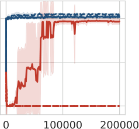

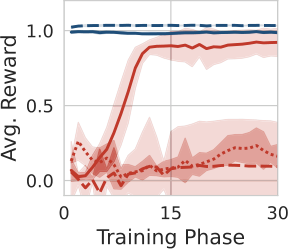

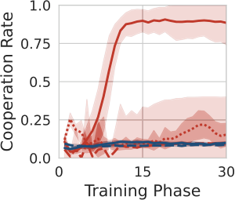

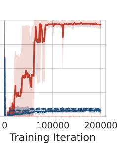

**Step 1) A. Training Progress**

**Step 2) C. Training Progress**

**Step 3) E. Training Progress**

**B. 収束後のエピソード (Phase=30)**

**D. 収束後のエピソード (Phase=30)**

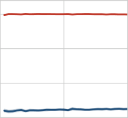

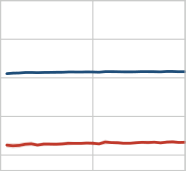

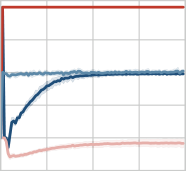

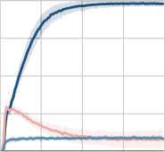

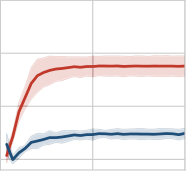

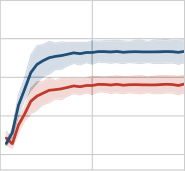

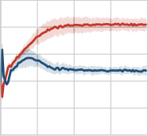

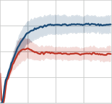

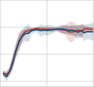

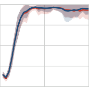

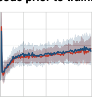

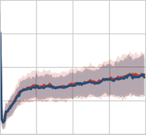

**図2** | **A–B: In-context best response の出現。** ランダムな Tabular 相手に対して訓練された PPI エージェントの、特定の固定戦略に対する評価時のパフォーマンス。エージェントは in-context learning を示し、エピソード内で相手を識別し best response に収束する。**C–D: In-context learners の Extortion の学習。** "Fixed In-Context Learner"（Step 1 で Tabular 方策に対して best-respond するよう事前訓練されたエージェント）に対して訓練されたエージェントが extortion を学習する。RL エージェントは相手の in-context 適応を搾取することで、報酬のより大きなシェアを獲得する。**E–F: 相互 Extortion から協調へ。** Extortion 方策（Step 2 から）で初期化された2つのエージェントが互いに対戦すると、co-player を extort しようとする相互の試みが、in-context learning を通じたエピソード内 (**F**) と in-weight learning を通じたエピソード間 (**E**) の両方で、互いの方策をより協調的な行動へと形成する結果となる。Error bar は10個のランダムシードにわたる標準偏差を示す。

多様な相手がいなければ、エージェントには汎用的な in-context learning メカニズムを発達させるインセンティブがない。両方の ablation において、エージェントは相互裏切りに崩壊する（図1; 破線・点線の曲線参照）。これにより、多様な相手を識別する必要性によって誘導される in-context learning メカニズムが協調的結果を可能にする重要な要因であることが確認される。Ablation の詳細は付録 A.4 を参照されたい。

**3.2.** **メカニズム分析：In-context learning から協調へ**

ここで、協調行動の学習を3つの個別のステップに分解し、多様性から in-context learning、extortability、そして最終的に協調に至る因果連鎖を検証する。

**Step 1: 多様性が in-context best-response メカニズムを誘導する。** まず、Tabular プールに対する訓練が in-context learning を育成することを検証する。Tabular Agent プールのみに対して訓練された PPI エージェントを評価する。図2 **B** は、エピソードの経過にわたる特定の Tabular 方策に対するエージェントのパフォーマンスを示す。エージェントは特定の相手に対する best response に迅速に適応する。これにより、エピソードの高速タイムスケールで目標指向の適応を行う _in-context best-response メカニズム_ の出現が確認される。

**Step 2: In-context learners は extortion に対して脆弱である。** 次に、このような in-context best-response 方策が他の co-player による shaping に影響されやすいことを確立する。Step 1 のエージェントを凍結し、"Fixed In-Context Learner" (Fixed-ICL) と呼び、これに対してのみ新しい PPI エージェントを訓練する。新しいエージェントは Fixed-ICL 方策を _extort_ することを学習する（図2 **C** & **D**）(Press & Dyson, 2012)。Fixed-ICL の適応傾向を搾取することで、新しいエージェントはそれを不公平な協調に追い込み、Fixed-ICL を犠牲にして自身の報酬を最大化する。これにより、エピソード内の目標指向適応が、相手が weight 更新を通じて extortionate 行動を学習するために必要な勾配信号を提供することが確認される。

**Step 3: 相互 extortion が協調を駆動する。** Step 2 で学習された extortion 方策で2つのエージェントを初期化し、互いに対して訓練する。エピソード内で、両方の extortion 方策が互いの in-context learning ダイナミクスをより協調的な行動へと形成する（図2 **F**）。より協調的な方向へのこの push はパラメータ更新により拾い上げられ、両方策を協調行動へとさらに駆動する（図2 **E**）。これは、明示的な learning-aware 手法で観察された "mutual shaping" 効果を反映している (Lu et al., 2022; Meulemans et al., 2025a)。

**Step 4: 混合集団における統合。** 混合プール訓練はこれらのダイナミクスを統合する：Tabular 相手に対する in-context 適応の維持をエージェントに強制し、これが他の learners による相互 extortion に対して脆弱にし、最終的に相互 extortion を通じて Learning Agent を協調へと駆動する (Sec. 3.1; 図1 & 図3)。付録 B.2 の図4は A2C Learning Agent でも同様の結果を示している。

### **4. 結論**

本研究では、明示的な co-player learning-awareness の複雑な機構——meta gradient や厳格なタイムスケール分離など——が一般和ゲームにおける協調行動の学習に必要ではないことを実証した。代わりに、多様な co-player の分布に対してエージェントを単に訓練するだけで in-context best-response 戦略を誘導するのに十分であることを見出した。この in-context learning がエージェントを shaping に対して脆弱にし、結果として相互 extortion ダイナミクスを通じて協調行動へと駆動する。重要なことに、この結果はマルチエージェント強化学習と現代の Foundation Model の訓練パラダイムのギャップを橋渡しする。Foundation Model は本来的に in-context learning を示し、多様なタスクと行動で訓練されるため、本研究の知見は標準的な分散学習技術を用いた協調的社会行動の出現のためのスケーラブルかつ計算効率の良い道筋を示唆している。

### **謝辞**

Guillaume Lajoie、Angelika Steger、および Google Paradigms of Intelligence チームのフィードバックと有益な議論に感謝する。

### **参考文献**

Abbas Abdolmaleki, Jost Tobias Springenberg, Yuval Tassa, Remi Munos, Nicolas Heess, and Martin Riedmiller. Maximum a posteriori policy optimisation. _arXiv preprint arXiv:1806.06920_, 2018.

Milad Aghajohari, Tim Cooijmans, Juan Agustin Duque, Shunichi Akatsuka, and Aaron Courville. Best response shaping. _arXiv preprint arXiv:2404.06519_, 2024a.

Milad Aghajohari, Juan Agustin Duque, Tim Cooijmans, and Aaron Courville. Loqa: Learning with opponent q-learning awareness. _arXiv preprint arXiv:2405.01035_, 2024b.

Blaise Aguera Y Arcas, Benjamin Bratton, and James Evans. The silicon interior, feb 2026. URL [https://antikythera.substack.com/p/the-silicon-interior](https://antikythera.substack.com/p/the-silicon-interior). Accessed: 2026-2-12.

Robert Axelrod and William D. Hamilton. The evolution of cooperation. _Science_, 211(4489):1390–1396, March 1981.

Jan Balaguer, Raphael Koster, Christopher Summerfield, and Andrea Tacchetti. The good shepherd: An oracle agent for mechanism design. _arXiv preprint arXiv:2202.10135_, 2022.

Yoshua Bengio, Samy Bengio, and Jocelyn Cloutier. Learning a synaptic learning rule. Technical report, Université de Montréal, Département d'Informatique et de Recherche opérationnelle, 1990.

James Bradbury, Roy Frostig, Peter Hawkins, Matthew James Johnson, Chris Leary, Dougal Maclaurin, George Necula, Adam Paszke, Jake VanderPlas, Skye Wanderman-Milne, and Qiao Zhang. JAX: composable transformations of Python+NumPy programs, 2018.

Caroline Claus and Craig Boutilier. The dynamics of reinforcement learning in cooperative multiagent systems. _AAAI/IAAI_, 1998(746-752):2, 1998.

Tim Cooijmans, Milad Aghajohari, and Aaron Courville. Meta-value learning: a general framework for learning with learning awareness. _arXiv preprint arXiv:2307.08863_, 2023.

DeepMind, Igor Babuschkin, Kate Baumli, Alison Bell, Surya Bhupatiraju, Jake Bruce, Peter Buchlovsky, David Budden, Trevor Cai, Aidan Clark, Ivo Danihelka, Antoine Dedieu, Claudio Fantacci, Jonathan Godwin, Chris Jones, Ross Hemsley, Tom Hennigan, Matteo Hessel, Shaobo Hou, Steven Kapturowski, Thomas Keck, Iurii Kemaev, Michael King, Markus Kunesch, Lena Martens, Hamza Merzic, Vladimir Mikulik, Tamara Norman, George Papamakarios, John Quan, Roman Ring, Francisco Ruiz, Alvaro Sanchez, Laurent Sartran, Rosalia Schneider, Eren Sezener, Stephen Spencer, Srivatsan Srinivasan, Miloš Stanojević, Wojciech Stokowiec, Luyu Wang, Guangyao Zhou, and Fabio Viola. The DeepMind JAX Ecosystem, 2020. URL [http://github.com/google-deepmind](http://github.com/google-deepmind).

Juan Agustin Duque, Milad Aghajohari, Tim Cooijmans, Razvan Ciuca, Tianyu Zhang, Gauthier Gidel, and Aaron Courville. Advantage alignment algorithms. _arXiv preprint arXiv:2406.14662_, 2024.

Jakob Foerster, Richard Y. Chen, Maruan Al-Shedivat, Shimon Whiteson, Pieter Abbeel, and Igor Mordatch. Learning with opponent-learning awareness. In _International Conference on Autonomous Agents and Multiagent Systems_, 2018.

Charles R. Harris, K. Jarrod Millman, Stéfan J. van der Walt, Ralf Gommers, Pauli Virtanen, David Cournapeau, Eric Wieser, Julian Taylor, Sebastian Berg, Nathaniel J. Smith, Robert Kern, Matti Picus, Stephan Hoyer, Marten H. van Kerkwijk, Matthew Brett, Allan Haldane, Jaime Fernández del Río, Mark Wiebe, Pearu Peterson, Pierre Gérard-Marchant, Kevin Sheppard, Tyler Reddy, Warren Weckesser, Hameer Abbasi, Christoph Gohlke, and Travis E. Oliphant. Array programming with NumPy. _Nature_, 585(7825):357–362, 2020.

Jonathan Heek, Anselm Levskaya, Avital Oliver, Marvin Ritter, Bertrand Rondepierre, Andreas Steiner, and Marc van Zee. Flax: A neural network library and ecosystem for JAX, 2024. URL [http://github.com/google/flax](http://github.com/google/flax).

Pablo Hernandez-Leal, Michael Kaisers, Tim Baarslag, and Enrique Munoz De Cote. A survey of learning in multiagent environments: Dealing with non-stationarity. _arXiv preprint arXiv:1707.09183_, 2017.

Sepp Hochreiter, A. Steven Younger, and Peter R. Conwell. Learning to learn using gradient descent. In _International Conference on Artificial Neural Networks_, Lecture Notes in Computer Science. Springer, 2001.

J. D. Hunter. Matplotlib: A 2D graphics environment. _Computing in Science & Engineering_, 9(3):90–95, 2007.

Sham Kakade and John Langford. Approximately optimal approximate reinforcement learning. In _Proceedings of the nineteenth international conference on machine learning_, pp. 267–274, 2002.

Akbir Khan, Timon Willi, Newton Kwan, Andrea Tacchetti, Chris Lu, Edward Grefenstette, Tim Rocktäschel, and Jakob N. Foerster. Scaling opponent shaping to high dimensional games. In _International Conference on Autonomous Agents and Multiagent Systems_, 2024.

H. W. Kuhn. _Extensive games and the problem of information_. Princeton University Press, 1953.

Ilya Loshchilov and Frank Hutter. Decoupled weight decay regularization. _arXiv preprint arXiv:1711.05101_, 2017.

Christopher Lu, Timon Willi, Christian A Schroeder De Witt, and Jakob Foerster. Model-free opponent shaping. In _International Conference on Machine Learning_, 2022.

Alexander Meulemans, Seijin Kobayashi, Johannes von Oswald, Nino Scherrer, Eric Elmoznino, Blake Richards, Guillaume Lajoie, João Sacramento, et al. Multi-agent cooperation through learning-aware policy gradients. _ICLR_, 2025a.

Alexander Meulemans, Rajai Nasser, Maciej Wołczyk, Marissa A. Weis, Seijin Kobayashi, Blake Richards, Guillaume Lajoie, Angelika Steger, Marcus Hutter, James Manyika, Rif A. Saurous, João Sacramento, and Blaise Agüera y Arcas. Embedded universal predictive intelligence: a coherent framework for multi-agent learning, 2025b.

Volodymyr Mnih, Adria Puigdomenech Badia, Mehdi Mirza, Alex Graves, Timothy Lillicrap, Tim Harley, David Silver, and Koray Kavukcuoglu. Asynchronous methods for deep reinforcement learning. In _International Conference on Machine Learning_, 2016.

Joon Sung Park, Joseph O'Brien, Carrie Jun Cai, Meredith Ringel Morris, Percy Liang, and Michael S. Bernstein. Generative agents: Interactive simulacra of human behavior. In _Proceedings of the 36th Annual ACM Symposium on User Interface Software and Technology_, 2023.

Juan Perdomo, Tijana Zrnic, Celestine Mendler-Dünner, and Moritz Hardt. Performative prediction. In _International Conference on Machine Learning_, pp. 7599–7609. PMLR, 2020.

Dereck Piche, Mohammed Muqeeth, Milad Aghajohari, Juan Duque, Michael Noukhovitch, and Aaron Courville. Learning robust social strategies with large language models. _arXiv preprint arXiv:2511.19405_, 2025.

William H. Press and Freeman J. Dyson. Iterated Prisoner's Dilemma contains strategies that dominate any evolutionary opponent. _Proceedings of the National Academy of Sciences_, 109(26):10409–10413, 2012.

Prajit Ramachandran, Barret Zoph, and Quoc V. Le. Searching for activation functions. _arXiv preprint arXiv:1710.05941_, 2017.

Anatol Rapoport. Prisoner's dilemma—recollections and observations. In _Game Theory as a Theory of a Conflict Resolution_, pp. 17–34. Springer, 1974.

Jürgen Schmidhuber. _Evolutionary principles in self-referential learning, or on learning how to learn: the meta-meta-... hook_. Diploma thesis, Institut für Informatik, Technische Universität München, 1987.

John Schulman, Philipp Moritz, Sergey Levine, Michael Jordan, and Pieter Abbeel. High-dimensional continuous control using generalized advantage estimation. _arXiv preprint arXiv:1506.02438_, 2015.

Marta Emili Garcia Segura, Stephen Hailes, and Mirco Musolesi. Opponent shaping in llm agents. _arXiv preprint arXiv:2510.08255_, 2025.

Yoav Shoham and Kevin Leyton-Brown. _Multiagent systems: Algorithmic, game-theoretic, and logical foundations_. Cambridge University Press, 2008.

Michael L. Waskom. seaborn: statistical data visualization. _Journal of Open Source Software_, 6(60):3021, 2021.

Wes McKinney. Data Structures for Statistical Computing in Python. In Stéfan van der Walt and Jarrod Millman (eds.), _Proceedings of the 9th Python in Science Conference_, pp. 56–61, 2010.

Timon Willi, Alistair Hp Letcher, Johannes Treutlein, and Jakob Foerster. COLA: consistent learning with opponent-learning awareness. In _International Conference on Machine Learning_, 2022.

Zhiheng Xi, Wenxiang Chen, Xin Guo, Wei He, Yiwen Ding, Boyang Hong, Ming Zhang, Junzhe Wang, Senjie Jin, Enyu Zhou, Rui Zheng, Xiaoran Fan, Xiao Wang, Limao Xiong, Yuhao Zhou, Weiran Wang, Changhao Jiang, Yicheng Zou, Xiangyang Liu, Zhangyue Yin, Shihan Dou, Rongxiang Weng, Wensen Cheng, Qi Zhang, Wenjuan Qin, Yongyan Zheng, Xipeng Qiu, Xuanjing Huang, and Tao Gui. The rise and potential of large language model based agents: a survey. _arXiv preprint arXiv:2309.07864_, 2023.

Annie Xie, Dylan Losey, Ryan Tolsma, Chelsea Finn, and Dorsa Sadigh. Learning latent representations to influence multi-agent interaction. In _Conference on Robot Learning_, 2021.

### **A. 手法の追加詳細**

**A.1.** **Partially Observable Stochastic Games**

マルチエージェントの相互作用を Partially Observable Stochastic Game (POSG; Kuhn, 1953) として形式化する。タプル (I, S, A, _𝑃𝑡_, _𝑃𝑟_, _𝑃𝑖_, O, _𝑃𝑜_, _𝛾_, _𝑇_) で定義される。ここで I = {1, ..., _𝑛_} は _𝑛_ エージェントの集合である。各タイムステップ _𝑡_ で環境は状態 _𝑠𝑡_ ∈ S にある。エージェントは共同行動空間 A = × _𝑖_ ∈I A _[𝑖]_ から同時に行動を選択し、_𝑃𝑡_(_𝑆𝑡_+1 | _𝑆𝑡_, _𝐴𝑡_) に従って環境を遷移させる。初期状態は _𝑃𝑖_(_𝑠_0) からサンプルされる。各エージェント _𝑖_ は共同分解分布 _𝑃𝑟_ = × _𝑖_ ∈I _𝑃𝑟_ _[𝑖]_(_𝑟_ _[𝑖]_ | _𝑠_, _𝑎_) から報酬 _𝑟𝑡_ _[𝑖]_ を、観測空間 O = × _𝑖_ ∈I O _[𝑖]_ から分布 _𝑃𝑜_(_𝑜𝑡_ | _𝑠𝑡_, _𝑎𝑡_−1) を通じて観測 _𝑜𝑡_ _[𝑖]_ を受け取る。割引率を _𝛾_、ホライズンを _𝑇_ で表す。上付き文字 _𝑖_ はエージェント _𝑖_ に固有の変数を、−_𝑖_ は残りのエージェントを表す。方策は相互作用履歴 _𝑥_ ≤ _[𝑖]_ _𝑡_ = {(_𝑜_ _[𝑖]_ _𝑘_, _𝑎_ _[𝑖]_ _𝑘_−1, _𝑟_ _𝑘_ _[𝑖]_−1)} _𝑡_ _𝑘_=1 に条件付けられる。エージェント _𝑖_ の方策を _𝜋_ _[𝑖]_(_𝑎𝑡_ _[𝑖]_ | _𝑥_ ≤ _[𝑖]_ _𝑡_; _𝜙_ _[𝑖]_) と表記し、_𝜙_ _[𝑖]_ によりパラメータ化する。

**A.2.** **環境**

**Iterated Prisoners Dilemma (IPD)** 各ラウンドで両エージェントは2つの行動を出力できる：協調 (_𝐶_) と裏切り (_𝐷_)。したがって、環境は5つの可能な観測を出力する：初期観測 _𝑠_0 と、前ラウンドで2プレイヤーが取った行動に基づく4つの観測 (_𝐶_, _𝐶_), (_𝐶_, _𝐷_), (_𝐷_, _𝐶_), (_𝐷_, _𝐷_) である。状態 _𝑠𝑡_ は過去の全観測 _𝑜_ ≤ _𝑡_ からなる。Tabular Agent は最新の観測 _𝑜𝑡_ のみに条件付けられるが、PPI と A2C エージェントは完全な履歴 _𝑥_ ≤ _𝑡_ を活用する。各ゲームは100ラウンドからなる。各エージェントは前ラウンドの状態を一人称視点で観測する（自身の行動が先に列挙される）。各ラウンドで、各エージェントは表1の利得行列に従って報酬を受け取る。

**表1** | 単発 IPD 利得行列

|  | Player 2 C | Player 2 D |
|---|---|---|
| **Player 1 C** | (1, 1) | (-1, 2) |
| **Player 1 D** | (2, -1) | (0, 0) |

**A.3.** **エージェントの実装**

_**A.3.1.**_ _**PPI エージェント**_

Predictive Policy Improvement (PPI) エージェントは、embedded Bayesian agents (Meulemans et al., 2025b) の実用的な近似であり、学習された Sequence Model と計画ベースの Policy Improvement メカニズムを組み合わせる。

**Sequence Model アーキテクチャ。** Sequence Model は128次元の Hidden State を持つ Gated Recurrent Unit (GRU) である。観測、行動、報酬からなる入力は、モダリティ固有の線形層を通じて共有32次元 Embedding 空間に射影される。観測と行動は射影前に One-Hot エンコードされる。これらの Embedding は GRU への入力として機能し、出力に Swish 活性化関数 (Ramachandran et al., 2017) を適用する。別個の線形出力ヘッドが Hidden State をデコードし、各モダリティの将来のトークンを予測する。

**訓練目的。** Sequence Model を30フェーズにわたり反復的に訓練する。各フェーズで、モデルパラメータ _𝜙_ は再初期化され、相互作用履歴のデータセット D = {_𝑥_ _(𝑛)_} _𝑛_=1 _𝑁_ に対して次トークン予測損失を最小化するよう訓練される：

**Algorithm 1** Predictive Policy Improvement

**Require:** 初期 Sequence Model _𝑝𝜙_0、強化学習環境 E、イテレーション数 _𝑁_iter、訓練エポック数 _𝑁_epochs、サンプル数 _𝑁_samples、初期データセット D0
1: **for** _𝑘_ = 1 to _𝑁_iter **do**
2: _𝑝𝜙𝑘_ の重み _𝜙𝑘_ をランダムに初期化
3: **for** _𝑒_ = 1 to _𝑁_epochs **do** ⊲ Step 1: Sequence Model の訓練
4: D_𝑘_−1 を用いて _𝑝𝜙𝑘_ のパラメータを更新し、式2の損失関数 _𝐿_train を最小化
5: **end for**
6: 空のデータセット R_𝑘_ を初期化
7: **for** _𝑟_ = 1 to _𝑁_samples **do** ⊲ Step 2: ゲーム軌道の収集
8: 環境 E をリセット
9: E 内で _𝑝𝜙𝑘_ を用いて行動/観測の系列を生成
10: E から軌道 _𝜏𝑟_ = (_𝑜_0, _𝑟_0, _𝑎_0, _𝑜_1, _𝑟_1, _𝑎_1, ...) を収集
11: _𝜏𝑟_ を R_𝑘_ に追加
12: **end for**
13: 次のイテレーションの訓練のために D_𝑘_ ← D_𝑘_−1 ∪ R_𝑘_ を設定
14: **end for**

_𝐿_train = _𝜆_obs _𝐿_obs + _𝜆_act _𝐿_action + _𝜆_rew _𝐿_reward, (2)

_𝐿_obs = −1/(_𝑁𝑇_) Σ_𝑛_ Σ_𝑡_ log _𝑝𝜙_(_𝑜𝑡_ _(𝑛)_ | _𝑥_ ≤ _(𝑛)_ _𝑡_−1), (3)

_𝐿_reward = −1/(_𝑁𝑇_) Σ_𝑛_ Σ_𝑡_ log _𝑝𝜙_(_𝑟𝑡_ _(𝑛)_ | _𝑥_ ≤ _(𝑛)_ _𝑡_−1, _𝑜𝑡_ _(𝑛)_), (4)

_𝐿_action = −1/(_𝑁𝑇_) Σ_𝑛_ Σ_𝑡_ log _𝑝𝜙_(_𝑎𝑡_ _(𝑛)_ | _𝑥_ ≤ _(𝑛)_ _𝑡_−1, _𝑜𝑡_ _(𝑛)_, _𝑟𝑡_ _(𝑛)_). (5)

D は全ての過去および現在のフェーズからの相互作用履歴で構成される。これは Performative Prediction (Perdomo et al., 2020) における一般的な戦略であり、予測モデルのより安定した訓練を確保する。

_𝑝𝜙_(_𝑎𝑡_ | _𝑥_ ≤ _𝑡_) と _𝑝𝜙_(_𝑜𝑡_ | _𝑥_<_𝑡_, _𝑎𝑡_−1) をカテゴリカル分布でモデル化し、標準的なカテゴリカル Cross-Entropy 損失を得る。_𝑝𝜙_(_𝑟𝑡_ | _𝑥_<_𝑡_, _𝑎𝑡_−1, _𝑜𝑡_) は固定分散の正規分布でモデル化し、平均二乗誤差損失 (_𝑟_ − _𝑟̂_)² を得る。各フェーズで20,000軌道をサンプルし、前フェーズのサンプルと連結して Sequence Model の共同訓練に使用する。最適化は AdamW (Loshchilov & Hutter, 2017)（学習率 10⁻⁴、Weight Decay 10⁻²、_𝛽_1 = 0.9、_𝛽_2 = 0.98）で、バッチサイズ256、10エポック実施する。勾配はノルム1.0でクリップする。

**事前訓練。** Sequence Model は、2つのランダムな Tabular Agent が100ラウンドの IPD を対戦する200,000サンプル軌道の初期データセット D0 で事前訓練され、上記と同じ訓練ハイパーパラメータを使用する。

**推論。** 展開時、エージェントは学習された Sequence Model をシミュレータとして使用し、15ラウンド先の Monte Carlo Rollout を実行して Q 値を推定する。最終的な行動選択はモデルの事前確率 _𝑝_(_𝑎_ | _𝑥_ ≤ _𝑡_; _𝜙_) を Rollout から導出された推定値 _𝑄̂_ _𝑝_(_𝑥_ ≤ _𝑡_, _𝑎_) で重み付けする方策 _𝜋_(_𝑎_ | _𝑥_ ≤ _𝑡_) に従う：

_𝜋_(_𝑎_ | _𝑥_ ≤ _𝑡_) = (1/_𝑍_) _𝑝_(_𝑎_ | _𝑥_ ≤ _𝑡_; _𝜙_) exp(_𝛽𝑄̂_ _𝑝_(_𝑥_ ≤ _𝑡_, _𝑎_)). (6)

全実験で _𝛽_ = 0.01 を使用する。

_**A.3.2.**_ _**Model-Free エージェント**_

**アーキテクチャ。** PPI エージェントと同じ構成の GRU ベース Sequence Model を使用した Advantage Actor-Critic (A2C) エージェント (Mnih et al., 2016) を実装する。GRU は前ラウンドの観測履歴を入力とし、次の行動を出力する。GRU には価値関数 _𝑉_(_𝑥_) を推定するための線形出力ヘッドも付加される。訓練中、ブートストラップ Temporal-Difference 誤差を用いて Advantage _𝐴_(_𝑥_ ≤ _𝑡_, _𝑎𝑡_) を推定する：

_𝐴_(_𝑥_ ≤ _𝑡_, _𝑎𝑡_) = _𝑟𝑡_ + _𝛾𝑉_(_𝑥_ ≤ _𝑡_+1) − _𝑉_(_𝑥_ ≤ _𝑡_).

モデルパラメータは Policy Gradient と Value Estimation Loss の結合損失を最小化するよう更新される：

_𝐿_ = Σ_𝑡_ [−log _𝜋_(_𝑎𝑡_ | _𝑥_ ≤ _𝑡_) _𝐴_(_𝑥_ ≤ _𝑡_, _𝑎𝑡_) + _𝑐𝑣_(_𝑟𝑡_ + _𝛾𝑉_(_𝑥_ ≤ _𝑡_+1) − _𝑉_(_𝑥_ ≤ _𝑡_))² + _𝑐𝑒_ Σ_𝑖_ _𝜋_(_𝑎𝑡_ _[𝑖]_ | _𝑥_ ≤ _𝑡_) log _𝜋_(_𝑎𝑡_ _[𝑖]_ | _𝑥_ ≤ _𝑡_)]

ここで _𝑐𝑣_, _𝑐𝑒_ はそれぞれ価値関数とエントロピーの訓練係数を表すハイパーパラメータである。

**訓練。** 比較可能な結果を得るため、Meulemans et al. (2025a) の A2C 訓練プロトコルに従い、価値関数推定、Generalized Advantage Estimation (Schulman et al., 2015)、Advantage Normalization、Reward Scaling を含む。詳細は Meulemans et al. (2025a) の付録Aを参照されたい。

各実験で、学習率、GAE Lambda、Advantage Normalization、Reward Scaling、Entropy Regularization についてハイパーパラメータ探索を実施する。最高性能の設定に対応するハイパーパラメータを表2に報告する。

_**A.3.3.**_ _**Tabular エージェント**_

Tabular Agent は Memory-1 方策を使用し、5つのパラメータで定義される：前回の結果に条件付けられた協調確率 (_𝑐𝑐_, _𝑐𝑑_, _𝑑𝑐_, _𝑑𝑑_) と初期状態 (_𝑠_0)。各パラメータは一様分布 U(0, 1) から初期化される。

**A.4.** **Ablation**

_**A.4.1.**_ _**Policy Conditioning**_

"Opponent ID" Ablation（図1）では、観測系列 **x** ≤ _𝑡_ の前に相手のアイデンティティを表す条件付けベクトル **z** を付加する。Tabular Agent の場合、**z** は全可能な観測 _𝑜_ ∈ O にわたる対数確率のフラット化ベクトルとして定義される：

**z** = [log _𝜋_(_𝑎_ | _𝑜_)] _𝑜_ ∈ O, _𝑎_ ∈ A

ここで O = {(_𝐶_, _𝐶_), (_𝐶_, _𝐷_), (_𝐷_, _𝐶_), (_𝐷_, _𝐷_), Start}。A2C および PPI エージェントの場合、**z** = **0**。

**表2** | A2C ハイパーパラメータ

| RL Hyperparameter | Step 1 | Step 2 | Step 3 | Step 4 |
|---|---|---|---|---|
| `advantages_normalization` | True | False | True | True |
| `batch_size` | 2048 | 2048 | 4096 | 4096 |
| `reward_rescaling` | 0.2 | 0.05 | 0.02 | 0.02 |
| `value_discount` (_𝛾_) | 0.99 | 0.99 | 0.99 | 0.99 |
| `td_lambda` (_𝜆_td) | 0.99 | 1.0 | 0.95 | 1.0 |
| `gae_lambda` (_𝜆_gae) | 0.99 | 1.0 | 0.95 | 1.0 |
| `value_coefficient` | 0.5 | 0.5 | 0.5 | 0.5 |
| `entropy_reg` | 0.001 | 0.001 | 0.001 | 0.01 |
| `optimizer` | Adam | Adam | Adam | Adam |
| `adam_epsilon` | 0.00001 | 0.00001 | 0.00001 | 0.00001 |
| `learning_rate` | 0.005 | 0.005 | 0.0005 | 0.001 |
| `max_grad_norm` | 1.0 | 1.0 | 1.0 | 1.0 |

_**A.4.2.**_ _**Mixed pool training なし**_

"No Tabular Opponents" Ablation（図1）では、PPI と A2C の両実験で Mixed Agent Pool から Tabular 相手を除去する。PPI では、さらに事前訓練データ分布 _𝐷_0 を Tabular Agent を含まず、純粋なランダム行動系列とその対応する報酬で構成するよう変更する。

### **B. 追加結果**

**B.1.** **Mixed pool training のエピソード内軌道**

図3は、混合プール設定（Sec. 3.1 参照）における初期訓練時の単一エピソード内での PPI と A2C のパフォーマンスを示す（PPI は Phase = 8、A2C は訓練イテレーション = 70k）。In-context 相手推論の出現と、他の Learning Agent に対する協調への初期勾配を示している。

**B.2.** **A2C に関する追加結果**

図4は、本文の図2で提示した PPI の結果に対応する A2C ベースの結果を示す。Step 1 では、PPI と同様に A2C エージェントが多様な Tabular Agent に対する best response を実装することを学習することが観察される。しかし Step 2 では、新しく訓練された A2C エージェントが PPI エージェントよりも Fixed-ICL ベースラインに対して高い報酬を獲得することが観察される（それぞれ ∼1.25 vs. ∼0.9）。これは (i) PPI の Fixed-ICL 方策が搾取されにくい、または (ii) A2C がより良い搾取者方策を見つけた、のいずれかに起因しうる。図4Dにおける搾取ダイナミクスの不規則な形状は、A2C 搾取者エージェントが A2C Fixed-ICL 方策に対して複雑な敵対的戦略を学習したことを示唆している。対照的に、図2Dの PPI extortion 方策はより規則的な extortion 方策であるように見える。最後に Step 3 では、A2C エージェントは初期的に協調に向かうが、訓練の不安定性により、シードによっては裏切りに戻る可能性がある。

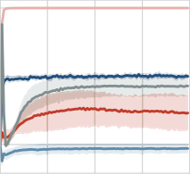

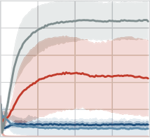

**図3** | **混合訓練における Best-Response の出現。** 図1で訓練されたモデルの収束前のエピソード内パフォーマンスを示す。PPI と A2C の両方がエピソードの開始時に counterpart を extort しようとし、その後協調レベルが増加することが観察される。同時に、non-tit-for-tat 的な Tabular 方策として相手を識別することは、高い裏切り率につながる。Error bar は10個のランダムシードにわたる標準偏差を示す。

**Step 1)**

**図4** | **A-B: In-context best response の出現。** ランダムな Tabular 相手に対して訓練され、収束後に特定の静的方策セットで評価された A2C のパフォーマンス。最終エージェントを "Fixed In-Context Learner" と呼ぶ。**C-D: In-context learners の Extortion の学習。** ランダムに初期化された A2C エージェントの Fixed In-Context Learner に対するパフォーマンス。**E-F: 相互 Extortion から協調へ。** 2つの A2C extortion エージェントは互いに対戦すると初期的に協調に収束するが、ランダムシードによっては時間とともに相互裏切りに崩壊する可能性がある。Error bar は5つのランダム初期化にわたる標準偏差に対応する。

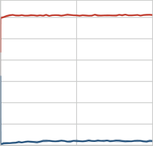

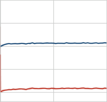

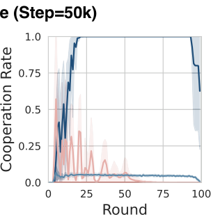

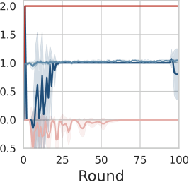

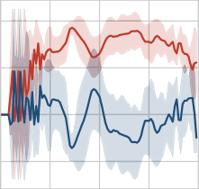

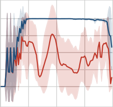

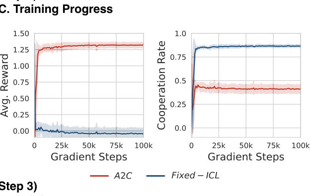

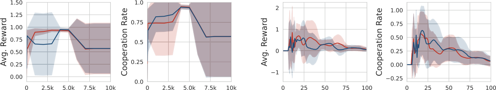

### **C. Predictive Policy Improvement (PPI) の導出**

本セクションでは、Predictive Policy Improvement (PPI) アルゴリズムの形式的な導出を提供する。PPI は理論的に基礎のある MUPI フレームワーク (Meulemans et al., 2025b) に触発され、Maximum a Posteriori Policy Optimization (MPO; Abdolmaleki et al., 2018) と密接に関連している。PPI は標準的な MPO の個別の価値関数と Self-Model を、行動、観測、報酬を予測するよう Self-Supervised に訓練された単一の Sequence Model に置き換える点で異なる。このモデルは World Model と Policy Prior の両方として同時に機能し、Sequence Model の生成能力を値推定と方策表現に活用する。

**C.1.** **目的関数：変分下界**

エージェントが期待リターン _𝑉_(_𝜋_) = 𝔼_𝜏_∼ℙ_𝜋_ [Σ_𝑡_=0^_𝑇_ _𝛾_^_𝑡_ _𝑟𝑡_] を最大化するよう方策 _𝜋_ を最適化する問題を考える。表記の簡潔さのため、エージェント固有の上付き文字を省略する（この導出は単一エージェント設定にも等しく適用される）。相互作用履歴 _𝑥_ ≤ _𝑡_ 上の行動事前分布または Self-Model として機能するパラメータ付き Sequence Model _𝑝𝜙_(_𝑎_ | _𝑥_ ≤ _𝑡_) を導入する。行動方策 _𝜋_ と事前分布 _𝑝𝜙_ 間の KL Divergence にペナルティを課すことで代理目的関数 _𝐽_ を定義する：

_𝐽_(_𝜋_, _𝜙_) = 𝔼_𝜏_∼ℙ_𝜋_ [Σ_𝑡_=0^_𝑇_ _𝛾_^_𝑡_ _𝑟𝑡_ − _𝛼_ KL(_𝜋_(· | _𝑥_ ≤ _𝑡_) || _𝑝𝜙_(· | _𝑥_ ≤ _𝑡_))]. (7)

KL(·||·) ≥ 0 であるため、_𝐽_(_𝜋_, _𝜙_) は _𝑉_(_𝜋_) の厳密な下界であり、_𝜋_ = _𝑝𝜙_ で等号が成り立つ。この下界を _𝜋_（非パラメトリック方策）と _𝜙_（パラメトリック Sequence Model）に関する座標上昇法で最適化する。

**C.2.** **Step 1: _𝜋_ に関する非パラメトリック Policy Improvement**

固定 _𝜙_ に対して _𝐽_(_𝜋_, _𝜙_) を _𝜋_ について最適化することは完全な最適制御問題であり、一般に解析解を持たないため、直接的な非パラメトリック Policy Improvement には適さない。代わりに、_𝜋_ = _𝑝𝜙𝑘_ 周りの _𝐽_(_𝜋_, _𝜙𝑘_) の一次近似を使用する。ここで _𝑝𝜙𝑘_ は前回の方策 _𝜋𝑘_−1 の展開により収集されたデータセットで訓練された Self-Model である：

_𝐽̄_(_𝜋_, _𝜙𝑘_) = Σ_𝑡_=1^_𝑇_ 𝔼_𝑥_ ≤ _𝑡_∼ℙ_𝑝𝜙𝑘_ [𝔼_𝑎_∼_𝜋_(·|_𝑥_ ≤ _𝑡_) [_𝑄_^_𝑝𝜙𝑘_(_𝑥_ ≤ _𝑡_, _𝑎_)] − _𝛼_ KL(_𝜋_(· | _𝑥_ ≤ _𝑡_) || _𝑝𝜙𝑘_(· | _𝑥_ ≤ _𝑡_)) − _𝑉_^_𝑝𝜙𝑘_(_𝑥_ ≤ _𝑡_)] + _𝐽_(_𝑝𝜙𝑘_, _𝜙𝑘_). (8)

ここで Q 値は非正則化された値 _𝑄_^_𝑝𝜙𝑘_(_𝑥_ ≤ _𝑡_, _𝑎_) = 𝔼_𝜏_>_𝑡_∼ℙ_𝑝𝜙𝑘_(·|_𝑥_ ≤ _𝑡_,_𝑎_) [Σ_𝑡'_=_𝑡_^_𝑇_ _𝛾_^(_𝑡'_−_𝑡_) _𝑟𝑡'_] に等しい。これは全ての KL 項が事前分布の下でゼロに評価されるためである。_𝐽_ と _𝐽̄_ の決定的な違いは、_𝐽̄_ における履歴に関する期待値が最適化される方策 _𝜋_ に依存しないことであり、arg max_𝜋_ _𝐽̄_ の閉形式解を許容する。

_𝐽̄_ が確かに _𝑝𝜙𝑘_ 周りの _𝐽_ の一次近似であることを、以下の2つの補題を通じて示す。

**補題 C.1.** _𝐽̄_(_𝑝𝜙𝑘_, _𝜙𝑘_) = _𝐽_(_𝑝𝜙𝑘_, _𝜙𝑘_)

_証明._ _𝜋_ = _𝑝𝜙𝑘_ のとき、式8の期待値内の項が相殺されることは容易に確認でき、_𝐽_(_𝑝𝜙𝑘_, _𝜙𝑘_) のみが残る。

**補題 C.2.** ∇_𝜋_ _𝐽̄_(_𝜋_, _𝜙𝑘_)|_𝜋_=_𝑝𝜙𝑘_ = ∇_𝜋_ _𝐽_(_𝜋_, _𝜙𝑘_)|_𝜋_=_𝑝𝜙𝑘_

_証明._ 方策分布 _𝜋_(_𝑎_ | _𝑥_ ≤ _𝑡_) に関する両目的関数の汎関数微分を、特定の履歴 _𝑥_ ≤ _𝑡_ と行動 _𝑎_ で評価して分析する。

まず代理目的関数 _𝐽̄_(_𝜋_, _𝜙𝑘_) を考える。履歴に関する期待値は事前分布 ℙ_𝑝𝜙𝑘_ に固定されており、最適化変数 _𝜋_ に依存しないため、汎関数微分は直接的である。対数項に積の法則を適用すると、局所的な行動確率 _𝜋_(_𝑎_ | _𝑥_ ≤ _𝑡_) に関する汎関数微分は：

_𝛿𝐽̄_(_𝜋_, _𝜙𝑘_) / _𝛿𝜋_(_𝑎_ | _𝑥_ ≤ _𝑡_) = ℙ_𝑝𝜙𝑘_(_𝑥_ ≤ _𝑡_) [_𝑄_^_𝑝𝜙𝑘_(_𝑥_ ≤ _𝑡_, _𝑎_) − _𝛼_ log(_𝜋_(_𝑎_ | _𝑥_ ≤ _𝑡_) / _𝑝𝜙𝑘_(_𝑎_ | _𝑥_ ≤ _𝑡_)) − _𝛼_]. (9)

この微分を事前分布 _𝜋_ = _𝑝𝜙𝑘_ で評価すると、対数項は消失し（log 1 = 0 であるため）：

_𝛿𝐽̄_(_𝜋_, _𝜙𝑘_) / _𝛿𝜋_(_𝑎_ | _𝑥_ ≤ _𝑡_)|_𝜋_=_𝑝𝜙𝑘_ = ℙ_𝑝𝜙𝑘_(_𝑥_ ≤ _𝑡_)(_𝑄_^_𝑝𝜙𝑘_(_𝑥_ ≤ _𝑡_, _𝑎_) − _𝛼_). (10)

次に、真の目的関数 _𝐽_(_𝜋_, _𝜙𝑘_) の微分はより複雑である。_𝜋_ が履歴訪問分布 ℙ_𝜋_(_𝑥_ ≤ _𝑡_) を決定するためである。正則化 Q 関数 _𝑄_^_𝜋__reg_(_𝑥_ ≤ _𝑡_, _𝑎_) を定義する。これは時刻 _𝑡_ の即時ペナルティを除く全ての_将来の_ KL ペナルティを含む期待リターンを捉える：

_𝑄_^_𝜋__reg_(_𝑥_ ≤ _𝑡_, _𝑎_) = 𝔼_𝜏_>_𝑡_∼ℙ_𝜋_(·|_𝑥_ ≤ _𝑡_,_𝑎_) [Σ_𝑘_=_𝑡_^_𝑇_ _𝛾_^(_𝑘_−_𝑡_) _𝑅𝑘_ − _𝛼_ Σ_𝑘_=_𝑡_+1^_𝑇_ _𝛾_^(_𝑘_−_𝑡_) KL(_𝜋_(· | _𝑥_ ≤ _𝑘_) || _𝑝𝜙𝑘_(· | _𝑥_ ≤ _𝑘_))]. (11)

これを用いて、特定の履歴の価値は：

_𝑉_^_𝜋__reg_(_𝑥_ ≤ _𝑡_) = Σ_𝑎'_ _𝜋_(_𝑎'_ | _𝑥_ ≤ _𝑡_) [_𝑄_^_𝜋__reg_(_𝑥_ ≤ _𝑡_, _𝑎'_) − _𝛼_ log(_𝜋_(_𝑎'_ | _𝑥_ ≤ _𝑡_) / _𝑝𝜙𝑘_(_𝑎'_ | _𝑥_ ≤ _𝑡_))]. (12)

グローバル目的関数 _𝐽_ の局所方策 _𝜋_(_𝑎_ | _𝑥_ ≤ _𝑡_) に関する汎関数微分を求めるため、Performance Difference Lemma の連続拡張 (Kakade & Langford, 2002) を適用する。この定理は、方策が訪問分布 ℙ_𝜋_(_𝑥_ ≤ _𝑡_) に与える間接的効果が勾配に対してゼロの正味寄与をもたらすことを確立する。したがって、微分は状態訪問確率と価値関数の局所的微分の積に分離される：

_𝛿𝐽_(_𝜋_, _𝜙𝑘_) / _𝛿𝜋_(_𝑎_ | _𝑥_ ≤ _𝑡_) = ℙ_𝜋_(_𝑥_ ≤ _𝑡_) _𝜕𝑉_^_𝜋_(_𝑥_ ≤ _𝑡_) / _𝜕𝜋_(_𝑎_ | _𝑥_ ≤ _𝑡_). (13)

_𝑉_^_𝜋_(_𝑥_ ≤ _𝑡_) の偏微分を取ると：

_𝛿𝐽_(_𝜋_, _𝜙𝑘_) / _𝛿𝜋_(_𝑎_ | _𝑥_ ≤ _𝑡_) = ℙ_𝜋_(_𝑥_ ≤ _𝑡_) [_𝑄_^_𝜋__reg_(_𝑥_ ≤ _𝑡_, _𝑎_) − _𝛼_ log(_𝜋_(_𝑎_ | _𝑥_ ≤ _𝑡_) / _𝑝𝜙𝑘_(_𝑎_ | _𝑥_ ≤ _𝑡_)) − _𝛼_]. (14)

最後に、この真の微分を事前方策 _𝜋_ = _𝑝𝜙𝑘_ で評価する。3つの簡略化が生じる：

- 履歴訪問分布が事前分布に一致する：ℙ_𝜋_(_𝑥_ ≤ _𝑡_) = ℙ_𝑝𝜙𝑘_(_𝑥_ ≤ _𝑡_)
- 即時 KL ペナルティがゼロに評価される：log 1 = 0
- 方策が全ての将来のタイムステップで事前分布に完全に一致するため、全ての将来の KL ペナルティがゼロに評価される。したがって、正則化 Q 関数は事前分布の非正則化 Q 関数に滑らかに縮退する：_𝑄_^_𝜋__reg_(_𝑥_ ≤ _𝑡_, _𝑎_) = _𝑄_^_𝑝𝜙𝑘_(_𝑥_ ≤ _𝑡_, _𝑎_)

これらの簡略化を適用すると：

_𝛿𝐽_(_𝜋_, _𝜙𝑘_) / _𝛿𝜋_(_𝑎_ | _𝑥_ ≤ _𝑡_)|_𝜋_=_𝑝𝜙𝑘_ = ℙ_𝑝𝜙𝑘_(_𝑥_ ≤ _𝑡_)(_𝑄_^_𝑝𝜙𝑘_(_𝑥_ ≤ _𝑡_, _𝑎_) − _𝛼_). (15)

_𝐽_ と _𝐽̄_ の両方の _𝜋_ = _𝑝𝜙𝑘_ で評価された汎関数微分が完全に一致するため、∇_𝜋_ _𝐽̄_(_𝜋_, _𝜙𝑘_)|_𝜋_=_𝑝𝜙𝑘_ = ∇_𝜋_ _𝐽_(_𝜋_, _𝜙𝑘_)|_𝜋_=_𝑝𝜙𝑘_ が成り立ち、証明が完了する。

**_𝐽̄_ の最適化。** 固定 _𝜙𝑘_ に対して _𝐽̄_(_𝜋_, _𝜙𝑘_) を _𝜋_ について最適化すると、よく知られた Boltzmann 方策が解として得られる：

_𝜋_*(_𝑎_ | _𝑥_ ≤ _𝑡_) = _𝑝𝜙𝑘_(_𝑎_ | _𝑥_ ≤ _𝑡_) exp(_𝛽𝑄_^_𝑝𝜙𝑘_(_𝑥_ ≤ _𝑡_, _𝑎_)) / _𝑍_(_𝑥_ ≤ _𝑡_), (16)

逆温度 _𝛽_ = 1/_𝛼_ である。_𝛽_ を _𝑝𝜙𝑘_ 周りの _𝐽̄_ が _𝐽_ の十分に正確な近似となる Trust Region を定義する固定ハイパーパラメータとして扱う。

**C.3.** **MPO および Sequence-Model 値推定との比較**

PPI は MPO の座標上昇構造を共有するが、Q 値の取得方法と、軌道収集のための行動方策として _𝜋_ と _𝑝𝜙𝑘_ のどちらを展開するかが異なる。標準的な MPO では、_𝑄_(_𝑠_, _𝑎_) は通常、エージェント自身の経験に対する Temporal Difference (TD) 学習により訓練される個別のニューラルネットワーク（Critic）で表現され、完全な履歴ではなく単一の状態 _𝑠_ に条件付けるためにマルコフ性に依存する。

対照的に、PPI は Sequence Model を World Model として活用する。値 _𝑄̂_ _𝑝_(_𝑥_ ≤ _𝑡_, _𝑎_) は Sequence Model 自体の内部で実行される Monte Carlo Rollout により推定される。_𝑝𝜙_(· | _𝑥_ ≤ _𝑡_, _𝑎_) から将来の軌道 _𝜏_>_𝑡_ をサンプリングすることで、エージェントは環境ダイナミクスと co-player の予測応答の両方に関する内部表現に基づいて行動の期待リターンを評価する。これにより PPI は Sequence Model により捕捉される高容量の時間的依存性の恩恵を受けることができる。PPI は MC Rollout のコストを償却し分散を低減するために、完全な履歴に条件付けられた明示的な Q 値関数の学習に容易に拡張可能であることに注意されたい。

### **D. PPI エージェントの均衡行動の理論的分析**

本セクションでは、Predictive Policy Improvement (PPI) アルゴリズムの理論的性質を分析する。エージェントが固定（または定常的に適応する）環境に対して方策を最適化する標準的な強化学習とは異なり、PPI エージェントは _performative_ ループで動作する：エージェントの予測モデルがその方策を決定し、方策がデータ分布を決定し、データ分布が予測モデルの更新に使用される。これは「Performative Prediction」(Perdomo et al., 2020) の概念と密接に関連しており、モデルの予測がそのモデルが予測しようとしているまさにそのデータの分布に影響を与えうる（交通予測モデルが顕著な例である）。

この相互作用を形式化し、_Predictive Equilibrium_ (PE) の概念を定義する。Deep Neural Network の非凸性のためにグローバルな純粋戦略均衡の存在は保証されないが、標準的な仮定の下で _局所的_ な Predictive Equilibrium（勾配ベースの最適化と整合的）および _混合_ Predictive Equilibrium（ランダム化された戦略）の存在が保証されることを示す。最後に、完全な World Model の極限で、Predictive Equilibrium が Subjective Embedded Equilibrium (Meulemans et al., 2025b) に対応することを示す。

**D.1.** **形式的設定**

_𝑛_ エージェントのゲームを考える。各エージェント _𝑖_ は _𝜃𝑖_ ∈ Θ_𝑖_ でパラメータ化された予測的 Sequence Model _𝑝𝜃𝑖_(_ℎ_ _[𝑖]_) を維持する。ここで _ℎ_ _[𝑖]_ は任意の長さ _𝑡_ の履歴 _𝑥_ ≤ _[𝑖]_ _𝑡_ であり、Θ_𝑖_ はコンパクト距離空間（例：ℝ^_𝑑_ の有界部分集合）である。

**Performative ループ。** PPI アルゴリズム（Algorithm 1）はパラメータとデータの間に閉ループ依存性を誘導する：

1. **モデルが方策を誘導する：** エージェントは式6で定義された Policy Improvement 演算子（Q 値に対する Boltzmann 方策）を通じてモデル _𝑝𝜃𝑖_ から方策 _𝜋𝜃𝑖_ を導出する。
2. **方策がデータを誘導する：** 全エージェントが方策 **𝝅𝜽** = {_𝜋𝜃_1, ..., _𝜋𝜃_N} を用いて相互作用すると、相互作用履歴 _ℎ_ 上の共同分布が誘導される。現在の共同設定 **𝜽** により生成される履歴の真の確率分布を ℙ(·; **𝜽**) と表記する。
3. **データがモデルを誘導する：** エージェントは観測された分布 ℙ(·; **𝜽**) とそのモデル _𝑝𝜃𝑖_ 間の KL Divergence を最小化するよう _𝜃𝑖_ を更新する。

**D.2.** **Predictive Equilibria**

この訓練ループの安定点は、モデルがまさにそのモデルから導出された方策により生成されたデータを最適に予測するような設定である。

**定義 D.1** (Global Predictive Equilibrium). 共同設定 **𝜽*** = (_𝜃_1*, ..., _𝜃_n*) は、全エージェント _𝑖_ について以下が成り立つとき Global Predictive Equilibrium である：

_𝜃𝑖_* ∈ arg min_𝜃𝑖_ ∈ Θ_𝑖_ KL(ℙ(_ℎ𝑖_; **𝜽***) || _𝑝𝜃𝑖_(_ℎ𝑖_)). (17)

直感的には、均衡においてどのエージェントも現在の共同モデルにより誘導される行動を前提として自身の World Model を改善できない。

**課題。** グローバル PE の存在を証明することは困難である。写像 _𝜃_ ↦ _𝜋𝜃_ が複雑であり、結果として得られる目的関数が一般に非凸であるためである。"argmin" 集合が不連続に変化しうる（Mode Hopping）ため、標準的な不動点定理の適用が妨げられる。これに対処するため、2つの緩和された解概念を定義する：_局所_ PE（勾配降下法に関連）と _混合_ PE。

_**D.2.1.**_ _**Local Predictive Equilibrium**_

実際には、PPI エージェントは勾配降下法によりパラメータを更新する。グローバル最小値ではなく停留点を見つける。重要なのは、更新がデータ分布を固定していると仮定すること（環境ダイナミクスに対する "stop-gradient" と解釈できる）である。

**定義 D.2** (Local Predictive Equilibrium). Θ_𝑖_ ⊂ ℝ^_𝑑𝑖_ を各エージェント _𝑖_ ∈ I のコンパクト凸パラメータ空間とする。共同設定 **𝜽*** = (_𝜃_1*, ..., _𝜃_n*) ∈ ×_𝑖_ ∈I Θ_𝑖_ は、データ生成過程を固定とした上で、全エージェント _𝑖_ ∈ I について局所損失に関する一次停留条件を満たすとき Local Predictive Equilibrium である。形式的には：

⟨∇_𝜃𝑖_ KL(ℙ(_ℎ𝑖_; **𝜽***) || _𝑝𝜃𝑖_(_ℎ𝑖_))|_𝜃𝑖_=_𝜃𝑖_*, _𝜙𝑖_ − _𝜃𝑖_*⟩ ≥ 0, ∀_𝜙𝑖_ ∈ Θ_𝑖_, ∀_𝑖_ ∈ I, (18)

ここで ⟨·, ·⟩ は標準内積を表す。

この変分不等式の定義は、PPI アルゴリズムにおける射影勾配降下法の収束基準に正確に対応する。_𝜃𝑖_* が Θ_𝑖_ の内部にある場合、式18は標準的な条件 ∇_𝜃𝑖_ KL(ℙ(_ℎ𝑖_; **𝜽***) || _𝑝𝜃𝑖_(_ℎ𝑖_))|_𝜃𝑖_=_𝜃𝑖_* = 0 を含意する (19)。

**定理 D.3** (Local Predictive Equilibrium の存在). _Θ_𝑖_ がℝ^_𝑑𝑖_ のコンパクト凸部分集合であると仮定する。パラメータ **𝜽** から損失の局所勾配 _𝐺𝑖_(**𝜽**) = ∇_𝜗_ KL(ℙ(·; **𝜽**) || _𝑝𝜗_)|_𝜗_=_𝜃𝑖_ への写像が連続であると仮定する。このとき、少なくとも1つの Local Predictive Equilibrium が存在する。_

_証明._ Local Predictive Equilibrium の存在を不動点問題として定式化して分析する。L_𝑖_(**𝜽**, _𝜓_) = KL(ℙ(_ℎ𝑖_; **𝜽**) || _𝑝𝜓_(_ℎ𝑖_)) をエージェント _𝑖_ の損失関数とする。ここで第一引数 **𝜽** はデータ分布を決定し（局所的に固定）、第二引数 _𝜓_ は最適化されるパラメータである。_局所勾配場 𝐺_: Θ → ℝ^_𝐷_（ここで _𝐷_ = Σ_𝑖_ ∈I _𝑑𝑖_）を個別勾配の連結として定義する：

_𝐺_(**𝜽**) = (∇_𝜓_ L1(**𝜽**, _𝜓_)|_𝜓_=_𝜃_1, ..., ∇_𝜓_ Ln(**𝜽**, _𝜓_)|_𝜓_=_𝜃_n).

Local Predictive Equilibrium は変分不等式 ⟨_𝐺_(**𝜽***), _𝜙_ − **𝜽***⟩ ≥ 0（全 _𝜙_ ∈ Θ に対して）で特徴付けられる。ここで Θ = ×_𝑖_ ∈I Θ_𝑖_。

パラメータ空間 Θ はユークリッド空間のコンパクト凸部分集合であり、勾配場 _𝐺_(**𝜽**) は連続であると仮定する。_𝐺_ の連続性は予測モデル _𝑝𝜃_ と誘導される方策分布に関する滑らかさの仮定から自然に導かれる。

射影勾配ステップにより定義される写像 _𝑇_: Θ → Θ を考える：

_𝑇_(**𝜽**) = ProjΘ(**𝜽** − _𝜂𝐺_(**𝜽**)),

ここで _𝜂_ > 0 はスカラーステップサイズであり、ProjΘ は集合 Θ へのユークリッド射影である。

1. **コンパクト性と凸性：** 仮定により Θ はコンパクト凸集合である。
2. **連続性：** 写像 _𝐺_ は仮定により連続。射影演算子 ProjΘ は非拡大的であり、したがって連続。よって合成 _𝑇_ は Θ から自身への連続写像である。

Brouwer の不動点定理により、_𝑇_(**𝜽***) = **𝜽*** を満たす点 **𝜽*** ∈ Θ が存在する。この不動点条件は **𝜽*** = ProjΘ(**𝜽*** − _𝜂𝐺_(**𝜽***)) を含意する。

閉凸集合へのユークリッド射影の標準的性質により、この等式は ⟨(**𝜽*** − _𝜂𝐺_(**𝜽***)) − **𝜽***, _𝜙_ − **𝜽***⟩ ≤ 0（全 _𝜙_ ∈ Θ）が成り立つ場合かつその場合に限り成立する。

内積内の項を整理すると：

⟨−_𝜂𝐺_(**𝜽***), _𝜙_ − **𝜽***⟩ ≤ 0 ⟹ ⟨_𝐺_(**𝜽***), _𝜙_ − **𝜽***⟩ ≥ 0, ∀_𝜙_ ∈ Θ.

この不等式はまさに式18で定義された一次停留条件を共同パラメータ空間 Θ に一般化したものである。したがって不動点 **𝜽*** は Local Predictive Equilibrium を構成し、内部停留点と境界解の両方を厳密に収容する。

_**D.2.2.**_ _**Mixed Predictive Equilibrium**_

局所近似に依存せずに均衡の存在を保証するため、エージェントがモデルパラメータ上でランダム化することを許可できる。これはゲーム理論における混合戦略に類似している。

**定義 D.4** (Mixed Predictive Equilibrium). ΔΘ_𝑖_ をパラメータ Θ_𝑖_ 上の確率分布の集合とする。Mixed Predictive Equilibrium は分布のタプル **𝝁*** = (_𝜇_*1, ..., _𝜇_*n) であり、全 _𝑖_ ∈ I について：

_𝜇_*_𝑖_ ∈ arg min_𝜇𝑖_ ∈ ΔΘ_𝑖_ KL(ℙ(_ℎ𝑖_; **𝝁***) || _𝑝𝜇𝑖_(_ℎ𝑖_)), (20)

ここで _𝑝𝜇𝑖_(_ℎ𝑖_) = 𝔼_𝜃𝑖_∼_𝜇𝑖_ [_𝑝𝜃𝑖_(_ℎ𝑖_)]、ℙ(_ℎ𝑖_; **𝝁***) は各エージェント _𝑖_ が Policy Improvement 演算子（式6）を _𝑝𝜇𝑖_ に適用して得られた方策 _𝜋𝜇𝑖_ に従う場合の履歴分布。

**定理 D.5** (Mixed Predictive Equilibrium の存在). _Θ_𝑖_ がコンパクト距離空間¹ であり、写像 (**𝜽**, _𝜃𝑖'_) ↦ KL(ℙ(·; **𝜽**) || _𝑝𝜃𝑖'_) が全 _𝑖_ ∈ I に対して連続であると仮定する。さらに KL(ℙ(_ℎ𝑖_; **𝝁**) || _𝑝𝜇𝑖_(_ℎ𝑖_)) < ∞（全 **𝝁** ∈ Δ = ×_𝑖_ ∈I ΔΘ_𝑖_ に対して）を仮定する。このとき Mixed Predictive Equilibrium が存在する。_

_証明._ 混合戦略の空間上の連続写像を構成し不動点定理を適用することで存在を証明する。ΔΘ_𝑖_ をコンパクト距離空間 Θ_𝑖_ 上の Borel 確率測度の空間とする。Wasserstein 距離を備えた ΔΘ_𝑖_ はコンパクト凸距離空間である。Δ = ×_𝑖_ ∈I ΔΘ_𝑖_ を共同戦略空間とする。

ΔΘ_𝑖_ はコンパクト距離空間であるため可分である。可算稠密部分集合 _𝐷𝑖_ = {_𝜇̃𝑖,𝑘_}^∞_𝑘_=1 ⊂ ΔΘ_𝑖_ を固定できる。

連続 Advantage 関数 _𝑎𝑖_: Δ × ΔΘ_𝑖_ → ℝ≥0 を定義する：

_𝑎𝑖_(**𝝁**, _𝜇'𝑖_) = max{0, KL(ℙ(_ℎ𝑖_; **𝝁**) || _𝑝𝜇𝑖_(_ℎ𝑖_)) − KL(ℙ(_ℎ𝑖_; **𝝁**) || _𝑝𝜇'𝑖_(_ℎ𝑖_))}.

KL(ℙ(_ℎ𝑖_; **𝝁**) || _𝑝𝜇𝑖_(_ℎ𝑖_)) < ∞ であるため、Advantage 関数は well-defined であり有限実数に評価される。

遷移写像 _𝑇𝑖_: Δ → ΔΘ_𝑖_ を構成する。Θ_𝑖_ 上の有限測度 _𝐴𝑖_(**𝝁**) を稠密部分集合 _𝐷𝑖_ 上に Advantage に比例した重みで定義する：

_𝐴𝑖_(**𝝁**) = Σ^∞_𝑘_=1 2^(−_𝑘_) _𝑎𝑖_(**𝝁**, _𝜇̃𝑖,𝑘_) _𝜇̃𝑖,𝑘_.

_𝐴𝑖_(**𝝁**)(Θ_𝑖_) = Σ^∞_𝑘_=1 2^(−_𝑘_) _𝑎𝑖_(**𝝁**, _𝜇̃𝑖,𝑘_) をその全質量とする。現在の戦略 _𝜇𝑖_ と改善測度 _𝐴𝑖_(**𝝁**) を混合することで _𝑇𝑖_(**𝝁**) を定義する：

_𝑇𝑖_(**𝝁**) = (_𝜇𝑖_ + _𝐴𝑖_(**𝝁**)) / (1 + _𝐴𝑖_(**𝝁**)(Θ_𝑖_)).

写像 **𝜽** ↦ KL(ℙ(·; **𝜽**) || _𝑝𝜇'𝑖_) が連続であり空間がコンパクトであるため、_𝑎𝑖_ は一様有界であり弱-*位相に関して **𝝁** について連続である。したがって、共同写像 _𝑇_(**𝝁**) = (_𝑇_1(**𝝁**), ..., _𝑇_n(**𝝁**)) はコンパクト凸集合 Δ から自身への連続関数である。Schauder の不動点定理により、_𝑇_(**𝝁***) = **𝝁*** を満たす不動点 **𝝁*** ∈ Δ が存在する。

¹ 定理 D.5 では Θ_𝑖_ の凸性は必要なく、コンパクト性のみを必要とすることに注意。

**𝝁*** が Mixed Predictive Equilibrium であることを背理法で証明する。_𝐶𝑖_ = _𝐴𝑖_(**𝝁***)(Θ_𝑖_) とおく。

不動点条件 _𝜇_*_𝑖_ = _𝑇𝑖_(**𝝁***) より：

_𝜇_*_𝑖_(1 + _𝐶𝑖_) = _𝜇_*_𝑖_ + _𝐴𝑖_(**𝝁***) ⟹ _𝐶𝑖_ _𝜇_*_𝑖_ = _𝐴𝑖_(**𝝁***).

**𝝁*** が Mixed Predictive Equilibrium でないと仮定する。ある _𝑖_ ∈ I に対して、KL(ℙ(_ℎ𝑖_; **𝝁***) || _𝑝𝜇̂𝑖_(_ℎ𝑖_)) < KL(ℙ(_ℎ𝑖_; **𝝁***) || _𝑝𝜇_*_𝑖_(_ℎ𝑖_)) を満たす分布 _𝜇̂𝑖_ ∈ ΔΘ_𝑖_ が存在する。

_𝜖_ := KL(ℙ(_ℎ𝑖_; **𝝁***) || _𝑝𝜇_*_𝑖_(_ℎ𝑖_)) − KL(ℙ(_ℎ𝑖_; **𝝁***) || _𝑝𝜇̂𝑖_(_ℎ𝑖_)) > 0 とおく。

定義により _𝜇̂𝑖_ の Advantage は厳密に正：_𝑎𝑖_(**𝝁***, _𝜇̂𝑖_) = _𝜖_ > 0。

写像 (**𝜽**, _𝜃𝑖'_) ↦ KL(ℙ(·; **𝜽**) || _𝑝𝜃𝑖'_) が連続であるため、汎関数 _𝜇'𝑖_ ↦ KL(ℙ(_ℎ𝑖_; **𝝁***) || _𝑝𝜇'𝑖_(_ℎ𝑖_)) はコンパクト距離空間 ΔΘ_𝑖_ 上で連続であり、Advantage 関数 _𝑎𝑖_(**𝝁***, ·) は一様連続である。したがって _𝜇̂𝑖_ を含む開近傍 _𝑈_ ⊂ ΔΘ_𝑖_ が存在し、全 _𝜇'𝑖_ ∈ _𝑈_ について _𝑎𝑖_(**𝝁***, _𝜇'𝑖_) > _𝜖_/2 である。

集合 _𝐷𝑖_ = {_𝜇̃𝑖,𝑘_}^∞_𝑘_=1 が ΔΘ_𝑖_ で稠密であるため、_𝜇̃𝑖,𝐾_ ∈ _𝑈_ を満たす整数 _𝐾_ が存在する。したがって _𝑎𝑖_(**𝝁***, _𝜇̃𝑖,𝐾_) > _𝜖_/2 > 0。この厳密に正の Advantage は改善測度の全質量が厳密に正であることを保証する：

_𝐶𝑖_ = _𝐴𝑖_(**𝝁***)(Θ_𝑖_) ≥ 2^(−_𝐾_) _𝑎𝑖_(**𝝁***, _𝜇̃𝑖,𝐾_) > 0.

不動点条件 _𝐶𝑖_ _𝜇_*_𝑖_ = _𝐴𝑖_(**𝝁***) と _𝐶𝑖_ > 0 より、_𝜇_*_𝑖_ を _𝐷𝑖_ の基底測度の無限凸結合として表現できる：

_𝜇_*_𝑖_ = (1/_𝐶𝑖_) _𝐴𝑖_(**𝝁***) = Σ^∞_𝑘_=1 _𝑤𝑘_ _𝜇̃𝑖,𝑘_,

重み _𝑤𝑘_ = 2^(−_𝑘_) _𝑎𝑖_(**𝝁***, _𝜇̃𝑖,𝑘_) / _𝐶𝑖_ ≥ 0 はちょうど1に合計される。

混合戦略 _𝜇_*_𝑖_ の下での期待予測モデルを考える。期待値の線形性により：

_𝑝𝜇_*_𝑖_(_ℎ𝑖_) = 𝔼_𝜃𝑖_∼_𝜇_*_𝑖_ [_𝑝𝜃𝑖_(_ℎ𝑖_)] = Σ^∞_𝑘_=1 _𝑤𝑘_ 𝔼_𝜃𝑖_∼_𝜇̃𝑖,𝑘_ [_𝑝𝜃𝑖_(_ℎ𝑖_)] = Σ^∞_𝑘_=1 _𝑤𝑘_ _𝑝𝜇̃𝑖,𝑘_(_ℎ𝑖_).

KL Divergence は第二引数に関して厳密に凸であるため、無限凸結合に Jensen の不等式を適用できる：

KL(ℙ(_ℎ𝑖_; **𝝁***) || _𝑝𝜇_*_𝑖_(_ℎ𝑖_)) = KL(ℙ(_ℎ𝑖_; **𝝁***) || Σ^∞_𝑘_=1 _𝑤𝑘_ _𝑝𝜇̃𝑖,𝑘_(_ℎ𝑖_)) ≤ Σ^∞_𝑘_=1 _𝑤𝑘_ KL(ℙ(_ℎ𝑖_; **𝝁***) || _𝑝𝜇̃𝑖,𝑘_(_ℎ𝑖_)).

重要なのは、Advantage 関数の定義と重み _𝑤𝑘_ の構成により、重み _𝑤𝑘_ が厳密に正であるのは対応する Advantage _𝑎𝑖_(**𝝁***, _𝜇̃𝑖,𝑘_) > 0 の場合かつその場合に限ることである。厳密に正の Advantage は評価された測度が現在の状態 _𝜇_*_𝑖_ よりも厳密に低い損失を達成することを正確に意味する：

KL(ℙ(_ℎ𝑖_; **𝝁***) || _𝑝𝜇̃𝑖,𝑘_(_ℎ𝑖_)) < KL(ℙ(_ℎ𝑖_; **𝝁***) || _𝑝𝜇_*_𝑖_(_ℎ𝑖_)).

_𝜖_/2 で下から有界な Advantage を持つ少なくとも1つの重み _𝑤𝐾_ > 0 が存在するため、この厳密な上界を _𝑘_ 上の和に代入すると：

Σ^∞_𝑘_=1 _𝑤𝑘_ KL(ℙ(_ℎ𝑖_; **𝝁***) || _𝑝𝜇̃𝑖,𝑘_(_ℎ𝑖_)) < Σ^∞_𝑘_=1 _𝑤𝑘_ KL(ℙ(_ℎ𝑖_; **𝝁***) || _𝑝𝜇_*_𝑖_(_ℎ𝑖_)) = KL(ℙ(_ℎ𝑖_; **𝝁***) || _𝑝𝜇_*_𝑖_(_ℎ𝑖_)).

不等式を組み合わせると、以下の絶対矛盾に到達する：

KL(ℙ(_ℎ𝑖_; **𝝁***) || _𝑝𝜇_*_𝑖_(_ℎ𝑖_)) < KL(ℙ(_ℎ𝑖_; **𝝁***) || _𝑝𝜇_*_𝑖_(_ℎ𝑖_)).

したがって、最初の仮定は偽でなければならない。そのような優越的分布 _𝜇̂𝑖_ は存在しえず、不動点 **𝝁*** は確かに Mixed Predictive Equilibrium である。

上記の定理の興味深い系として、モデルが関数空間で凸である場合、純粋な Global Predictive Equilibrium が存在する。

**系 D.6** (モデルの関数凸性の下での Pure Predictive Equilibrium の存在). _定理 D.5 と同じ仮定を考える。さらに全エージェント _𝑖_ ∈ I について、表現可能な予測モデルの空間 {_𝑝𝜃𝑖_ | _𝜃𝑖_ ∈ Θ_𝑖_} が凸であると仮定する。すなわち、全 _𝜃𝑖'_, _𝜃𝑖''_ ∈ Θ_𝑖_ と全 _𝛼𝑖_ ∈ [0, 1] に対して、_𝑝𝜃𝑖_ = _𝛼𝑖_ _𝑝𝜃𝑖'_ + (1 − _𝛼𝑖_) _𝑝𝜃𝑖''_ を満たす純粋パラメータ _𝜃𝑖_ ∈ Θ_𝑖_ が存在する。² これらの条件の下で、Global Predictive Equilibrium（純粋戦略における）は常に存在する。_

_証明._ 定理 D.5 より、Mixed Predictive Equilibrium **𝝁*** = (_𝜇_*1, ..., _𝜇_*n) ∈ ×_𝑖_ ∈I ΔΘ_𝑖_ が存在する。Pure Global Predictive Equilibrium の存在を確立するため、任意の確率分布 _𝜇𝑖_ ∈ ΔΘ_𝑖_ に対して、モデルの関数凸性仮定が _𝑝𝜃𝑖_* = _𝑝𝜇𝑖_ = 𝔼_𝜃𝑖_∼_𝜇𝑖_ [_𝑝𝜃𝑖_] を満たす純粋パラメータ _𝜃𝑖_* ∈ Θ_𝑖_ の存在を保証することを示す。

まず有限台測度に対してこの主張を証明する。_𝜇𝑖_ = Σ^_𝑚_  _𝑘_=1 _𝑤𝑘_ _𝛿𝜃𝑖,𝑘_ を Θ_𝑖_ 上の有限台確率測度とし、_𝑤𝑘_ ≥ 0 かつ Σ^_𝑚_ _𝑘_=1 _𝑤𝑘_ = 1。台のサイズ _𝑚_ に関する帰納法で進める。基底 _𝑚_ = 1 は自明であり、_𝑝𝜇𝑖_ = _𝑝𝜃𝑖,1_。主張が _𝑚_ − 1 に対して成り立つと仮定すると、_𝜇𝑖_（_𝑤𝑚_ < 1 の場合）を以下のように表現できる：

_𝑝𝜇𝑖_ = _𝑤𝑚_ _𝑝𝜃𝑖,𝑚_ + (1 − _𝑤𝑚_) Σ^(_𝑚_−1) _𝑘_=1 (_𝑤𝑘_/(1 − _𝑤𝑚_)) _𝑝𝜃𝑖,𝑘_.

帰納的仮説により、_𝑝𝜃̃𝑖_ = Σ^(_𝑚_−1) _𝑘_=1 (_𝑤𝑘_/(1 − _𝑤𝑚_)) _𝑝𝜃𝑖,𝑘_ を満たす純粋パラメータ _𝜃̃𝑖_ ∈ Θ_𝑖_ が存在する。凸性仮定を _𝛼𝑖_ = _𝑤𝑚_、_𝜃𝑖'_ = _𝜃𝑖,𝑚_、_𝜃𝑖''_ = _𝜃̃𝑖_ で適用すると、_𝑝𝜃𝑖_ = _𝑤𝑚_ _𝑝𝜃𝑖,𝑚_ + (1 − _𝑤𝑚_) _𝑝𝜃̃𝑖_ = _𝑝𝜇𝑖_ を満たす _𝜃𝑖_ ∈ Θ_𝑖_ が存在する。よって主張は全ての有限台測度に対して成り立つ。

次に任意の測度 _𝜇𝑖_ ∈ ΔΘ_𝑖_ を考える。有限台測度の集合が弱-*位相の下で ΔΘ_𝑖_ で稠密であるため、_𝜇𝑖_ に弱収束する有限台測度の列 (_𝜇𝑖_^(_𝑚_))^∞_𝑚_=1 が存在する。

任意の _ℎ𝑖_ に対して写像 _𝜃𝑖_ ↦ _𝑝𝜃𝑖_(_ℎ𝑖_) が連続有界であるため、汎関数 _𝜈_ ↦ _𝑝𝜈_(_ℎ𝑖_) = ∫ _𝑝𝜃𝑖_(_ℎ𝑖_) _𝑑𝜈_(_𝜃𝑖_) は弱-*位相に関して連続である。したがって、期待モデルの列は各点収束する：_𝑝𝜇𝑖_^(_𝑚_) → _𝑝𝜇𝑖_（_𝑚_ → ∞）。

帰納的ステップより、各有限台測度 _𝜇𝑖_^(_𝑚_) に対して _𝑝𝜃𝑖_^(_𝑚_) = _𝑝𝜇𝑖_^(_𝑚_) を満たす対応する純粋パラメータ _𝜃𝑖_^(_𝑚_) ∈ Θ_𝑖_ が存在する。これにより Θ_𝑖_ の純粋パラメータの列 (_𝜃𝑖_^(_𝑚_))^∞_𝑚_=1 が構成される。Θ_𝑖_ がコンパクト距離空間であるため、この列はある極限点 _𝜃𝑖_* ∈ Θ_𝑖_ に収束する部分列 (_𝜃𝑖_^(_𝑚𝑘_))^∞_𝑘_=1 を許容する。

写像 _𝜃𝑖_ ↦ _𝑝𝜃𝑖_ の連続性により：

_𝑝𝜃𝑖_* = lim_𝑘_→∞ _𝑝𝜃𝑖_^(_𝑚𝑘_) = lim_𝑘_→∞ _𝑝𝜇𝑖_^(_𝑚𝑘_) = _𝑝𝜇𝑖_.

したがって、Mixed Predictive Equilibrium **𝝁*** に対して、全 _𝑖_ ∈ I について _𝑝𝜃𝑖_* = _𝑝𝜇_*_𝑖_ を満たす純粋パラメータの共同設定 **𝜽*** = (_𝜃_1*, ..., _𝜃_n*) ∈ ×_𝑖_ ∈I Θ_𝑖_ が存在する。

よって _𝜃𝑖_* ∈ arg min_𝜃𝑖_ ∈ Θ_𝑖_ KL(ℙ(_ℎ𝑖_; **𝜽***) || _𝑝𝜃𝑖_(_ℎ𝑖_))（全 _𝑖_ ∈ I）が成り立つ。

これはまさに Global Predictive Equilibrium の定義を満たし、これらの条件下での純粋戦略における存在を証明する。

関数凸性の仮定は有限容量ネットワークにとっては理想化であるが、Deep Neural Network は万能関数近似器であるため、モデル容量が増加するにつれて表現可能な分布の空間が有効な確率測度の完全凸集合に近似し、純粋均衡の存在がますます正確な近似となることを注記する。

² パラメータにおける凸性、すなわち _𝑝_(_𝛼𝑖_ _𝜃𝑖'_ + (1 − _𝛼𝑖_) _𝜃𝑖''_) = _𝛼𝑖_ _𝑝𝜃𝑖'_ + (1 − _𝛼𝑖_) _𝑝𝜃𝑖''_ を要求しないことを強調する。

**D.3.** **Nash 均衡および Subjective Embedded Equilibria との関係**

最後に、PPI アルゴリズムの不動点をゲーム理論の標準的な解概念に接続する。標準的なゲーム理論では、Nash Equilibrium はエージェントが固定された環境で最適に行動することを仮定し、co-player の方策は焦点エージェントの現在の行動選択から独立している。対照的に、PPI フレームワークのエージェントは内部 World Model _𝑝𝜃𝑖_ に関して最適に行動し、この World Model は将来の軌道の共同分布を推定することで焦点エージェントの行動と co-player の応答間の潜在的な反応的依存性を捕捉する。

これは「Embedded Equilibria」の概念と密接に関連しており、このような自己予測的ダイナミクスから出現する均衡行動を特徴付ける：

**定義 D.7** (Subjective Embedded Equilibrium). (Meulemans et al., 2025b) 共同方策プロファイル **𝝅*** と内部 Sequence Model の集合 {_𝑝_*1, ..., _𝑝_*n} が Subjective Embedded Equilibrium を構成するのは以下の場合である：

1. **主観的最適性：** 各エージェントの方策 _𝜋_*_𝑖_ がその内部 World Model _𝑝_*_𝑖_ に対する厳密な best-response である。
2. **On-Path 整合性：** 各エージェントの World Model が真の環境ダイナミクスと均衡パス上でのみ（共同方策 **𝝅*** により真に生成される履歴の分布 ℙ* 上で）完全に一致する。

重要なのは、Subjective Embedded Equilibrium がエージェントのモデルの off-path counterfactuals（**𝝅*** の下でゼロ確率が割り当てられる行動）に関する精度に制約を置かないことである。にもかかわらず、_𝜋_*_𝑖_ は _𝑝_*_𝑖_ に関する best response でなければならず、これは反実仮想的な off-policy パスを考慮に入れる。換言すれば、予測モデル _𝑝_*_𝑖_ によると、エージェント _𝑖_ は _𝜋_*_𝑖_ からの逸脱によってより高い期待リターンを得ることはない。

Subjective Embedded Equilibria とその性質のさらなる詳細については Meulemans et al. (2025b) を参照されたい。

PPI エージェントが（予測的）World Model が完全である不動点に収束した場合、Predictive Equilibrium は Subjective Embedded Equilibrium に対応することが判明する。まず完全な World Model を持つ Predictive Equilibrium を形式化する：

**定義 D.8** (Perfect Predictive Equilibrium). Perfect Predictive Equilibrium はエージェントが誘導されるデータ分布を完全にモデル化する設定 **𝜽*** である：

KL(ℙ(_ℎ𝑖_; **𝜽***) || _𝑝𝜃𝑖_*(_ℎ𝑖_)) = 0, ∀_𝑖_ ∈ I. (21)

**定理 D.9** (Perfect Predictive Equilibrium ⟹ Subjective Embedded Equilibrium). _式6で定義された Policy Improvement 演算子 _𝜋𝜃𝑖_(_𝑎𝑖_ | _ℎ𝑖_) ∝ _𝑝𝜃𝑖_(_𝑎𝑖_ | _ℎ𝑖_) exp(_𝛽𝑄_^_𝑝𝜃𝑖_(_ℎ𝑖_, _𝑎𝑖_)) を使用する予測エージェントを考える。**𝜽*** が Perfect Predictive Equilibrium であるならば、結果として得られる設定は Subjective Embedded Equilibrium と整合的である。_

_証明._ Perfect Predictive Equilibrium において、条件 KL(ℙ(·; **𝜽***) || _𝑝𝜃𝑖_*(·)) = 0 は Sequence Model がほぼ至る所で真のデータ分布に一致することを含意する。したがって、均衡パス上で Sequence Model により生成される事前行動確率は真の行動方策に正確に一致する：_𝑝𝜃𝑖_*(_𝑎𝑖_ | _ℎ𝑖_) = _𝜋𝜃𝑖_*(_𝑎𝑖_ | _ℎ𝑖_)。これにより On-Path Consistency 条件が直ちに満たされる。

_𝑝𝜃𝑖_* = _𝜋𝜃𝑖_* を Policy Improvement 演算子に代入すると：

_𝜋𝜃𝑖_*(_𝑎𝑖_ | _ℎ𝑖_) = (1/_𝑍_(_ℎ𝑖_)) _𝜋𝜃𝑖_*(_𝑎𝑖_ | _ℎ𝑖_) exp(_𝛽𝑄_^_𝑝𝜃_*_𝑖_(_ℎ𝑖_, _𝑎𝑖_)).

方策のサポート内の任意の行動 _𝑎𝑖_（_𝜋𝜃𝑖_*(_𝑎𝑖_ | _ℎ𝑖_) > 0）について、両辺を _𝜋𝜃𝑖_*(_𝑎𝑖_ | _ℎ𝑖_) で除すると：

1 = (1/_𝑍_(_ℎ𝑖_)) exp(_𝛽𝑄_^_𝑝𝜃_*_𝑖_(_ℎ𝑖_, _𝑎𝑖_)) ⟹ _𝑄_^_𝑝𝜃_*_𝑖_(_ℎ𝑖_, _𝑎𝑖_) = ln _𝑍_(_ℎ𝑖_) / _𝛽_.

_𝑍_(_ℎ𝑖_) は _𝑎𝑖_ に依存しない正規化定数であるため、モデルの下で評価された期待リターンは正の確率で実行される全ての行動に対して同一でなければならない。

次に、方策のサポートにない off-path 行動 _𝑎'𝑖_（_𝜋𝜃𝑖_*(_𝑎'𝑖_ | _ℎ𝑖_) = 0）を考える。この行動は共同方策の下で決して取られないため、周辺確率 ℙ(_ℎ𝑖_, _𝑎'𝑖_; **𝜽***) = 0。したがって、KL Divergence は _𝑎'𝑖_ に続くモデルの条件付き予測に一切の制約を課さない。

Subjective Optimality を形式的に検証するため、_𝜋𝜃𝑖_*(_𝑎'𝑖_ | _ℎ𝑖_) = 0 を正当化する Sequence Model の off-path 条件付き確率の有効な補完が存在することを示す。_𝑒_min = (_𝑜_, _𝑟_min) を最小可能報酬 _𝑟_min を含む環境知覚とする。モデルの off-path 反実仮想補完を _𝑝𝜃𝑖_*(_𝑒_min | _ℎ𝑖_, _𝑎'𝑖_) = 1 と定義し、その後は吸収的最小報酬を仮定する。

この補完された主観モデルの下で期待リターンを評価すると _𝑄_^_𝑝𝜃_*_𝑖_(_ℎ𝑖_, _𝑎'𝑖_) = _𝑉_min が得られ、これは on-path リターン ln _𝑍_(_ℎ𝑖_) / _𝛽_ 以下である。方策演算子は事前分布 _𝑝𝜃𝑖_*(_𝑎'𝑖_ | _ℎ𝑖_) に制約されており、不動点を満たすためにこれはゼロに評価されなければならないため、エージェントは準最適な逸脱 _𝑎'𝑖_ に正確にゼロの確率を割り当てる。したがって、エージェントはその主観的 World Model に対する正確な best-response を実行しており、Subjective Embedded Equilibrium の定義を完全に満たす。

### **E. ソフトウェア**

実験は Python と Google JAX (Bradbury et al., 2018) フレームワーク、および NumPy (Harris et al., 2020)、pandas (Wes McKinney, 2010)、Matplotlib (Hunter, 2007)、seaborn (Waskom, 2021)、Flax (Heek et al., 2024)、Optax (DeepMind et al., 2020) パッケージを用いて実装された。

**E.1.** **LLM の使用**

本原稿の準備において、言語編集と可読性の向上に Gemini 3 Pro を使用した。また補題 C.2 の証明の追加詳細の提供にも Gemini 3 Pro を使用し、その後著者らにより検証された。
