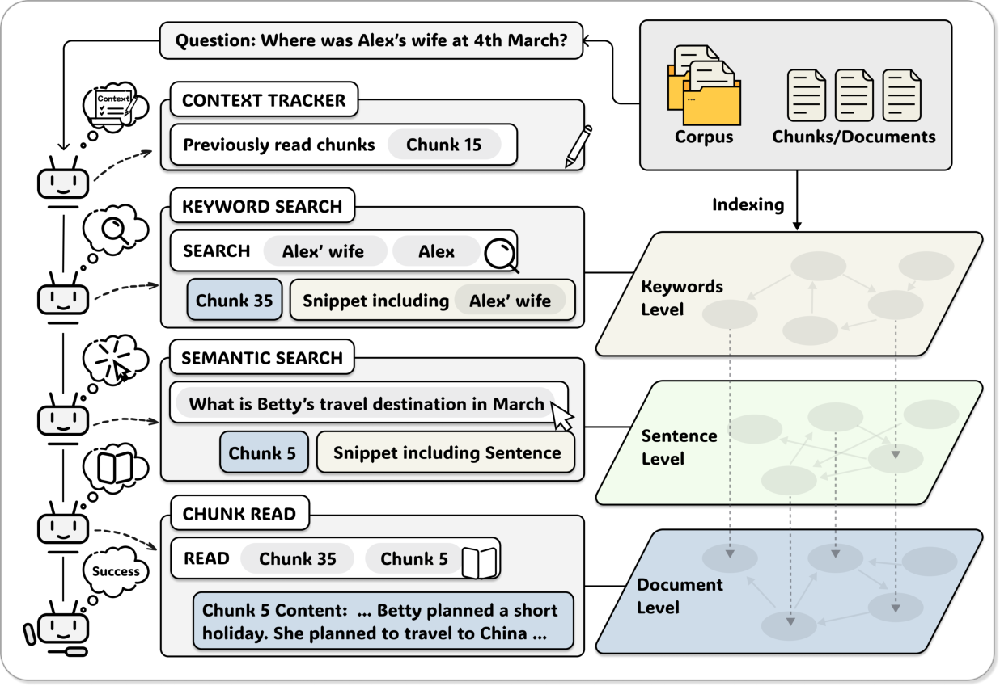

# A-RAG: Scaling Agentic Retrieval-Augmented Generation via Hierarchical Retrieval Interfaces

**Authors:** Mingxuan Du, Benfeng Xu, Chiwei Zhu, Shaohan Wang, Pengyu Wang, Xiaorui Wang, Zhendong Mao
**Venue:** Preprint (arXiv), February 2026
**PDF:** `paper.pdf`
**Date Read:** 2026-02-24

---

## One-Sentence Summary

LLM に階層的な retrieval interface（keyword search, semantic search, chunk read）をツールとして直接公開し、モデル自身が検索戦略を自律的に決定する Agentic RAG フレームワーク A-RAG を提案し、既存の Graph RAG・Workflow RAG 手法を複数のマルチホップ QA ベンチマークで上回ったと著者らは主張している。

## Problem Statement

既存の RAG システムは2つのパラダイムに依存している: (1) アルゴリズムが一括で passage を取得し context に結合する方式（Graph RAG を含む）、(2) 事前定義されたワークフローをモデルにステップバイステップで実行させる方式（Workflow RAG）。いずれの方式もモデルが検索の意思決定に参加することを許さず、モデル能力の向上に応じた性能スケーリングを妨げている。著者らは、LLM の推論能力・ツール使用能力が急速に発展する中、RAG がこのパラダイムシフトに追随できていないことを問題として提起している。

## Core Thesis & Design Philosophy

- **Core thesis:** RAG における性能向上のボトルネックは検索アルゴリズムの精緻化ではなく、モデル自身に検索の自律性（autonomy）を与えることにある。階層的な retrieval interface を通じてモデルに情報アクセスの粒度選択を委ねることで、タスク固有のワークフローが自然発生的に創発される。
- **What they reject:** 検索戦略を設計時に固定するアプローチ（Graph RAG のような事前構築グラフ、Workflow RAG のような事前定義パイプライン）。これらはモデルの推論能力を活用できず、モデルの改善に伴うスケーリングを阻害する。
- **What they bet on:** モデルにツールとして異なる粒度の検索手段を提供すれば、モデル自身が推論に基づいて最適な検索戦略を動的に組み立てるという仮説。特に、progressive information disclosure（段階的情報開示）が context 効率と精度の両立を可能にするという設計原理。

## Intellectual Lineage

| Source | Original Concept | How This Paper Adapts It |
|--------|-----------------|-------------------------|
| ReAct (Yao et al., 2023) | Reasoning と Acting を交互に実行する agent loop パターン。モデルが thought → action → observation のサイクルを繰り返す。 | A-RAG の agent loop の骨格として採用。ただし、parallel tool calling 等の複雑な機構を意図的に排除し、最もシンプルな ReAct ループのみを使用して interface 設計の効果を分離して検証。 |
| Lewis et al. (2021) — RAG | 外部知識ベースからの retrieval と LLM の generation を組み合わせる基本パラダイム。 | 基本的な retrieve-then-generate の枠組みを継承しつつ、one-shot retrieval からモデル主導の iterative retrieval へとパラダイムを転換。モデルが「いつ」「何を」「どの粒度で」検索するかを自律的に決定。 |
| GraphRAG (Edge et al., 2025) | Corpus からエンティティ関係グラフを構築し、local/global 検索を可能にする構造化 RAG。 | グラフ構造の事前構築を否定し、keyword-level の情報アクセスはランタイムの exact text matching で代替。これにより indexing コストを大幅に削減しつつ、entity matching の機能を agent のツールとして提供。 |
| RAPTOR (Sarthi et al., 2024) | 再帰的要約による階層的ツリー構造の構築で、多段階粒度での retrieval を実現。 | 階層的情報アクセスの概念を継承するが、ツリー構造の事前構築ではなく、keyword / sentence / chunk という3粒度の retrieval interface として実装。構造はインデックスではなくツール設計に埋め込まれている。 |
| LinearRAG (Zhuang et al., 2025) | NER ベースのグラフ構築を簡略化し、2段階 retrieval を行う。実験設定（corpus, chunking）も本研究のベースライン。 | 実験設定（corpus 分割、1000 token chunk、データセット）を継承。ただし、グラフ構造の構築自体を不要とし、chunking + embedding のみの軽量 indexing に置き換え。 |

## Proposed Method

### Overview

A-RAG は3つの主要コンポーネントで構成される: (i) 階層的インデックス、(ii) 階層的 retrieval ツール群、(iii) シンプルな agent loop。Figure 3 に全体像が示されている。

コーパスは chunking + embedding により3段階の粒度で索引化され、agent はこれらの粒度にアクセスするための3つのツール（keyword_search, semantic_search, chunk_read）を使って iterative に情報を収集する。

### Key Design Decisions

1. **3粒度の階層的ツール設計（keyword / sentence / chunk）**: keyword_search は exact lexical matching、semantic_search は dense embedding による意味検索、chunk_read は全文読み取り。 — *Rationale:* コーパス内の情報は本質的に複数粒度で組織されており、異なるクエリタイプに異なる粒度が最適であるという洞察。keyword は precise entity matching に、semantic は paraphrase や同義語に、chunk read は文脈把握に適する。 — *Alternatives:* 単一の embedding search のみ（A-RAG Naive がこれに相当し、Full に劣る）、グラフベースの構造化検索（GraphRAG, HippoRAG2）、事前定義ワークフローによる multi-step retrieval（IRCoT, FLARE）。

2. **Snippet-based progressive disclosure**: keyword_search と semantic_search は全文ではなくスニペット（マッチした文のみ）を返し、agent が chunk_read で全文を読むかどうかを判断する。 — *Rationale:* 不要な context の流入を防ぎ、agent に情報取捨選択の自律性を付与。Table 3 で A-RAG (Full) が A-RAG (Naive) より大幅に少ないトークンでより高い精度を達成していることがこの設計の有効性を示す。 — *Alternatives:* 検索結果の全文を直接返す（w/o Chunk Read ablation がこれに相当し、Full に劣る）。

3. **Keyword search に inverted index やグラフ構造を使わない（runtime exact matching）**: keyword_search は offline の inverted index や知識グラフを構築せず、クエリ時に直接テキストマッチングを行う。 — *Rationale:* indexing 時間と計算コストの大幅削減。グラフベース手法の offline コストを回避しつつ、entity matching の機能を維持。 — *Alternatives:* BM25 inverted index、知識グラフ構築（GraphRAG, LightRAG）、NER ベースのエンティティ抽出（LinearRAG）。

4. **最小限の agent loop 設計（ReAct ベース、parallel tool calling なし）**: 意図的にシンプルな逐次 ReAct ループを採用し、1回のイテレーションで1つのツールのみ呼び出す。 — *Rationale:* interface 設計の効果を分離して評価するため、複雑なオーケストレーション機構による交絡を排除。 — *Alternatives:* Parallel tool calling、multi-agent 協調（MA-RAG）、planning + execution の分離、SFT/RL による agent 最適化。

5. **Context Tracker による重複読み取り防止**: 読み済み chunk の ID を追跡し、再読み取り要求には "This chunk has been read before" を返す。 — *Rationale:* トークン消費の削減と、agent にコーパスの未探索部分への探索を促すインセンティブ。 — *Alternatives:* 重複チェックなし（トークン浪費）、read 済み chunk の要約を返す、全履歴をコンテキストに保持。

### Technical Details

**階層的インデックス構築:**
- Chunking: コーパスを約1,000 token の chunk に分割（文境界でアライン）
- Embedding: 各 chunk 内の文 $s_{i,j}$ を sentence encoder $f_{\text{emb}}$ でベクトル化: $\mathbf{v}_{i,j} = f_{\text{emb}}(s_{i,j})$
- Keyword-level: 事前インデックス不要、ランタイムの exact text matching

**Keyword Search のスコアリング (Eq. 1):**

$$\text{Score}_{\text{kw}}(c_i, K) = \sum_{k \in K} \text{count}(k, T_i) \cdot |k|$$

ここで $\text{count}(k, T_i)$ は chunk テキスト $T_i$ 内のキーワード $k$ の出現頻度、$|k|$ はキーワードの文字長（長いキーワードほど specific であるため重み付け）。

**スニペット抽出 (Eq. 2):**

$$\text{Snippet}(c_i, K) = \{s \in \text{Sent}(c_i) \mid \exists k \in K, k \subseteq s\}$$

**Semantic Search のスコアリング (Eq. 3):**

$$\text{Score}_{\text{sem}}(s_{i,j}, q) = \frac{\mathbf{v}_{i,j}^T \mathbf{v}_q}{\|\mathbf{v}_{i,j}\| \|\mathbf{v}_q\|}$$

**Agent Loop (Algorithm 1):** 入力として質問 $q$、ツール集合 $T$、LLM $M$、最大イテレーション数 $L$ を受け取る。各イテレーションで LLM がツール呼び出しか最終回答かを判断。$C_{\text{read}}$ で読み済み chunk を追跡。最大イテレーション到達時は強制回答を促す。

## Key Claims

1. **Naive A-RAG（単一 embedding ツールのみ）が既存の Graph RAG・Workflow RAG を上回る** — Evidence: Table 1 で GPT-5-mini バックボーン時、A-RAG (Naive) が複数データセットで GraphRAG, HippoRAG2, LinearRAG, FaithfulRAG, MA-RAG, RAGentA を上回っている。
2. **A-RAG (Full) が全ベンチマークで最高性能を達成** — Evidence: Table 1 で GPT-5-mini 使用時、A-RAG (Full) が5データセット全てで最高精度。GPT-4o-mini 使用時は5中3で最高。
3. **階層的 interface により context 効率が向上** — Evidence: Table 3 で A-RAG (Full) は A-RAG (Naive) より大幅に少ないトークン（例: HotpotQA で 2,737 vs 27,455）でより高い精度を達成。
4. **A-RAG は test-time compute のスケーリングが効果的に機能する** — Evidence: Figure 4 で max step 増加に伴う精度向上（5→20 steps で GPT-5-mini 約8%改善）、reasoning effort 増加で約25%改善。
5. **各階層ツールがそれぞれ独自の貢献をしている** — Evidence: Table 2 の ablation で各ツール除去時に性能が低下。

## Methodology Assessment

- **Datasets:** HotpotQA, 2WikiMultiHopQA, MuSiQue, GraphRAG-Bench（Medical, Novel サブセット）の4つの公開マルチホップ QA データセット。LinearRAG と同一の corpus・質問を使用し公平性を確保していると著者らは主張。データセットの選択はマルチホップ推論に偏っており、他のタスクタイプ（fact verification, dialogue 等）への汎化は検証されていない。
- **Baselines:** Graph RAG（GraphRAG, HippoRAG2, LinearRAG）と Workflow RAG（FaithfulRAG, MA-RAG, RAGentA）の双方を網羅。ただし、Self-RAG, CRAG 等の training-based Workflow RAG 手法は含まれていない。また、Deep Research 系の agent（OpenAI Deep Research, Gemini Deep Research）との比較はない。
- **Metrics:** LLM-Evaluation Accuracy（GPT-5-mini が judge）と Contain-Match Accuracy の2指標。LLM judge の信頼性は human verification に基づくと述べているが、詳細な一致率は報告されていない。Judge Error が failure の9-19%を占めており、メトリクス自体の信頼性に一定の課題がある。
- **Statistical rigor:** エラーバー、信頼区間、複数ラン結果の報告なし。単一ランの結果のみに基づいており、結果の分散は不明。
- **Reproducibility:** コードとeval suiteの公開を約束（GitHub リポジトリあり）。Embedding に Qwen3-Embedding-0.6B、backbone LLM に GPT-4o-mini / GPT-5-mini を使用。ハイパーパラメータは Appendix B に記載。ただし、API ベースモデルの使用により完全な再現は OpenAI API の挙動に依存。

## Results Summary

**Table 1（メイン結果）:**
- GPT-4o-mini: A-RAG (Full) が MuSiQue (LLM-Acc 46.1%), Medical (79.4%), Novel (72.7%) で最高。HotpotQA, 2Wiki では HippoRAG2 が一部メトリクスで上回る。
- GPT-5-mini: A-RAG (Full) が全5データセット・全メトリクスで最高。MuSiQue で 74.1%（次点 LinearRAG 62.4%）、HotpotQA で 94.5%（次点 LinearRAG 86.2%）と大差。

**Table 2（Ablation）:**
- 各ツール除去で性能低下。特に semantic search 除去の影響が最大（MuSiQue で 74.1%→69.4%）。

**Table 3（Context 効率）:**
- A-RAG (Full) は HotpotQA で 2,737 tokens（Naive RAG の 5,358 の約半分）、2Wiki で 2,930 tokens と著しく効率的。
- A-RAG (Naive) は 22,000-56,000 tokens と非効率で、階層的 interface の重要性を示す。

**Figure 4（Test-Time Scaling）:**
- Max steps: 5→20 で GPT-5-mini は約8%、GPT-4o-mini は約4%改善。
- Reasoning effort: minimal→high で GPT-5-mini, GPT-5 ともに約25%改善。

## Limitations & Open Questions

- **統計的厳密性の欠如:** エラーバー、複数ラン結果、有意差検定がなく、観測された差が統計的に有意かどうかが不明。
- **モデル依存性:** GPT-4o-mini と GPT-5-mini のみでの評価であり、GPT-5, Gemini-3, Claude 等のより強力なモデルでの検証が不足。著者ら自身もこれを limitation として認めている。
- **タスクの多様性:** マルチホップ QA のみでの評価。Fact verification, dialogue, long-form generation 等への汎化は未検証。
- **ツール設計の体系的探索不足:** 3つのツール以外のツール設計（例: summary tool, reranking tool）の可能性は検討されていない。
- **Keyword search の限界:** exact matching は typo、表記揺れ、多言語に弱い可能性がある。BM25 や fuzzy matching との比較がない。
- **Test-time compute のコスト対効果:** max steps 増加による精度向上は示されているが、APIコスト・レイテンシとのトレードオフの定量的分析がない。
- **Failure mode における entity confusion の深掘り:** 最大の failure mode（40-71%）であるが、その原因分析と改善策の検討が不十分。
- **Open question:** Agent のツール選択パターンは学習によって最適化可能か? SFT/RL で agent のツール使用を最適化した場合、どの程度の改善が得られるか?
- **Open question:** この hierarchical interface 設計は web-scale の検索エンジンや enterprise search にスケールするか?

## Connections to Other Work

- **Builds on:** ReAct (Yao et al., 2023) の agent loop パターン、RAG (Lewis et al., 2021) の基本パラダイム、LinearRAG (Zhuang et al., 2025) の実験設定
- **Compared with:** GraphRAG (Edge et al., 2025), HippoRAG2 (Gutierrez et al., 2025a), LinearRAG (Zhuang et al., 2025), FaithfulRAG (Zhang et al., 2025a), MA-RAG (Nguyen et al., 2025), RAGentA (Besrour et al., 2025)
- **Enables:** SFT/RL による agent のツール使用最適化（Search-R1, RAG-Gym 等との統合）、より多様なツール設計の探索、web-scale agentic RAG への拡張、Deep Research agent における retrieval interface 設計への応用

## Personal Notes

- 著者らの「Agentic 3原則」（Autonomous Strategy, Iterative Execution, Interleaved Tool Use）による既存手法の分類（Table 4）は明快で、分野の整理として価値がある。ただし、この分類自体が A-RAG を有利にするよう設計されている可能性に注意が必要。
- A-RAG (Naive) が既存手法を上回る結果は、複雑な retrieval アルゴリズムよりもモデルの自律性が重要という主張を支持する強い evidence だが、公平な比較条件（特に inference 計算量の等価性）についてはさらなる検証が望ましい。
- Context 効率（Table 3）の結果は印象的だが、A-RAG はより多くの LLM inference ステップ（推論トークン）を消費しており、retrieved token だけでなく total token consumption（推論 + retrieval）での比較が重要。
- Keyword search のスコアリング（Eq. 1）で文字長による重み付けは直感的だが、情報検索の理論（TF-IDF, BM25）との比較や理論的根拠が薄い。
