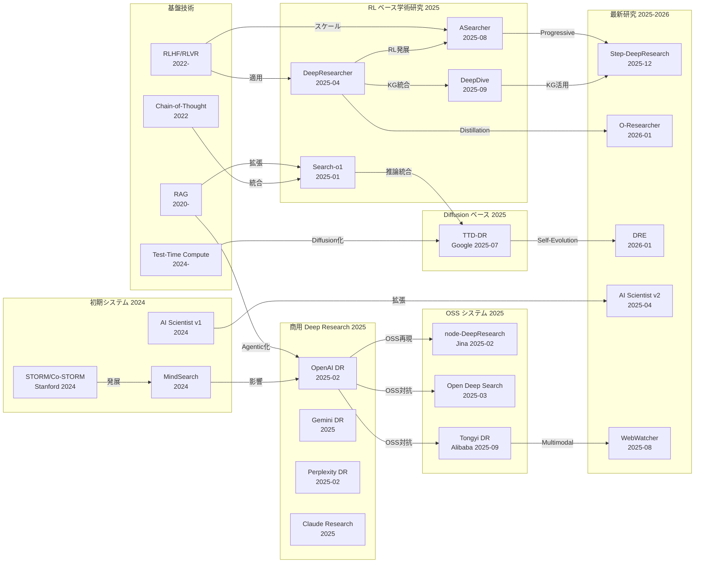

# Literature Survey: Deep Research — 自律的研究エージェントの台頭

**Date:** 2026-02-23
**Scope:** LLMを基盤とした Deep Research（自律的研究エージェント）システムの体系的サーベイ。計画（Planning）、検索（Retrieval）、推論（Reasoning）、レポート生成（Report Generation）の4つのコア能力に焦点を当て、2023年以降に登場した商用・オープンソース実装を網羅する。特に2025〜2026年に公開された論文を重視する。

---

## 1. 背景と定義

**Deep Research** とは、LLM を中核に据え、複数ステップの情報検索・推論・統合を自律的に実行し、構造化されたレポートを生成する AI エージェントシステムの総称である。従来の単一ターンの質問応答や RAG パイプラインとは異なり、Deep Research エージェントは以下の特徴を持つ:

- **長時間水平（Long-Horizon）探索**: 数十回〜100回以上の検索・閲覧を反復的に実行
- **動的計画（Dynamic Planning）**: 中間結果に基づいてリサーチ計画を適応的に更新
- **Multi-hop 推論**: 複数情報源からの情報を統合し、複合的な質問に回答
- **構造化レポート生成**: 引用付きの長文レポートを自律的に作成

Xu & Peng (2025) のサーベイによれば、2023年以降に80以上の商用・非商用実装が登場しており、Deep Research は急速に成熟しつつある分野である。

---

## 2. Timeline

| 年月 | 論文/システム | 主要な貢献 |
|------|-------------|-----------|
| 2024-07 | MindSearch (Luo et al.) | 人間の検索行動を模倣する Multi-Agent フレームワーク。WebPlanner + 並列 WebSearcher 構成 |
| 2024-09 | STORM / Co-STORM (Stanford OVAL) | Wikipedia 品質の記事を自動生成。Multi-perspective Question Asking による事前調査。Co-STORM は EMNLP 2024 採択 |
| 2024-08 | The AI Scientist v1 (Sakana AI) | 仮説立案から論文執筆まで完全自動化する最初の試み |
| 2025-01 | Search-o1 (RUC-NLPIR) | 大規模推論モデルに Agentic Search を統合。Reason-in-Documents モジュール。EMNLP 2025 |
| 2025-01 | Agentic RAG Survey (Singh et al.) | Agentic RAG の体系的サーベイ。Reflection, Planning, Tool Use, Multi-Agent パターンの分類 |
| 2025-02 | OpenAI Deep Research | o3 ベースの商用 Deep Research エージェント。RL ベースの Web ブラウジング+分析 |
| 2025-02 | Perplexity Deep Research | 反復的情報検索ループ。Ask-Iterate-Cite ワークフロー |
| 2025-02 | Jina node-DeepResearch | OpenAI Deep Research のオープンソース再現。Gemini/OpenAI + Jina Reader |
| 2025-03 | Open Deep Search (ODS) | DeepSeek-R1 等のオープンソース推論 LLM + Open Search Tool。SimpleQA, FRAMES で SOTA 級 |
| 2025-04 | DeepResearcher (GAIR-NLP) | 実世界 Web 環境での end-to-end RL 訓練。Prompt 工学ベースラインに対し +28.9pt |
| 2025-04 | The AI Scientist v2 (Sakana AI) | Agentic Tree Search による自動科学発見。AI 生成論文が ICLR Workshop のピアレビュー通過 |
| 2025-06 | Comprehensive DR Survey (Xu & Peng) | 80以上のシステムを分析する95ページのサーベイ。4次元階層的分類法を提案 |
| 2025-06 | DeepResearch Bench (Muset AI) | PhD レベル100問、22分野。RACE + FACT 評価フレームワーク |
| 2025-06 | DR Agents: Systematic Examination (arXiv 2506.18096) | Deep Research エージェントの体系的検討とロードマップ |
| 2025-07 | **TTD-DR (Han et al., Google)** | **Test-Time Diffusion による Deep Research。Denoising + Retrieval で反復的レポート改善。Self-Evolution アルゴリズム。SOTA 達成** |
| 2025-08 | ASearcher (arXiv 2508.07976) | 大規模非同期 RL による Long-Horizon 探索。100ターン以上、400k トークンの出力 |
| 2025-08 | WebWatcher (Alibaba) | Vision-Language Deep Research エージェント。マルチモーダル情報検索 |
| 2025-08 | DR Survey: Autonomous Research Agents (arXiv 2508.12752) | 能力中心のサーベイ。Planning, Retrieval, Reasoning, Report Generation の最適化 |
| 2025-09 | DeepDive (THUDM) | Knowledge Graph + Multi-Turn RL。BrowseComp で open-source SOTA |
| 2025-09 | Tongyi DeepResearch (Alibaba) | 30.5B MoE (3.3B active)。3段階訓練: Agentic CPT → SFT → RL。Apache 2.0 |
| 2025-09 | DeepResearch Arena (arXiv 2509.01396) | 学術セミナーから導出した10,000以上の研究タスク。12学術分野 |
| 2025-11 | Deep Research: Systematic Survey (arXiv 2512.02038) | 基礎コンポーネント、実装技術、課題、将来方向の包括的概観 |
| 2025-12 | Step-DeepResearch (arXiv 2512.20491) | Atomic Capability ベースのデータ合成 + Progressive Training。32B で closed-source 級性能 |
| 2026-01 | O-Researcher (arXiv 2601.03743) | Multi-Agent Distillation + Agentic RL。オープンソースモデルで新 SOTA |
| 2026-01 | Deep Researcher Reflect Evolve (arXiv 2601.20843) | Sequential Plan Reflection + Candidates Crossover。DeepResearch Bench 46.21 |

---

## 3. Taxonomy（分類法）

```mermaid
graph TD
    DR[Deep Research Agent] --> COMM[商用システム<br/>Commercial]
    DR --> OPEN[オープンソース<br/>Open Source]
    DR --> ACAD[学術研究<br/>Academic]

    COMM --> COMM_O[OpenAI Deep Research<br/>o3ベース]
    COMM --> COMM_G[Gemini Deep Research<br/>MoE + 非同期タスク管理]
    COMM --> COMM_P[Perplexity Deep Research<br/>反復的検索ループ]
    COMM --> COMM_C[Claude Research<br/>Multi-Agent Orchestration]

    OPEN --> OPEN_T[Tongyi DeepResearch<br/>30.5B MoE, Apache 2.0]
    OPEN --> OPEN_J[Jina node-DeepResearch]
    OPEN --> OPEN_ODS[Open Deep Search<br/>ODS]
    OPEN --> OPEN_HF[HuggingFace<br/>open-deep-research]
    OPEN --> OPEN_LC[LangChain<br/>open_deep_research]

    ACAD --> ACAD_RL[RL ベース]
    ACAD --> ACAD_DIFF[Diffusion ベース]
    ACAD --> ACAD_MA[Multi-Agent ベース]
    ACAD --> ACAD_KG[Knowledge Graph ベース]

    ACAD_RL --> DR_RL1[DeepResearcher<br/>End-to-End RL in Real Web]
    ACAD_RL --> DR_RL2[ASearcher<br/>非同期 RL, Long-Horizon]
    ACAD_RL --> DR_RL3[O-Researcher<br/>Agentic RL + Distillation]
    ACAD_RL --> DR_RL4[Step-DeepResearch<br/>Progressive Training]

    ACAD_DIFF --> DR_DIFF1[TTD-DR<br/>Test-Time Diffusion]

    ACAD_MA --> DR_MA1[MindSearch<br/>WebPlanner + WebSearcher]
    ACAD_MA --> DR_MA2[STORM / Co-STORM<br/>Multi-Perspective QA]
    ACAD_MA --> DR_MA3[AI Scientist v2<br/>Agentic Tree Search]
    ACAD_MA --> DR_MA4[DRE<br/>Reflect + Evolve]

    ACAD_KG --> DR_KG1[DeepDive<br/>KG + Multi-Turn RL]

    DR --> EVAL[評価・ベンチマーク]
    EVAL --> EVAL_1[DeepResearch Bench<br/>100問, 22分野]
    EVAL --> EVAL_2[DeepResearch Arena<br/>10K問, 12分野]
    EVAL --> EVAL_3[BrowseComp / BrowseComp-VL]
    EVAL --> EVAL_4[xBench / GAIA / FRAMES]
```

---

## 4. コア技術の分析

### 4.1 Planning（計画立案）

Deep Research エージェントの計画能力は、リサーチの質を左右する最重要要素の一つである。

| アプローチ | 代表システム | 特徴 |
|-----------|------------|------|
| Static Planning | 初期の RAG エージェント | 事前に固定された検索計画 |
| Dynamic/Adaptive Planning | OpenAI DR, Gemini DR | 中間結果に基づく計画更新 |
| Sequential Reflection | DRE (Prateek 2026) | Global Research Context を参照した逐次的計画修正 |
| Tree Search | AI Scientist v2 | Agentic Tree Search による仮説空間の探索 |
| Diffusion-based Planning | TTD-DR (Google) | Denoising プロセスとしての反復的計画改善 |

TTD-DR の著者らは、レポート生成を Diffusion プロセスとして定式化することで、従来の Linear な計画・生成パイプラインの限界を克服したと主張している。各 Denoising ステップで外部情報を取り込むことにより、計画と実行が密に結合される。

### 4.2 Retrieval（情報検索）

| アプローチ | 代表システム | 特徴 |
|-----------|------------|------|
| Single-turn Search | 基本的な RAG | 1回の検索で情報取得 |
| Iterative Search | Perplexity DR | 反復的に検索クエリを調整 |
| Agentic Search | Search-o1 | 推論中に動的に検索を挿入 |
| Real-world Web RL | DeepResearcher | 実際の検索エンジンとの対話で RL 訓練 |
| Multi-modal Retrieval | WebWatcher | テキスト+画像検索の統合 |
| KG-augmented | DeepDive | Knowledge Graph から高品質な訓練データを合成 |

DeepResearcher は、RAG ベースの RL（固定コーパスを仮定）と Prompt 工学ベース（手動設計）の限界を指摘し、実世界の Web 環境で直接 RL 訓練を行う初めてのフレームワークとして提案された。結果として、Prompt 工学ベースラインに対し最大 +28.9pt の改善を達成したと報告されている。

### 4.3 Reasoning（推論）

| アプローチ | 代表システム | 特徴 |
|-----------|------------|------|
| Chain-of-Thought | 標準的な LLM エージェント | 逐次的推論 |
| Reason-in-Documents | Search-o1 | 検索結果内での推論モジュール |
| Multi-hop Reasoning | TTD-DR, MindSearch | 複数情報源の統合推論 |
| Test-Time Compute Scaling | OpenAI o3/o4, Gemini Deep Think | 推論時間の動的スケーリング |
| Self-Reflection | DeepResearcher | RL により獲得した自己反省能力 |

Test-time compute scaling は 2025年の主要トレンドであり、推論時により多くの計算資源を投入することでモデル性能を向上させるアプローチである。TTD-DR はこれを Diffusion のフレームワークに統合した点が新規性として評価される。

### 4.4 Report Generation（レポート生成）

| アプローチ | 代表システム | 特徴 |
|-----------|------------|------|
| Single-pass Generation | 基本的な LLM | 1回のパスでレポート生成 |
| Iterative Refinement | TTD-DR | Diffusion ベースの反復的改善 |
| Parallel + Merge | Gemini DR | 並列タスク実行 + 非同期マージ |
| Candidates Crossover | DRE | 複数 LLM 候補の出力を統合 |
| Multi-Agent Synthesis | Claude Research | Orchestrator + 複数 Subagent |
| Structured Report | Step-DeepResearch | Atomic Capability ベースの構造化生成 |

Anthropic のエンジニアリングブログによれば、Multi-Agent 構成のClaude Research システムは、単一エージェントの Claude Opus 4 に対して内部評価で 90.2% の性能向上を達成し、性能差の 80% はトークン使用量で説明できるとされている。

---

## 5. Comparison Table

詳細な比較は `comparison-table.md` を参照。以下は主要システムの概要比較:

| システム | 種別 | ベースモデル | 主要手法 | DeepResearch Bench | Code |
|---------|------|------------|---------|-------------------|------|
| OpenAI Deep Research | 商用 | o3 | RL + Web Browsing | 46.98 | No |
| Gemini Deep Research | 商用 | Gemini 2.5 Pro (MoE) | 非同期タスク管理 + Search | 48.88 | No |
| Perplexity Deep Research | 商用 | 非公開 | Iterative Retrieval Loop | - | No |
| Claude Research | 商用 | Opus 4 + Sonnet 4 | Multi-Agent Orchestration | - | No |
| TTD-DR (Google) | 学術 | LLM (非公開) | Test-Time Diffusion + Self-Evolution | SOTA (報告値) | No |
| DeepResearcher | 学術/OSS | Qwen2.5-7B/32B 等 | End-to-End RL in Real Web | - | [GitHub](https://github.com/GAIR-NLP/DeepResearcher) |
| Tongyi DeepResearch | OSS | 30.5B MoE (3.3B active) | Agentic CPT + SFT + RL | - | [GitHub](https://github.com/Alibaba-NLP/DeepResearch) |
| O-Researcher | 学術 | Multiple scales | Multi-Agent Distillation + Agentic RL | 新SOTA (報告値) | [arXiv](https://arxiv.org/abs/2601.03743) |
| DRE | 学術 | LLM (非公開) | Sequential Reflection + Crossover | 46.21 | [GitHub](https://github.com/SauravP97/deep-researcher-reflect-evolve) |
| ASearcher | 学術/OSS | QwQ-32B | 大規模非同期 RL | xBench 51.1, GAIA 58.7 | [arXiv](https://arxiv.org/abs/2508.07976) |
| DeepDive | 学術/OSS | 32B | KG + Multi-Turn RL | BrowseComp OSS SOTA | [GitHub](https://github.com/THUDM/DeepDive) |
| Step-DeepResearch | 学術 | 32B | Atomic Capability + Progressive Training | Scale AI Rubrics 61.4% | [arXiv](https://arxiv.org/abs/2512.20491) |
| WebWatcher | 学術 | VLM | Multi-modal Agent + RL | BrowseComp-VL SOTA | [arXiv](https://arxiv.org/abs/2508.05748) |
| Open Deep Search | OSS | DeepSeek-R1 等 | Open Search Tool + Reasoning Agent | FRAMES +9.7% | [GitHub](https://github.com/sentient-agi/OpenDeepSearch) |
| Search-o1 | 学術/OSS | 推論モデル | Agentic RAG + Reason-in-Documents | - | [GitHub](https://github.com/RUC-NLPIR/Search-o1) |
| STORM / Co-STORM | 学術/OSS | LLM | Multi-Perspective QA + Outline | - | [GitHub](https://github.com/stanford-oval/storm) |
| MindSearch | 学術 | LLM | WebPlanner + Parallel WebSearcher | - | - |
| AI Scientist v2 | 学術/OSS | LLM + VLM | Agentic Tree Search | ICLR Workshop 採択 | [GitHub](https://github.com/SakanaAI/AI-Scientist-v2) |

---

## 6. Key Themes & Trends（主要テーマとトレンド）

### 6.1 RL による Deep Research エージェントの end-to-end 訓練

2025年の最も顕著なトレンドは、強化学習（RL）を用いた Deep Research エージェントの end-to-end 訓練である。DeepResearcher が実世界 Web 環境での RL 訓練を先駆的に提案し、以降 ASearcher（大規模非同期 RL）、DeepDive（KG ベースの訓練データ + Multi-Turn RL）、O-Researcher（Agentic RL + Multi-Agent Distillation）と急速に発展している。

特筆すべきは、RL 訓練を通じて創発的な認知行動（計画立案、情報のクロスバリデーション、自己反省、正直な不確実性の表明）が獲得されるという報告である（DeepResearcher）。これは、明示的なプロンプト設計なしに、Web 環境との対話を通じてエージェントがリサーチスキルを自律的に獲得できることを示唆している。

### 6.2 Test-Time Compute Scaling と Diffusion ベースのアプローチ

TTD-DR は、レポート生成を Diffusion プロセスとして定式化するという斬新なアプローチを提案した。従来の Deep Research エージェントが「計画 → 検索 → 統合 → 生成」という線形パイプラインに依存していたのに対し、TTD-DR は反復的な Denoising プロセスにより、各ステップで外部情報を動的に取り込みながらレポートを改善する。

このアプローチは、Test-Time Compute Scaling のトレンドと合流している。推論時により多くの計算資源を投入することで、訓練時の能力を超えた性能を引き出すことが可能になる。OpenAI の o3/o4 シリーズ、Google の Gemini Deep Think が同様の方向性を追求している。

### 6.3 オープンソースの急速な発展

2025年は Deep Research のオープンソース化が飛躍的に進展した年である:

- **Tongyi DeepResearch** (Alibaba): 30.5B MoE モデルを Apache 2.0 で公開。商用システムに匹敵する性能
- **Open Deep Search**: DeepSeek-R1 等のオープンソース推論 LLM と組み合わせ、GPT-4o Search Preview を上回る性能
- **node-DeepResearch** (Jina AI): OpenAI Deep Research の公開数時間後にオープンソース再現を公開

Alibaba の Tongyi DeepResearch は「Deep Research 版の DeepSeek moment」と評され、オープンソースモデルが商用システムと同等の性能を達成できることを実証した。

### 6.4 Multi-Agent アーキテクチャの成熟

Anthropic のエンジニアリングレポートは、Deep Research における Multi-Agent 構成の優位性を定量的に示した。Orchestrator-Worker パターン（Lead Agent が戦略を策定し、Subagent が並列に情報収集）により、単一エージェントに対して 90.2% の性能向上が達成されている。性能差の 80% はトークン使用量で説明可能であり、Multi-Agent 構成の本質的な利点は「十分なトークンを問題解決に費やす」ことにあるとされている。

### 6.5 評価手法の発展

Deep Research の評価手法も急速に発展している:

- **DeepResearch Bench**: RACE（適応的基準駆動評価）+ FACT（事実性+引用信頼性）の2軸評価
- **DeepResearch Arena**: 学術セミナーから導出した10,000問で実世界に近い評価
- **BrowseComp / BrowseComp-VL**: 複雑な情報検索能力の評価（テキスト+マルチモーダル）
- **xBench / GAIA / FRAMES**: エージェント能力の汎用ベンチマーク

しかし、評価手法自体にも課題が残る。レポートの「品質」は多面的であり、事実正確性、引用信頼性、構造の論理性、情報の網羅性を統合的に評価する枠組みはまだ発展途上にある。

---

## 7. TTD-DR (Deep Researcher with Test-Time Diffusion) 詳細分析

本サーベイの重点対象である TTD-DR について詳述する。

### 7.1 問題設定

従来の Deep Research エージェントは、汎用的な test-time scaling アルゴリズム（best-of-N や majority voting 等）を用いてレポートを生成するが、複雑な長文レポート生成においてはしばしば性能が頭打ちになる。TTD-DR は、人間の研究プロセス（検索→推論→修正のサイクル）に着想を得て、この課題に取り組む。

### 7.2 アーキテクチャ

TTD-DR のバックボーン DR エージェントは3つの主要ステージから構成される:

1. **Research Plan Generation**: リサーチの全体計画を生成
2. **Iterative Search and Synthesis**: 反復的な検索と情報統合
3. **Final Report Generation**: 最終レポートの生成

### 7.3 コアメカニズム

**Denoising with Retrieval（レポートレベルの Refinement）**:
- 初期ドラフト（LLM の内部知識に基づく "noisy" な出力）を反復的に改善
- 各 Denoising ステップで対象検索（targeted retrieval）を実施
- 現在のドラフトが次の検索クエリ生成を誘導
- 新情報でドラフトを更新（詳細の追加 or 既存情報の検証）

**Self-Evolution（コンポーネント単位の最適化）**:
- エージェントワークフローの各コンポーネント（Plan, Question, Answer, Report）が個別に最適化
- 高品質なコンテキストを Diffusion プロセスに供給するための自己進化

### 7.4 結果

著者らは、TTD-DR が多様なベンチマーク（集中的な検索と Multi-hop 推論を要するもの）において state-of-the-art を達成し、既存の Deep Research エージェントを大幅に上回ると報告している。

### 7.5 評価と制約

TTD-DR の革新性は高く評価されるが、以下の点に注意が必要:
- ベースとなる LLM の詳細は完全には開示されていない
- Self-Evolution アルゴリズムの収束性や安定性に関する理論的保証は限定的
- 計算コストの詳細な分析が不十分（Diffusion の反復回数とコストのトレードオフ）
- 独立した再現実験による検証は未実施

---

## 8. Relationship Diagram（論文間の関係図）

---

## 9. Open Problems（未解決の課題）

1. **事実性と幻覚の制御**: Deep Research エージェントは長文レポートを生成するが、微妙な事実誤りや引用の不正確さが混入するリスクがある。DeepResearch Bench の FACT フレームワークがこの問題を可視化したが、根本的な解決には至っていない。特に Multi-hop 推論における中間ステップのエラー蓄積が課題である。

2. **計算コストとスケーラビリティ**: TTD-DR の Diffusion 反復や ASearcher の 100 ターン以上の探索は、膨大な計算コストを伴う。商用環境での実用性には、コストと品質のトレードオフの最適化が不可欠である。ASearcher は 400k トークン以上の出力を生成するが、これは推論コストの観点から持続可能かという疑問が残る。

3. **評価の標準化**: DeepResearch Bench、DeepResearch Arena、BrowseComp 等の多様なベンチマークが登場したが、統一的な評価基準は確立されていない。特に、レポートの「質」を多次元的に評価する合意形成が課題である。ResearchRubrics のような専門家作成の基準が一つの方向性を示している。

4. **マルチモーダル情報統合**: WebWatcher が Vision-Language Deep Research を提案したが、実世界の研究では図表、数式、コード、データセット等の多様なモダリティを統合する必要がある。BrowseComp-VL の提案はこの方向の第一歩だが、本格的なマルチモーダル研究エージェントはまだ発展途上にある。

5. **知識の新鮮さと動的更新**: Deep Research エージェントは Web 検索に依存するが、情報の鮮度、信頼性、矛盾する情報源の扱いに関する体系的なアプローチが不足している。Wiki Live Challenge (2026) はこの問題に取り組む最近の試みである。

6. **安全性と倫理**: Deep Research エージェントが生成するレポートが、意図せず偏った情報や誤情報を広める可能性がある。OpenAI Deep Research System Card がこの問題を部分的に扱っているが、包括的なフレームワークはまだ存在しない。

7. **RL 訓練の安定性と再現性**: RL ベースの Deep Research エージェント（DeepResearcher, ASearcher, DeepDive）は印象的な結果を報告しているが、RL 訓練の不安定性、ハイパーパラメータ感度、再現性に関する懸念がある。NeurIPS 2025 で報告された RLVR の限界（推論能力の拡張ではなくサンプリング効率の向上に留まる）は、より強力な RL パラダイムの必要性を示唆している。

8. **Long-Horizon 探索の制御**: ASearcher が 100 ターン以上の探索を可能にしたが、探索の終了条件、品質と効率のバランス、不要な探索の回避（Redundancy Penalty: DeepDive が提案）など、Long-Horizon 探索の制御手法は未成熟である。

---

## 10. 今後の方向性

1. **Diffusion ベース手法の発展**: TTD-DR が開拓した Diffusion ベースのアプローチは、Deep Research の新しいパラダイムとなる可能性がある。特に、Self-Evolution メカニズムの理論的基盤の確立と、他の反復的改善手法（Reflect Evolve 等）との統合が期待される。

2. **小規模モデルの高性能化**: Tongyi DeepResearch（3.3B active）や Step-DeepResearch（32B）が示すように、Progressive Training や Agentic CPT を通じて、小規模モデルでも大規模商用システムに匹敵する性能を達成する方向性が加速するだろう。

3. **マルチモーダル Deep Research**: WebWatcher が Vision-Language に拡張したように、図表理解、コード実行、データ分析を統合したマルチモーダル Deep Research エージェントの発展が期待される。

4. **Domain-Specific Deep Research**: 医療、法律、科学研究等の特定ドメインに特化した Deep Research エージェントの開発。AI Scientist v2 が科学研究の自動化を先駆的に示した。

5. **Human-AI Collaborative Research**: Co-STORM が提案した Human-AI 協調研究のパラダイムの発展。人間の専門知識とエージェントの探索能力を効果的に統合するインタラクションデザイン。

---

## 11. サーベイ論文の一覧

本分野の理解を深めるための体系的サーベイ論文:

| 論文 | arXiv ID | 公開日 | 特徴 |
|------|---------|--------|------|
| A Comprehensive Survey of Deep Research: Systems, Methodologies, and Applications | 2506.12594 | 2025-06 | 80+システム分析、95ページ、4次元階層的分類法 |
| Deep Research: A Survey of Autonomous Research Agents | 2508.12752 | 2025-08 | 能力中心サーベイ、Planning/Retrieval/Reasoning/Report Generation |
| Deep Research: A Systematic Survey | 2512.02038 | 2025-11 | 基礎コンポーネント、実装技術、課題、将来方向 |
| Deep Research Agents: A Systematic Examination And Roadmap | 2506.18096 | 2025-06 | 体系的検討とロードマップ |
| Reinforcement Learning Foundations for Deep Research Systems: A Survey | 2509.06733 | 2025-09 | RL に焦点を当てたサーベイ |
| Agentic Retrieval-Augmented Generation: A Survey on Agentic RAG | 2501.09136 | 2025-01 | Agentic RAG の体系的サーベイ |
| A Survey of LLM-based Deep Search Agents | 2508.05668 | 2025-08 | Deep Search エージェントのパラダイムと最適化 |

---

## 12. References

### 主要論文（年代順）

- Luo, Q. et al. "MindSearch: Mimicking Human Minds Elicits Deep AI Searcher." arXiv:2407.20183, 2024.
- Shao, Z. et al. "Assisting in Writing Wikipedia-like Articles From Scratch with Large Language Models (STORM)." Stanford OVAL, 2024. EMNLP 2024.
- Lu, C. et al. "The AI Scientist: Towards Fully Automated Open-Ended Scientific Discovery." arXiv:2408.06292, 2024.
- Li, X. et al. "Search-o1: Agentic Search-Enhanced Large Reasoning Models." arXiv:2501.05366, January 2025.
- Singh, A. et al. "Agentic Retrieval-Augmented Generation: A Survey on Agentic RAG." arXiv:2501.09136, January 2025.
- OpenAI. "Introducing Deep Research." February 2025. https://openai.com/index/introducing-deep-research/
- OpenAI. "Deep Research System Card." February 2025. https://cdn.openai.com/deep-research-system-card.pdf
- Zheng, Y. et al. "DeepResearcher: Scaling Deep Research via Reinforcement Learning in Real-world Environments." arXiv:2504.03160, April 2025.
- Yamada, T. et al. "The AI Scientist-v2: Workshop-Level Automated Scientific Discovery via Agentic Tree Search." arXiv:2504.08066, April 2025.
- Xu, R. and Peng, J. "A Comprehensive Survey of Deep Research: Systems, Methodologies, and Applications." arXiv:2506.12594, June 2025.
- Ayanami et al. "DeepResearch Bench: A Comprehensive Benchmark for Deep Research Agents." arXiv:2506.11763, June 2025.
- **Han, R. et al. "Deep Researcher with Test-Time Diffusion." arXiv:2507.16075, July 2025.** (Google)
- Geng, Z. et al. "WebWatcher: Breaking New Frontier of Vision-Language Deep Research Agent." arXiv:2508.05748, August 2025.
- "Beyond Ten Turns: Unlocking Long-Horizon Agentic Search with Large-Scale Asynchronous RL." arXiv:2508.07976, August 2025.
- "Deep Research: A Survey of Autonomous Research Agents." arXiv:2508.12752, August 2025.
- "DeepDive: Advancing Deep Search Agents with Knowledge Graphs and Multi-Turn RL." arXiv:2509.10446, September 2025.
- Alibaba-NLP. "Tongyi DeepResearch." September 2025. https://github.com/Alibaba-NLP/DeepResearch
- "DeepResearch Arena." arXiv:2509.01396, September 2025.
- "Reinforcement Learning Foundations for Deep Research Systems: A Survey." arXiv:2509.06733, September 2025.
- "Deep Research: A Systematic Survey." arXiv:2512.02038, November 2025.
- "Step-DeepResearch Technical Report." arXiv:2512.20491, December 2025.
- Yao, Y. et al. "O-Researcher: An Open Ended Deep Research Model via Multi-Agent Distillation and Agentic RL." arXiv:2601.03743, January 2026.
- Prateek, S. "Deep Researcher with Sequential Plan Reflection and Candidates Crossover (Deep Researcher Reflect Evolve)." arXiv:2601.20843, January 2026.

### オープンソースプロジェクト

- Stanford OVAL. STORM. https://github.com/stanford-oval/storm
- Jina AI. node-DeepResearch. https://github.com/jina-ai/node-DeepResearch
- Sentient AGI. Open Deep Search. https://github.com/sentient-agi/OpenDeepSearch
- LangChain. open_deep_research. https://github.com/langchain-ai/open_deep_research
- HKUDS. Auto-Deep-Research. https://github.com/HKUDS/Auto-Deep-Research
- Hugging Face. open-deep-research (smolagents). https://github.com/huggingface/smolagents
- Alibaba-NLP. Tongyi DeepResearch. https://github.com/Alibaba-NLP/DeepResearch
- GAIR-NLP. DeepResearcher. https://github.com/GAIR-NLP/DeepResearcher
- THUDM. DeepDive. https://github.com/THUDM/DeepDive
- Sakana AI. AI-Scientist-v2. https://github.com/SakanaAI/AI-Scientist-v2

### 商用システム

- OpenAI Deep Research: https://openai.com/index/introducing-deep-research/
- Gemini Deep Research: https://gemini.google/overview/deep-research/
- Perplexity Deep Research: https://www.perplexity.ai/
- Anthropic Claude Research: https://www.anthropic.com/engineering/multi-agent-research-system
